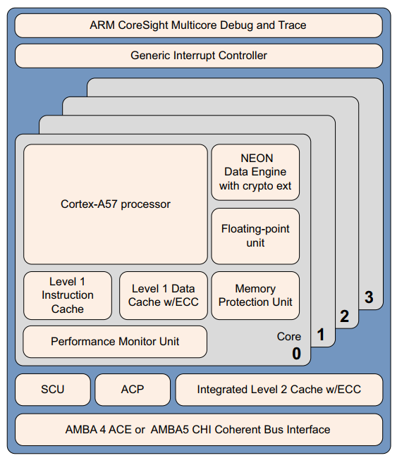

## 2. ARMv8‑A 架构和处理器  

ARM 架构可以追溯到 1985 年，但它并没有停滞不前。相反，它从早期的 ARM 内核开始大规模发展，每一步都增加了特性
和功能：

- ARMv4 及更早版本
  这些早期的处理器仅使用 ARM 32 位指令集。ARMv4T ARMv4T 架构将 Thumb 16 位指令集添加到 ARM 32 位指令集。这是第一个获得广泛许可的架构。它由 ARM7TDMI®和 ARM9TDMI®处理器实现
- ARMv5TE ARMv5TE 
  架构增加了对 DSP 类型操作的改进，饱和算法，以及用于 ARM 和 Thumb 互通。 ARM926EJ‑S®实现了这个架构。
- ARMv6 ARMv6 
  进行了多项增强，包括支持未对齐的内存访问、对内存架构的重大更改以及对多处理器的支持。此外，还包括对在 32 位寄存器中的字节或半字上操作的 SIMD 操作的一些支持。 ARM1136JF‑S®实现了这个架构。 ARMv6 架构还提供了一些可选扩展，特别是 Thumb‑2 和安全扩展(TrustZone®)。Thumb‑2 将 Thumb 扩展为混合长度的 16 位和 32 位指令集。
- ARMv7-A ARMv7-A 
  架构强制要求 Thumb‑2 扩展，并添加了高级 SIMD 扩展 (NEON)。在 ARMv7 之前，所有内核都遵循基本相同的架构或功能集。为了帮助解决越来越多的不同应用程序，ARM 引入了一组架构配置文件：
  (1)ARMv7-A
  (2)ARMv7-M
  (3)ARMv7-R

### 2.1 ARMv8-A

ARMv8‑A 架构是针对应用程序配置文件的最新一代 ARM 架构。 ARMv8 这个名称用于描述整体架构，现在包括 32 位执行状态和 64 位执行状态。它引入了使用 64 位宽寄存器执行的能力，同时保持与现有 ARMv7 软件的向后兼容性。

ARMv8‑A 架构引入了许多更改，可以设计出性能显着提高的处理器实现：

- 大物理地址(Large physical address)
  这使处理器能够访问超过 4GB 的物理内存。
- 64 位虚拟寻址(64-bit virtual addressing)
  这使虚拟内存超出 4GB 限制。这对于使用内存映射文件 I/O 或稀疏寻址的现代桌面和服务器软件很重要。
- 自动事件信号(Automatic event signaling)
  这可以实现节能、高性能的自旋锁
- 更大的寄存器文件(Larger register files)
  31 个 64 位通用寄存器可提高性能并减少堆栈使用。
- 高效的 64 位立即生成(Efficient 64-bit immediate generation)
  对文字池的需求较少
- 较大的 PC 相对寻址范围(Large PC-relative addressing range)
  一个 +/‑4GB 的寻址范围，用于在共享库和与位置无关的可执行文件中进行有效的数据寻址。

- 额外的 16KB 和 64KB 翻译颗粒(Additional 16KB and 64KB translation granules)
  这降低了翻译后备缓冲区(TLB) 未命中率和页面遍历深度。
- 新的异常模型(New exception model)
  这降低了操作系统和管理程序软件的复杂性。
- 高效的缓存管理理Efficient cache management)
  用户空间缓存操作提高了动态代码生成效率。使用数据缓存零指令快速清除数据缓存。
- 硬件加速密码学(Hardware-accelerated cryptography)
  提供 3 到 10 倍更好的软件加密性能。这对于小粒度解密和加密非常有用，因为太小而无法有效地卸载到硬件加速器，例如 https。
- 加载‑获取、存储‑释放指令(Load-Acquire, Store-Release instructions)
  专为 C++11、C11、Java 内存模型而设计。它们通过消除显式内存屏障指令来提高线程安全代码的性能。
- NEON 双精度浮点高级 SIMD(NEON double-precision floating-point advanced SIMD)
  这使得 SIMD 矢量化能够应用于更广泛的算法集，例如科学计算、高性能计算(HPC) 和超级计算机。

### 2.2 ARMv8‑A 处理器属性  

#### 2.2.1 ARMv8 处理器  

Cortex‑A53 处理器  

Cortex‑A53 处理器是一款中档、低功耗处理器，在单个集群中具有一到四个内核，每个内核都有一个L1 缓存子系统、一个可选的集成 GICv3/4 接口和一个可选的 L2 缓存控制器。

Cortex‑A53 处理器是一款非常节能的处理器，能够支持 32 位和 64 位代码。它提供了比非常成功的 Cortex‑A7 处理器更高的性能。它能够部署为独立的应用处理器，或在 big.LITTLE 配置中与 Cortex‑A57 处理器配对，以获得最佳性能、可扩展性和能源效率。

Cortex‑A53 处理器具有以下特性：

- 有序的八级流水线。
- 通过使用分层时钟门控、电源域和高级保留模式来降低功耗。
- 通过重复执行资源和双指令解码器提高双发能力。
- 功耗优化的二级缓存设计可提供更低的延迟并在性能与效率之间取得平衡。

Cortex‑A57 处理器
Cortex‑A57 处理器面向移动和企业计算应用，包括计算密集型 64 位应用，例如高端计算机、平板电脑和服务器产品。它可以与 Cortex‑A53 处理器一起使用到 ARM big.LITTLE 配置中，以实现可扩展的性能和更高效的能源使用。

Cortex‑A57 处理器具有与其他处理器的高速缓存一致性互操作性，包括用于 GPU 计算的 ARM Mali™系列图形处理单元(GPU)，并为高性能企业应用程序提供可选的可靠性和可扩展性功能。它提供了比 ARMv7Cortex‑A15 处理器更高的性能，并具有更高的能效水平。加密扩展的包含将加密算法的性能提高了 10 倍于上一代处理器。

Cortex‑A57 处理器完全实现了 ARMv8‑A 架构。它支持多核操作，在单个集群中具有一到四核多处理。通过
AMBA5 CHI 或 AMBA 4 ACE 技术，可以实现多个一致的 SMP 集群。可通过 CoreSight 技术进行调试和跟踪。

Cortex‑A57 处理器具有以下特性：

- 乱序，15+阶段流水线。
- 省电功能包括路径预测、标记减少和缓存查找抑制。
- 通过重复执行资源增加峰值指令吞吐量。具有本地化解码、3 宽解码带宽的功率优化指令解码。
- 性能优化的 L2 缓存设计使集群中的多个核心可以同时访问 L2。

学习ARM架构课程，薪资翻翻、年薪百万、迎娶白富美...

 

课程介绍 

- [Armv8/Armv9架构从入门到精通](http://arm3.hehezhou.cn) 
- [Secureboot从入门到精通](http://secureboot.hehezhou.cn) 
- [Trustzone/TEE/安全从入门到精通-标准版](http://trustzone1.hehezhou.cn) 
- [Trustzone/TEE/安全从入门到精通-高配版](http://trustzone2.hehezhou.cn) 
- [Trustzone/TEE/安全从入门到精通-实践版](http://trustzone3.hehezhou.cn) 
- [optee系统安全从入门到精通](http://opteedake.hehezhou.cn) 
- [Android15安全架构](http://android15.hehezhou.cn) 
- [ATF架构从入门到精通](http://atfke.hehezhou.cn) 
- [CA/TA可信安全应用开发从入门到精通](http://atfke.hehezhou.cn) 
- [aarch64汇编基础入门](http://aarch64.hehezhou.cn) 
- [ARM架构扫盲-SOC架构扫盲](http://armsoc.hehezhou.cn) 
- [Android Keymaster/keymint详解](http://keymaster.hehezhou.cn) 
- [Arm精选-全店通VIP](http://quandiantong.hehezhou.cn) 
- [Arm精选-铂金VIP](http://bojin.hehezhou.cn) 