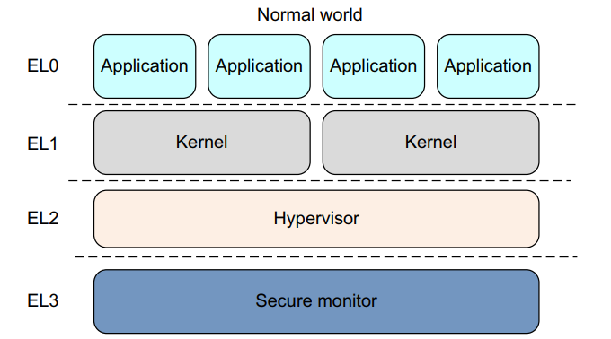
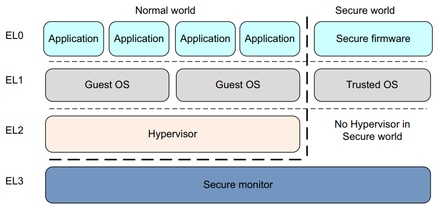
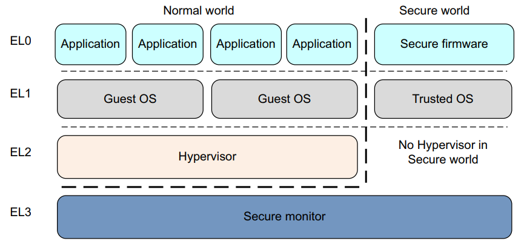
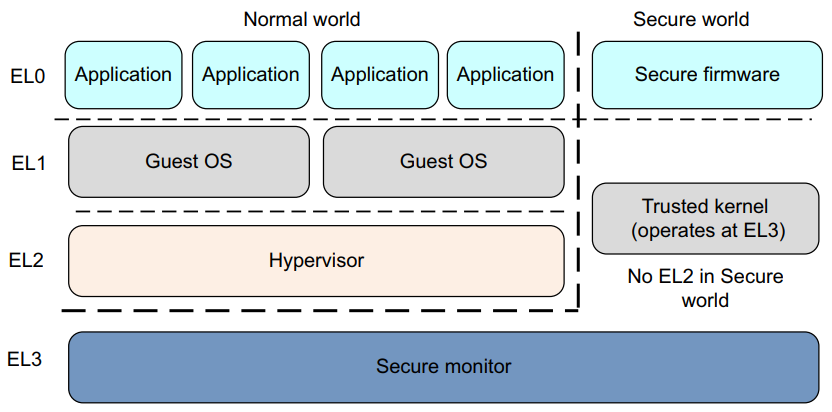
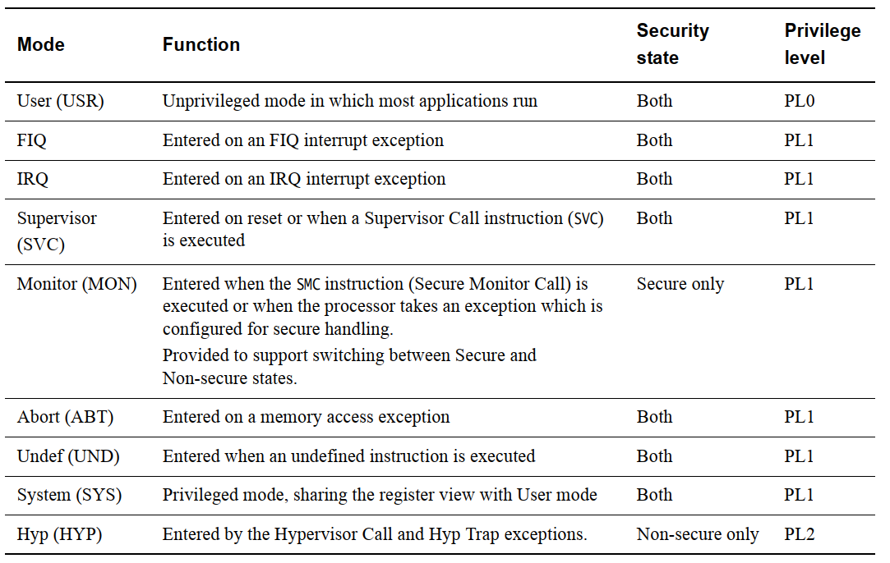
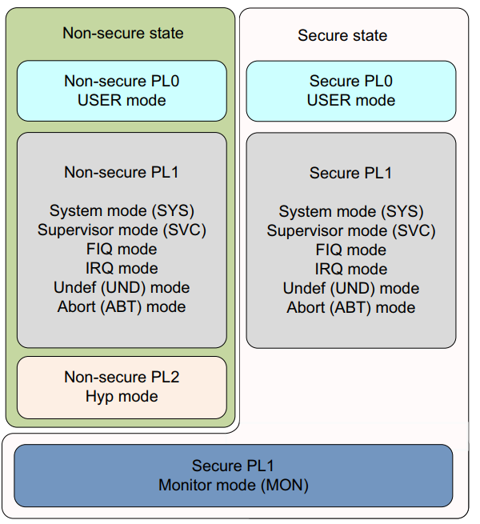
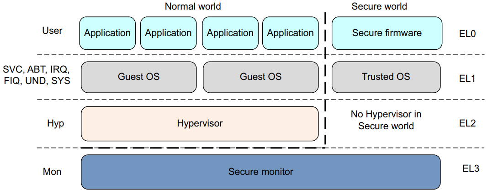
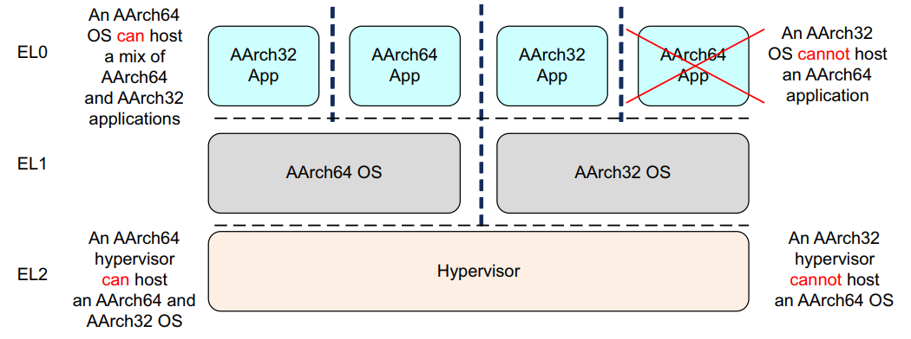

## 3. ARMv8 基础知识  

在 ARMv8 中，执行发生在四个异常级别之一。在 AArch64 中，异常级别决定了特权级别，类似于 ARMv7中定义的特权级别。异常级别决定特权级别，因此在 ELn 执行对应于特权PLn。类似地，具有比另一个更大的n值的异常级别处于更高的异常级别。一个数字比另一个小的异常级别被描述为处于较低的异常级别。

异常级别提供了适用于 ARMv8 架构的所有操作状态的软件执行权限的逻辑分离。它类似于并支持计算机科学中常见的分层保护域的概念。

- EL0 Normal user applications.
- EL1 Operating system kernel typically described as privileged.
- EL2 Hypervisor.
- EL3 Low-level firmware, including the Secure Monitor.

通常，一个软件，例如应用程序、操作系统的内核或管理程序，占用一个异常级别。此规则的一个例外是内核中的虚拟机管理程序，例如 KVM，它在EL2和 EL1 上运行。

ARMv8‑A 提供两种安全状态，安全和非安全。非安全状态也称为正常世界。这使操作系统 (OS) 能够与受信任的操作系统在同一硬件上并行运新g，并提供针对某些软件攻击和硬件攻击的保护。 ARM TrustZone 技术使系统能够在正常和安全世界之间进行分区。与 ARMv7‑A 架构一样，安全监视器充当在正常和安全世界之间移动的网关。

ARMv8‑A 还提供对虚拟化的支持，但仅在普通世界中。这意味着管理程序或虚拟机管理器(VMM) 代码可以在系统上运行并托管多个客户操作系统。每个客户操作系统本质上都在虚拟机上运行。然后，每个操作系统都不会意识到它正在与其他客户操作系统共享系统上的时间。

正常世界（对应于非安全状态）具有以下特权组件：

- Guest OS kernels
  此类内核包括在非安全 EL1 中运行的 Linux 或 Windows。在管理程序下运行时，丰富的操作系统内核可以作为来宾或主机运行，具体取决于管理程序模型。
- Hypervisor
  这在 EL2 上运行，它始终是非安全的。虚拟机管理程序在存在并启用时，可为丰富的操作系统内核提供虚拟化服务。

安全世界具有以下特权组件：

- Secure firmware
  在应用处理器上，这个固件必须是在启动时运行的第一件事。它提供了多种服务，包括平台初始化、可信操作系统的安装以及安全监视器调用的路由。
- Trusted OS
  受信任的操作系统为普通世界提供安全服务，并为执行安全或受信任的应用程序提供运行时环境。

ARMv8 架构中的安全监视器处于更高的异常级别，并且比所有其他级别具有更高的特权。这提供了软件特权的逻辑模型。

### 3.1 执行状态  

ARMv8 架构定义了两种执行状态， AArch64和AArch32。每个状态分别用于描述使用 64 位宽通用寄存器或 32 位宽通用寄存器的执行。虽然 ARMv8 AArch32 保留了 ARMv7 对特权的定义，但在 AArch64 中，特权级别由异常级别决定。因此，在 ELn 的执行对应于特权PLn。

当处于 AArch64 状态时，处理器执行 A64 指令集。当处于 AArch32 状态时，处理器可以执行 A32（在早期版本的架构中称为 ARM）或 T32 (Thumb) 指令集。

下图显示了 AArch64 和 AArch32 中异常级别的组织。
AArch64：

AArch32： 

在 AArch32 状态下，Trusted OS 软件在 Secure EL3 中执行，而在 AArch64 状态下，它主要在Secure EL1 中执行。

### 3.2 更改异常级别  

在 ARMv7 架构中，处理器模式可以在特权软件控制下更改，也可以在发生异常时自动更改。当发生异常时，内核保存当前执行状态和返回地址，进入所需模式，并可能禁用硬件中断。

下表对此进行了总结。应用程序以最低级别的特权 PL0 运行，即以前的非特权模式。操作系统在 PL1 上运行，Hypervisor 在具有虚拟化扩展的系统中在 PL2 上运行。安全监视器作为在安全和非安全（正常）世界之间移动的网关，也在 PL1 上运行。

在 AArch64 中，处理器模式映射到异常级别，如图 3‑6 所示。与在 ARMv7 (AArch32) 中一样，当发生异常时，处理器将更改为支持处理异常的异常级别（模式）。

异常级别之间的移动遵循以下规则：

- 移动到更高的异常级别，例如从 EL0 到 EL1，表示软件增加执行特权。
- 不能将异常处理到较低的异常级别。
- EL0 级别没有异常处理，必须在更高的异常级别处理异常
- 异常导致程序流程发生变化。异常处理程序的执行以高于 EL0 的异常级别从与所采取的异常相关的已定义向量开始。例外情况包括：
  IRQ 和 FIQ 等中断。
  内存系统中止。
  未定义的指令。
  系统调用。这些允许非特权软件对操作系统
  安全监视器或管理程序陷阱。
- 通过执行ERET指令来结束异常处理并返回到上一个异常级别。
- 从异常返回可以保持相同的异常级别或进入较低的异常级别。它不能移动到更高的异常级别。
- 安全状态确实会随着异常级别的变化而变化，除非从 EL3 重新调整到非安全状态

### 3.3 改变执行状态  

有时您必须更改系统的执行状态。例如，如果您正在运行 64 位操作系统，并且希望在 EL0 上运行32 位应用程序，则可能是这样。为此，系统必须更改为 AArch32。

当应用程序完成或执行返回操作系统时，系统可以切换回 AArch64。第 3‑9 页上的图 3‑7表明您不能反过来做。 AArch32 操作系统不能承载 64 位应用程序

要在相同的异常级别之间切换执行状态，您必须切换到更高的异常级别，然后返回到原始的异常级别。例如，您可能有 32 位和 64 位应用程序在 64 位操作系统下运行。在这种情况下，32 位应用程序可以执行并生成主管调用(SVC)指令，或接收中断，从而导致切换到 EL1 和 AArch64。 （请参阅第 6‑21 页的异常处理说明。）然后操作系统可以执行任务切换并返回到 AArch64 中的 EL0。实际上，这意味着您不能拥有混合的 32 位和 64位应用程序，因为它们之间没有直接的调用方式。

您只能通过更改异常级别来更改执行状态。发生异常可能会从 AArch32 更改为 AArch64，从异常返回可能会从 AArch64 更改为 AArch32。

EL3的代码无法将异常提升到更高的异常级别，因此无法更改执行状态，除非通过重置。

以下是在 AArch64 和 AArch64 和AArch32执行状态：

- AArch64 和 AArch32 执行状态都具有大致相似的异常级别，但安全和非安全操作之间存在一些差异。产生异常时处理器所处的执行状态可以限制其他执行状态可用的异常级别。
- 更改为 AArch32 需要从较高的异常级别转到较低的异常级别。这是通过执行ERET指令退出异常处理程序的结果。请参阅第 6‑21 页的异常处理说明。
- 更改为 AArch64 需要从较低的异常级别转到较高的异常级别。异常可能是指令执行或外部信号的结果。
- 如果在发生异常或从异常返回时，异常级别保持不变，则执行状态不能改变。
- ARMv8 处理器在特定的 AArch32 执行状态下运行异常级别，它使用与 ARMv7 中相同的异常模型来处理该异常级别的异常。在 AArch64 执行状态下，它使用第 10 章AArch64 异常处理中描述的异常处理模型。

因此，这两种状态之间的互通是在安全监视器、管理程序或操作系统的级别上执行的。在 AArch64状态下执行的管理程序或操作系统可以支持较低权限级别的 AArch32 操作。这意味着在 AArch64中运行的操作系统可以同时托管 AArch32 和 AArch64 应用程序。同样，AArch64 管理程序可以同时托管 AArch32 和 AArch64 客户操作系统。但是，32 位操作系统不能托管 64 位应用程序，32 位虚拟机管理程序不能托管 64 位客户操作系统。

对于最高实现的异常级别（Cortex‑A53 和 Cortex‑A57 处理器上的 EL3），在接受异常时用于每个异常级别的执行状态是固定的。异常级别只能通过重置处理器来更改。对于 EL2 和 EL1，它由第 4‑7 页的系统寄存器控制。