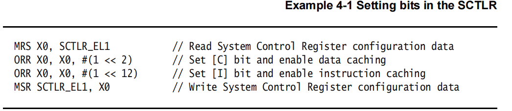

## 4. ARMv8 寄存器  

AArch64执行状态提供了32个在任何时间任何特权级下都可访问的64位的通用寄存器。

每个寄存器都有64位宽，它们通常被称为寄存器X0-X30。


每个AArch64 64位通用寄存器（X0-X30）也具有32位（W0-W30）形式。


32位W寄存器取自相应的64位X寄存器的低32位。也就是说，W0映射到X0的低32位，W1映射到X1的低32位。

从W寄存器读取时，忽略相应X寄存器高32位，并保持其它不变。写入W寄存器时，将X寄存器的高32位设置为零。也就是说，将0xFFFFFFFF写入W0会将X0设置为0x00000000FFFFFFFF。

###  4.1 AArch64 特殊寄存器

除了31个核心寄存器外，还有几个特殊的寄存器。


> 注意：没有被称为X31或W31的寄存器。许多指令被编码，例如：31代表零寄存器，ZR(WZR/XZR)。还有一组受限制的指令，其中对一个或多个参数进行编码，使数字31表示堆栈指针(SP)。

当访问零寄存器时，所有写操作都被忽略，所有读操作返回0。请注意，64位形式的SP寄存器不使用X前缀。


在ARMv8体系结构中，当CPU运行在AArch64状态时，异常返回状态保存在每个异常级别的以下专用寄存器中：

- *Exception Link Register* (ELR). 
- *Saved Processor State Register* (SPSR).

每个异常级别都有一个专用的SP寄存器，但它不用于保存返回状态。


#### 4.1.1 零寄存器

零寄存器当用作源寄存器时读操作的结果为零，当用作目标寄存器时则将结果丢弃。你可以在大多数指令中但不是所有指令中使用零寄存器。

#### 4.1.2 栈指针

在ARMv8体系结构中，要使用的栈指针的选择在一定程度上与异常级别是分开的。默认情况下，发生异常时会选择目标异常级别的SP_ELn作为栈指针。例如，当触发到EL1的异常时，就会选择SP_EL1作为栈指针。每个异常级别都有自己的栈指针，SP_EL0、SP_EL1、SP_EL2和SP_EL3。

当AArch64处于EL0以外的异常级别时，处理器可以使用：

- 与该异常级别相关联的一个专用的64位栈指针(SP_ELn)
- 与EL0关联的栈指针(SP_EL0)

EL0永远只能访问SP_EL0。


t后缀表示选择了SP_EL0栈指针。h后缀表示选择了SP_ELn栈指针。

虽然大多数指令都无法使用SP寄存器。但是有一些形式的算术指令可以操作SP，例如，ADD指令可以读写当前的栈指针以调整函数中的栈指针。例如：

```c
ADD SP, SP, #0x10 // Adjust SP to be 0x10 bytes before its current value
```

#### 4.1.3 程序计数器

原来的ARMv7指令集的一个特性是R15作为程序计数器(PC)，并作为一个通用寄存器使用。PC寄存器的使用带来了一些编程技巧，但它为编译器和复杂的流水线的设计引入了复杂性。在ARMv8中删除了对PC的直接访问，使返回预测更容易，并简化了ABI规范。

PC永远不能作为一个命名的寄存器来访问。但是，可以在某些指令中隐式的使用PC，如PC相对加载和地址生成。PC不能被指定为数据处理或加载指令的目的操作数。

#### 4.1.4 异常链接寄存器（ELR）

异常链接寄存器保存异常返回地址。

#### 4.1.5 程序状态保存寄存器（SPSR）

当异常发生时，CPSR中的处理器状态将保存在相关的程序状态保存寄存器(SPSR)中，其方式类似于ARMv7。SPSR保存着异常发生之前的PSTATE的值，用于在异常返回时恢复PSTATE的值。


AArch64下各bit的含义：

**N**       负数标志位，如果结果为负数，则N=1；如果结果为非负数，则N=0。

**Z**        零标志位，如果结果为零，Z=1，否则Z=0。

**C**        进位标志位

**V**        溢出标志位

**SS**      软件步进标志位 ，表示当一个异常发生时，软件步进是否开启

**IL**       非法执行状态位

**D**        程序状态调试掩码，在异常发生时的异常级别下，来自监视点、断点和软件单步调试事件中的调试异常是否被屏蔽。

**A**         SError（系统错误）掩码位

**I**          IRQ掩码位

**F**         FIQ掩码位

**M[4]**   异常发生时的执行状态 ，0表示AArch64

**M[3:0]** 异常发生时的mode或异常级别

在ARMv8中，写入的SPSR依赖于异常级别。如果异常发生在EL1，则使用SPSR_EL1。如果异常发生在EL2，则使用SPSR_EL2，如果异常发生在EL3，则使用SPSR_EL3。处理器核会在异常发生时填充SPSR。

> 注意： 与异常级别相关联的寄存器对ELR_ELn和SPSR_ELn保存着在较低异常级别执行期间的状态。

### 4.2 处理器状态

AArch64没有直接与ARMv7当前程序状态寄存器(CPSR)等价的寄存器。在AArch64中，传统CPSR的组件作为可以独立访问的字段提供。这些状态被统称为处理器状态(PSTATE)。

AArch64的处理器状态或PSTATE字段有以下定义：


在AArch64中，你可以通过执行ERET指令从一个异常中返回，这将导致SPSR_ELn被复制到PSTATE中。这将恢复ALU标志、执行状态、异常级别和处理器分支。从这里开始，将继续从ELR_ELn中的地址开始执行。

PSTATE.{N, Z, C, V}字段可以在EL0级别访问。 其他的字段可以在EL1或更高级别访问，但是这些字段在EL0级别未定义。

### 4.3 系统寄存器

在AArch64中，系统配置通过系统寄存器进行控制，并使用MSR和MRS指令进行访问。这与ARMv7-A形成了鲜明对比，在ARMv7-A中，这些寄存器通常通过协处理器15(CP15)操作来访问。寄存器的名称会告诉你可以访问它的最低异常级别。

例如：

- TTBR0_EL1可以从EL1、EL2和EL3访问
- TTBR0_EL2可以从EL2和EL3访问

具有后缀_ELn的系统寄存器在各异常级别中有一个独立的的副本，但通常不是EL0，很少有系统寄存器可以从EL0访问，尽管缓存类型寄存器(CTR_EL0)是一个可以从EL0访问的系统寄存器的例子。

可以采用以下形式来访问系统寄存器：

```c
MRS x0, TTBR0_EL1 // Move TTBR0_EL1 into x0
MSR TTBR0_EL1, x0 // Move x0 into TTBR0_EL1
```

ARM体系结构以前的版本使用协处理器来进行系统配置。但是，AArch64并不包含对协处理器的支持。表4-5仅列出了本书中提到的系统寄存器。

有关完整的列表，请参见ARM体系结构参考手册-ARMv8的附录J，以了解ARMv8-A体系结构配置文件。

下表展示了具有独立副本的寄存器异常级别。例如，辅助控制寄存器(ACTLRs)在各异常级别作为ACTLR_EL1、ACTLR_EL2和ACTLR_EL3存在。


#### 4.3.1 系统控制寄存器

系统控制寄存器(SCTLR)是一个用来控制标准内存、配置系统能力、提供处理器核状态信息的寄存器。


并不是所有bit在EL1都可用，各bit的含义如下：

**UCI**               设置此位后，在AArch64中为DC CVAU、DC CIVAC、DC CVAC和IC IVAU指令启用EL0访问。

**EE**                 异常字节顺序

​                      **0**   小端

​                      **1**   大端

**EOE**               EL0显式数据访问的字节序

​                       **0**  小端

​                       **1**  大端

**WXN**           写权限不可执行 XN (eXecute Never)。 See *Access permissions* on page 12-23.

​                      **0**  可写区域不设置不可执行权限（XN）

　　　　　   **1**  可写区域强制为不可执行(XN) 　　

**nTWE**           不陷入WFE，此标志为1表示WFE作为普通指令执行

**nTWI**            不陷入WFI,  此标志为1表示WFI作为普通指令执行

**UCT**               此标志为1时，开启AArch64的EL0下访问CTR_EL0寄存器

**DNE**              EL0 下访问 DC AVA指令，0 禁止执行，1 允许执行

**I**                     开启指令缓存，这是在EL0和EL1下的指令缓存的启用位。对可缓存的正常内存的指令访问被缓存。

**UMA**             用户屏蔽访问。当EL0使用AArch64，控制从EL0的中断屏蔽访问。

**SED**               禁止SETEND。在EL0使用AArch32禁止SETEND指令。0 使能，1 禁止

**ITD**                禁止IT指令

​                      **0**   IT指令有效

​                      **1**    IT指令被当作16位指令。仅另外16位指令或32位指令的头16位可以使用，这依赖于实现

**CP15BEN**     CP15 barrier使能。如果实现了，它是AArch32 CP15 DMB,DSB和ISB barrier操作的使能位

**SA0**                EL0的栈对齐检查使能位

**SA **                 栈对齐检查使能位

**C**                    数据cache使能。EL0和EL1的数据访问使能位。对cacheable普通内存的数据访问都被缓存

**A**                    对齐检查使能位

**M**                   使能MMU

**对SCTLR的访问**

为访问SCTLR_ELn，使用：

```c
MRS <Xt>, SCTLR_ELn // Read SCTLR_ELn into Xt
MSR SCTLR_ELn, <Xt> // Write Xt to SCTLR_ELn
```

例如：



> 注意： 处理器中各异常级别的cache必须在数据和指令的cache使能之前被无效化

### 4.4 字节序

在内存中查看字节有两种基本的方式，一种是小端(LE)，另一种是大端(BE)。在大端机器上，内存中对象中高字节存储在低地址（即接近于零的地址）。在小端机器上，低字节存储在低地址。术语byte-ordering也可以用来代替大小端。


每个异常级别的数据的大小端都被单独控制。对于EL3，EL2和EL1，通过SCTLR_ELn.EE设置大小端。EL1中其他位，SCTLR_EL1.E0E 控制EL0的数据大小端的设置。在AArch64执行状态中，数据访问可以为LE或BE，但指令的获取通常为LE。

处理器是否支持LE和BE取决于处理器的实现。如果只支持小端，则EE位和E0E位始终为0。类似地，如果仅支持大端，则EE位和E0E位被设置为1。

当使用AArch32时，CPSR.E位与相对应系统控制寄存器中EE位不同，该位在EL1，EL2和EL3被弃用。ARMv7中SETEND指令也被弃用，它通过设置SCTLR.SED位在执行SETEND指令时可能导致未定义的异常。

### 4.5 改变执行状态（再次）

在第3-8页的更改执行状态时，我们从异常级别角度描述了AArch64和AArch32之间的变化。现在我们从寄存器的角度来考虑这个变化。

从AArch32的异常级别进入AArch64的异常级别时：

- 对于AArch32下访问任何异常级别的高32位寄存器的值的行为都是未知的。
- 在AArch32执行期间不可访问保留了它们在AArch32执行之前的状态的寄存器。
- 当EL2使用AArch32触发一个到EL3的异常时， ELR_EL2的高32位是未知的。
- AArch32不可以访问AArch64各异常级别的栈指针（SPs）和异常链接寄存器（ELRs），这些寄存器保存着它们在AArch32执行之前的状态: SP_EL0、SP_EL1 、SP_EL2 、ELR_EL1

通常，应用程序程序员可以在AArch32或AArch64下编写应用程序。只有操作系统必须考虑到这两个执行状态和它们之间的切换。

#### 4.5.1 AArch32下的寄存器

兼容ARMv7 意味着 AArch32必须匹配ARMv7特权级别。这也意味着AArch32只处理ARMv7 32位通用寄存器。因此，ARMv8体系结构与AArch32执行状态提供的视图之间必须有一些对应关系。

请记住，在ARMv7体系结构中有16个32位通用寄存器(R0-R15)用于软件使用。其中15个（R0-R14）可用于通用数据存储。剩下的寄存器R15是程序计数器(PC)，其值在处理器核心执行指令时被改变。软件还可以访问CPSR，而从之前执行的模式中保存的CPSR是SPSR。在发生异常时，CPSR将被复制到发生异常的模式的SPSR中。

访问这些寄存器中的哪一个，取决于软件正在执行的处理器模式和寄存器本身，这称为banking，第4-14页图4-7中的阴影寄存器称为banked。它们使用不同的物理存储，通常程序只有在特定模式下执行时才能访问。


在ARMv7中使用了banking来减少异常的延迟。然而，这也意味着在相当数量的寄存器中，任何时候可以使用的都不到一半。

相比之下，AArch64执行状态有31个64位通用寄存器，并且可以在所有异常级别中随时访问。在AArch64和AArch32之间的执行状态的切换意味着AArch64寄存器必须映射到AArch32(ARMv7)寄存器集。此映射如图4-8所示。

当在AArch32状态下执行时，AArch64寄存器的高32位是不可访问的。如果处理器在AArch32状态下工作，它将使用32位W寄存器，这相当于32位的ARMv7寄存器。

AArch32需要将banked寄存器映射到AArch64寄存器，否则这些寄存器将无法访问。


AArch32中的SPSR和ELR_Hyp寄存器是只能被系统指令访问的附加寄存器。它们没有被映射到AArch64体系结构的通用寄存器空间中。下面这些寄存器在AArch32和AArch64之间进行映射：

- SPSR_svc映射到SPSR_EL1
- SPSR_hyp映射到SPSR_EL2
- ELR_hyp映射到ELR_EL2

以下寄存器仅在AArch32执行期间使用。由于在EL1上使用AArch64执行，所以，尽管在AArch64执行期间这些寄存器不可访问，但仍然保留了它们的状态。

- SPSR_abt
- SPSR_und
- SPSR_irq
- SPSR_fiq

SPSR寄存器只能在AArch64状态用于上下文切换的高异常级别下可访问。

同样，如果在AArch32的异常级别触发一个到AArch64异常级别的异常，则AArch64 ELR_ELn的高32位都为零。

#### 4.5.2 AArch32下的PSTATE

在AArch64中，传统CPSR的不同组件被表示为可以独立访问的处理器状态(PSTATE)字段。在AArch32，有与ARMv7 CPSR位对应的附加字段。

提供只能在AArch32上访问的附加PSTATE位：


### 4.6 NEON和浮点寄存器

除了通用寄存器之外，ARMv8还有32个128位浮点寄存器，标记为V0-V31。32个寄存器用于保存标量浮点指令的浮点操作数，以及NEON操作的标量操作数和向量操作数。NEON和浮点寄存器也在第7章*AArch64 Floating-point and NEON*也会介绍。

#### 4.6.1 AArch64中浮点寄存器的组织

在对标量数据进行操作的NEON指令和浮点指令中，浮点和NEON寄存器的行为类似于主要的通用整数寄存器。因此，只访问较低的位，在读时忽略未使用的高位，在写时将其设置为零。标量浮点和NEON名称的限定名表示有效位的数目，如下所示，其中n是寄存器号0-31。


> 注意： 支持16位浮点数，但仅作为要转换的格式。不支持数据处理操作。（**译注**：即不能直接对16位浮点数据进行操作）

前缀F和浮点数大小由浮点ADD指令指定:
```c
FADD Sd, Sn, Sm // Single-precision
FADD Dd, Dn, Dm // Double-precision
```
半精度浮点指令用于在不同大小之间进行转换：
```c
FCVT Sd, Hn // half-precision to single-precision
FCVT Dd, Hn // half-precision to double-precision
FCVT Hd, Sn // single-precision to half-precision
FCVT Hd, Dn // double-precision to half-precision
```
#### 4.6.2 标量寄存器大小

在AArch64中，整数标量的映射已经从ARMv7-A中使用的映射更改为图4-11所示的映射


图4-11 S0是D0的低半部分，D0是Q0的低半部分。S1是D1的低半部分，D1同样是Q1的低半部分，以此类推。这消除了编译器在自动向量化高级代码时遇到的许多问题。

- 每个Q寄存器的低64位也可以看作是D0-D31，32个给浮点和NEON计算使用的64位宽寄存器。
- 每个Q寄存器的低32位也可以看作是S0-S31，32个给浮点和NEON计算使用的32位宽寄存器。
- 每个S寄存器的低16位也可以看作是H0-H31，32个给浮点和NEON计算使用的16位宽寄存器。
- 每个H寄存器的低8位也可以看作是B0-B31,  32个供NEON使用的8位宽寄存器。

> 注意： 在每种情况下只使用每个寄存器集的底部的位。读取时忽略寄存器空间的其余部分，写入时用0填充其余部分。

这种映射的结果是，如果在AArch64中执行的程序正在使用来自AArch32的D或S寄存器。那么，在使用D或S寄存器之前，程序必须将它们从V寄存器中解包。

对于标量ADD指令：

```c
ADD Vd, Vn, Vm
```

例如，如果大小为32位，则指令为：

```c
ADD Sd, Sn, Sm
```


#### 4.6.3 向量寄存器大小

向量的大小为64位，有一个或多个元素。也可以为128位，有两个或多个元素。如图4-12所示:

对于向量ADD指令：

```c
 ADD Vd.T, Vn.T, Vm.T
```

这里对于32位向量，有4个lanes（通道），指令变为：

```c
 ADD Vd.4S, Vn.4S, Vm.4S
```


当这些寄存器以特定的指令形式使用时，必须进一步限定名称以指示数据形状。更具体地说，这意味着数据元素的大小和其中包含的元素或通道的数量。

#### 4.6.4 AArch32执行状态的NEON

在AArch32中，较小的寄存器被打包成较大的寄存器(比如D0和D1合并成Q1)。这引入了一些复杂的循环迭代依赖关系，这会降低编译器向量化循环结构的能力。


AArch32中的浮点寄存器和高级SIMD寄存器被映射到AArch64 FP和SIMD寄存器。这样做是为了允许应用程序或虚拟机的浮点和NEON寄存器由更高级别的系统软件(例如OS或Hypervisor)解释(并在必要时修改)。

AArch64 V16-V31 FP和NEON寄存器不能从AArch32访问。与通用寄存器一样，运行在AArch32中的异常级别时，这些寄存器保留了AArch64执行前的状态。
