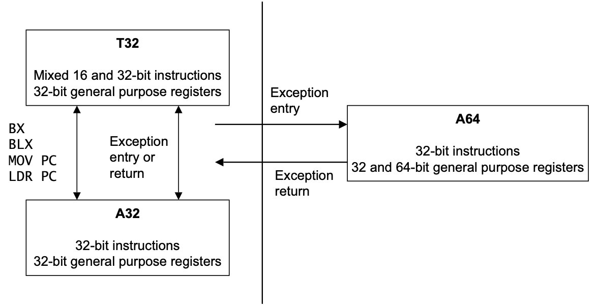

## 5. ARMv8 指令集简介

ARMv8架构中引入的最重要的变化之一是增加了64位指令集。该指令集补充了现有的32位指令集架构。这一指令集提供了对64位宽整数寄存器和数据操作的访问，以及使用64位内存指针的能力。新的指令集被称为**A64**，并且在AArch64状态下执行。ARMv8架构还包括原始的ARM指令集（现称为A32）和Thumb（T32）指令集。A32和T32都以AArch32状态执行，并且向后与ARMv7架构兼容。

虽然ARMv8-A向后兼容了32位ARM架构的特性，但A64指令集与旧的ISA指令是独立且不同的，而且他们的编码方式也不同。A64增加了一些额外的功能，同时也删除了其他可能限制高性能实现速度或能效的功能。ARMv8架构还包括对32位指令集（A32和T32）的一些增强性功能。然而，使用这些功能的代码与旧的ARMv7实现不兼容。然而，A64指令集中的指令操作码长度仍然是32位，而不是64位。

更详细描述A64汇编语言的编程指南也可以参考*ARM®* *Compiler arm asm Reference Guide v6.01*。

### 5.1 ARMv8指令集

新的A64指令集与现有的A32指令集相似。指令宽度为32位，他们的语法十分相似。

指令集使用ARMv8架构中约定的通用命名，因此现在调用原始的32位状态指令集是**A32**和**T32**。

- **A32**	在AArch32状态下，尽管指令集存在差异，但是在很大程度上与ARMv7兼容。请参阅ARMv8-A架构参考手册。它还提供了一些新说明，以与A64指令集中引入的一些功能保持一致。
- **T32**    Thumb指令集最初包含在ARM7TDMI处理器中，最初只包含16位指令。16位指令以牺牲一些性能为代价提供了更小的程序体积。ARMv7处理器包括Cortex-A系列处理器，支持Thumb-2技术，该技术扩展了Thumb指令集，以提供16位和32位指令的混合指令集。这提供了与ARM相似的性能，同时保留了缩小的代码体积。由于其大小和性能优势，编译或组合所有32位代码以利用Thumb-2技术越来越常见。

此外还引入了一个新的指令集，ARM核心在AArch64状态下可以使用这个新的指令集。为了与命名约定保持一致，并反映64位操作，此指令集称为**A64**。

- **A64**	提供了与AArch32或ARMv7中的A32和T32指令集类似的功能。新的A64指令集的设计进行了几项改进：

    - **一致的编码方案**	

        A32中一些指令的延迟添加导致编码方案存在一些不一致。例如，对半字的LDR和STR支持与主流字节和单字传输指令的编码略有不同，这就会导致寻址模式略有不同。

    - **种类繁多的常量**   

         A64指令为常量提供了大量选项，每个选项都根据特定指令类型的要求进行量身定制。

        - 算术指令通常接受12位立即数。
        - 逻辑指令通常接受32位或64位常量，其编码存在一些约束。
        - MOV指令接受16位立即操作，可以移动到任何16位边界。
        - 地址生成指令适用于与4KB页面大小对齐的地址。

        A64提供了灵活的常量，但对它们进行编码，甚至确定一个特定的常量是否可以在特定的环境下合法地进行编码，都可能是不太容易的。

    - **数据类型处理更容易**

        A64可以自然地处理64位有符号和无符号数据类型，因为它提供了更简洁、更高效的64位整数操作方法。这对所有提供64位整数（如C或Java）的语言都有好处。

    - **长偏移量**

        A64指令通常为PC相关分支和偏移寻址提供了更长的偏移量。

        分支范围的增加使其更容易管理节间跳转。动态生成的代码通常被放在堆上，所以在实践中，它可以位于任何地方。运行时系统发现，随着分支范围的增加，管理起来要容易得多，需要的修复工作也少了。

        长期以来，对字词池（嵌入代码流中的字词数据块）的需求一直是ARM指令集的一个特点。这在A64指令集中仍然存在。然而，较大的PC相对加载偏移量对字词池的管理有很大帮助，使得每个编译单元可以使用一个字词池。这消除了在长代码序列中需要为多个池开辟位置的需要。

    - **指针**

        指针在AArch64中是64位的，这允许对更多的虚拟内存进行寻址，并为地址映射提供更多的自由。然而，使用64位指针确实会产生一些代价。同一段代码在使用64位指针运行时，通常比使用32位指针时使用更多的内存。每个指针存储在内存中，需要8个字节而不是4个字节。这听起来很微不足道，但加起来就会有很大的损失。此外，由于迁移到64位后对内存空间的使用增加，会导致访问缓存的次数减少。这种高速缓存命中率的下降会降低系统性能。
        有些语言可以用压缩指针来实现，如Java，以此来规避出现的性能问题。

    - **使用条件结构而不是IT块**

        IT块是T32一个很有用的特性，它可以实现高效的序列，避免在未执行的指令周围出现短的向前分支。然而，它们有时很难被硬件有效地处理。因此A64删除了这些块，用CSEL（即条件选择）和CINC（即条件增加）等条件指令来代替它们。这些条件结构更直接，更容易处理。

    - **移位和旋转行为更直观**

        A32或T32的移位和旋转行为并不总是和高级语言预期的行为相对应。

        ARMv7提供了一个桶状移位器，可以作为数据处理指令的一部分使用。但是，指定移位的类型和数量需要一定数量的操作码位，这些操作码位可以用在其他地方。
        因此，A64指令删除了很少使用的选项，而是增加了新的显式指令来执行更复杂的移位操作。 

    - **代码生成**

        在为常见的算术函数静态和动态生成代码时，A32和T32通常需要不同的指令或指令序列。这是为了应对不同的数据类型。A64中的这些操作更加一致，因此更容易为不同大小的数据类型的简单操作生成公共序列。

        例如，在T32中，相同的指令可以有不同的编码，具体取决于使用的寄存器（低寄存器或高寄存器）。

        A64指令集编码更加规范和合理化。因此，A64的汇编器通常需要比T32的汇编器更少的代码行。

    - **固定长度指令**

        与T32不同的是，所有A64指令的长度都相同，T32是一个可变长度的指令集。这使得管理和跟踪生成的代码序列更容易，特别是会影响动态代码生成器。

    - **三操作数映射更好**

        一般来说，A32为数据处理操作保留了真正的三操作数结构。另一方面，T32包含了大量的双操作数指令格式，这使得它在生成代码时的灵活性稍差。A64坚持采用一致的三操作数语法，这进一步促进了指令集的规则性和同质性，有利于编译器的使用。

#### 5.1.1 区分32位和64位A64指令

A64指令集中的大多数整数指令有两种形式，它们在64位通用寄存器文件中的32位或64位值上运行。

在查看指令使用的寄存器名称时：

- 如果寄存器名称以X开头，则寄存器为64位。
- 如果寄存器名称以W开头，则寄存器为32位。

选择32位指令表时，以下情况都成立：

- 在31位而不是63位向右移位和旋转注入。
- 由指令设置的条件标志是从较低的32位开始计算的。
- 将X寄存器的W寄存器的Bit[63:32]设置为零。

即使32位指令形式的结果与等效的64位指令形式计算的较低32位无法区分，这种区别也适用。例如，可以使用64位ORR执行32位按位ORR，只需忽略结果的前32位。A64指令集包括单独的32位和64位形式的ORR指令。

C和C++的LP64和LLP64数据模型预计将是AArch64上最常用的。它们都将经常使用的int、short和char类型定义为32位或更少。通过在指令集中维护这一语义信息，实现者可以利用这一信息。例如，避免耗费能量或周期来计算、转发和存储这种数据类型的未使用的前32位。实现者可以自由地以他们选择的任何方式利用这种自由来节省能量。

因此，新的A64指令集提供了不同的符号和零扩展指令。此外，A64指令集意味着可以扩展和移动ADD、SUB、CMN或CMP指令的最终源寄存器以及Load或Store指令的索引寄存器。这使得可以高效地实现涉及64位数组指针和32位数组索引的数组索引计算。

#### 5.1.2 地址

当处理器可以在单个寄存器中存储64位的值时，在程序中访问大量的内存就变得简单多了。一个在32位内核上执行的单线程，只能访问4GB的地址空间。该可寻址空间的大部分被保留给操作系统内核、库代码、外围设备等使用。因此，缺乏空间意味着程序在执行时可能需要将一些数据映射进或映射出内存。有一个更大的地址空间，有64位指针，就可以避免这个问题。这也使得诸如内存映射文件的技术更有吸引力，使用起来也更方便。文件内容被映射到线程的内存映射中，即使物理RAM可能没有大到足以容纳整个文件。

需要解决的其他改进包括：

- **独占访问**

    独占加载存储一个字节、半字、字和双字。对一对双字的独占访问允许对一对指针的原子更新，例如循环列表的插入。所有的独占访问必须自然

    对齐，独占对的访问必须对齐到数据大小的两倍，也就是说，一对64位的值要对齐到128位。

- **增加PC相对偏移地址**

    PC相关的load指令偏移范围为±1MB。与A32中PC相关的load指令相比，这减少了字词池的数量，并增加了函数之间字词数据的共享。反过来，

    这也减少了Icache和TLB污染。

    大多数条件性分支的范围是±1MB，预计对发生在单个函数中的大多数条件性分支来说是足够的。

    无条件分支，包括分支和链接，其范围为±128MB，预计足以跨越大多数可执行加载模块和共享对象的静态代码段，而不需要链接器插入的单板。

    > 单板是由链接器自动插入的小段代码，例如，当它检测到一个分支目标超出范围时。单板成为原始分支的一个中间目标，单板本身就是通
    >
    > 往目标地址的一个分支。
    >
    > 链接器可以重复使用为前一次调用产生的单板，如果它在两次调用的范围内，则可以重复使用对同一函数的其他调用。偶尔，这种单板会
    >
    > 成为影响性能的因素。
    >
    > 如果你有一个通过单板调用多个函数的循环，你会得到许多管道刷新，从而得到次优的性能。将相关代码放在一起的内存中可以避免这种
    >
    > 情况。

    范围为±4GB的PC相对load以及store和地址生成只能使用两个指令内联执行，即无需从字面池加载偏移量。

- **未对齐地址支持**

    除独占和有序访问外，所有load和store指令都支持在访问正常内存时使用未对齐的地址。这简化了向A64移植代码的工作。

- **批量传输**

    A64中不存在LDM、STM、PUSH和POP指令。批量传输可以用LDP和STP指令来构建。这些指令从连续的内存位置加载和存储一对独立的寄存器。

    LDNP和STNP指令提供了一个流式或非时间性的提示，即数据不需要保留在缓存中。

    PRFM，即预取内存指令可以将预取的目标锁定在一个特定的高速缓存级别。

- **加载/存储**

    所有的加载/存储指令现在支持一致的寻址模式。这使得从内存中加载和存储数量时，以同样的方式处理char、short、int和long long变得更加容易。
    浮点和NEON寄存器现在支持与核心寄存器相同的寻址模式，使得两个寄存器组的互换使用更加容易。

- **对齐检查**

    当在AArch64中执行程序时，在指令获取和使用堆栈指针的加载或存储时执行额外的对齐检查，使PC或当前SP的错误对齐检查成为可能。

    这种方法比强制对齐PC或SP更可取，因为PC或SP的错位通常表示软件错误，例如软件中的地址损坏。

    对齐检查有多种形式：

    - 当试图执行一条在AArch64中PC错位的指令时，程序计数器对齐检查会产生一个与指令获取相关的异常。

        错位的PC被定义为PC的位[1:0]不为00的情况。PC错位在与目标异常级别相关的异常综合寄存器中被识别。

        当使用AArch64处理异常时，相关的异常链接寄存器持有整个PC的错位形式，就像故障地址寄存器FAR_ELn一样。在该异常级别中，

        PC对齐检查会在AArch64中执行，在AArch32中作为数据终止异常处理的一部分。

    - 只要在AArch64中尝试使用堆栈指针作为基址的加载或存储，堆栈指针（SP）对齐检查就会产生一个与数据内存访问相关的异常。

        错位的堆栈指针是指堆栈指针的第[3:0]位，作为计算的基址，不是0000。只要堆栈指针被用作基址，它就必须是16字节对齐的。

        堆栈指针对齐检查只在AArch64中执行，并且可以为每个异常级别独立启用。

        - EL0和EL1由SCTLR_EL1中的两个单独的位控制。
        - EL2在SCTLR_EL2中由位控制。
        - EL3在SCTLR_EL3中由位控制。

#### 5.1.3 寄存器

A64 64位寄存器库有助于在大多数应用程序中降低寄存器压力。

A64程序调用标准（PCS）在寄存器（X0-X7）中传递多达八个参数。相比之下，A32和T32只在寄存器中传递四个参数，任何多余的参数都在堆栈中传递。

PCS还定义了一个专用的帧指针（FP），通过可靠地解开堆栈，使调试和调用图分析变得更容易。有关更多信息，请参阅第9章ARM 64位架构的ABI。

采用64位宽的整数寄存器的一个后果是，编程语言使用的变量的宽度各不相同。目前正在使用一些标准模型，它们主要在为整数、长和指针定义的大小上有所不同，下图是变量宽度表：

|   种类    | ILP32 | LP64 | LLP64 |
| :-------: | :---: | :--: | :---: |
|   char    |   8   |  8   |   8   |
|   short   |  16   |  16  |  16   |
|    int    |  32   |  32  |  32   |
|   long    |  32   |  64  |  32   |
| long long |  64   |  64  |  64   |
|  size_t   |  32   |  64  |  64   |
|  pointer  |  32   |  64  |  64   |

64位的Linux实现了使用LP64，这被A64程序调用标准所支持。其他PCS变体也被定义，可以被其他操作系统使用。

- **零寄存器**

    零寄存器（WZR/XZR）用于一些编码技巧。例如，没有普通的乘法编码，只有乘法加法。MUL W0、W1、W2指令与使用零寄存器的MADD W0、W1、W2、WZR相同。并非所有指令都可以使用XZR/WZR。正如我们在第四章中提到的，零寄存器与堆栈指针共享相同的编码。这意味着，对于某些参数数量以及非常有限的指令而言，WZR/XZR不可用，而是使用WSP/SP。

    A32指令集：

    ```asm
    mov r0, #0 
    str r0, [...]
    ```

    A64指令集使用零寄存器：

    ```asm
    str wzr, [...]
    ```

    不需要使用备用寄存器，或者使用以下方式写入16字节的零：

    ```asm
    stp xzr, xzr, [...] etc
    ```

    零寄存器的一个方便的副作用是，有许多具有大直接字段的NOP指令。例如，ADR XZR，仅#<imm>即可在指令中为您提供21位数据，没有其他副作用。这对JIT编译器非常有用，可以在运行时修补代码。

- **栈指针**

    大多数指令无法引用堆栈指针（SP）。某些形式的算术指令可以读取或写入当前堆栈指针。这可以用于调整函数序言或结语中的堆栈指针。例如：

    ```asm
    ADD SP, SP, #256 // SP = SP + 256
    ```

- **程序计数器**

    当前的程序计数器(PC)不能像一般寄存器文件的一部分那样用数字来表示，因此不能作为算术指令的源地址或目的地址，也不能作为加载和存储指令的基地址、索引或转移寄存器。

    唯一读取PC的指令是那些计算PC相关地址的指令（ADR、ADRP、 literal load和 direct branches），以及在链接寄存器中存储返回地址的分支和链接指令（BL和BLR）。修改程序计数器的唯一方法是使用分支、异常产生和异常返回指令。

    当PC被一条计算PC相关地址的指令所读取时，那么它的值就是该指令的地址。与A32和T32不同，PC没有隐含的4或8字节的偏移。		

- **FP和NEON寄存器**

    NEON寄存器最重要的更新是，NEON现在有32个16字节寄存器，而不是之前的16个寄存器。浮点和NEON寄存器库中不同寄存器大小之间的更简单的映射方案使得这些寄存器更容易使用。对于编译器和优化器来说，这种映射更容易建模和分析。

- **寄存器索引地址**

    A64指令集在A32的基础上提供了额外的寻址模式，允许64位的索引寄存器被添加到64位的基础寄存器中，并可以选择按访问大小对索引进行缩

    放。此外，它还提供了索引寄存器中32位数值的符号或零扩展，同样可以选择缩放。

### 5.2 C++ 内联汇编

在本节中，我们简要介绍了如何在C或C++语言模块中包含汇编代码。

asm关键字可以将内联GCC语法汇编代码合并到函数中。例如：

```c
#include <stdio.h>

int add(int i, int j) {
  
	int res = 0; 
  asm (
	"ADD %w[result], %w[input_i], %w[input_j]"//Use `%w[name]` to operate on W 
    																				// registers (as in this case). 
    																				// You can use `%x[name]` for X 
    																				// registers too, but this is the 
    																				// default.
	: [result] "=r" (res)
	: [input_i] "r" (i), [input_j] "r" (j) );
	return res;
}

int main(void) {
	int a = 1; int b = 2; int c = 0;
	c = add(a,b)
	printf(“Result of %d + %d = %d\n, a, b, c); 
}

```

Asm内联汇编语句的一般形式是：

```c
asm(code [: output_operand_list [: input_operand_list [: clobber_list]]]);
```

这里的代码是程序集代码。在我们的示例中，这是“add%[result]，%[input_i]，%[input_j]”。

Output_operand_list是一个可选的输出操作数列表，用逗号分隔。每个操作数由方括号中的符号名称、约束字符串和括号中的C表达式组成。在本例中，有一个输出操作数：[result] "=r" (res)。

Input_operand_list是一个可选的输入操作数列表，用逗号分隔。输入操作数使用与输出操作数相同的语法。在本例中，有两个输入操作数：[input_i] "r" (i) 和 [input_j] "r" (j)。

Clobber_list是crobbered寄存器或其他值的可选列表。在我们的示例中，省略了这一点。

在C/C++和程序集代码之间调用函数时，您必须遵循AAPCS64规则。

有关更多信息，请参阅：

[https://gcc.gnu.org/onlinedocs/gcc/Using-Assembly-Language-with-C.html#Using-Assembly-L anguage-with-C](https://gcc.gnu.org/onlinedocs/gcc/Using-Assembly-Language-with-C.html#Using-Assembly-L anguage-with-C)

### 5.3 在指令集之间切换

不可能在单个应用程序中使用来自两个执行状态的代码。ARMv8中A64和A32或T32指令集之间没有互操作，因为A32和T32指令集之间有互操作。用A64编写的ARMv8处理器代码无法在ARMv7 Cortex-A系列处理器上运行。然而，为ARMv7-A处理器编写的代码可以在AArch32执行状态下的ARMv8处理器上运行。下面的图总结了这一点。





<font color=Teal size=6>
ARM架构是一切信息技术的基础，还有什么理由不学？
</font>
<br>


<font color=black size=5>课程介绍</font><br>

- [Armv8/Armv9架构从入门到精通](http://arm3.hehezhou.cn)<br>
- [Secureboot从入门到精通](http://secureboot.hehezhou.cn)<br>
- [Trustzone/TEE/安全从入门到精通-标准版](http://trustzone1.hehezhou.cn)<br>
- [Trustzone/TEE/安全从入门到精通-高配版](http://trustzone2.hehezhou.cn)<br>
- [Trustzone/TEE/安全从入门到精通-实践版](http://trustzone3.hehezhou.cn)<br>
- [optee系统安全从入门到精通](http://opteedake.hehezhou.cn)<br>
- [Android15安全架构](http://android15.hehezhou.cn)<br>
- [ATF架构从入门到精通](http://atfke.hehezhou.cn)<br>
- [CA/TA可信安全应用开发从入门到精通](http://atfke.hehezhou.cn)<br>
- [aarch64汇编基础入门](http://aarch64.hehezhou.cn)<br>
- [ARM架构扫盲-SOC架构扫盲](http://armsoc.hehezhou.cn)<br>
- [Android Keymaster/keymint详解](http://keymaster.hehezhou.cn)<br>
- [Arm精选-全店通VIP](http://quandiantong.hehezhou.cn)<br>
- [Arm精选-铂金VIP](http://bojin.hehezhou.cn)<br>

