## 6. A64指令集

许多程序员在应用层面上的写作不需要用汇编语言写代码。然而，在需要高度优化代码的情况下，汇编代码可能是有用的。当编写编译器时，或者需要使用C语言中不能直接使用的低级功能时，就是这种情况。在开发操作系统时，启动代码的一部分、设备驱动程序可能需要汇编代码。最后，在调试C语言时，能够阅读汇编代码是非常有用的，特别是了解汇编指令和C语句之间的映射关系。

### 6.1 指令助记符

A64汇编语言重载了指令的记忆法，并根据操作数寄存器的名称来区分指令的不同形式。例如，下面的ADD指令都有不同的编码，但你只需记住一个助记符，汇编程序会根据操作数自动选择正确的编码。

```asm
ADD W0, W1, W2	// add 32-bit registers
ADD X0, X1, X2	// add 64-bit registers
ADD X0, X1, W2, SXTW	// add sign extended 32-bit register to 64-bit extended // register
ADD X0, X1, #42	// add immediate to 64-bit register
ADD V0.8H, V1.8H, V2.8H	// NEON 16-bit add, in each of 8 lanes
```

### 6.2 数据处理指令

这些指令是处理器的基本算术和逻辑操作，对通用寄存器中的数值或一个寄存器和一个即时数值进行操作。6-4页的乘法和除法指令可以看作是这些指令的特例。
		数据处理指令大多使用一个目标寄存器和两个源操作数。一般的格式可以认为是指令，其次是操作数，如下所示。

```asm
Instruction Rd, Rn, Operand2
```

第二个操作数可能是一个寄存器，一个修改后的寄存器，或者一个立即数。R的使用表明它可以是一个X或一个W寄存器。

数据处理操作包括：

- 算术和逻辑运算。
- 移动和位移操作。
- 符号和零扩展的指令。
- Bit和bitfield操作。
- 有条件比较和数据处理。

#### 6.2.1 算术和逻辑运算

下面的表格显示一些可用的算术和逻辑运算。

| 种类 |             指令             |
| :--: | :--------------------------: |
| 算术 |   ADD, SUB, ADC, SBC, NEG    |
| 逻辑 | AND, BIC, ORR, ORN, EOR, EON |
| 比较 |        CMP, CMN, TST         |
| 移位 |           MOV, MVN           |

有些指令还有一个S的后缀，表示该指令设置了标志。在表6-1的指令中，包括ADDS、SUBS、ADCS、SBCS、ANDS和BICS。还有其他设置标志的指令，特别是CMP、CMN和TST，但这些指令没有S后缀。
		ADC和SBC操作进行加法和减法，也使用携带条件标志作为输入。

```asm
ADC{S}: Rd = Rn + Rm + C SBC{S}
Rd = Rn - Rm - 1 + C
```

算术指令示例：

```asm
ADD W0, W1, W2, LSL #3 SUBS X0, X4, X3, ASR #2 MOV X0, X1	// W0 = W1 + (W2 << 3)
CMP W3, W4	// X0 = X4 - (X3 >> 2), set flags // Copy X1 to X0
ADD W0, W5, #27	// Set flags based on W3 - W4
Example 6-1 Arithmetic instructions	// W0 = W5 + 27
```

逻辑操作本质上与在寄存器的单个位上运行的相应布尔运算符相同。

BIC（位元位清除）指令执行寄存器的AND，这是目标寄存器之后的第一个，具有第二个操作数的倒置值。例如，要清除寄存器X0的位[11]，请使用：

```asm
MOV X1, #0x800 
BIC X0, X0, X1
```

ORN和EON分别与第二操作数的位数-NOT进行OR或EOR。

比较指令只修改标志，没有其他作用。这些指令的即时值的范围是12位，这个值可以选择向左移动12位。

#### 6.2.2 乘以和除法指令

乘法指令与ARMv7-A中的乘法指令大体相似，但能够在单个指令中执行64位乘法。汇编语言中的乘法操作如下图所示:

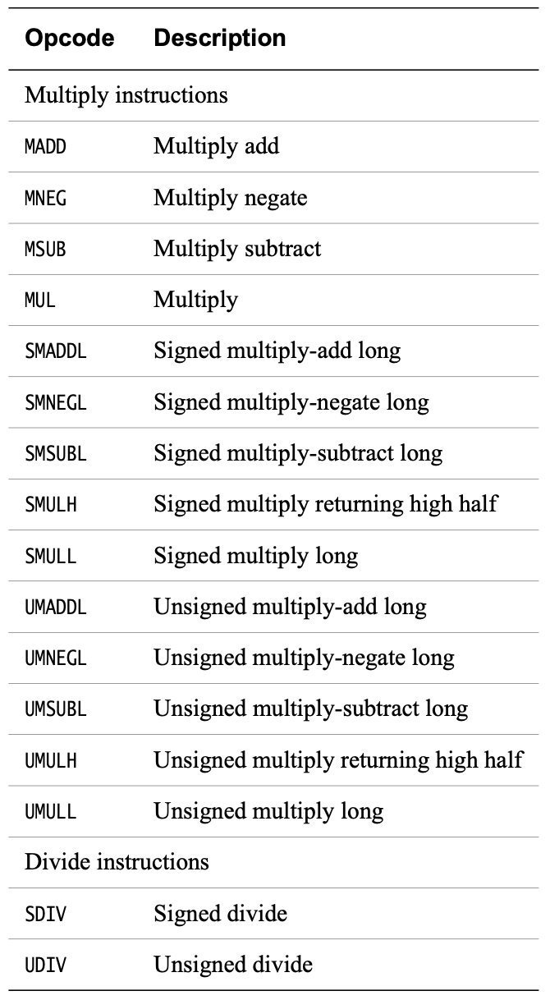

有一些乘法指令对32位或64位的数值进行操作，并返回与操作数相同大小的结果。例如，用MUL指令可以将两个64位的寄存器相乘，产生一个64位的结果。

```asm
MUL X0, X1, X2 // X0 = X1 * X2
```

还可以用MADD或MSUB指令在第三个源寄存器中加减累加器的值。

例如，MNEG指令可以用来对结果进行取反:

```asm
MNEG X0, X1, X2 // X0 = -(X1 * X2)
```

此外，还有一系列的乘法指令可以产生一个长的结果，即把两个32位的数字相乘，产生一个64位的结果。这些长线乘法有有符号和无符号的变体（UMULL, SMULL）。还有一些选项是将另一个寄存器中的数值累积起来（UMADDL, SMADDL）或进行取反（UMNEGL, SMNEGL）。

包括32位和64位的乘法，并可选择累加，其结果大小与操作数相同：

- 32±（32×32）得到32位结果。
- 64±（64×64）得到64位结果。
- ±（32×32）得到32位结果。
- ±（64×64）得到64位结果。

加宽乘法，即有符号和无符号的乘法，通过累加得到一个64位的结果：

- 64±（32×32）得到64位结果。
- ±（32×32）得到64位的结果。

一个64×64到128位的乘法运算需要两个指令序列来产生一对64位的结果寄存器。

- ±（64×64）得到结果[63:0]的较低64位。
- （64×64）得到结果的更高64位[127:64]。

> 该列表不包含32×64选项。您不能直接将32位W寄存器乘以64位X寄存器。

ARMv8-A架构支持32位和64位大小值的有符号和无符号除法。比如说：

```asm
UDIV W0, W1, W2 // W0 = W1 / W2 (unsigned, 32-bit divide) 
SDIV X0, X1, X2 // X0 = X1 / X2 (signed, 64-bit divide)
```

溢出和除零不会导致系统问题：

- 任何整数除以零都会返回零。
- 溢出只能在SDIV中发生：
    - INT_MIN / -1 返回INT_MIN，其中INT_MIN是最小的负数，可以在用于操作的寄存器中进行编码。与大多数C/C++方言一样，结果总是向零四舍五入。

#### 6.2.3 位移操作

以下说明是专门针对位移的：

- 逻辑向左移位（LSL）。LSL指令执行2的乘法。
- 逻辑向右移位（LSR）。LSR指令以2的幂执行除法。
- 算术向右移（ASR）。ASR指令执行2的幂的除法，保留符号位。
- 右旋转（ROR）。ROR指令执行位旋转，将旋转的位从LSB包裹到MSB。

位移操作如下表所示：

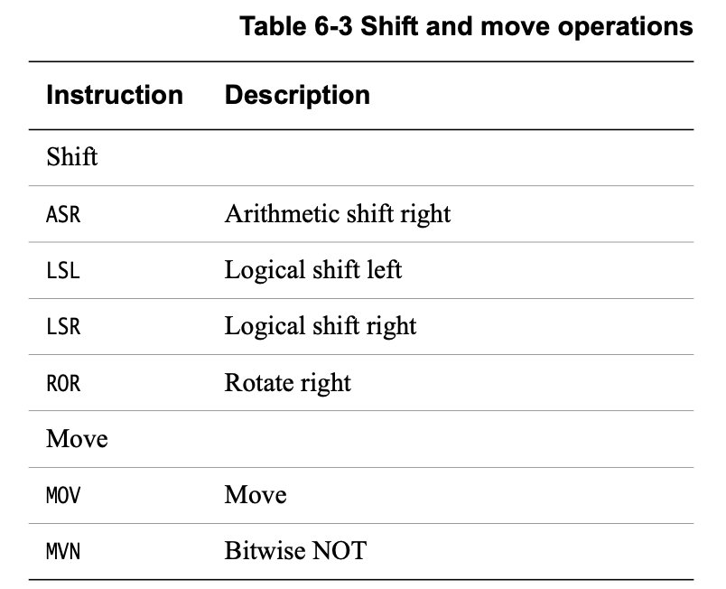

位移操作示意图如下图所示：

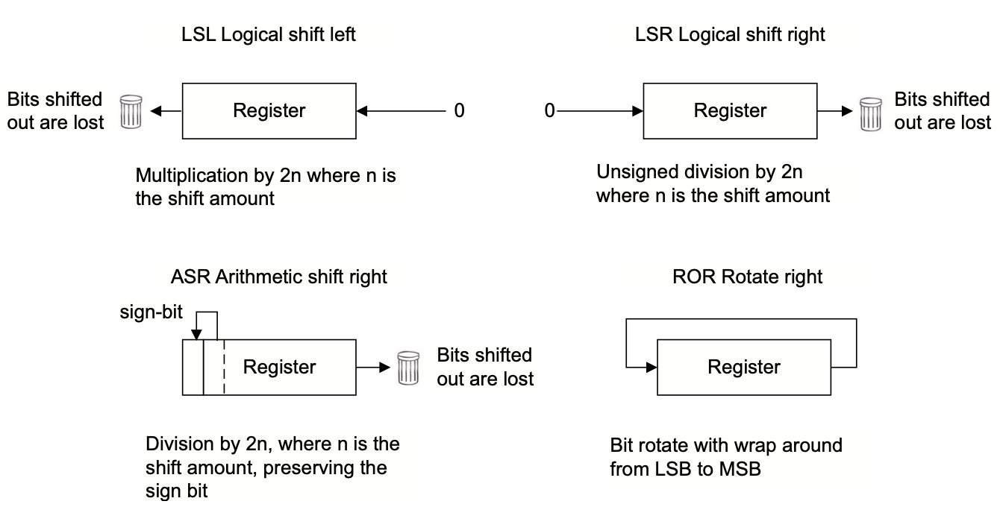

为移位指定的寄存器可以是32位或64位。要移位的数量可以指定为一个即时值，即达到寄存器大小减1，或者通过一个寄存器，其值只取自底部的5位（modulo-32）或6位（modulo-64）。

#### 6.2.4 Bitfield和字节操作指令

这些指令存在有符号（SXTB, SXTH, SXTW）和无符号（UXTB, UXTH）两种变体，是相应的Bitfield操作指令的别名。

这些指令的有符号和无符号变体都是将一个字节、半字或字（尽管只有SXTW在字上操作）扩展到寄存器大小。源寄存器总是一个W寄存器。目的寄存器可以是X或W寄存器，除了SXTW必须是X寄存器。

例如：

```asm
SXTB X0，W1 // 符号扩展了寄存器W1的最小有效字节,通过重复最左边的位，从8位到64位字节。
```

Bitfield(位域)指令与ARMv7中的指令类似，包括位域插入（BFI）以及有符号和无符号位域提取（(S/U)BFX）。还有一些额外的位域指令，如 BFXIL（位域提取和插入低）、UBFIZ（无符号位域插入零）和 SBFIZ（有符号位域插入零）。

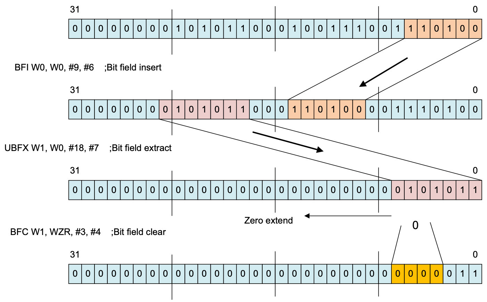

> 还有BFM、UBFM和SBFM指令。这些是位域移动指令，是ARMv8的新指令。但是，不需要明确使用这些指令，因为为所有情况提供了别名。这些别名是已经描述过的位域操作。[SU]XT[BHWX]、ASR/LSL/LSR immediate、BFI、 BFXIL、SBFIZ、SBFX、UBFIZ和UBFX。

如果你熟悉ARMv7架构，你可能会认出另一个位操作指令。

- CLZ在寄存器中计数前导零位。

同样，相同的字节操作指令：

- RBIT反转所有位。

- REV 反转寄存器的字节顺序。

- REV16 反转寄存器中每个半字的字节顺序。

	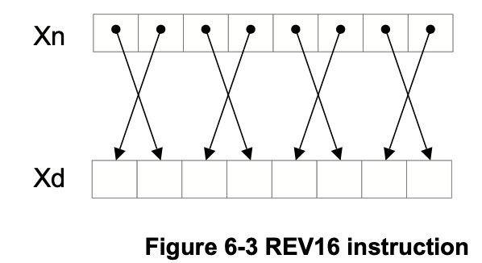

- REV32 反转寄存器中每个单词的字节顺序。

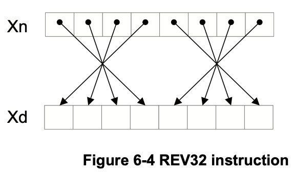

这些操作可以在word（32位）或双字（64位）大小的寄存器上执行，但REV32除外，它仅适用于64位寄存器。

#### 6.2.5 条件指令

A64指令集并不支持每条指令的条件执行。预先执行的指令并没有提供足够的好处来证明其对操作码空间的大量使用。

第4-6页的处理器状态描述了四个状态标志，零（Z）、负（N）、Carry（C）和溢出（V）。下面的表格表示这些位的值，用于标志设置操作。

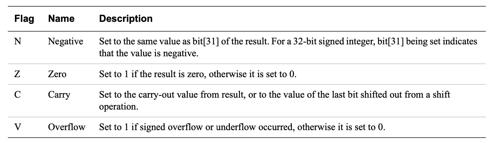

如果一个无符号操作的结果溢出了结果寄存器，C标志被设置。V标志的操作方式与C标志相同，但用于签名操作。

> 条件标志（NZCV）和条件代码与A32和T32的相同。然而，A64增加了NV（0b1111），尽管它的行为与它的补码AL（0b1110）相同。这与A32不同，A32没有给0b1111赋予任何意义。


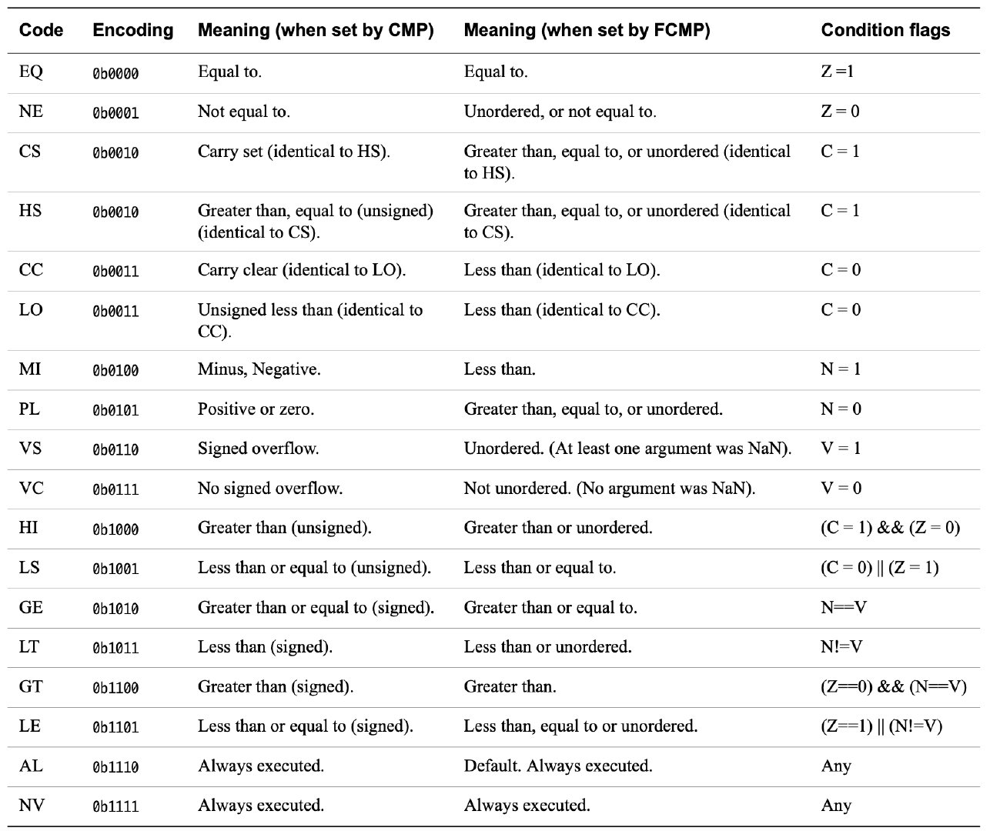

有一小部份的条件数据处理指令。这些指令是无条件执行的，但使用条件标志作为指令的额外输入。提供这组指令是为了取代ARM代码中条件执行的常见用法。

读取条件标志的指令类型有：

- **加/减**

    例如，用于多精度算术和校验和的传统ARM指令。

- **带有可选增量、否定或反转的条件选择**

    有条件地在一个源寄存器和第二个增量、否定、倒置或未修改的源寄存器之间进行选择。

    这些是A32和T32中单个条件指令最常见的用途。典型的用途包括有条件计数或计算有符号数量的绝对值。

- 条件操作

    A64指令集只允许对程序流控制分支指令进行条件执行。这与A32和T32相反，后者的大多数指令都可以用条件代码来预测。这些可以总结为以

    下几点：

    - 有条件选择（移动）

        - CSEL 根据一个条件在两个寄存器之间进行选择。无条件指令，然后是条件选择，可以取代简短的条件序列。
        - CSINC 根据一个条件在两个寄存器之间进行选择。返回第一个源寄存器或第二个源寄存器增加一个。
        - CSINV 根据条件在两个寄存器之间进行选择。返回第一个源寄存器或倒置的第二个源寄存器。
        - CSNEG 根据条件在两个寄存器之间进行选择。返回第一个源寄存器或被否定的第二个源寄存器。

    - 有条件设置

        有条件地在0和1（CSET）或0和-1（CSETM）之间进行选择。例如，用于在一般寄存器中将条件标志设置为布尔值或掩码。

    - 有条件比较

        （CMP和CMN）如果原始条件为真，则将条件标志设置为比较结果。如果不是真，条件标志将设置为指定的条件标志状态。条件比较指令对于表示嵌套或复合比较非常有用。

        > 使用FCSEL和FCCMP指令的浮点寄存器也可以使用条件选择和条件比较。


例如：

```asm
CSINC X0, X1, X0, NE // Set the return register X0 to X1 if Zero flag clear,else increment X0
```

上面的代码提供了示例指令的一些别名，其中要么使用零寄存器，要么将同一寄存器用作指令的目标和两个源寄存器。

例如：

```asm
CINC X0, X0, LS 	// If less than or same (LS) then X0 = X0 + 1
CSET W0, EQ			// If the previous comparison was equal (Z=1) then W0 = 1, // else W0 = 0
CSETM X0, NE	// If not equal then X0 = -1, else X0 = 0
```

这类指令为避免使用分支或有条件执行的指令提供了一个强有力的方法。编译器或汇编程序员可能采用一种技术，对if-then-else语句的两个分支进行操作。然后在最后选择正确的结果。

例如，考虑简单的C代码：

```c
if (i == 0) r = r + 2; else r = r - 1;
```

这可能会产生类似于以下内容的代码：

```asm
CMP w0, #0       // if (i == 0)
SUB w2, w1, #1   // r = r - 1
ADD w1, w1, #2   // r = r + 2
CSEL w1, w1, w2, EQ  // select between the two results
```


### 6.3 内存访问指令

与之前的所有ARM处理器一样，ARMv8架构是一个加载/存储架构。这意味着没有数据处理指令直接对内存中的数据进行操作。数据必须首先被加载到寄存器中，进行修改，然后存储到内存中。程序必须指定一个地址，要传输的数据大小，以及一个源寄存器或目标寄存器。还有一些额外的加载和存储指令，提供了更多的选择，如非时间性的加载/存储，加载/存储排他性，以及获取/释放。

内存指令可以以非对齐方式访问普通内存（见第13章内存排序）。这不支持独占访问、加载获取或存储释放变体。如果不需要非对齐访问，可以将其配置为故障。

#### 6.3.1 加载指令格式

Load指令的一般形式如下：

```asm
LDR Rt, <addr>
```

对于加载到整数寄存器中，你可以选择一个大小来加载。例如，要加载一个比指定的寄存器值小的尺寸，在LDR指令中加入以下后缀之一：

- LDRB (8-bit, zero extended).
- LDRSB (8-bit, sign extended).
- LDRH (16-bit, zero extended).
- LDRSH (16-bit, sign extended).
- LDRSW (32-bit, sign extended).

还有一些非比例偏移的形式，如LDUR<type>（参见第6-14页指定加载或存储指令的地址）。程序员通常不需要明确使用LDUR形式，因为大多数汇编程序可以根据使用的偏移量选择合适的版本。

你不需要指定一个零扩展的负载到X寄存器，因为写一个W寄存器有效的 零扩展到整个寄存器的宽度。

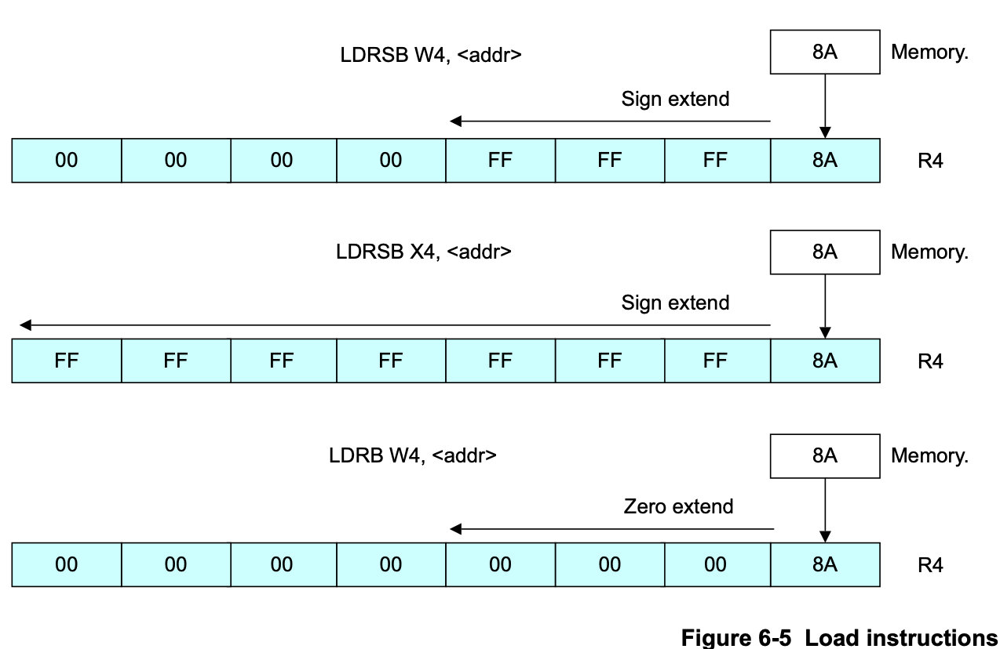

#### 6.3.2 存储指令格式

同样，存储指令的一般形式如下：

```asm
STR Rn，<addr>
```

还有一些非比例偏移的形式，如STUR<type>（参见第6-14页的指定加载或存储指令的地址）。程序员通常不需要明确使用STUR形式，因为大多数汇编程序可以根据使用的偏移量选择合适的版本。

要存储的大小可能比寄存器小。你可以通过在STR中加入B或H的后缀来指定。在这种情况下，存储的总是寄存器中最小的有效部分。

#### 6.3.3 浮点和NEON标量加载和存储

加载和存储指令也可以访问浮点/NEON寄存器。在这里，大小只由被加载或存储的寄存器决定，它可以是B、H、S、D或Q寄存器中的任何一个。

加载指令总结如下表所示：

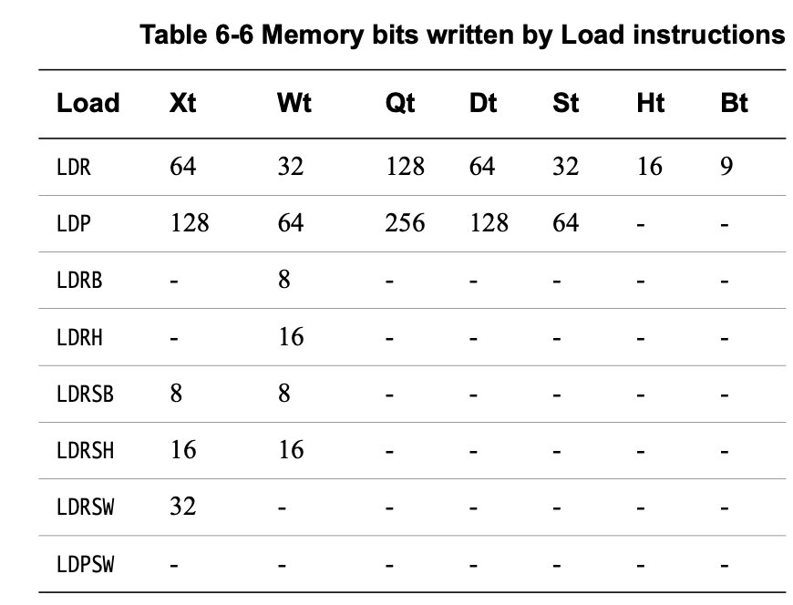

存储指令总结如下表所示：

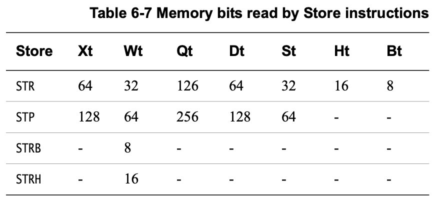

对于加载到FP/SIMD寄存器中，没有符号扩展选项可用。这种加载的地址仍然使用通用寄存器来指定。

例如：

```asm
LDR D0, [X0, X1]
```

用X0加X1所指向的内存地址的双字加载寄存器D0。

> 浮点和标量NEON负载和存储使用与整数负载和存储相同的寻址模式。

#### 6.3.4 指定加载或存储指令的地址

A64可用的寻址模式与A32和T32中的相似。有一些额外的限制以及一些新的功能，但是对于熟悉A32或T32的人来说，A64可用的寻址模式并不令人惊讶。

在A64中，一个地址操作数的基寄存器必须总是一个X寄存器。然而，有几条指令支持零扩展或符号扩展，这样就可以提供一个32位的偏移作为一个W寄存器。

##### 偏移模式

偏移寻址模式将一个立即数或一个可选择修改的寄存器值添加到一个64位的基础寄存器中以产生一个地址。

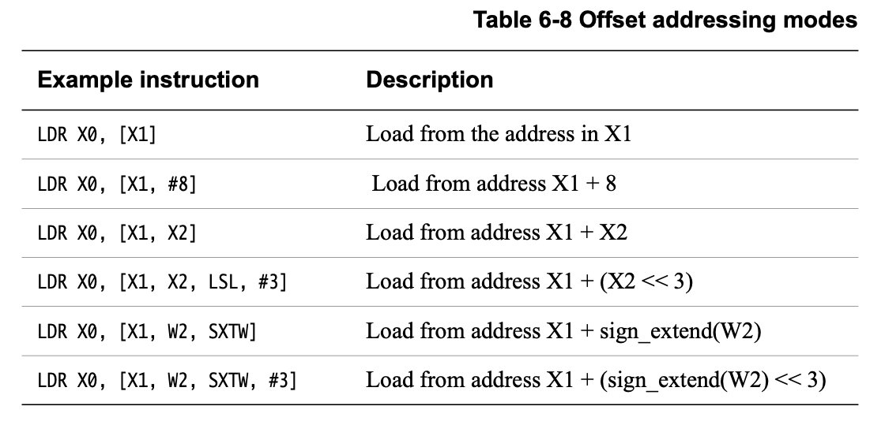

通常，在指定移位或扩展选项时，移位量可以是以字节为单位的访问大小的0（默认值）或log2（以便Rn << <shift>乘以访问大小）。这支持常见的数组索引操作。

```c
// A C example showing accesses that a compiler is likely to generate. 
void example_dup(int32_t a[], int32_t length) {
		int32_t first = a[0];	// LDR W3, [X0]
		for (int32_t i = 1; i < length; i++) { 
				a[i] = first;			// STR W3, [X0, W2, SXTW, #2]
		}
}
```

##### 索引模式

索引模式与偏移模式类似，但它们也更新基地址寄存器。这里的语法与A32和T32相同，但操作集的限制性更强。通常情况下，只能为索引模式提供即时偏移量。

有两种变体：在访问内存之前应用偏移量的预索引模式，以及在访问内存之后应用偏移量的后索引模式。

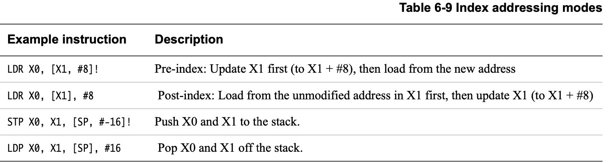

这些选项准确地映射到一些常见的C操作上。：

```c
// A C example showing accesses that a compiler is likely to generate. 
void example_strcpy(char * dst, const char * src)
{
		char c;
		do {
				c = *(src++);	// LDRB W2, [X1], #1 
				*(dst++) = c;	// STRB W2, [X0], #1
		} while (c != '\0'); 
}
```

##### PC-relative 模式（字面加载）

A64增加了另一种专门用于访问文字池的寻址模式。文字池是在指令流中编码的数据块。这些池子不被执行，但是它们的数据可以使用PC相对的内存地址从周围的代码中访问。文字池经常被用来编码常量值，这些常量值不适合用简单的立即移动指令。

在A32和T32中，PC可以像一个通用寄存器一样被读取，所以只需指定PC为基寄存器就可以访问一个字库。

在A64中，PC普遍不能被访问，而是有一种特殊的寻址模式（仅用于加载指令）可以访问与PC相关的地址。这种特殊的寻址模式也比A32和T32中的PC-relative 加载所能达到的范围要大得多。因此，文字池可以更稀疏地定位。

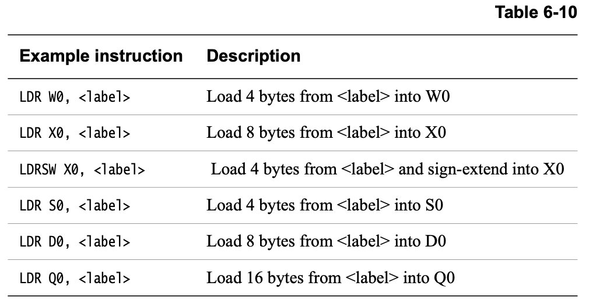

#### 6.3.5 访问多个内存位置

A64不包括A32和T32代码可以使用的Load Multiple(LDM)或Store Multiple(STM)指令。

在A64代码中，有加载对（LDP）和存储对（STP）指令。与A32的LDRD和STRD指令不同，任何两个整数寄存器都可以被读取或写入。数据被读入或写入相邻的内存位置。为这些指令所提供的寻址模式选项比其他内存访问指令的限制性更强。LDP和STP指令只能使用一个带有7位有符号即时值的基寄存器，并可选择预增加或后增加。与32位的LDRD和STRD不同，LDP和STP可以进行无符号访问。

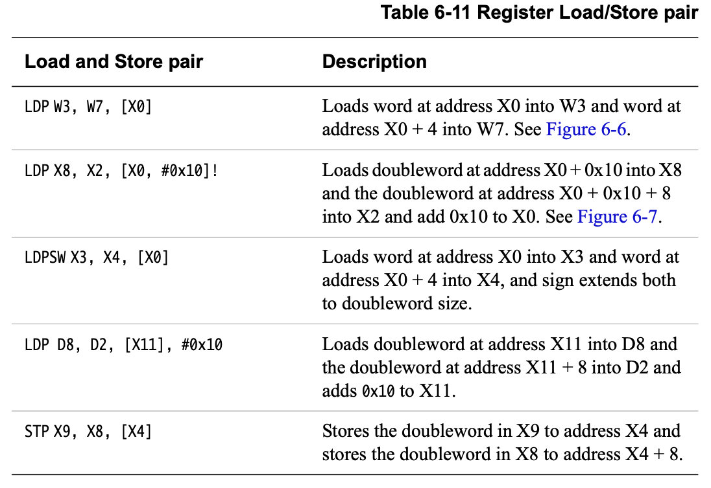

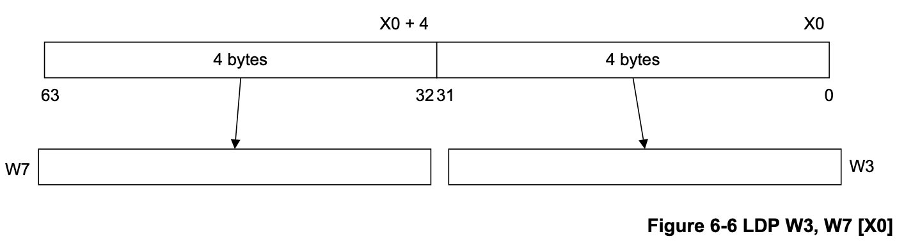

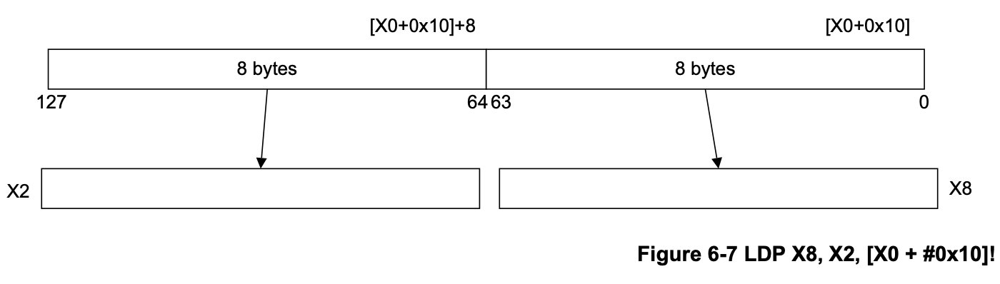

#### 6.3.6 无特权访问

A64的LDTR和STTR指令执行无特权的加载或存储（参见ARMv8-A架构参考手册中的LDTR和STTR）：

- 在 EL0、EL2 或 EL3，它们表现为正常加载或存储。

- 当在EL1执行时，它们的行为就像是在EL0特权级别执行的一样。


这些指令相当于A32 LDRT和STRT指令。

#### 6.3.7 预取内存

从内存中预取（PRFM）使代码能够向内存系统提供一个提示，即来自特定地址的数据将很快被程序使用。这个提示的效果由实施者决定，但通常情况下，它导致数据或指令被加载到一个缓存中。

指令语法是：

```asm
PRFM <prfop>, <addr> | label
```

其中prfop是以下选项的串联：

```asm
Type    PLD or PST (prefetch for load or store).
Target  L1, L2, or L3 (which cache to target).
Policy  KEEP or STRM (keep in cache, or streaming data).
```

例如，PLDL1KEEP。

这些指令与A32 PLD和PLI指令相似。

#### 6.3.8 非时间性加载和存储对

ARMv8中的一个新概念是非时间性的加载和存储。这些是LDNP和STNP指令，执行一对寄存器值的读或写。它们还向内存系统发出提示，说明缓存对该数据没有用处。这个提示并不禁止内存系统的活动，如地址的缓存、预加载或收集。然而，它表明缓存不太可能提高性能。一个典型的用例可能是流式数据，但要注意，有效使用这些指令需要针对微架构的方法。

非时间性的加载和存储放宽了内存排序的要求。在上面的例子中，LDNP指令可能在前面的LDR指令之前被观察到，这可能导致从X0的不确定地址读取。

例如：

```asm
LDR X0, [X3]
LDNP X2, X1, [X0] // Xo may not be loaded when the instruction executes!
```

为了纠正上述问题，你需要一个明确的负载屏障：

```asm
LDR X0, [X3]
DMB nshld
LDNP X2, X1, [X0]
```

#### 6.3.9 内存访问原子性

使用单一通用寄存器的对齐内存访问需要被保证为原子访问。一对通用寄存器的加载和存储指令，使用一个对齐的内存地址，保证显示为两个单独的原子访问。不对齐访问不是原子的，因为它们通常需要两个单独的访问。此外，浮点和SIMD内存访问不保证是原子的。

#### 6.3.10 内存屏障和栅栏说明

ARMv7和ARMv8都提供了对不同屏障操作的支持。这些将在第13章内存排序中详细描述：

- 数据内存屏障（DMB）。这迫使所有在程序中较早的内存访问在任何后续访问之前成为全局可见。

- 数据同步屏障（DSB）。所有悬而未决的加载和存储、缓存维护指令以及所有的TLB维护指令，在程序继续执行之前都会完成。DSB的行为类似于DMB，但有额外的属性。

- 指令同步屏障（ISB）。这条指令刷新了CPU流水线和预取缓冲区，导致ISB之后的指令被从缓存或内存中取走（或重新取走）。


ARMv8 引入了单边栅栏，它与释放一致性模型有关。这些被称为加载-获取（LDAR）和存储-释放（STLR），是基于地址的同步原语。(参见第13-8页的单向屏障。)这两个操作可以配对形成一个完整的栅栏。这些指令只支持基寄存器寻址，不提供偏移量或其他类型的索引寻址。

#### 6.3.11 原始同步

ARMv7-A和ARMv8-A体系结构都提供对独占内存访问的支持。在A64中，这就是加载/存储独占（LDXR/STXR）对。

LDXR指令从一个内存地址加载一个值，并试图默默地要求对该地址进行独占锁定。然后，只有在成功获得并保持锁的情况下，Store-Exclusive指令才会向该位置写入一个新的值。LDXR/STXR配对被用来构建标准的同步原语，如自旋锁。提供了一组成对的LDXRP和STXRP指令，以允许代码原子地更新一个跨越两个寄存器的位置。有字节、半字、字和双字选项。与加载获取/存储释放配对一样，只支持基本寄存器寻址，没有任何偏移。

CLREX指令清除了监视器，但与ARMv7不同的是，异常进入或返回也会清除监视器。监控器也可能被虚假地清除，例如，通过缓存驱逐或其他与应用程序没有直接关系的原因。软件必须避免在成对的LDXR和STXR指令之间有任何显式内存访问、系统控制寄存器更新或高速缓存维护指令。

还有一对被称为LDAXR和STLXR的负载获取/存储释放指令的排他性。请看第14-6页的同步化。

### 6.4 流控

A64指令集提供了许多不同种类的分支指令（见表6-12）。对于简单的相对分支，即那些从当前地址开始的偏移量，使用B指令。无条件的简单相对分支可以从当前的程序计数器位置向后或向前分支，最多可达128MB。有条件的简单相对分支，即在B指令上附加了一个条件代码，其范围较小，为±1MB。

对子程序的调用，如果需要将返回地址保存在链接寄存器（X30）中，则使用BL指令。这条指令没有条件版本。BL的行为和B指令一样，有一个额外的效果，就是将返回地址，也就是BL后的指令地址，存储在寄存器X30中。

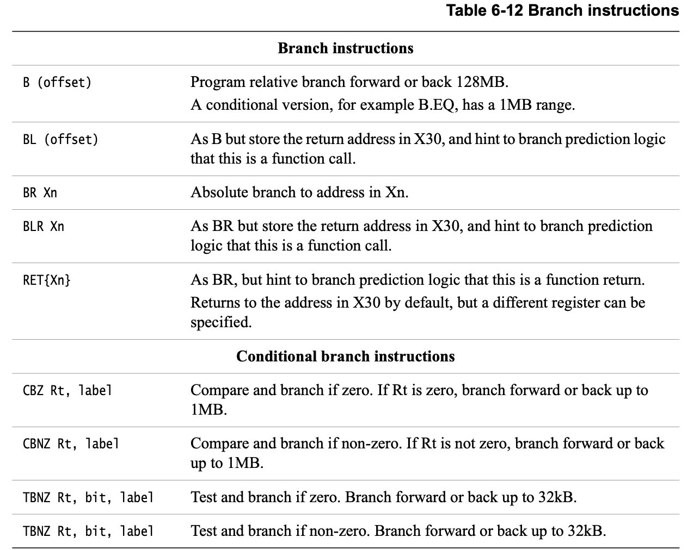

除了这些与PC有关的指令外，A64指令集还包括两个绝对分支。BR Xn指令执行一个绝对分支到Xn中的地址，而BLR Xn具有相同的效果，但也将返回地址存储在X30中（链接寄存器）。RET指令的作用与BR Xn相似，但它提示分支预测逻辑它是一个函数返回。RET的默认分支是指向X30中的地址，当然也可以指定其他寄存器。

A64指令集包括一些特殊的条件性分支。这些分支在某些情况下可以提高代码密度，因为不需要明确的比较。

- CBZ Rt，标签//如果为零，则进行比较和分支

- CBNZ Rt，标签//比较和分支，如果不是零


这些指令将32位或64位的源寄存器与零进行比较，然后有条件地执行一个分支。分支偏移的范围是±1MB。这些指令不读取或写入条件代码标志（NZCV）。

有两种类似的测试和分支指令:

- TBZ Rt,  bit, label.  //测试和分支，如果Rt<bit>为零
- TBNZ Rt, bit, label //如果Rt<bit>不是零，则测试和分支

这些指令测试源寄存器中由立即指定的位位置上的位，并根据该位是否被设置或清除而有条件地进行分支。分支偏移的范围是±32kB。与CBZ/CBNZ一样，这些指令不读取或写入条件代码标志（NZCV）。

### 6.5 系统控制和其他指令

A64指令集包含与以下内容相关的说明：

- 异常处理。

- 系统注册访问。

- 调试。

- 提示指令，在许多系统中都有电源管理应用程序。

#### 6.5.1 异常处理指令

有三条异常处理指令，其目的是导致异常的发生。这些指令用于调用运行在操作系统（EL1）、管理程序（EL2）或安全监控器（EL3）中更高的异常级别的代码：

-  SVC #imm16	//主管调用，允许应用程序调用内核//（EL1）。

-  HVC #imm16	//虚拟机管理程序调用，允许操作系统代码调用虚拟机管理程序（EL2）。

-  SMC #imm16	//安全监视器调用，允许操作系统或虚拟机管理程序调用安全//监视器（EL3）。


异常综合寄存器中的处理程序可以获得立即数。这是对ARMv7的改变，在ARMv7中，立即数必须通过读取调用指令的操作码来确定。更多信息请参见第10章AArch64异常处理。

要从异常中返回，请使用ERET指令。这条指令通过将SPSR_ELn复制到PSTATE来恢复处理器的状态，并分支到ELR_ELn中保存的返回地址。

#### 6.5.2 系统寄存器访问

系统寄存器访问提供了两项说明：

- MRS Xt, <system register> 

​		例如：MRS X4, ELR_EL1  // Copies ELR_EL1 to X4

- MSR <system register>, Xt 

    例如：MSR SPSR_EL1, X0  // Copies X0 to SPSR_EL1

PSTATE的个别字段也可以用MSR或MRS访问。例如，要选择与EL0相关的堆栈指针或当前的异常级别。

- MSR SPSel, #imm	// A value of 0 or 1 in this register is used to select
     								// between using EL0 stack pointer or the current exception

    ​								// level stack pointer

这些指令有特殊形式可用于清除或设置单个异常掩码位（见第4-5页的保存进程状态寄存器）：

- MSR DAIFClr, #imm4
- MSR DAIFSet, #imm4

请参阅第4-7页的系统寄存器。

#### 6.5.3 调试指令

有两个与调试相关的说明：

- BRK #imm16 // 进入监视器模式调试，其中有片上调试监视器代码

- HLT #imm16 // 进入停止模式调试，其中连接外部调试硬件


有关调试的信息，请参阅第18章调试。

#### 6.5.4 提示指令

HINT指令在规则上可以被当作NOP处理，但是它们可以产生特定的实现效果：

- NOP		// No operation - not guaranteed to take time to execute
- YIELD     // Hint that the current thread is performing a task that // can be swapped out
- WFE       // Wait for Event
- WFI        // Wait for interrupt 
- SEV        // Send Event
- SEVL      // Send Event Local

这些概念也包含在第14章多核处理器和第15章电源管理中。

#### 6.5.5 NEON指令

NEON指令集也有一些增强功能，其中一些是相当重要的。第7章AArch64浮点和NEON更详细地描述了这些。

A64中NEON的变化包括:

- 支持双精度浮点，使得用双精度浮点的C代码能够向量化。
- 对存储在NEON寄存器中的标量数据进行操作的新指令。
- 插入和提取矢量元素的新指令。
- 用于类型转换和饱和整数运算的新指令。
- 浮点值规范化的新指令。
- 新的跨线指令用于向量减少、求和、取最小或最大值。
- 执行诸如比较、加法、查找绝对值和否定等操作的指令已被扩展到能够对64位整数元素进行操作。

#### 6.5.6 浮点指令

A64提供了一套类似于ARMv7-A VFPv4扩展的浮点指令，它提供了对标量浮点值的单精度和双精度数学运算。有一些变化和新功能：

- 浮点比较直接设置条件标志（NZCV）。在A64中，无需显式地将比较结果从浮点传输到整数标志。
- 已经添加了有关IEEE754-2008标准的说明，例如计算一对数字的最小值和最大值。
- 在从整数到浮点格式的转换中，现在可以明确指定舍入模式。当需要在特定的舍入模式下进行简单转换时，不再需要设置全局FPCR标志。其中一些选项也适用于ARMv8 A32和T32。
- 添加了支持64位整数和浮点格式之间转换的说明。
- 在A64中，涉及整数类型的浮点操作直接在整数寄存器上工作。不需要手动在浮点和整数寄存器之间转移整数值进行转换操作。

#### 6.5.7 加密指令

ARMv8的可选扩展增加了加密指令，大大改善了AES加密以及SHA1和SHA256散列等任务的性能。