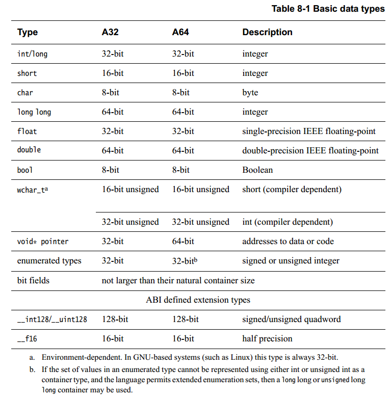
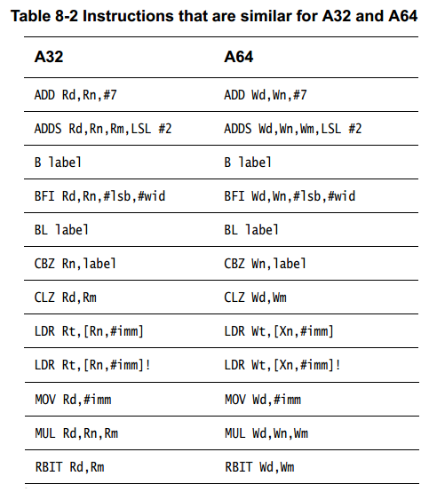
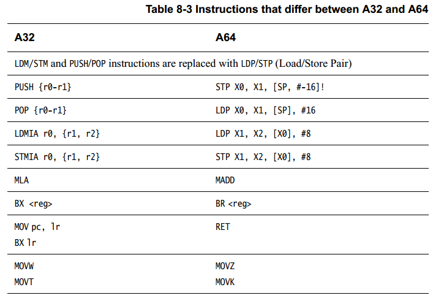
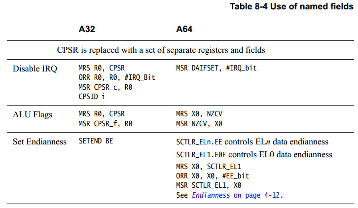

## 8. 移植到 A64


> 本章不打算作为一个详细的为所有系统编写可移植代码的指南，但是，覆盖了工程师应该知道的在ARM处理器上移植代码的主要领域。在将代码从 A32 和 T32 指令集移动到 AArch64 中的 A64 指令集时，您应该注意一些显着差异：

> * A32 指令集中的大多数指令都可以有条件地执行。也就是说，可以将条件代码附加到指令，并根据先前标志设置指令的结果执行（或不执行）指令。尽管这使编程技巧能够减少代码大小和周期数，但这会使具有乱序执行的高性能处理器的设计变得非常复杂。
>
>   在操作码字段中保留操作码（predication）的必要位可以有用地用于其他目的（例如，为从更大的通用目的寄存器池中进行选择提供空间-译注：不明白）。因此，在 A64 代码中，只有一小部分指令可以有条件地执行，而一些比较和选择指令取决于执行条件。请参阅第 6-8 页的条件指令。
>
> * 许多A64 指令可以对源寄存器或仅受操作数大小限制的寄存器应用任意常量移位。此外，A64 提供了非常有用的扩展寄存器形式。需要明确的指令来处理更复杂的情况，例如变量移位。 T32 也比 A32 更具约束性，因此在某些方面 A64 是相同原则的延续。 A32 的 Operand2 在 A64 中并不存在，但各自有类似的指令。
>
> * 加载和存储指令的可用寻址模式有一些变化。 A32 和 T32 中的偏移量、前置-索引和后置-索引形式在 A64 中仍然可用。A64引入一种新的 PC 相对寻址模式，因为不能使用与通用寄存器相同的方式访问 PC。 ~~A64 加载指令可以以内联方式替换寄存器~~（尽管不如 A32 灵活），并且可以使用一些扩展模式（例如，可以使用 32 位数组索引）
>
>   A64 从以前的 ARM 架构中删除了所有复合内存访问指令（加载或存储多个-译注：LDM/STM），这些指令能够从内存中读取或写入任意寄存器列表。现在A64应使用可对任意两个寄存器进行操作的加载 (LDP) 和存储 (STP) 指令。 PUSH 和 POP 也已被删除。
>   
> * ARMv8 添加了包括单向内存栅栏（barrier）的加载和存储指令：加载-获取（load-acquire）和存储-释放（store-release）。这些在 ARMv8 A32 和 T32 以及 A64 中可用。加载-获取指令要求任何后续内存访问（编程顺序）仅在加载获取之后可见。 store-release 确保在 store-release 变得可见之前所有早期的内存访问都是可见的。请参阅第 6-18 页的内存屏障和栅栏说明。
>
>   译注： Acquire： Acquire之后的所有内存操作将发生在Acquire操作之后。Release： Release确保所有先于Release的内存操作将先于Release操作发生
>
> * AArch64 不支持协处理器的概念，包括CP15。新的系统指令（todo: 列举一下指令）允许访问通过 AArch32 中的 CP15 协处理器指令访问的寄存器。
>
> * AArch64 中没有CPSR 这个寄存器。PSTATE （NZCV等标志）可以通过特殊寄存器、操作码访问访问。
>
>   译注： 
>
>    ```assembly
>    指令： DAIFSet DAIFClr  特殊寄存器： NZCV DAIF CurrentEL
>    ```
>
> * 对于许多应用程序，将代码从旧版本的 ARM 架构或其他处理器架构移植到 A64 意味着只需重新编译源代码。但是，在许多领域 C 代码不能完全移植。
>   A64 和 A32/T32 之间的相似性在以下示例中说明。下面的三个序列显示了一个简单的 C 函数和第一个 T32 和 A64 中的输出代码。两者的对应关系很容易看出来。
>

> ``` c
> // C code
> int foo(int val)
> {
>     int newval = bar(val);
>     return val + newval;
> }
> ```
>
> ``` assembly
> // T32									// A64
> foo:									foo:
> SUB SP, SP, #8								SUB SP, SP #16
> STRD R4, R14, [SP]							STP X19, X30, [SP]
> MOV R4, R0									MOV W19, W0
> BL bar										BL bar
> ADD R0, R0, R4								ADD W0, W0, W19
> LDRD R4, R14, [SP]							ADD SP, SP, #16
> ADD SP, SP, #8								RET
> BX LR	
> ```
>
> 
> 
> A64提供的通用功能是从A32和T32的功能中演化而来，因此在这两者之间移植代码比较简单。将A32汇编代码转换为A64的也很简单。大多数指令在这些指令集之间很容易映射，许多（执行）序列在A64中变得更简单。
> 
> 

### 8.1 字节对其

> 数据和代码必须满足适当的内存对其方式。访问对齐会影响 ARM 内核的性能，并且在将代码从早期架构迁移到 ARMv8-A 时可能会出现可移植性问题。出于性能原因，或者在移植对指针或 32 位和 64 位整数变量做出假设的代码时，需要注意对齐问题。
>
> 以前版本的 ARM 编译器语法程序集提供了 ALIGN n 指令，其中 n 以字节为单位指定对齐边界。例如，指令 ALIGN 128 将地址对齐到 128 字节边界。
>
> GNU 汇编语法（ARM Complier 6 语法）提供了 .balign n 指令，它使用与 ALIGN 相同的格式。
>
> 注意：
>
> > GNU 语法汇编还提供了 .align n 指令。但是，n 的格式因系统而异。 .balign 指令提供与 .align 相同的对齐功能，并在所有架构中具有一致的行为
> >
> > > 译注： .balign, b感觉应为boundary的意思，边界对其。 译注： gnu-gcc 汇编 .align 2 是 2^2，4字节对其的意思。
>
> 在从旧编译器迁移到 ARM Compiler 6 时，您应该将 ALIGN n 的所有实例转换为 .balign n。

### 8.2 数据类型

> 在 64 位机器上的 C 和 C 派生语言的许多编程环境中，int 变量仍然是 32 位宽，但长整数和指针是 64 位宽。 这些被描述为具有 LP64 数据模型（译注：lp64指一系列数据类型，见下表格）。 本章假设为 LP64，尽管其他数据模型可用，请参见第 5-7 页的表 5-1。
> ARM ABI 为 LP64 定义了许多基本数据类型。 其中一些可能因架构而异，如下所示：

> 
>
> ​	译注： a. 对于一些linux环境， wchar_t 总是为32bit
>
> ​				b. 如果定义枚举类型时没有显示的指定变量为int或者unsigned（使用0x0赋值某个枚举类型），而且没有指定-fshort-enums,则枚举类型的长度有可能是unsigned long long或者long long
>
> ​	在将 AArch64 与以前版本的 ARM 架构进行比较时，由于通用寄存器和操作都是64位，通常可以更有效地处理 64 位数据类型。 int 仍然是 32 位的，可以通过通用寄存器（W 寄存器）有效地处理它。 然而，指针是指向数据或代码的 64 位地址。 ARM ABI 将 char 默认定义为无符号。 对于以前版本的架构也是如此。
> 如果您的代码不以不可移植的方式操作指针，例如转换为非指针类型或从非指针类型转换或执行指针算术的情况，移植将变的简单。 这意味着你从未将指针存储在 int 变量中（可能有 intptr_t 和 uintptr_t 例外），并且从未将指针转换为 int。 有关这方面的更多信息，请参阅将代码从 32 位环境移植到 64 位环境时遇到的问题（第 8-8 页）。
>
> ​	除其他影响外，这会更改大小，并可能更改结构和参数列表的对齐方式。当存储大小很重要的情况下，可以使用 stdint.h 中的 int32_t 和 int64_t 类型。注意 size_t 和 ssize_t 在 AAPCS64-LP64 中都是 64 位的。
> ​	出于性能原因，编译器尝试在自然大小（译注：参考linux对其方式）边界上对齐数据。大多数编译器都试图优化编译模块中全局数据的布局。
>
> ​	AArch64 支持 16、32、64 和 128 位数据非对齐访问，其中使用的地址不是要加载或存储的数量的倍数。但是，独占加载（loaded)或存储(stored)以及 加载-获取(load-acquire)或存储-释放(store-release)指令只能访问对齐的地址(译注：比如ldp，stp指令始终要满足64bit对其）。这意味着用于构造信号量（sem、mutex）和其他锁（lock）机制的变量通常必须对齐（译注：还有压栈、出栈等情况）。
>
> ___ ___
>
> **注意**
>
> > 在正常情况下，所有变量都应该对齐。 在大多数情况下，非对齐访问的平均效率仍然低于对齐访问。
> >对于系统中的其他 CPU 或 总线控制，未对齐的访问永远不能保证是原子的。
> > 此规则的唯一主要例外是访问packed的数据结构——在通过文件或网络连接等方式将数据进行组织（译注：打包数据），为发送或接收 外部数据节省大量精力。
>
> ___ ___
>
> ​	与对齐访问相比，未对齐访问可能会对性能产生影响。 在自然大小边界上对齐的数据可以更有效地访问，而未对齐的访问可能会花费额外的总线或缓存周期。 应该使用packed属性（ \__attribute__((packed,aligned(1)))警告编译器潜在的未对齐访问，例如在手动转换指向不同数据类型的指针时。
>
> > 译注： 这里我理解的是，packed取消默认的自然对其方式，采用实际大小进行对其，~~~ ``` TODO： 举例不明白想表达什么意思。``` ~~~
>

#### 8.2.1 汇编代码

> 许多 A32 汇编指令可以很容易地替换为类似的 A64 指令。 不幸的是目前没有自动化机制。 然而，很多东西可以相当简单地转换。 下表显示了 A32/T32 和 A64 指令集在许多方面的紧密匹配。
>
> > > > > > > > > > > > > > 
>
> 但是，在许多有重写需求的地方存在差异。 下表显示了其中的一些。
>
> > > > > > > > > > > > > > > > > > > > > > > > 

___ ___

**Note **

> > > 64-bit APCS 需要**栈**按照 128-bit(16 byte) 对其 

___ ___

表8-4 展示了如何通过 PSTATE 各个字段的别名来替代CPSR 寄存器



T32 条件执行编译为第 8-6 页、表 8-4 的 A32 列中所示的序列。 在 A64 中，它使用了新的条件选择指令，如 A64 列所示。
以下示例说明了两个指令集（T32 和 A64）中条件执行之间的区别：

```c
// C code
int gcd(int a, int b)
{
    while (a != b) {
        if (a > b) {
            a = a - b;
        } else {
            b = b - a;
        }
    }
    return a;
}
```

```assembly
//A32						// A64
gcd:						gcd:
CMP R0, R1						SUBS W2, W0, W1
ITE								CSEL W0, W2, W0, gt
SUBGT R0, R0, R1				CSNEG W1, W1, W2, gt
SUBLE R1, R1, R0				BNE gcd
BNE gcd							RET
BX lr
```


### 8.3 移植32-bit代码到64-bit时遇到的问题

> 移植 C 代码到 64 位环境中运行时可能会出现一些常见问题。这些问题不只是在 ARM 架构中出现。
>
> * 需要注意指针和整数变量，因为它们的大小可能不同。 ARM 建议使用 stdint.h 中的 uintptr_t 或 intptr_t 将指针类型作为整数值处理。指针运算中使用的偏移量应声明为 ptrdiff_t，因为使用 int 可能会产生不正确的结果。
> * 64 位系统具有更大的潜在的内存访问，32 位 int 可能不足以索引数组中的所有条目。
> * C 表达式中的隐式类型转换可能会产生一些意想不到的效果。注意确保使用的任何常量值与掩码本身具有相同的类型。
> * 使用不同长度或符号的数据类型执行操作时要小心。例如，当无符号和有符号 32 位整数在表达式中混合并将结果分配给有符号长整数时，可能需要将其中一个操作数显式转换为其 64 位类型。这会导致所有其他操作数也被提升为 64 位。请注意，long 通常是 A64 (LP64) 上的 64 位类型。


#### 8.3.1 代码重写和再编译

> 任何移植都不可避免地需要重新编译和重写代码。 大多数情况下的目标是尽可能使用前者而不是后者。
>
> 好消息是很多代码只需要重新编译。 但是，请谨慎行事，因为许多基本数据类型的大小将发生变化。 尽管编写良好的 C 代码不应该对单个类型的大小有太多依赖，但你很可能会遇到一些。
>
> 因此，最佳实践必须是在重新编译时启用所有警告和错误，并确保您注意到编译器发出的任何警告，即使代码看起来编译时没有错误。
> 密切注意代码中的任何显式类型转换，因为当底层类型的大小发生变化时，这些通常是错误的根源。

#### 8.3.2 ARMv8-A使用ARM Compiler 6 的一些选项

> 向编译器提供正确的选项以生成代码或为ARMv8-A 生成目标代码. 以下是可用的选项：
>
> 使用 **--target** 为指定的目标生成代码。
>
> **--target** 选项是强制性的，没有默认值。 您必须始终指定目标体系结构。

​	**Syntax**

> --target=triple
>
> triple 为 architecture-vendor-OS-abi 的架构
>
> 已经支持的target选项如下：
>
> aarch64-arm-none-eabi : ARMv8-A 架构的AArch64 模式。
>
> armv8a-arm-none-eabi :  ARMv8-A架构的AArch32 模式。
>
> armv7a-arm-none-eabi：ARMv7-A 架构
>
> 例如:
> --target=armv8a-arm-none-eabi

___Note___

------

--target 选项是 armclang 选项。 对于所有其他工具，例如 armasm 和 armlink，使用 --cpu 和 --fpu 选项来指定目标处理器和架构。

译注： 对于gun gcc 还有两个参数-march -mtune可以参考

------

> 使用 --mcpu 选项为特定 ARM 处理器生成代码。
>
> 如下：
>
> > -mcpu=<processor>+(no)crc - 使能或者禁止 crc 指令
> >
> > -mcpu=<processor>+(no)crypto - 使能或者禁止加解密引擎
> >
> > -mcpu=<processor>+(no)fp - 使能或者禁止floating point 扩展
> >
> > -mcpu=<processor>+(no)simd - 使能或者禁止NEON指令
> >
> > processor 可以是cortex-a53 或者 cortex-a57， （译注： 感觉a55 也是可以的）

> 为 AArch32 架构编译代码时会产生与 ARMv7-A 非常相似的代码。 虽然 AArch32 有一些新指令（例如 Load-Acquire 和 Store-Release），并且 SWP 指令已被删除，但这些指令通常不是由编译器生成的。
> 使用 +nosimd 选项进行编译可避免使用任何 NEON/Floating-point 指令或寄存器。 这对于 NEON 单元未使能的系统或特定代码段（例如重置代码和异常处理程序）可能很有用，确保其中不使用NEON/Floating-point非常重要。 默认编译代码时为无加密扩展，但使用 NEON。

### 8.4 C 代码的一些建议

* 使用sizeof() 代替常量，例如：

​		```(void **) calloc(4, 100);```

​		替换为：

​		```(void **) calloc(sizeof(void*), 100);```

​		或者最好使用：

​		``` void *a; (void **) calloc(sizeof(a), 100);```

* 如果需要显示的（explicit）定义数据类型，最后使用stdin.h

* 如果需要将指针强制转换为整数，请使用保证能够容纳该指针的类型，例如 uintptr_t。

  如果你不关心实际的指针代表的类型，类型 *bob；bob++ 仍然是首要使用的方式，指针运算更适用于潜在的（基础）数据类型。 （**译注：不明白他想说什么**）

* 当使用结构体成员时（结构体）需要注意，此时数据大小和布局很重要，如下：

  ```struct {void *a; int b; int c} bob;``` 

  不建议使用

   ``` struct {int b; void *a; int c;} ``` 

  这种与 AAPCS64 中规定的一样，元素 a 在它之前插入了 32 位填充以保持 64 位对齐。

* 适当使用 size_t (译注： 当表示数据大小的类型时)

* 当假定数据类型大小时，应该谨慎使用limits.h

* 恰当的使用 函数、宏、built-ins 应用在数据类型

  例如： 使用 atol(char\*) 替换 atoi（char\*)

* 使用原子操作时，使用正确的64位的函数操作64位数据类型。

* 不要假设对同一结构中不同位域的操作是独立处理的——在 64 位平台上比在 32 位平台上可以读取和写入的位更多。

* 对Long数据类型使用 ‘L’ 时，32-bit架构位32bit，64bit架构位64bit。如下表达式需要选择正确的类型：

​			  ``` long value = 1L << (超过了32位)；```

​		对于编译32位和编译64位指令时，当数据长度需要求是64位时，必须使用LL或者ULL后缀。

* 或者，你可以使用 C99中stdint.h 提供的宏，可以通过这些宏使用字面数值（比如：1，2，3）

   ``` size_t value = UINT64_C(1) << SOMANY;```

#### 8.4.1 显示和隐示转换

> 当不同长度和不同符号的数据类型混合在表达式中时，C/C++ 中的内部提升和类型转换可能会导致一些意想不到的问题。特别是，要了解在表达式计算时进行转换的时间点。
>
> 例如：
>
> > int + long => long
>
> > unsigned int + signed int => unsigned int
>
> > int64_t + uint32_t  => int64_t
>
> 如果在提升到 long 之前执行了丢失了符号位的转换，那么当分配给带符号的 long 时，结果可能不正确。
>
> 如果在表达式中混合了无符号和有符号 32 位整数并将结果分配给有符号 64 位整数，则将非64位操作数转换为其 64 位类型。这会导致其他操作数提升为 64 位，并且在表达式中不需要进一步的转换。
>
> 另一种解决方案是强制转换整个表达式，以便在赋值时发生符号扩展。但是，对于这些问题，没有一种万能的解决方案。在实践中，修复它们的最佳方法是了解代码试图做什么。
>
> 在如下例子中，你希望a的结果位-1：
>
> ``` c
> long a;
> int b;
> unsigned  int c;
> b = -2;
> c = 1;
> a = b + c;
> ```
>
> 当long为 32 位长时 a = -1（表示为 0xFFFFFFFF），对于64位长 a = 0x00000000FFFFFFFF（或十进制的 4 294 967 295）。
>
> 显然这是一个意想不到的非常错误的结果！这是因为 b 在加法之前被转换为 unsigned int （以匹配 c)，所以加法的结果是一个无符号整数。
>
> 一种可能的解决方案是在执行加法之前强制转换为更长的数据类型。
>
> ``` c
> long a;
> int b;
> unsigned int c;
> b = -2;
> c = 1;
> a = (long)b + c;
> ```
>
> 这样得到了二进制补码的 -1（或 0xFFFFFFFFFFFFFFFF）的预期的结果。计算是按照64bit算数运算执行，并转换为有符号数输出正确结果。
>
> 译注：无符号和有符号数运输时，会将有符号数转换为无符号数。
>
> 

#### 8.4.2 位操作

> 注意确保位掩码的宽度正确， C 表达式中的隐式类型转换可能会产生一些意想不到的效果。 考虑以下用于在 64 位变量中设置指定位的函数：
>
> ```c
> long SetBitN(long value, unsigned bitNum)
> {
>     long mask;
>     mask = 1 << bitNum;
>     return value | mask;
> }
> ```
>
> 32bit的环境中这个函数没有问题，并且可以设置【31：0】bit。要将其移植到 64 位系统，您可能认为更改掩码类型以允许设置[63:0]位就足够了，如下所示：
>
> ```c
> long long SetBitN(long value, unsigned bitNum)
> {
>     long long mask;
>     mask = 1 << bitNum;
>     return value | mask;
> }
> ```
>
> 同样，这不能正常工作，因为数字 1 为 int 类型。 确切的行为取决于各个编译器的配置和假设。 要使代码正确运行，您需要赋予常量与掩码相同的类型：
>
> ```c
> long long SetBitN(long value, unsigned bitNum)
> {
>     long long mask;
>     mask = 1LL << bitNum;
>     return value | mask;
> }
> ```
>
> 如果您需要一个特定大小的整数，请使用stdint.h中的 uint32_t 和 UINT32_C 宏类型。

#### 8.4.3 下标索引

> 在 64 位环境中使用大型数组或对象时，请注意 int 可能不再大到足以索引所有条目。特别是，在使用 int 下标遍历数组时要小心。
>
> ```c
> static char array[BIG_NUMBER];
> for (unsigned int index = 0; index != BIG_NUMBER; index++) ...
> ```
>
> 由于 size_t 是 64 位类型，而 unsigned int 是 32 位类型，因此可能错误定义了一类数据（译注：BIG_NUMBER > 2^32 ) 使得循环永不终止。
