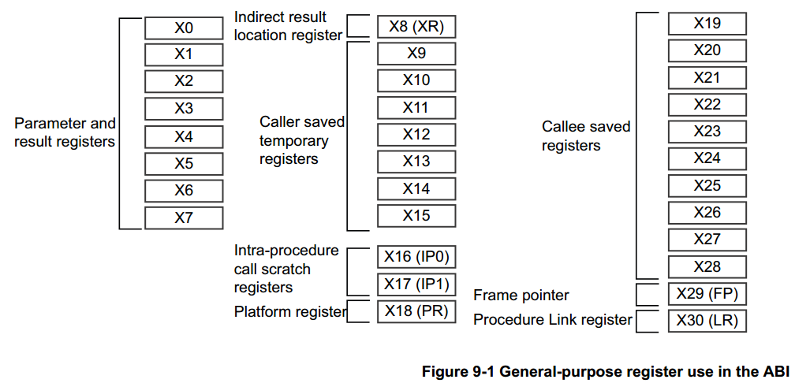
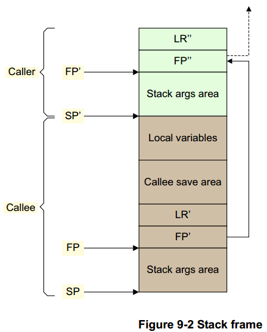
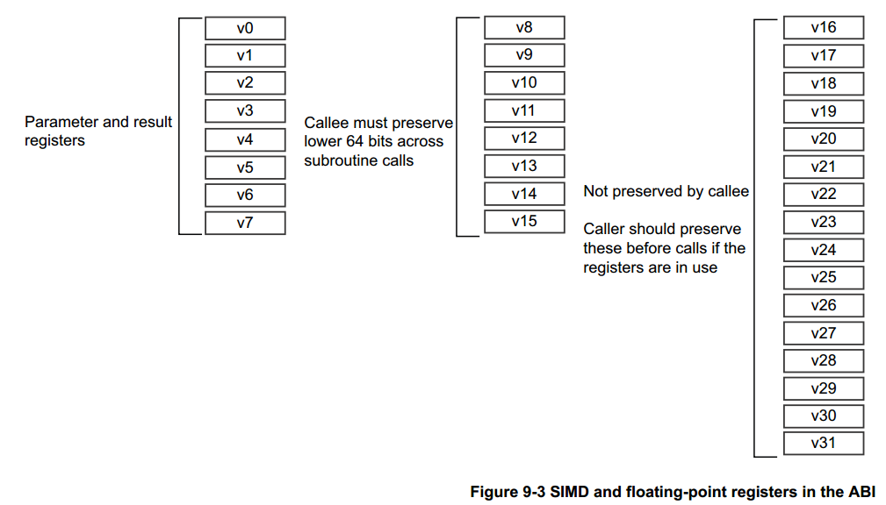

## 9. ARM 64 位架构的 ABI


> ARM 体系结构的应用程序二进制接口 (ABI) 指定了所有可执行本机代码模块必须遵守的基本规则，以便它们可以正确地协同工作。这些基本规则由特定编程语言（例如，C++）的附加规则补充。除了 ARM ABI 指定的规则之外，个别操作系统或执行环境（例如 Linux）可能会指定额外的规则来满足他们自己的特定要求。
>
> AArch64 架构的 ABI 有许多组件：
>
> **Executable and Linkable Format (ELF)**
>
> > ARM 64 位架构 (AArch64) 的 ELF 指定目标（object）和可执行格式。
>
> **Procedure Call Standard (PCS)**
>
> > ARM 64 位架构 (AArch64) ABI 版本的过程调用标准(PCS) 指定子例程单独编写、编译和汇编之间如何协同工作。它指定调用例程和被调用者之间或例程与其执行环境之间的约定，例如当调用例程或堆栈布局时的约定。
>
> **DWARF**
>
> > 这是一种广泛使用的标准化调试数据格式。 AArch64 DWARF 基于 DWARF 3.0，但有一些附加规则。 有关详细信息，请参阅 ARM 64 位架构 (AArch64) 的 DWARF。 
>
> **C and C++ libraries**
>
> > 参考 *ARM Compiler ARM C and C++ Libraries and Floating-Point Support User Guide* 。
>
> **C++ ABI**
>
> > 参考 *C++ Application Binary Interface Standard for the ARM 64-bit Architecture*。
>
> 

### 9.1 AArch64 内部寄存器在函数调用中的传递标准

> 了解寄存器使用的标准会很有用。 了解如何传递参数可以帮助你：
>
> * 编写更高效的C 代码。 
> * 了解反汇编代码。
> * 编写汇编代码。
> * 调用用不同语言编写的函数。

#### 9.1.1 通用目的寄存器作为参数

> 出于函数调用的目的，通用寄存器分为四组：
>
> **Argument registers (X0-X7)** : 参数寄存器 x0-x7
>
> > 这些寄存器用于将参数传递给函数并返回结果。 它们可以用作临时寄存器或调用者保存的寄存器变量（译注：传入参数），可以在函数内保存中间值，或者函数调用之间传递参数。 与 AArch32 相比，8 个寄存器可用于参数传递，这样减少了因参数过多放入堆栈的需要。
>
> **Caller-saved temporary registers (X9-X15)**（调用者）
>
> > 如果调用者需要在调用另一个函数时保留一些寄存器中的任何值，则调用者必须将受影响的寄存器保存在自己的堆栈帧中。 也可以修改子例程，（译注：使用x9-x15实现相同功能，）而不需要在返回调用函数时保存值到堆栈和从堆栈中恢复它们。
>
> **Callee-saved registers (X19-X29)**（被调用）
>
> > 这些寄存器保存在被调用者内部。 只要在返回前保存并恢复，就可以在被调用的子程序中修改。
>
> **Registers with a special purpose (X8, X16-X18, X29, X30)** 特殊目的寄存器
>
> * X8 是间接结果寄存器。 这用于传递间接结果的地址位置，例如，函数返回大型结构的位置。（译注：不只是返回，函数内部有大的结构体也会使用）
>
> * X16 和 X17 分别是 IP0 和 IP1，intra-procedure-call 临时寄存器
>
>   这些可以通过veneers或者类似代码使用，或者作为子程序调用之间的中间值的临时寄存器。 它们可以被函数破坏。veneers代码是链接器自动插入的一小段代码，例如当分支（跳转）目标超出分支指令（支持的）范围时。
>
> * X18 是平台寄存器，保留供平台 ABI 使用。这是平台上的一个附加临时寄存器，没有为其分配特殊含义。
>
> * X29 是 Frame Pointer 寄存器（FP）
>
> * X30 是链接寄存器(LR)。
>
> 第 9-4 页的图 9-1 显示了 64 位 X 寄存器。有关寄存器的更多信息，请参阅第 4 章。有关浮点参数的信息，请参阅第 7-7 页的浮点参数。
>
> 

#### 9.1.2 返回值的传递（Indirect result location）

> 再提一下， X8（XR）用于传递间接结果的位置，类似如下代码：
>
> ```c
> // test.c//
> struct struct_A
> {
>     int i0;
>     int i1;
>     double d0;
>     double d1;
> }AA;
> struct struct_A foo(int i0, int i1, double d0, double d1)
> {
>     struct struct_A A1;
>     A1.i0 = i0;
>     A1.i1 = i1;
>     A1.d0 = d0;
>     A1.d1 = d1;
>     return A1;
> }
> void bar()
> {
>     AA = foo(0, 1, 1.0, 2.0);
> }
> ```
>
> 可以用如下方法编译：
>
> armclang -target aarch64-arm-none-eabi -c test.c
> fromelf-c test.o 
>
> ___ ___
>
> *注意*
>
> 此代码未经优化编译以演示所涉及的机制和原理。 通过优化，编译器可能会删除所有这些。
>
> ______
>
> ```assembly
> foo:
>     SUB SP, SP, #0x30
>     STR W0, [SP, #0x2C]
>     STR W1, [SP, #0x28]
>     STR D0, [SP, #0x20]
>     STR D1, [SP, #0x18]
>     LDR W0, [SP, #0x2C]
>     STR W0, [SP, #0]
>     LDR W0, [SP, #0x28]
>     STR W0, [SP, #4]
>     LDR W0, [SP, #0x20]
>     STR W0, [SP, #8]
>     LDR W0, [SP, #0x18]
>     STR W0, [SP, #10]
>     LDR X9, [SP, #0x0]
>     STR X9, [X8, #0]
>     LDR X9, [SP, #8]
>     STR X9, [X8, #8]
>     LDR X9, [SP, #0x10]
>     STR X9, [X8, #0x10]
>     ADD SP, SP, #0x30
>     RET
> bar:
>     STP X29, X30, [SP, #0x10]!
>     MOV X29, SP
>     SUB SP, SP, #0x20
>     ADD X8, SP, #8
>     MOV W0, WZR
>     ORR W1, WZR, #1
>     FMOV D0, #1.00000000
>     FMOV D1, #2.00000000
>     BL foo
>     ADRP X8, {PC}, 0x78		// 译注： x8 存放AA地址，bar使用sp中的返回值，复制给AA
>     ADD X8, X8, #0			
>     LDR X9, [SP, #8]
>     STR X9, [X8, #0]
>     LDR X9, [SP, #0x10]
>     STR X9, [X8, #8]
>     LDR X9, [SP, #0x18]
>     STR X9, [X8, #0x10]
>     MOV SP, X29
>     LDP X20, X30, [SP], #0x10 // 译注： 原文这里好像写错了应该是X29寄存器
>     RET
> ```
>
> 在此示例中，该结构包含超过 16 个字节。 根据 AArch64 的 AAPCS，返回的对象被写入 XR 指向的内存。
>
> 通过生成的代码可以看到：
>
> > * W0、W1、D0 和D1 用于传递整数和双精度参数。
> >
> > * bar() 在堆栈上为 foo() 的返回结构值腾出空间，并将 sp 放入 X8。
> > * bar() 将X8 与W0、W1、D0 和D1 中的参数一起传递给foo()，然后foo() 获取地址以进行进一步的操作。
> > * foo() 可能会损坏 X8，因此 bar() 使用 SP 访问返回结构。
>
> 使用 X8 (XR) 的优点是它不会降低用于传递函数参数的寄存器的可用性。
>
> AAPC64 栈帧如图 9-2 所示。 帧指针 (X29) 应该指向保存在栈上的前一个帧指针，保存的 LR (X30) 存储在它之后。 链中的最后一个帧指针应设置为 0。堆栈指针必须始终在 16 字节边界上对齐。 堆栈帧的确切布局可能存在一些变化，特别是在可变参数或无帧函数的情况下。 有关详细信息，请参阅 AAPCS64 文档。
>
> 
>
> _______
>
> *注意*
>
> AAPCS 仅指定 FP、LR 块布局以及这些块如何链接在一起。图 9-2 中的其他所有内容（包括两个函数栈帧之间边界的精确位置）都未指定，编译器可以自由选择。
>
> _____
>
> 图 9-2 说明了一个使用两个被调用者保存的寄存器（X19 和 X20）和一个临时变量的帧，其布局如下（左边的数字是从 FP 偏移的字节数）：
>
> ```c
> 40: <padding>
> 32: temp
> 24: x20
> 16: x19
> 8: LR'
> 0: FP'
> ```
>
> 填充是维持栈指针的 16 字节对齐所必需的。
>
> ```assembly
> function:
>     STP X29, X30, [SP, #-48]!	// Push down stack pointer and store FP and LR
>     MOV X29, SP					// Set the frame pointer to the bottom of the new frame
>     STP X19, X20, [X29, #16]	// Save X19 and X20
>     : :
>     Main body of code
>     : :
>     LDP X19, X20, [X29, #16]	// Restore X19 and X29
>     LDP X29, X30, [SP], #48		// Restore FP' and LR' before setting the stack
>     							// pointer to its original position
>     RET 						// Return to caller
> ```
>
> 

#### 9.1.3 NEON 和 Floating-Point 寄存器作为参数

> ARM 64 位架构也有 32 个寄存器，v0-v31，可供 NEON 和浮点运算使用。 通过改变指代寄存器的名称更改访问的大小。
>
> ______
>
> *注意*
>
> 与 AArch32 不同，在 AArch64 中，NEON 和浮点寄存器的 128 位和 64 位的视图在狭义视图中不存在多个寄存器叠加（组成一个寄存器的情况），因此 q1、d1 和 s1 都指的是寄存器组中相同入口。
>
> > 译注：AArch32 中 Q0[127:0] = S3[31:0] + S2[31:0] + S1[31:0] + S0[31:0]
> >
> > ​								Q1[127:0] = S7[31:0] + S6[31:0] + S5[31:0] + S4[31:0]
> >
> > ​			AArch64 中 Q0[127:0] 中的 [31:0] 与 S0[31:0] 对应
> >
> > ​									Q1[127:0] 中的 [31:0] 与 S1[31:0] 对应
> >
> > ​			所以AArch64入口相同，长度不同， 而AArch32 由4个S组成一个Q，多个寄存器叠加而生成一个寄存器。
>
> ______
>
> 
>
> * V0-V7 用于将参数值传递给子例程并从函数返回结果值。 它们也可用于在例程中保存中间值（但通常仅在子例程调用之间）。
> * 经由子例程调用的被调用例程（callee routine）中必须保存V8-V15。只需要保存 V8-V15 中存储的每个值的低 64 位。
> * V16-V31 不需要保留（或应该由调用者保留）。
>
> 


