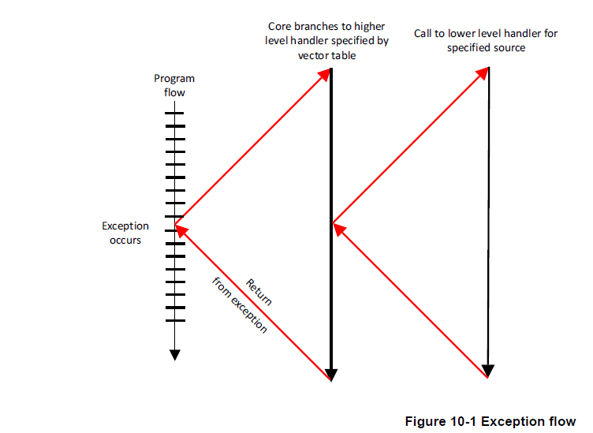
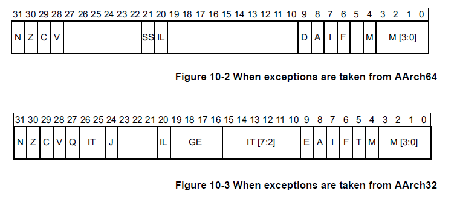
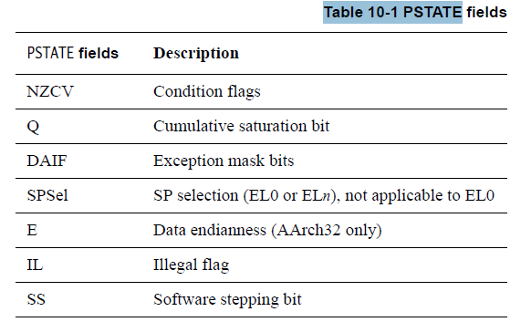
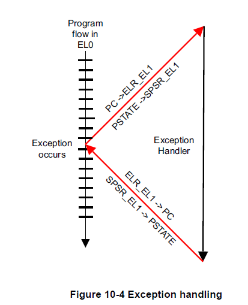
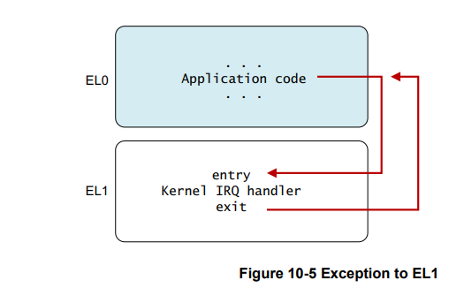
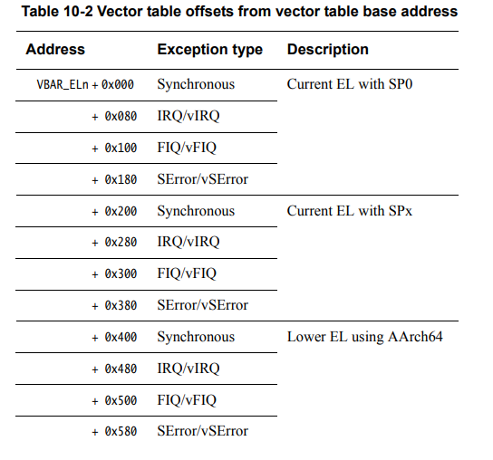
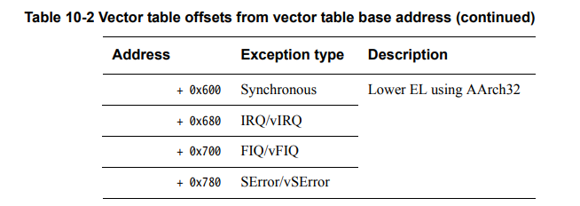
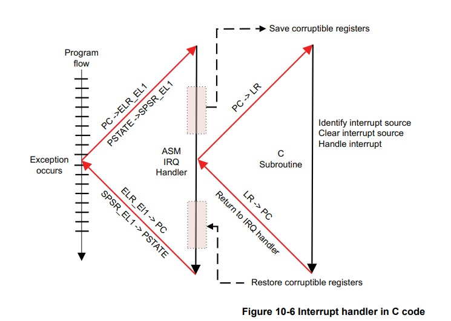
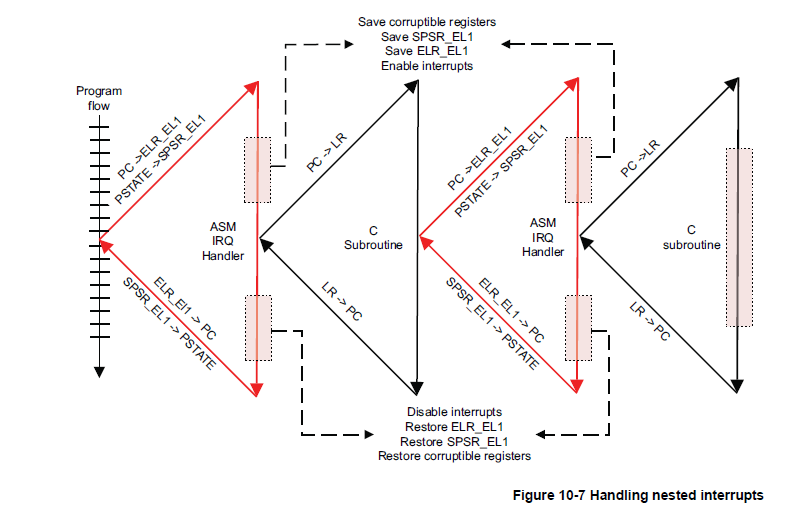

## 10 AArch64异常处理

严格来说，中断是说软件执行流程的东西，但是，在arm术语中，统称为异常。异常是需要特权软件（异常处理程序）执行某些操作以确保系统顺利运行的条件或系统事件。每种异常类型都有一个异常处理程序。一旦处理完异常，特权软件就会让内核准备好恢复它在处理异常之前所做的任何事情。
下面介绍了几种异常：

**Interrupt：**

一般有两种，分为irq 和 fiq。fiq的优先级高于IRQ，这两种异常通常都与内核上的输入引脚相关。假设中断未被禁用，外部硬件断言了一个中断请求并在当前指令完成执行时触发相应的异常类型（irq or fiq),fiq和irq对core来说都是物理信号，当被断言时，如果内核当前已启用，则会发生相应的异常。在几乎所有系统上，各种中断源都使用中断控制器连接。中断控制器对中断进行仲裁并确定其优先级，进而提供串行化的单个中断信号，然后将其连接到内核的 FIQ 或 IRQ 信号。有关详细信息，请参阅通用中断控制器。由于 IRQ 和 FIQ 中断的发生在任何时间，与内核正在执行的软件没有直接关系，因此它们被归类为异步异常。

**Aborts（中止）：**

在指令获取失败（指令中止）或数据访问失败（数据中止）时生成中止。它可来源于内存访问错误时的外部内存系统（可能表明指定的地址与系统中的实际内存不对应）。也可来源于core内的内存管理单元 (MMU) 生成中止。操作系统可以使用 MMU 中止来为应用程序动态分配内存。

当一条指令被提取时，它在流水线中被标记为abort。仅当内核随后尝试执行指令时，才会发生指令中止异常。异常发生在指令执行之前。如果在中止指令到达流水线执行阶段之前清除了流水线，则不会发生中止异常。数据中止异常是由于加载或存储指令而发生的，并且被认为是在数据读取或写入之后发生的。

如果abort是由于执行或试图执行指令流而生成的，并且返回的地址提供了引起中止指令的详细信息，则该中止被描述为同步abort。

异步abort不是通过执行指令生成的，而返回地址可能并不总是会提供引起abort原因的详细信息。在ARMv8-A中，指令和数据abort是同步的。异步异常包括`IRQ`/`FIQ`和`System errors (SError)`。 参考 *Synchronous and asynchronous exceptions。*

**Reset :**  

复位被视为最高异常级别的特殊向量。

这是 ARM 处理器在触发异常时的指令跳转位置。 这个向量使用IMPLEMENTATION DEFINED 地址。RVBAR_ELn 包含此复位向量地址，其中 n 是实现的最高异常级别的编号。所有内核都有一个复位输入，并在复位后立即发生复位异常。 它是最高优先级的异常，不能被屏蔽。 此异常用于在上电后在内核上执行代码以对其进行初始化。

**生成异常的指令**

执行某些指令会产生异常。 通常执行此类指令可以从运行更高权限级别的软件请求服务：

- Supervisor Call (SVC) 指令可以使用户模式程序能够请求操作系统（OS）服务。
- Hypervisor Call (HVC) 指令使客户操作系统（guest OS）能够请求管理程序服务。
- Secure monitor Call（安全监控 SMC) 指令使非安全世界请求安全世界服务。

如果异常是由于在 EL0 处取指令而产生的，则将其视为 EL1 的异常，除非 HCR_EL2.TGE 位设置为非安全状态，在这种情况下将其视为 EL2。
如果异常是由于任何其他异常级别的指令提取而生成的，则异常级别保持不变。

在本书的前面部分，我们看到 ARMv8-A 架构有四个异常级别。 处理器执行只能通过获取异常或从异常返回从而在异常级别之间移动。当处理器从较高的异常级别移动到较低的异常级别时，执行状态可以保持不变，也可以从 AArch64 切换到 AArch32。 相反，当从较低的异常级别移动到较高的异常级别时，执行状态可以保持不变或从 AArch32 切换到 AArch64。



图 10-1 示意性地显示了运行应用程序时发生的异常程序流程。异常发生后，处理器分支到一个向量表，其中包含每个异常类型的条目。 向量表包含一个调度代码，该代码通常识别异常的原因，选择并调用适当的函数来处理它。 此代码完成执行，然后返回到高级处理程序，然后执行 ERET 指令来返回到应用程序。

### 10.1 异常处理寄存器

第 4 章描述了处理器的当前状态是如何存储在单独的 `PSTATE` 字段中。
如果发生异常，则 PSTATE 信息被保存在 Saved Program Status Register 中。(SPSR_ELn) 存在于 SPSR_EL3、SPSR_EL2 和 SPSR_EL1中



SPRSR.M 字段（第 4 位）用于记录执行状态（0 表示 AArch64，1 表示 AArch32）。 



异常屏蔽位 (DAIF) 允许屏蔽异常事件。 该位置1时不发生异常。
**D：**debug异常mask。
**A：**SError 中断mask，例如异步外部中止。
**I ：** IRQ 中断mask。
**F ：**FIQ 中断mask。

SPSel 字段选择是否应使用当前异常级别堆栈指针或 SP_EL0。 这可以在任何异常级别设置，除了 EL0。(**译注:**本来就是为了选择EL0和非EL0的SP，在EL0就不用选） 这将在本章后面讨论。

IL 字段在设置时后，会导致执行的下一条指令触发异常。 被使用做非法异常返回，例如配置为AArch32时，试图以AArch64返回EL2。

第 18 章调试中介绍了软件步进 (SS) 位。 调试器使用它来执行单条指令，然后在下一条指令上发生调试异常。

其中一些分散的field（CurrentEL、DAIF、NZCV 等）在发生异常时被合并在一起复制到 SPSR_ELn寄存器中（返回时则相反）。

当导致异常的事件发生时，处理器硬件会自动执行某些动作。 SPSR_ELn 被更新（其中 n 是发生异常的异常级别），SPSR_ELn 用来存储在异常结束时需要返回的正确的 PSTATE 信息。 PSTATE 被更新以反映新的处理器状态（这可能意味着异常级别被提高，或者它可能保持不变）。 在异常结束时使用的返回地址存储在 ELR_ELn 中。



需要注意的的是，寄存器后缀_ELn表示这些寄存器存在多个副本，这些不同的副本用于不同的异常级别，例如，SPSR_EL1和SPSR_EL2是不同的物理寄存器，除此之外，在同步或SError发生的时候，ESR_ELn寄存器会更新存储着异常原因的值

处理器何时从中断中返回，是通过执行ERET指令来完成，执行此指令将从 SPSR_ELn 恢复预异常 PSTATE，并通过从 ELR_ELn 恢复 PC 将程序执行返回到原始位置。

我们已经了解了SPSR寄存器如何为异常返回保存必要的状态信息。下面。我们将学习用于存储程序地址信息的链接寄存器，此架构为函数调用和异常返回提供了单独的链接寄存器。

我们在第六章A64指令集中看到，寄存器X30用于（于RET指令一起）从子程序中返回，每次我们使用链接指令（BL或BLR）执行分支时，X30里面的值就更新为需要返回的指令地址。

ELR_ELn寄存器存储着异常的返回地址，该寄存器的值在进入异常程序时会自动写入。并且此值会被写到PC里面，这是因为执行异常返回指令ERET所影响。

---

如果在异常返回时，SPSR寄存器与系统寄存器不一致会报error

---

对于一些特殊的异常，ELR_ELn寄存器保存着异常返回地址，对于一些异常，ELR_ELn保存着异常产生之后下一条待执行指令的地址。例如，当执行SVC(系统调用）指令时，我们只是希望返回到应用程序中的以下指令。 在其他情况下，我们可能希望重新执行产生异常的指令。

对于异步异常，ELR_ELn寄存器保存着由于分支到中断处理而导致未来得及处理或者已经处理过的指令地址。例如，如果程序在一个异步中断之后必须要返回到一个指令，这时允许程序代码修改ELR_En寄存器。ARMv8-A 模型比 ARMv7-A 中使用的模型要简单得多，因为向后兼容的原因，当从某些类型的异常返回时，必须从 Link 寄存器值中减去 4 或 8。

除了 SPSR 和 ELR 寄存器外，每个异常级别都有自己的专用堆栈指针寄存器。 这些被命名为 SP_EL0、SP_EL1、SP_EL2 和 SP_EL3。 这些寄存器用于指向专用堆栈，例如，该堆栈可用于存储被异常处理程序破坏的寄存器，以便在返回原始代码之前将它们恢复为原始值。

处理程序代码可以从使用 SP_ELn 切换到 SP_EL0。 例如，SP_EL1 可能指向一块内存，其中包含一个内核可以保证始终有效的小堆栈。 SP_EL0 可能指向更大的内核任务堆栈，但不能保证不会溢出。 这种切换是通过写入 [SPSel] 位来控制的，如下

```arduino
MSR SPSel, #0 // switch to SP_EL0
MSR SPSel, #1 // switch to SP_ELn
```

### 10.2 同步和异步中断

     在AArch中，异常可以是同步的，也可以是异步的。如果异常是由于执行或尝试执行指令而生成，并且返回的地址提供了指令的详细信息，则将其看作为同步异常。一个异步异常不会通过执行指令产生，并且返回的地址中，也许不会提供引起此异常的细节信息。
    
     异步异常的来源是 IRQ（正常优先级中断）、FIQ（快速中断）或 SError（系统错误）。 系统错误有许多可能的原因，最常见的是异步数据中止（例如，将错误数据从高速缓存行写回外部存储器触发的中止）。

同步异常有多种来源：

- 指令从MMU 中止。 例如，通过从标记为从不执行的内存位置读取指令。
- 从MMU 中止数据。 例如，权限失败或对齐检查。
- SP 和PC 对齐检查。
- 同步外部中止。 例如，读取翻译表时发生的abort。
- 未分配指令。
- 调试异常。

#### 10.2.1  同步中断

  同步中断可能通过多种可能的原因产生

- 产生于MMU. 例如权限失效或者访问标志错误的内存区域
- SP和PC对齐检查
- 未定义的指令
- 服务呼叫（SVC，SMC，HVC）

   此类异常可能是操作系统正常操作的一部分。 例如，在 Linux 中，当一个任务希望请求分配一个新的内存页面时，这是通过 MMU 中止机制来处理的。

     在 ARMv7-A 架构中，prefetch abort、Data Abort 和 undef 异常是独立的项目。 在 AArch64 中，所有这些事件都会生成同步中止。 然后，异常处理程序可以读取状态和 FAR 寄存器以获得区分它们的必要信息（稍后将更详细地描述。）

#### 10.2.2 处理同步异常

     寄存器会提供处理同步异常的信息。异常状态寄存器（ESR_ELn)提供异常的原因信息，故障地址寄存器（FAR_ELn)保存所有同步指令和数据中止以及对齐故障的故障虚拟地址。
    
      异常链接寄存器 (ELR_ELn) 保存导致中止数据访问的指令的地址（对于数据中止）。 这通常在内存故障后更新，但在其他情况下被配置，例如，分支到了一个未对齐的地址。
    
    如果异常从AArch32 的异常级别转移到 AArch64 的异常级别，并且该异常写入了与目标异常级别相关联的故障地址寄存器（FAR_ELn)，则 FAR_ELn 的前 32 位全部设置为零。
    
    对于实现EL2 (Hypervisor)或EL3 (Secure Kernel)的系统，同步异常通常在当前或更高的异常级别上进行。异步异常可以(如果需要)路由到更高的异常级别，以由 Hypervisor 或安全内核处理。`SCR_EL3`
寄存器指定哪些异常将被路由到EL3，类似地，HCR_EL2 指定将哪些异常路由到 EL2。 有单独的位允许单独控制 IRQ、FIQ 和 SError 的路由。（**译注**：比如在EL2上运行 Hypervisor时，来自设备的中断需要路由到EL2，再由Hypervisor转发到EL1中的虚拟机中，这个时候就要设置`HCR_EL2`寄存器中`IRQ`
相关的位）。

#### 10.2.3  系统响应

  某些指令或系统功能只能在特定的异常级别下执行。 如果运行在较低异常级别的代码需要执行特权操作，例如，当应用程序代码向内核请求功能时。 一种方法是使用SVC 指令。 这允许应用程序生成异常。 可以传入参数寄存器，或在系统调用中编码。

#### 10.2.4  系统响应到EL2/EL3

   前面我们看到了如何使用 SVC 从 EL0 的用户应用程序调用 EL1 的内核。HVC 和 SMC 系统调用指令以与 EL2 和 EL3 类似的方式移动处理器。当处理器在 EL0（应用程序）执行时，它不能直接调用管理程序（EL2）或安全监视器（EL3）。这只能从 EL1 及以上进行。因此，应用程序必须使用 SVC 调用内核并允许内核代表它们调用更高的异常级别。

   从 OS 内核 (EL1)，软件可以使用 HVC 指令调用管理程序 (EL2)，或者使用 SMC 指令调用安全监视器 (EL3)。如果处理器使用 EL3 实现，则提供了让 EL2 捕获来自 EL1 的 SMC 指令的能力。如果没有 EL3，则 SMC 未分配并在当前 Exception 级别触发。同样，从管理程序代码 (EL2) 中，程序可以使用 SMC 指令调用安全监视器 (EL3)。如果您在 EL2 或 EL3 中进行 SVC 调用，它仍然会导致同一异常级别的同步异常，并且该异常级别的处理程序可以决定如何响应。

#### 10.2.5 未分配的指令

   未分配的的指令会导致AArch64产生同步中断，当处理器执行下面的操作之一时会生成此异常类型：

- 未分配的指令操作码
- 需要比当前异常级别更高级别特权的指令。
- 已禁用的指令。
- PSTATE.IL 域被设置时的任何指令。

#### **10.2.6  异常状态寄存器**

异常状态寄存器（ Exception Syndrome Register, `ESR_ELn`）包含允许异常处理程序确定异常原因的信息。它只对针对同步异常和`SError`做更新，不为`IRQ`或`FIQ`更新，因为这些中断处理程序通常从通用中断控制器(`GIC`)的寄存器中获取状态信息。寄存器的位编码为:

- `ESR_ELn`的Bits[31:26]表示异常类，它允许处理程序区分各种可能的异常原因(如未分配的指令，源自MCR/MRC的到CP15的异常，FP操作的异常，执行了`SVC`，`HVC`或`SMC`，数据中止和对齐异常)。
- 位[25]表示陷入的指令长度(0表示16位指令，1表示32位指令)，并且也为某些异常类设置。
- 位[24:0]形成指令特定症状(`ISS`)字段，该字段包含特定于该异常类型的信息。例如，当执行系统调用指令(`SVC`、`HVC`或`SMC`)时，该字段包含与操作码相关的**立即值**，例如对于`SVC 0x123456`的0x123456。

### 10.3 **异常导致的执行状态和异常级别的变化**

   当发生异常时，处理器可能会更改执行状态（从 AArch64 到 AArch32）或保持相同的执行状态。 例如，外部源可能会在执行以 AArch32 模式运行的应用程序时生成 IRQ（中断）异常，然后在以 AArch64 模式运行的 OS 内核中执行 IRQ 处理程序。

SPSR 寄存器包括了执行状态和要返回的异常级别。 当发生异常时，这由处理器自动设置。 但是，每个异常级别中异常的执行状态控制如下：

- 最高异常级别（不一定是EL3）的复位执行状态通常由硬件配置输入确定。 但这不是固定的，因为我们有 RMR_ELn 寄存器来更改运行时最高异常级别的执行状态（寄存器宽度）（导致软复位）。 请记住，EL3 与安全监视器代码相关联。 监视器是一小段受信任的代码，始终以特定状态运行
- 对于EL2 和EL1，执行状态由SCR_EL3.RW 和HCR_EL2.RW 位控制。 SCR_EL3.RW 位在 EL3（安全监视器）中编程并设置下一个较低级别（EL2）的状态。 HCR_EL2.RW 位可在 EL2 或 EL3 中编程，并设置 EL1/0 的状态。
- 你永远不会在 EL0 中处理异常，（记住 EL0 是最低优先级，用于应用程序代码）。

考虑一个在 EL0 中运行的应用程序，它被一个 IRQ 中断，如图 10-5 所示。 内核 IRQ 处理程序在 EL1 上运行。 处理器在收到 IRQ 异常时确定要设置的执行状态。 它通过查看控制寄存器的 RW 位来处理异常级别之上的异常级别。因此，在示例中，异常发生在 EL1 中，它是 HCR_EL2.RW 控制 处理程序的执行状态。



现在我们必须考虑异常处于什么异常级别。同样，当接受异常时，异常级别可能保持不变，也可能变得更高。正如我们已经看到的，在EL0中从不接受异常。

同步异常通常在当前或更高的异常级别中被接受。而异步异常可以路由到一个更高的异常级别。对于安全代码，`SCR_EL3`指定将哪些异常路由到EL3。对于hypervisor代码，`HCR_EL2`指定要路由到EL2的异常。

  

在这两种情况下，都有单独的位来控制 IRQ、FIQ 和 SError 的路由。处理器仅将异常引入到被它路由到的异常级别。异常级别永远不会因异常而下降。中断总是在中断发生的异常级别被屏蔽。

从 AArch32 到 AArch64 的异常处理时，有一些特殊的注意事项。 AArch64 处理程序代码可能需要访问 AArch32 寄存器，因此架构定义了映射关系以允许访问 AArch32 寄存器。

AArch32 寄存器 R0 到 R12 作为 X0 到 X12 访问。 AArch32 模式下的 SP 和 LR 的分组版本通过 X13 到 X23 访问，而分组的 R8 到 R12 FIQ 寄存器作为 X24 到 X29 访问。这些寄存器的位 [63:32] 在 AArch32 状态下不可用，包含 0 或最后写入 AArch64 的值。没有关于它的价值的架构保证。因此，通常将寄存器访问为 W 寄存器。

### 10.4 AArch64 异常向量表

     当异常发生时，处理器必须执行与异常对应的处理程序代码。 存储处理程序的内存位置称为异常向量。 在 ARM 体系结构中，异常向量存储在一个表中，称为异常向量表。
    
     每个异常级别都有自己的向量表，即 EL3、EL2 和 EL1 各有一个。 该表包含要执行的指令，而不是一组地址。 个别异常的向量位于表开头的固定偏移量处。 每个表基的虚拟地址由基于向量的地址寄存器 VBAR_EL3、VBAR_EL2 和 VBAR_EL1 设置。
    
      向量表中的每个条目有 16 条指令长。 与每个条目为 4 个字节的 ARMv7 相比，这本身就是一个重大变化。 ARMv7 向量表的这种间距意味着每个条目几乎总是某种形式的分支，指向内存中其他地方的实际异常处理程序。 在 AArch64 中，向量的间距更宽，因此顶层处理程序可以直接写入向量表中。

表10-2展示了其中一个向量表。基址由`VBAR_ELn`给出，然后每一项与这个基址有一个定义好了的偏移量。每个表有16项，每项128字节(32条指令)大小。该表实际上由4组4项组成。使用哪一项取决于几个因素:

- 异常类型（SError、FIQ、IRQ 或同步）
- 如果在相同的异常级别处理异常，则要使用的堆栈指针（SP0 或 SPx）
- 如果异常是在较低的异常级别上被接受的，则降低一个异常的执行状态(AArch64或AArch32)



​    



  考虑一个例子可能会使这更容易理解。
如果内核代码在 EL1 处执行并且产生 IRQ 中断信号，发生 了IRQ 异常。此特定中断与管理程序或安全环境无关，它也在内核中处理，在 SP_EL1 处设置了 SPSel 位，因此使用的是 SP_EL1。 因此从地址 VBAR_EL1 + 0x280 开始执行。

      在ARMv8-A架构中没有`LDR PC，[PC，#offset]`在这样的指令情况下，必须使用更多的指令来从多个寄存器中读取目标。向量间距（128字节）的选择是为了避免未被使用的向量对典型大小的指令缓存行造成缓存污染。复位地址是一个完全独立的地址，是处理器的实现来定义的，并且通常由核心内的硬连接配置设置。这个地址在`RVBAR_EL1/2/3`寄存器中可见。
    
     对于每个异常，无论是来自当前异常级别还是来自较低异常级别，都有一个单独的异常向量，这为操作系统或管理程序提供了确定较低异常级别的 AArch64 和 AArch32 状态的灵活性。 SP_ELn 用于从较低级别生成的异常。 但是，软件可以切换到在处理程序中使用 SP_EL0。 使用此机制时，它有助于从线程中的线程访问值处理程序。

### 10.5 中断处理

ARM 通常使用中断来表示中断信号。 在 ARM A-profile 和 R-profile 处理器上，这意味着外部 IRQ 或 FIQ 中断信号。 该架构没有指定如何使用这些信号。 FIQ 通常保留用于安全中断源。 在早些时候
架构版本中，FIQ 和 IRQ 用于表示高优先级和标准中优先级的中断，但在 ARMv8-A 中并非如此。

当处理器接受一个异常到AArch64执行状态时，所有的`PSTATE`中断掩码都会自动设置。这意味着后续的异常将被禁用。如果软件要支持异常嵌套，例如，允许高优先级的中断去打断对低优先级源的处理，那么软件需要显式地重新启用中断。

对于下面的指令：

`MSR DAIFClr, #imm`

这个立即数值实际上是一个4位字段，因为也有如下掩码:

- `PSTATE.A` (for SError)
- `PSTATE.D` (for Debug)



```arduino
IRQ_Handler
// 压栈寄存器
STP X0, X1, [SP, #-16]!// SP = SP -16
...
STP X2, X3, [SP, #-16]!// SP = SP - 16
// 不像ARMv7没有STM指令，这里需要多条STP指令
BL read_irq_source// 一个函数计算出为什么收到一个中断
// 清中断
BL C_irq_handler// C 语言的中断处理函数
// 从栈中恢复寄存器
LDP X2, X3, [SP], #16// S = SP + 16，X2,X3出栈
LDP X0, X1, [SP], #16// S = SP + 16，X0,X1出栈
…
ERET// 异常返回
```

但是，从性能的角度来看，下面的处理顺序更优

```arduino
IRQ_Handler
SUB SP, SP, #<frame_size>// SP = SP - <frame_size>
STP X0, X1, [SP]// 在底层帧中加载X0和X1
STP X2, X3, [SP]// 在底层帧+16byte处加载X2和X3
...// 更多寄存器的保存
...
// 中断处理
BL read_irq_source// 一个函数计算出为什么收到一个中断
// 清中断
BL C_irq_handler// C 语言的中断处理函数
// 从栈中恢复寄存器
LDP X0, X1, [SP]// 在底层帧中加载X0和X1
LDP X2, X3, [SP]// 在底层帧+16byte处加载X2和X3
...// 更多的寄存器加载
ADD SP, SP, #<frame_size>// 将 SP 恢复为原始值
…
ERET// 异常返回
```



嵌套处理程序需要一些额外的代码。 它必须在堆栈上保存 SPSR_EL1 和 ELR_EL1 的内容。 在确定（并清除）中断源之后，我们还必须重新启用 IRQ。 但是（与 ARMv7-A 不同），由于子程序调用的链接寄存器与异常的链接寄存器不同，因此我们不需要对LR或者mode做特殊的处理。

### 10.6 通用中断处理

ARM 提供了用于 ARMv8-A 架构的标准中断控制器。该中断控制器的可编程接口在 GIC 架构中定义。 GIC 架构规范有多个版本。本文档主要介绍版本 (GICv2)。 ARMv8-A 处理器通常连接到 GIC，例如 GIC-400 或 GIC-500。通用中断控制器 (GIC) 支持在多核系统中的内核之间路由软件（SPI）生成、私有(PPI)和共享的外围中断(SPI)。

GIC 架构提供的寄存器可用于管理中断源和中断行为，以及在多核系统中将中断路由到各个内核。以使软件能够屏蔽、启用和禁用来自单个源的中断，对（在硬件中）单个源进行优先级排序并生成软件中断。 GIC 接受在系统级别断言的中断，并可以向它所连接的每个内核发送信号，从而可能导致发生 IRQ 或 FIQ 异常。

从软件的角度来看，GIC主要有两个主要的功能块

**Distributor：系统中的所有中断源都连接到distributor。 Distributor 提供寄存器来控制各个中断的属性，例如优先级、状态、安全性、路由信息和启用状态。 distributor通过附加的 CPU 接口确定将哪个中断转发到内核。**

**CPU Interface：cpu通过它接收中断。 CPU 接口提供寄存器来屏蔽、识别和控制转发到该内核的中断状态。 系统中的每个内核都有一个单独的 CPU 接口。**

中断在软件中通过一个编号来标识，称为中断 ID。 一个中断 ID对应一个中断源。 软件可以使用中断 ID 来识别中断源并调用相应的处理程序来服务中断。 提供给软件的确切中断 ID 由系统设计决定，中断可以有多种不同的类型：

**软件生成中断 (SGI)：**这是由软件通过写入distributor寄存器生成的中断，软件生成的中断寄存器（GICD_SGIR）。通常用于内核间通信。 SGI 可以完全只对系统中选定的一组core起效。为SGI保留中断 ID是 0-15。
**专用外设中断 (PPI)**：这是distributor可以路由到指定的cpu上的中断。为PPI保留的中断 ID是16-31。这些表示中断core私有的中断源，并且独立于另一个core上的相同源，例如，每个core上的计时器产生的PPI。
**共享外设中断 (SPI)：**这是GIC 可以路由到多个core的外设中断。中断号 32-1020 用于SPI。 SPI 用于发出中断信号从整个系统可访问的各种外围设备。

**局部特定外设中断 (LPI)**：这些是路由到特定core的基于消息的中断。 LPI 是GICv2 或 GICv1 不支持。

中断可以是边沿触发的（当 GIC 检测到相关输入的上升沿时被认为是有效的，并且在清除之前保持有效）或电平敏感的（认为仅当 GIC 的相关输入为高电平时才有效）。

中断可以处于多种不同的状态：

• 活动——这意味着该中断已被内核确认并且正在
目前正在服务中。
• 活动和未决——这描述了内核正在服务中断的情况
并且 GIC 也有来自同一源的未决中断。

- Inactive——这意味着当前中断没有断言。
- Pending——这意味着中断源已被断言，但正在等待由核心处理。 待处理的中断是被转发到 CPU 接口的候选然后再到CPU
- active——这意味着该中断已被cpu接收并且正在目前正在处理中。
- active and pending——这描述了内核正在处理该中断并且 GIC 判断该中断还一直送过来。

中断传递的优先级和目标core都在distributor中配置。 外围设备distributor发送的中断都处于待处理状态（如果它已经处于活动状态，则处于活动和待处理状态）。 distributor确定最高优先级的待处理的中断，可以传递到core并将其转发到CPU 接口， 在 CPU 接口处，中断依次发送给core，此时core
接受 FIQ 或 IRQ 异常。core执行异常处理程序作为响应。 处理程序从 CPU 接口寄存器中查询中断 ID 并开始执行中断服务程序。 完成后，处理程序必须写入 CPU 接口寄存器以报告处理结束。

对于给定的中断，典型的顺序是：

- 非活动 -> 待处理：当外设断言中断时。
- 待定 -> 活动：当处理程序确认中断时
- 活动 -> 非活动：当处理完中断时。

Distributor 提供了报告不同中断 ID 的当前状态的寄存器。在多核/多处理器系统中，单个 GIC 可以由多个内核共享（在 GICv2 中最多 8 个）。 GIC 提供寄存器来控制 SPI 所对应的内核。 这个机制使操作系统能够跨内核共享和分发中断，并且协调工作。有关 GIC 行为的更多详细信息，请参阅`ARM Generic Interrupt Controller Architecture specification`。

#### 10.6.1 配置

GIC的寄存器实现都是外部memory_map形式。 所有的核都可以访问公共的Distributor，但是CPU接口是banked的，即每个核使用相同的地址访问自己的私有CPU接口。 一个内核不可能访问另一个内核的 CPU 接口。

Distributor 包含许多寄存器，您可以使用它们来配置各个中断的属性。 这些可配置的属性有：

- 中断优先级（GICD_IPRIORITY<n>)，distributor使用它来确定哪个中断接下来被转发到 CPU 接口。
- 中断配置（GICD_ICFGR<n>）。 这决定了中断是电平还是
边缘敏感。 不适用于 SGI。
- 一个中断目标core（GICD_ITARGETSR<n>）。 这确定了中断可以路由到哪些core。 仅适用于 SPI。
- 中断启用或禁用状态（GICD_ISENABLER<n>GICD_ICENABLER<n>）。 只有那些在distributor中启用的中断。当它们处于待处理状态时有资格被路由到cpu 接口。
- 中断安全 (GICD_IGROUPR<n>) 确定中断是否分配给安全或非安全。
- 中断状态。

Distributor 还提供了优先级屏蔽，通过它可以防止低于某个优先级的中断到达内核。 distributor在确定是否可以将挂起的中断转发到特定内核时使用它每个内核上的 CPU 接口有助于微调中断控制和处理核。

#### 10.6.2 初始化

distributor和 CPU interface在复位时都被禁用。 GIC 必须在复位后初始化，然后才能向内核提供中断。

在 Distributor 中，软件必须配置优先级、目标core、安全性并启用各个中断。随后必须通过其控制寄存器 (GICD_CTLR) 启用distributor。对于每个CPU interface，软件必须对优先级掩码和优先级抢占进行设置。每个 CPU interface本身必须通过控制寄存器 (GICD_CTLR) 启用。在cpu处理中断之前，软件通过设置使cpu准备好接受中断向量表中的有效中断向量，并清除 PSTATE 中的中断屏蔽位，并设置路由控制..
可以通过禁用 Distributor 来禁用系统中的整个中断机制。也可以通过禁用其 CPU 接口来禁用对单个内核的中断传递。也可以在分配器中禁用（或启用）各个中断。对于一个中断到达核心，单个中断、分配器和 CPU 接口必须全部启用。中断也需要有足够的优先级，即高于内核的优先掩码。

#### 10.6.3 中断处理

当core接受了中断，就跳转到顶层中断向量表并且开始执行。顶层的中断处理程序从 CPU interface读取寄存器以获得中断 ID。

读取寄存器除了返回中断 ID 外，还会导致中断在distributor中被标记为活active。 一旦知道中断 ID（识别中断源），顶层处理程序就可以调度特定于设备的中断处理程序来服务中断。

当中断处理程序完成执行时，顶层处理程序将相同的中断 ID 写入 CPU 接口块中的中断结束 (EoI) 寄存器，指示中断处理结束。

除了移除活动状态，使最终的中断状态为Inactive或pending（如果状态为active and pending），这使 CPU 接口能够将更多挂起的中断转发到core。 这结束了单个中断的处理。

在同一个内核上可能有多个中断等待服务，但是CPU 接口一次只能发出一个中断信号。 顶层中断处理程序可以重复上述顺序，直到读取到特殊中断 ID 值 1023，表示有在这个核心上没有更多的中断挂起。 这个特殊的中断 ID 被称为虚假的中断标识。
虚假中断 ID 是一个保留值，不能分配给系统。 当顶层处理程序读取了虚假中断 ID 后，它可以完成它的执行，并准备内核在中断之前恢复它正在执行的任务。通用中断控制器 (GIC) 通常管理来自多个中断源的输入。并将它们分发给 IRQ 或 FIQ 。