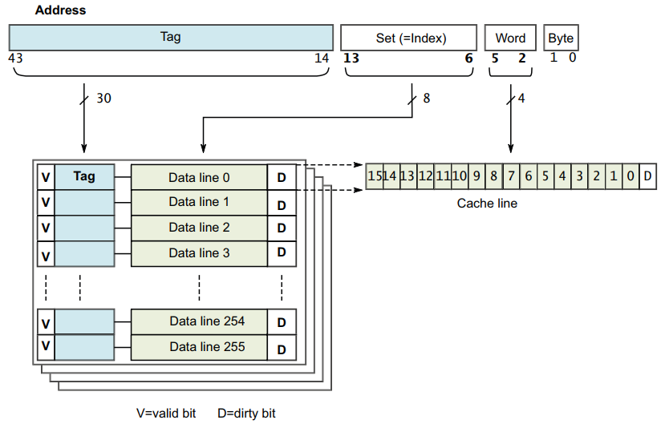

## 11. 缓存cache

ARM架构最初开发时，处理器的时钟速度和内存的访问速度大致相似。今天的处理器内核要复杂得多，并且时钟频率可以提高几个数量级。然而，外部总线和存储设备的频率并没有达到同样的程度。可以实现能够以与内核相同的速度运行的片上 SRAM 小块，但与容量可以增加数千倍的标准 DRAM块相比，这种 RAM 非常昂贵。在许多基于 ARM 处理器的系统中，访问外部存储器需要数十甚至数百个内核周期。

高速缓存是位于核心内存和主内存之间的小而快的内存块。它在主存储器中保存项目的副本。对高速缓冲存储器的访问比对主存储器的访问要快得多。每当核心读取或写入特定地址时，它首先在缓存中查找它。如果它在缓存中找到地址，它会使用缓存中的数据，而不是执行对主存储器的访问。通过减少缓慢的外部存储器访问时间的影响，这显着提高了系统的潜在性能。通过避免驱动外部信号，它还降低了系统的功耗。


实现 ARMv8‑A 架构的处理器通常使用两级或多级缓存来实现。这通常意味着处理器的每个内核都有小型 L1 指令和数据缓存。 Cortex‑A53 和 Cortex‑A57 处理器通常使用两级或多级缓存实现，即小型 L1指令和数据缓存和更大的统一 L2 缓存，在集群中的多个内核之间共享。此外，可以有一个外部 L3 缓存作为外部硬件块，在集群之间共享。

将数据提供给缓存的初始访问并不比正常速度快。对缓存值的任何后续访问都会更快，而性能提升正是由此而来。核心硬件检查缓存中的所有指令获取和数据读取或写入，但您必须将内存的某些部分（例如包含外围设备的部分）标记为不可缓存。因为缓存只保存主内存的一个子集，所以您需要一种方法来快速确定您要查找的地址是否在缓存中。

有时，缓存中的数据和指令与外部存储器中的数据可能不一样；这是因为处理器可以更新尚未写回主存的缓存内容。或者，代理可能会在核心获取自己的副本后更新主内存。这是第 14 章中描述的一致性问题。当您有多个内核或内存代理（例如外部 DMA 控制器）时，这可能是一个特殊问题。

### 11.1 缓存术语

在冯诺依曼架构中，单个缓存用于指令和数据（统一缓存）。修改后的哈佛架构具有独立的指令和数据总线，因此有两个高速缓存，一个指令高速缓存（I‑cache）和一个数据高速缓存（D‑cache）。在 ARMv8 处理器中，有不同的指令和数据 L1 缓存，由统一的L2 缓存支持。

缓存需要保存地址、一些数据和一些状态信息。

以下是一些使用的术语的简要总结和说明缓存基本结构的图表：


- 标签是存储在高速缓存中的内存地址的一部分，用于标识与数据行相关的主内存地址。

- 64 位地址的高位告诉缓存信息在主存中的来源，称为标记。总缓存大小是它可以保存的数据量的度量，尽管用于保存标记值的 RAM 不包括在计算中。但是，标签确实占用了缓存中的物理空间

- 为每个标签地址保存一个数据字是低效的，因此通常将多个位置组合在同一个标签下。这个逻辑块通常称为高速缓存行，是指高速缓存的最小可加载单元，即来自主存储器的连续字块。当缓存行包含缓存的数据或指令时，它被认为是有效的，如果不包含缓存行则称为无效。
与每一行数据相关的是一个或多个状态位。通常，您有一个有效位，将行标记为包含可以使用的数据。这意味着地址标签代表了一些真实的价值。在数据缓存中，您可能还具有一个或多个脏位，用于标记缓存行（或其一部分）是否保存与主内存内容不同（更新）的数据。

- 索引是内存地址的一部分，它确定可以在高速缓存的哪些行中找到该地址。
地址或索引的中间位标识行。索引用作缓存 RAM 的地址，不需要存储作为标记的一部分。本章稍后将对此进行更详细的介绍。

- 路是高速缓存的细分，每个路的大小相同并以相同的方式索引。一组由共享特定索引的所有方式的高速缓存行组成

- 这意味着地址的底部几位（称为偏移量）不需要存储在标签中。您需要整行的地址，而不是行中每个字节的地址，因此五个或六个最低有效位始终为 0。

#### 11.1.1 设置关联缓存和方式

ARM 内核的主缓存始终使用一组关联缓存来实现。这显着降低了直接映射缓存出现缓存抖动的可能性，提高了程序执行速度并提供了更具确定性的执行。它以增加硬件复杂性和略微增加功率为代价，因为每个周期都会比较多个标签。

使用这种缓存组织方式，缓存被分成许多大小相等的块，称为路。然后，内存位置可以映射到一条路而不是一条线。地址的索引字段继续用于选择特定行，但现在它以每种方式指向单独的行。通常，L1 数据缓存有两种或四种方式。 Cortex‑A57 具有 3 路 L1 指令高速缓存。 L2 缓存通常有 16 种方式。

外部 L3 缓存实现，例如 ARM CCN‑504 缓存一致性网络（请参阅第 14‑18 页的计算子系统和移动应用程序），可以有更多的方式，即更高的关联性，因为它们的大小要大得多。具有相同索引值的缓存行被称为属于一个集合。要检查命中，您必须查看集合中的每个标签。

在图 11‑3 中，显示了一个 2 路缓存。来自地址0x00、0x40或0x80的数据可能会在任一缓存方式的第 0 行中找到，但不能同时在两种缓存方式中找到。


增加缓存的关联性会降低抖动的可能性。理想的情况是完全关联的缓存，其中任何主内存位置都可以映射到缓存中的任何位置。
但是，除了非常小的缓存（例如与 MMU TLB 相关的缓存）之外，构建这样的缓存是不切实际的。在实践中，8 路以上的性能改进是最小的，而 16 路关联性对于较大的 L2 缓存更有用。


#### 11.1.2 缓存标签和物理地址

每条线都有一个与之关联的标签，该标签记录了与该线关联的外部存储器中的物理地址。高速缓存行的大小由实现定义。但是，由于互连，所有内核都应具有相同的高速缓存行大小。

访问的物理地址用于确定数据在缓存中的位置。最低有效位用于选择高速缓存行中的相关项。中间位用作索引以选择高速缓存集中的特定行。最高有效位标识地址的其余部分，并用于与该行的存储标签进行比较。在 ARMv8 中，数据缓存通常是物理索引、物理标记 (PIPT)，但也可以是非混叠虚拟索引、物理标记 (VIPT)。

缓存中的每一行包括：
- 来自相关物理地址的标签值。
- 有效位表示该行是否存在于缓存中，即标签是否有效。 如果高速缓存跨多个内核是一致的，则有效位也可以是 MESI 状态的状态位。
- 脏数据位指示缓存行中的数据是否与外部存储器不一致。


ARM 缓存设置为关联的。这意味着对于任何给定地址，都有多个可能的缓存位置或方式。一组关联缓存显着降低了缓存抖动的可能性，从而提高了程序执行速度，但代价是增加了硬件复杂性和略微增加了功率。

一个简化的四路组相联 32KB L1 缓存（如 Cortex-A57 处理器的数据缓存），缓存线长度为 16 字（64 字节），如图 所示（32KB 4-way set associative data cache  ）：




#### 11.1.3 Inclusive和exclusive的cache

考虑一个简单的内存读取，例如，单核处理器中的 LDR X0, [X1]。
- 如果 X1 指向内存中标记为可缓存的位置，则在 L1 数据缓存中进行缓存查找。
- 如果在 L1 缓存中找到该地址，则从 L1 缓存中读取数据并返回给内核。


- 如果在L1缓存中没有找到地址，但在L2缓存中，则将缓存行从L2缓存加载到L1缓存中，并将数据返回给核心。这可能会导致从 L1 中逐出一条线以腾出空间，但它可能仍存在于较大的 L2 缓存中。


- 如果地址不在 L1 或 L2 缓存中，则数据从外部存储器加载到 L1 和 L2 缓存中并提供给内核。这可能会导致线路被驱逐。


这是一个比较简单的观点。对于多核和多集群系统，在从外部存储器执行加载之前，也可能会检查集群内或其他集群的内核的 L2 或 L1 缓存的缓存。此外，此时没有考虑 L3 或系统缓存。

这是一种包容性缓存模型，其中相同的数据可以同时存在于 L1 和 L2 缓存中。在独占缓存中，数据只能存在于一个缓存中，并且不能同时在 L1 和 L2 缓存中找到一个地址。


###  11.2 缓存控制器

高速缓存控制器是负责管理高速缓存内存的硬件块，其方式对程序来说在很大程度上是不可见的。它自动将代码或数据从主存写入缓存。它从内核接收读取和写入内存请求，并对高速缓存或外部存储器执行必要的操作。

当它收到来自核心的请求时，它必须检查是否要在缓存中找到所请求的地址。这称为缓存查找。它通过将请求的地址位的子集与与缓存中的行关联的标记值进行比较来做到这一点。如果存在匹配，称为命中，并且该行被标记为有效，则使用高速缓存进行读取或写入。

当核心从特定地址请求指令或数据，但与缓存标签不匹配或标签无效时，会导致缓存未命中，请求必须传递到内存层次结构的下一层，即 L2缓存或外部存储器。它还可能导致缓存行填充。缓存行填充会导致将一块主内存的内容复制到缓存中。同时，请求的数据或指令被流式传输到内核。这个过程是透明地发生的，软件开发人员不能直接看到。在使用数据之前，核心不需要等待 linefill 完成。高速缓存控制器通常首先访问高速缓存行内的关键字。例如，如果您执行的加载指令在缓存中未命中并触发缓存行填充，则内核首先检索缓存行中包含所请求数据的那部分。这些关键数据被提供给核心流水线，而缓存硬件和外部总线接口则在后台读取缓存线的其余部分。

### 11.3 缓存策略

缓存策略使我们能够描述何时应将一行分配给数据缓存，以及当执行存储指令时会发生什么，该指令命中数据缓存。

**缓存分配策略是：**

- **Write allocation (WA)**
在写未命中时分配高速缓存行。 这意味着在处理器上执行存储指令可能会导致发生突发读取。 在执行写入之前，有一个 linefill 来获取缓存行的数据。 高速缓存包含整行，这是其最小的可加载单元，即使您只写入该行中的单个字节。

- **Read allocation (RA)**
在读取未命中时分配高速缓存行。

**缓存更新策略是：**

- **Write-back (WB)**
  写入仅更新缓存并将缓存行标记为脏。 仅当线路被逐出或明确清除时，才会更新外部存储器。

  


- **Write-through (WT)**
  写入更新缓存和外部存储器系统。 这不会将高速缓存行标记为dirty。

  

​         在 WT 和 WB 缓存模式下，命中缓存的数据读取行为相同。


普通内存的可缓存属性分别指定为内部和外部属性。 内部和外部之间的划分由实现定义并在第 13 章中详细介绍。通常，内部属性由集成缓存使用，外部属性在处理器内存总线上可供外部缓存使用。


处理器可以推测性地访问普通内存，这意味着它可以潜在地自动将数据加载到缓存中，而无需程序员明确请求特定地址。 这在第 13 章内存排序中有更详细的介绍。 但是，程序员也可以向内核指示将来使用哪些数据。 ARMv8-A 提供预加载提示指令。 缓存是否支持推测和预加载由实现定义。 可以使用以下说明：

- AArch64：`PRFM PLDL1KEEP，[Xm，#imm]`； 这表示从“Xm + offset”加载到 L1 缓存中作为临时预取的预取，这意味着数据可能会被多次使用。
- AArch32: `PLD Rm` // 将数据从 Rm 中的地址预加载到缓存中


> 通常，预取内存的 A64 指令具有以下形式：
>
> - `PRFM <prfop>, addr`
> - <br>
> - `<prfop> <type><target><policy> | #uimm5`
> - `<type>` 
> PLD for prefetch for load 
> PST for prefetch for store
> - `<target>`   L1 for L1 cache, L2 for L2 cache, L3 for L3 cache
> - `<policy>`    KEEP 用于保留或临时预取意味着通常在缓存中分配 STRM 用于流式或非临时预取意味着内存仅使用一次
> - `uimm5`   将提示编码表示为 5 位立即数。 这些是可选的.


### 11.4 一致性和统一点

对于基于集合和基于方式的清理和无效，操作是在特定级别的缓存上执行的。对于使用虚拟地址的操作，架构定义了两点：

- Point of Coherency (PoC)  。对于特定地址，PoC 是所有观察者（例如，可以访问内存的内核、DSP 或 DMA 引擎）确保看到内存位置的相同副本的点。通常，这是主要的外部系统存储器

  


- Point of Unification (PoU)  。内核的 PoU 是保证内核的指令和数据缓存以及转换表遍历可以看到内存位置的相同副本的点。例如，统一的 2 级缓存将成为系统中的统一点，该系统具有哈佛 1 级缓存和用于缓存转换表条目的 TLB。如果不存在外部缓存，则主存储器将是统一点。

  


对 PoU 的了解使代码能够自我修改，以确保从修改后的代码版本中正确获取未来的指令。他们可以通过使用两个阶段的过程来做到这一点：
- 按地址清理相关数据缓存条目。
- 按地址使指令缓存条目无效。

ARM 架构不需要硬件来确保指令缓存和内存之间的一致性，即使对于共享内存的位置也是如此。


### 11.5 缓存维护

软件有时需要清理缓存或使缓存失效。当外部存储器的内容已更改并且需要从缓存中删除陈旧数据时，可能需要这样做。在与 MMU 相关的活动（例如更改访问权限、缓存策略或虚拟到物理地址映射）之后，或者当 I 和 D 缓存必须为动态生成的代码（例如 JIT 编译器和动态库加载器）同步时，也可能需要它。

- 高速缓存或高速缓存行的无效意味着通过清除一个或多个高速缓存行的有效位来清除其中的数据。缓存在重置后必须始终无效，因为它的内容是未定义的。这也可以被视为一种在缓存外的内存域中对缓存用户可见的更改的方式。

- 清理高速缓存或高速缓存行意味着将标记为脏的高速缓存行的内容写入下一级高速缓存或主存储器，并清除高速缓存行中的脏位。这使得高速缓存行的内容与高速缓存或内存系统的下一级保持一致。这仅适用于使用回写策略的数据缓存。这也是一种使缓存中的更改对外部内存域的用户可见的方法，但仅适用于数据缓存。

- 零。这会将缓存中的内存块归零，而无需首先从外部域读取其内容。这仅适用于数据缓存。


对于这些操作中的每一个，您可以选择操作应应用于哪些条目：
- all，表示整个缓存，不可用于数据或统一缓存
- 修改后的虚拟地址 (MVA)，VA 的另一个名称，是包含特定虚拟地址的高速缓存行
- Set 或 Way 是由其在缓存结构中的位置选择的特定缓存行

AArch64 缓存维护操作使用具有以下一般形式的指令执行：
`<缓存> <操作>{, <Xt>}`


那些接受地址参数的指令采用一个 64 位寄存器，该寄存器保存要维护的虚拟地址。此地址没有对齐限制。采用 Set/Way/Level 参数的指令采用 64 位寄存器，其低 32 位遵循 ARMv7 架构中描述的格式。 AArch64 数据缓存按地址无效指令 DC IVAC 需要写权限，否则会生成权限错误。

所有指令高速缓存维护指令可以相对于其他指令高速缓存维护指令、数据高速缓存维护指令以及加载和存储以任何顺序执行，除非在指令之间执行DSB。

除了 `DC ZVA` 之外，指定地址的数据缓存操作只有在指定相同地址时才能保证以相对于彼此的程序顺序执行。那些指定地址的操作相对于所有未指定地址的维护操作按程序顺序执行。

考虑以下代码序列。

```c
IC IVAU, X0 // Instruction Cache Invalidate by address to Point of Unification
DC CVAC, X0 // Data Cache Clean by address to Point of Coherency
IC IVAU, X1 // Might be out of order relative to the previous operations if x0 and x1 differ
```
前两条指令按顺序执行，因为它们引用相同的地址。 但是，最终指令可能会相对于先前的操作重新排序，因为它引用了不同的地址


```c
IC IVAU, X0 // I cache Invalidate by address to Point of Unification
IC IALLU // I cache Invalidate All to Point of Unification Operations execute in order
```

这仅适用于发出指令。只有在 DSB 指令之后才能保证完成。

使用 DC ZVA 指令预加载数据缓存为零值的能力是 ARMv8-A 中的新功能。处理器的运行速度明显快于外部存储器系统，有时从存储器加载高速缓存行可能需要很长时间。

高速缓存行归零的行为与预取类似，因为它是向处理器暗示将来可能使用某些地址的一种方式。但是，归零操作可以更快，因为无需等待外部存储器访问完成。

不是从内存中读取实际数据到缓存中，而是在缓存行中填充零。它可以向处理器提示代码完全覆盖了缓存行的内容，因此不需要初始读取。

考虑需要大型临时存储缓冲区或正在初始化新结构的情况。您可以让代码简单地开始使用内存，或者您可以编写代码在使用它之前预取它。两者都将使用大量周期和内存带宽来将初始内容读取到缓存中。通过使用缓存零选项，您可能会节省这种浪费的带宽并更快地执行代码。

可以根据指令是通过 VA 操作还是通过 Set/Way 操作来定义发生高速缓存维护指令的点。

可以选择范围，可以是PoC，也可以是PoU，可以广播的操作，参见第14章多核处理器，可以选择Shareability。以下示例代码说明了将整个数据或统一缓存清理到 PoC 的通用机制。

```c
MRS X0, CLIDR_EL1
AND W3, W0, #0x07000000 // Get 2 x Level of Coherence
LSR W3, W3, #23
CBZ W3, Finished
MOV W10, #0				 // W10 = 2 x cache level
MOV W8, #1 				// W8 = constant 0b1
Loop1: ADD W2, W10, W10, LSR #1 // Calculate 3 x cache level
LSR W1, W0, W2 				// extract 3-bit cache type for this level
AND W1, W1, #0x7
CMP W1, #2
B.LT Skip 					// No data or unified cache at this level
MSR CSSELR_EL1, X10 		// Select this cache level
ISB 						// Synchronize change of CSSELR
MRS X1, CCSIDR_EL1 // Read CCSIDR
AND W2, W1, #7 // W2 = log2(linelen)-4
ADD W2, W2, #4 // W2 = log2(linelen)
UBFX W4, W1, #3, #10 // W4 = max way number, right aligned
CLZ W5, W4 /* W5 = 32-log2(ways), bit position of way in DC operand */
LSL W9, W4, W5 /* W9 = max way number, aligned to position in DC operand */
LSL W16, W8, W5 // W16 = amount to decrement way number per iteration
Loop2: UBFX W7, W1, #13, #15 // W7 = max set number, right aligned
LSL W7, W7, W2 /* W7 = max set number, aligned to position in DC operand */
LSL W17, W8, W2 // W17 = amount to decrement set number per iteration
Loop3: ORR W11, W10, W9 // W11 = combine way number and cache number...
ORR W11, W11, W7 // ... and set number for DC operand
DC CSW, X11 // Do data cache clean by set and way
SUBS W7, W7, W17 // Decrement set number
B.GE Loop3
SUBS X9, X9, X16 // Decrement way number
B.GE Loop2
Skip: ADD W10, W10, #2 // Increment 2 x cache level
CMP W3, W10
DSB /* Ensure completion of previous cache maintenance operation */
B.GT Loop1
```


需要注意的几点：

- 在正常情况下，清理或使整个缓存无效是只有固件应该做的事情，作为内核加电或断电序列的一部分。它也可能需要大量时间，L2 缓存中的行数可能非常大，并且有必要逐个循环它们。因此，这种清洁绝对只适用于特殊场合！

- 缓存维护操作（例如 DC CSW）在缓存维护（第 11-13 页）中进行了描述。

- 缓存必须在序列开始时禁用，以防止在序列中间分配新行。如果缓存是独占的，则一条线可以在级别之间迁移。

- 在 SMP 系统中，另一个内核可能能够从缓存中间序列中获取脏缓存行，从而阻止它们到达 PoC。 Cortex-A53 和 Cortex-A7 处理器都可以做到这一点。

- 如果存在 EL3，则缓存必须从安全世界中失效，因为某些条目可能是无法从普通世界中失效的“安全脏”数据。如果保持不变，“安全脏”数据可能会在由于安全或正常世界中的正常缓存使用而被驱逐时破坏内存系统。

如果软件需要指令执行和内存之间的一致性，它必须使用 ISB 和 DSB 内存屏障和缓存维护指令来管理这种一致性。如下示例中所示的代码序列可用于此目的。

```c
/* Coherency example for data and instruction accesses within the same Inner
Shareable domain. Enter this code with <Wt> containing a new 32-bit instruction,
to be held in Cacheable space at a location pointed to by Xn. */

STR Wt, [Xn]
DC CVAU, Xn // Clean data cache by VA to point of unification (PoU)
DSB ISH // Ensure visibility of the data cleaned from cache
IC IVAU, Xn // Invalidate instruction cache by VA to PoU
DSB ISH // Ensure completion of the invalidations
ISB // Synchronize the fetched instruction stream
```

此代码序列仅对适合单个 I 或 D-cache 行的指令序列有效。

该代码通过虚拟地址清除和使数据和指令缓存无效，该区域从 x0 中给出的基地址和 x1 中给出的长度开始。

```c
//
// X0 = base address
// X1 = length (we assume the length is not 0)
//
// Calculate end of the region
ADD x1, x1, x0 // Base Address + Length
//
// Clean the data cache by MVA
//
MRS X2, CTR_EL0 // Read Cache Type Register
// Get the minimun data cache line
//
UBFX X4, X2, #16, #4 // Extract DminLine (log2 of the cache line)
MOV X3, #4 // Dminline iss the number of words (4 bytes)
LSL X3, X3, X4 // X3 should contain the cache line
SUB X4, X3, #1 // get the mask for the cache line
BIC X4, X0, X4 // Aligned the base address of the region
clean data cache:
DC CVAU, X4 // Clean data cache line by VA to PoU
ADD X4, X4, X3 // Next cache line
CMP X4, X1 // Is X4 (current cache line) smaller than the end
// of the region
B.LT clean_data_cache // while (address < end_address)
DSB ISH // Ensure visibility of the data cleaned from cache
//
//Clean the instruction cache by VA
//
// Get the minimum instruction cache line (X2 contains ctr_el0)
AND X2, X2, #0xF // Extract IminLine (log2 of the cache line)
MOV X3, #4 // IminLine is the number of words (4 bytes)
LSL X3, X3, X2 // X3 should contain the cache line
SUB x4, x3, #1 // Get the mask for the cache line
BIC X4, X0, X4 // Aligned the base address of the region
clean_instruction_cache:
IC IVAU, X4 // Clean instruction cache line by VA to PoU
ADD X4, X4, X3 // Next cache line
CMP X4, X1 // Is X4 (current cache line) smaller than the end
// of the region
B.LT clean_instruction_cache // while (address < end_address)
DSB ISH // Ensure completion of the invalidations
ISB // Synchronize the fetched instruction stream
```


### 11.6 缓存发现

缓存维护操作可以通过缓存集、方式或虚拟地址来执行。与平台无关的代码可能需要知道缓存的大小、缓存行的大小、集合和路径的数量以及系统中有多少级缓存。重置后缓存失效和零操作最有可能出现此要求。架构缓存上的所有其他操作都可能在 PoC 或 PoU 的基础上进行。

有许多包含此信息的系统控制寄存器：
- 缓存级别的数量可以通过软件读取缓存级别 ID 寄存器 (`CLIDR_EL1`) 来确定。
- 缓存行大小在缓存类型寄存器 (`CTR_EL0`) 中给出。
- 如果这需要由运行在执行级别 EL0 的用户代码访问，这可以通过设置系统控制寄存器 (`SCTLR`/`SCTLR_EL1`) 的 UCT 位来完成。

需要对两个单独的寄存器进行异常级别访问，以确定高速缓存中的组数和路数。

- (1)。代码必须首先写入缓存大小选择寄存器 (`CSSELR_EL1`) 以选择您想要获取信息的缓存。

- (2)。然后代码读取缓存大小 ID 寄存器 (`CCSIDR`/`CCSIDR_EL1`)。

- (3)。数据缓存零 ID 寄存器 (`DCZID_EL0`) 包含要为零操作归零的块大小。

- (4)。 `SCTLR`/`SCTLR_EL1` 的 [DZE] 位和 Hypervisor 配置寄存器 (`HCR`/`HCR_EL2`) 中的 `[TDZ]` 位控制哪些执行级别和哪些世界可以访问 `DCZID_EL0`。 `CLIDR_EL1`、`CSSELR_EL1` 和 `CCSIDR_EL1` 只能通过特权代码访问，即 AArch32 中的 PL1 或更高版本，或 AArch64 中的 EL1 或更高版本。

- (5)。如果在异常级别禁止通过虚拟地址执行数据高速缓存零 (`DC ZVA`) 指令，EL0 由`SCTLR_EL1`.DZE 位控制，EL1 和 EL0 中的非安全执行由 HCR_EL2 控制.TDZ 位，然后读取该寄存器返回一个值，指示该指令不受支持。

- (6)。 CLIDR 寄存器只知道处理器本身集成了多少级缓存。它不能提供有关外部存储系统中任何缓存的信息。
例如，如果只集成了 L1 和 L2，`CLIDR`/`CLIDR_EL1` 标识了两个级别的缓存，处理器不知道任何外部 L3 缓存。在执行缓存维护或与集成缓存保持一致性的代码时，可能需要考虑非集成缓存。


此外，在 big.LITTLE 系统中，所描述的缓存层次结构可能因内核而异，例如，Cortex-A53 和 Cortex-A57 处理器具有不同的“CTR.L1IP”字段。

