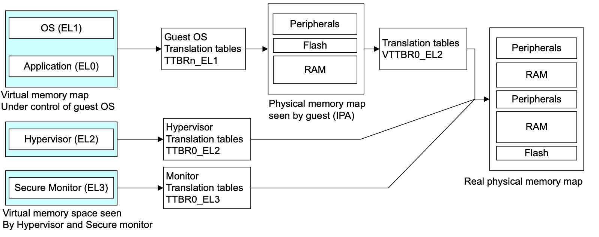

## 12. 内存管理单元

内存管理单元（MMU）的一个重要功能是使系统能够运行多个任务，作为独立的程序运行在他们自己的私有虚拟内存空间。它们不需要了解系统的物理内存图，即硬件实际使用的地址，也不需要了解可能在同一时间执行的其他程序。


你可以为每个程序使用相同的虚拟内存地址空间。你也可以使用一个连续的虚拟内存地图，即使物理内存是碎片化的。这个虚拟地址空间与系统中的实际物理内存地图是分开的。你可以编写、编译和链接应用程序以在虚拟内存空间中运行。

如下图所示的内存虚拟和物理视图的系统实例，一个系统中的不同处理器和设备可能有不同的虚拟和物理地址图。操作系统对MMU进行编程，在这两个内存视图之间进行转换。


要做到这一点，虚拟内存系统中的硬件必须提供地址转换，即把处理器发出的虚拟地址转换为主内存中的物理地址。

虚拟地址是你、编译器和链接器在内存中放置代码时使用的地址。物理地址是由实际的硬件系统使用的。

MMU使用虚拟地址的最重要的位来索引映射表中的条目，并确定哪个块被访问。MMU将代码和数据的虚拟地址映射成实际系统中的物理地址。这种转换是在硬件中自动进行的，对应用程序是透明的。除了地址转换外，MMU还控制内存访问权限、内存排序和每个区域内存的缓存策略。


MMU使任务或应用程序的编写方式要求它们对系统的物理内存图或可能同时运行的其他程序一无所知。这使你可以为每个程序使用相同的虚拟内存地址空间。

它还允许你使用一个连续的虚拟内存地图，即使物理内存是碎片化的。这个虚拟地址空间与系统中的实际物理内存地图是分开的。应用程序被编写、编译和链接以在虚拟内存空间中运行。

### 12.1 转址旁路缓存（TLB）

转址旁路缓存（TLB）是MMU中最近访问的页面映射的缓冲区。对于处理器执行的每个内存访问，MMU检查映射是否被缓存在TLB中。如果请求的地址翻译在TLB中引起了命中，那么该地址的映射就为立即可用。

每个TLB条目通常不仅包含物理地址和虚拟地址，还包含诸如内存类型、缓存策略、访问权限、地址空间ID（ASID）和虚拟机ID（VMID）等属性。如果TLB不包含处理器发出的虚拟地址的有效映射，称为TLB缺失，则执行外部映射表漫游或查找。MMU内的专用硬件使其能够读取内存中的映射表。然后，新加载的映射可以被缓存在TLB中，以便在映射表行走没有导致页面故障的情况下进行重复使用。TLB的确切结构在ARM处理器的实现之间有所不同。

如果操作系统修改了可能已缓存在 TLB 中的映射条目，那么操作系统就有责任使这些陈旧的 TLB 条目失效。

执行A64代码时，有一个TLBI，这是一个TLB无效指令。

```asm
TLBI <type><level>{IS} {, <Xt>}
```

下面的列表给出了类型字段的一些比较常见的选择。完整的列表在表12-1中给出。

- **ALL** 所有TLB条目。
- **VMALL**   所有TLB条目。这是当前访客操作系统的第一阶段。
- **VMALLS12** 所有TLB条目。这是当前访客操作系统的第1和第2阶段。
- **ASID** 与Xt中的ASID匹配的条目
- **VA** Xt中指定的虚拟地址和ASID条目。
- **VAA** 在Xt中指定的虚拟地址条目，具有任何ASID。

每个异常级别，即EL3、EL2或EL1，都有自己的虚拟地址空间，该操作适用于该空间。IS字段指定这仅适用于内部可共享条目。

> 有关ASID和映射表配置的信息，请参阅上下文切换，以了解有关可共享性概念的更多信息。

<level>字段只是指定操作应适用的异常级虚拟地址空间（可以是3、2或1）。

IS字段指定这仅适用于内部可共享条目。


下面的代码例子显示了对由内部可共享内存支持的映射表的写入序列。

```asm
<< Writes to Translation Tables >>
DSB ISHST // ensure write has completed
TLBI ALLE1 // invalidate all TLB entries
DSB ISH // ensure completion of TLB invalidation
ISB // synchronize context and ensure that no instructions are 
		// fetched using the old translation
```

有关示例中显示的DSB和ISB屏障指令的更多信息，请参阅第13-6页。

例如，要更改单个条目，请使用以下指令：

```asm
TLBI VAE1, X0
```

这将使与寄存器X0中指定的地址关联的条目无效。

TLB可以容纳固定数量的条目。你可以通过最大限度地减少由映射表遍历引起的外部内存访问数量并获得高TLB命中率来实现最佳性能。ARMv8-A架构提供了一个称为连续块条目的功能，以有效地使用TLB空间。映射表块条目每个都包含一个连续的位。当设置时，该位向TLB发出信号，它可以缓存一个涵盖多个块的映射的单一条目。一个查找可以索引到一个连续块所覆盖的地址范围的任何地方。因此，TLB可以为定义的地址范围缓存一个条目，使得在TLB中存储更大范围的虚拟地址成为可能。

要使用一个连续的位，连续的块必须是相邻的，也就是说它们必须对应于一个连续的虚拟地址范围。它们必须从一个对齐的边界开始，具有一致的属性，并指向同一级别转换的连续输出地址范围。要求的对齐方式是，4KB颗粒的VA[20:16]或64KB颗粒的VA[28:21]，对所有地址都是一样的。需要以下数量的连续块：

- 16×4KB相邻块，带有4KB颗粒的64KB块条目。
- 32×32MB相邻块，为L2描述符提供1GB条目，128×16KB为使用16KB颗粒时，L3描述符的2MB条目。
- 32×64Kb相邻块，带有64KB颗粒的2MB块条目。

如果不满足这些条件，则会发生编程错误，这可能会导致TLB中止或查找损坏。这种错误的可能例子包括：

- 一个或多个表条目没有连续的位集。

- 其中一个条目的输出点在对齐范围之外。

对于ARMv8架构，不正确的使用不允许逃避EL0和EL1有效地址空间之外的权限检查，或者错误地提供对EL3空间的访问。

### 12.2 内核和应用程序虚拟地址空间的分离

操作系统通常有许多应用程序或任务在同时运行。每个任务都有自己独特的转换表，内核在一个任务和另一个任务之间切换时，会从一个转换表切换到另一个。然而，大部分内存系统仅由内核使用，并且具有固定的虚拟到物理地址的映射，其中转换表项很少改变。ARMv8架构提供了许多功能来有效地处理这一要求。

映射表基地址在映射基础寄存器（TTBR0_EL1）和（TTBR1_EL1）中指定。当VA的上面几位都是0时，TTBR0所指向的映射表被选中，当VA的上面几位都被设置为1时，TTBR1被选中。 你可以启用VA标记，将前八位排除在检查之外。

来自指令获取或数据访问的处理器的虚拟地址是64位。然而，你必须在一个48位的物理地址内存映射中映射上面定义的两个区域。。

EL2和EL3有一个TTBR0，但没有TTBR1。这意味着：

- 如果EL2使用的是AArch64，它只能使用范围在0x0到0x0000FFFF_FFFFFFFF。
- 如果EL3使用的是AArch64，它只能使用范围在0x0到0x0000FFFF_FFFFFFFF。

下面的图显示了内核空间如何被映射到内存的最重要区域，以及与每个应用程序相关的虚拟地址空间如何被映射到内存的最不重要区域。然而，这两者都被映射到一个小得多的物理地址空间。


映射控制寄存器TCR_EL1定义了被检查的最有效位的确切数量。TCR_EL1包含大小字段T0SZ[5:0]和T1SZ[5:0]。该字段中的整数给出了必须全部为0或全部为1的最有意义位的数量。这些字段有指定的最小值和最大值，它们随颗粒大小和起始表级别而变化。因此，你必须始终使用这两个空间，在所有系统中至少需要两个映射表。一个没有操作系统的简单裸机系统仍然需要一个只包含故障项的小的上层映射表。


TCR_EL1控制EL1和EL0的其他内存管理功能。图12-5仅显示了控制地址范围和颗粒大小的字段。


中级物理地址大小（IPS）字段控制最大输出地址大小。如果映射指定了超出此范围的输出地址，则访问失败，000=32位物理地址，101=48位。两位映射颗粒（TG）TG1和TG0字段分别给出内核或用户空间的颗粒大小，00=4KB，01=16KB，11=64KB。

你可以配置用于第一次查找的映射表级别。完整的映射过程可能需要三到四级的映射表。你不需要实现所有等级的映射表。第一级的查找实际上是由颗粒大小和TCR_ELn.TxSZ字段决定的。您可以为TTBR0_EL1和TTBR1_EL1单独配置。

### 12.3 将虚拟地址转换为物理地址

当处理器为指令获取或数据访问发出一个64位的虚拟地址时，MMU硬件会将虚拟地址转换为相应的物理地址。对于一个虚拟地址来说，前16位[63:47]必须全部是0或1，否则地址会触发一个故障。

然后，最不重要的位被用来提供所选部分的偏移量，这样MMU就把块表项的物理地址位和原始地址的最不重要的位结合起来，产生最终地址。

该架构还支持标记地址。这个地址中最重要的8位容易被忽略（被视为不是地址的一部分）。这意味着这些位可以用于其他方面，例如，记录关于一个指针的信息。


在一个简单的地址转换中，只涉及一个层次的查找。假设我们使用的是一个64KB的颗粒，有一个42位的虚拟地址。MMU映射虚拟地址的方法如下:

1. 如果VA[63:42] = 1，则TTBR1用于第一页表的基地址。当VA[63:42] = 0时，TTBR0用于第一页表的基地址。
2. 页表包含8192个64位页表条目，并使用VA[41:29]进行索引。MMU从表中读取相关的2级表格条目。
3. MMU检查页面表条目的有效性，以及是否允许请求的内存访问。假设它有效，则允许内存访问。
4. 在图12-7中，页表条目指的是512MB的页面（它是一个块描述符）。
5. Bit[47:29]取自此页面表条目，并形成物理地址的Bit[47:29]。
6. 由于我们有一个512MB的页面，VA的Bit[28:0]被取为PA[28:0]。请参阅第12-15页颗粒大小对映射表的影响。
7. 返回完整的PA[47:0]，以及页面表条目中的其他信息。

在实践中，如此简单的映射过程严重限制了您如何细微地划分地址空间。一级表条目可以指向二级页面表，而不是只使用此一级映射表。

通过这种方式，操作系统可以进一步将很大一部分虚拟内存划分为更小的页面。对于二级表，一级描述符包含二级页面表的物理基地址。与处理器请求的虚拟地址相对应的物理地址可以在二级描述符中找到。

下面的图图显示了一个64位颗粒从第1阶段第2级开始的正常64KB页面的转换实例。


每个二级表都与一个或多个一级条目相关。你可以有多个一级描述符指向同一个二级表，这意味着你可以将多个虚拟地址别名到同一个物理地址。

图12-8描述了一种有两层查找的情况。同样，这也假设了一个64KB的颗粒和42位的虚拟地址空间。

1. 如果VA[63:42] = 1，则TTBR1用于第一页表的基地址。当VA[63:42] = 0时，TTBR0用于第一页表的基地址。
2. 页面表包含8192个64位页面表条目，并通过VA[41:29]进行索引。MMU从表中读取相关的二级表格条目。
3. MMU检查二级页面表条目的有效性，以及是否允许请求的内存访问。假设它有效，则允许内存访问
4. 在图12-8中，二级页表条目是指三级页表的地址（它是一个表描述符）。
5. Bit[47:16]取自二级页表条目，形成三级页表的基地址。
6. VA的Bit[28:16]用于索引3级页面表条目。MMU从表格中读取相关的3级表格条目。
7. MMU检查三级页面表条目的有效性，以及是否允许请求的内存访问。假设它有效，则允许内存访问。
8. 在图12-8中，三级页面表条目指的是64KB页面（它是一个页面描述符）。
9. Bit[47:16]取自三级页面表条目，用于形成PA[47:16]。
10. 由于我们有一个64KB页面，VA[15:0]被取为PA[15:0]。
11. 返回完整的PA[47:0]，以及页面表条目中的其他信息。

#### 12.3.1 安全和非安全地址

理论上，安全和非安全物理地址空间是相互独立的，并行存在。一个系统可以设计为有两个完全独立的内存系统。然而，大多数真实系统将安全和非安全视为访问控制的属性。正常（非安全）世界只能访问不安全的物理地址空间。安全世界可以访问两个物理地址空间。同样，这是通过映射表控制的。


这也会对缓存的一致性产生影响。例如，由于安全的0x8000和非安全的0x8000从技术上讲是不同的物理地址，它们可以同时出现在高速缓存中。

在一个安全内存和非安全内存位于不同位置的系统中，不会有问题。更有可能的是，它们会在同一个位置。理想情况下，内存系统会阻止对非安全内存的安全访问和对安全内存的非安全访问。在实践中，大多数只阻止对安全内存的非安全访问。同样，这意味着你可能会在缓存中出现两次相同的物理内存，安全和非安全的。这始终是一个编程错误。为了避免这种情况，安全世界必须始终使用非安全的方式来访问非安全的内存。

#### 12.3.2 配置和启用MMU

对控制MMU的系统寄存器的写入是切换上下文的事件，它们之间不存在排序要求。这些事件的结果不能保证在上下文同步事件之前被看到 （见第13-6页的屏障）。

```asm
MSR TTBR0_EL1, X0 // Set TTBR0
MSR TTBR1_EL1, X1 // Set TTBR1
MSR TCR_EL1, X2 // Set TCR
ISB	// The ISB forces these changes to be seen before the MMU is enabled.
MRS X0, SCTLR_EL1 // Read System Control Register configuration data 
ORR X0, X0, #1 //Set [M] bit and enable the MMU.
MSR SCTLR_EL1, X0 // Write System Control Register configuration data
ISB	 // The ISB forces these changes to be seen by the next instruction
```

这与扁平映射的要求是不同的，扁平映射是为了确保我们知道在写入SCTL_EL1.M后直接执行哪条指令。如果我们看到写入的结果，那就是使用新的转换机制的VA+4的指令。如果我们没有看到结果，它仍然是在VA+4的指令，但是VA=PA。ISB在这里没有帮助，因为我们不能保证它是下一条执行的指令，除非我们使用扁平映射。

#### 12.3.3 停用内存管理单元时的操作

当阶段1 MMU被禁用时，对于不安全的EL0和EL1，当HCR_EL2时访问。直流位设置为启用数据缓存，默认内存类型为正常不可共享，内部回写读写分配，外部回写读写分配。

### 12.4 ARMv8-A中的转址表

ARMv8-A架构支持三组不同的转址表形式：

- ARMv8-A AArch64长描述符格式。
- ARMv7-A长描述符格式，例如ARM Cortex-A15处理器中的ARMv7-A架构的大物理地址扩展（LPAE）。
- ARMv7-A短描述符格式。

在AArch32状态下，你可以使用现有的ARMv7-A长描述符和短描述符格式来运行现有的客户操作系统和现有的应用程序代码，无需修改。ARMv7-A短描述符只能在EL0和EL1阶段1映射中使用。因此，它们不能被管理程序或安全监控代码使用。

在AArch64执行状态下始终使用ARMv8-A长描述符格式。这与带有大型物理地址扩展的ARMv7-A长描述符格式非常相似。它使用相同的64位长描述符格式，但有一些变化。它引入了一个新的0级表索引，它使用与1级表相同的描述符格式。增加了对多达48位输入和输出地址的支持。输入虚拟地址现在来自一个64位寄存器。然而，由于该架构不支持完整的64位寻址，地址的第63:48位必须全部相同，即全部为0或全部为1，或者前8位可用于VA标记。

AArch64支持映射三种不同的颗粒。这些定义了映射表最底层的块大小，并控制使用中的映射表的大小。较大的颗粒大小减少了所需的页表层数，这在使用管理程序提供虚拟化的系统中可能成为一个重要的考虑因素。

支持的颗粒大小为4KB、16KB和64KB，支持这三种颗粒的大小是由具体设计方案决定的。创建页表的代码能够读取系统寄存ID_AA64MMFR0_EL1，以了解哪些是支持的大小。Cortex-A53处理器支持所有三种尺寸，但一些早期版本的处理器不是这样的，比如Cortex-A57，它不支持16K颗粒尺寸。在映射控制寄存器（TCR_EL1）中，每个映射表的大小都可以配置。

#### 12.4.1 AArch64描述符格式

你可以在所有级别的表中使用描述符格式，从0级到3级。0级描述符只能输出1级表的地址。三级描述符不能指向另一个表，只能输出块地址。因此，三级表的格式略有不同。

下面的图显示了表描述符类型由条目的Bit[1:0]标识，可以参考以下任一个：

- 下一级表的地址，在这种情况下，内存可以进一步细分为较小的块。
- 可变大小的内存块的地址。
- 表条目，可以标记为Fault或Invalid。


> 为了清晰起见，此图表没有指定位字段的宽度。

#### 12.4.2 颗粒尺寸对映射表的影响

三种不同的颗粒尺寸可能会影响所需映射表的数量和大小。

在所有情况下，如果VA输入范围限制为42位，则可以省略一级映射表。

根据可能的VA范围的大小，级数可能会更少。例如，对于4KB颗粒，如果TTBCR设置为低地址仅跨度1GB，则不需要级别0和1，映射从2级开始，4KB页面从3级开始。

- **4KB**

    当你使用4kB的颗粒大小时，硬件可以使用4级查找过程。48位地址每一级有9个地址位被翻译，即每一级有512个条目，最后的12位在4kB内选择一个字节，直接来自原始地址。

    虚拟地址的第47:39位索引到512个条目的L0表。每个表项都跨越512GB范围，并指向一个L1表。在这个512条目的L1表中，第38:30位被用作索引来选择一个条目，每个条目都指向一个1GB块或一个L2表。位29:21索引到一个512条目的L2表，每个条目指向一个2MB块或下一级表。在最后一级，第20:12位索引到一个512条目的L2表，每个条目指向一个4kB的块。

	

- **16KB**

    当你使用16KB的颗粒大小时，硬件可以使用4级查找过程。48位的地址每一级映射有11个地址位，即每一级有2048个条目，最后的14位在4KB内选择一个字节，直接来自原始地址。0级表只包含两个条目。虚拟地址的第47位从两个条目的L0表中选择一个描述符。这些表项中的每一个都跨越了128TB的范围，并指向一个L1表。在这个2048个条目的L1表内，第46:36位被用作索引来选择一个条目，每个条目指向一个L2表。第35:25位索引到一个2048个条目的L2表，每个条目指向一个32MB的块或下一个表层。在最后的映射阶段，Bit[24:14]索引到一个2048个条目的L2表，每个条目指向一个16KB的块。

	

- **64KB**

    当你使用64kB的颗粒大小时，硬件可以使用3级查找过程。第1级表只包含64个条目。

    虚拟地址的第47:42位从64个条目的L1表中选择一个描述符。这些表项中的每一个都跨越了4TB的范围，并指向一个L2表。在这个8192个条目的L2表内，第41:29位被用作索引来选择一个条目，每个条目指向一个512MB的块或一个L2表。在最后的第28:16位索引到一个8192条目的L3表，每个条目都指向一个64kB的块。

	

#### 12.4.3 缓存配置

MMU使用映射表和映射寄存器来控制哪些内存位置是可缓存的。MMU控制缓存策略、内存属性和访问权限，并提供虚拟到物理地址的映射。


软件配置由系统寄存器执行（其中一些列在第4章ARMv8寄存器中）。

在一些设计中，外部存储器系统可能包含进一步的特定实现的外部存储器的缓存。

#### 12.4.4缓存策略

MMU映射表也定义了内存系统中每个块的缓存策略。被定义为Normal的内存区域可能被标记为可缓存或不可缓存。映射表项的位[4:2]指的是内存属性定向寄存器（MAIR）中的八个内存属性编码之一。内存属性编码指定了访问该内存时要使用的缓存策略。这些都是对处理器的提示，在一个特定的实现中是否支持所有的缓存策略，以及哪些缓存数据被认为是连贯的，这都是实施定义的。一个内存区域可以用它的可共享属性来定义。

### 12.5 转址表配置

除了在TLB中存储单个映射关系外，你可以配置MMU将映射表存储在可缓存的内存中。这通常比总是从外部存储器读取映射表要快得多。TCR_EL1有额外的字段来控制这个。

这些附加字段指定了TTBR0和TTBR1的映射表的可缓存性和可共享性。相关的字段被称为SH0/1 Shareability，IRGN0/1 Inner Cacheable，和ORGN0/1 Outer Cacheable。表12-2显示了可缓存性的允许设置。


内存的可共享性的对应表与映射表的行走有关。对于一个设备或强排序的内存区域，该值被忽略。


在TCR_EL1中指定的属性必须与为存储映射表的虚拟内存区域指定的属性相同。缓存映射表是正常的默认行为。

#### 12.5.1 虚拟地址标记

映射控制寄存器TCR_ELn有一个额外的字段，称为顶部字节忽略（TBI），提供标记寻址支持。通用寄存器是64位宽，但地址中最重要的16位必须全部是0xFFFF或0x0000。任何试图使用不同位值的行为都会触发故障。

当标签寻址支持被启用时，前八位，也就是虚拟地址的[63:56]被处理器忽略了。它在内部设置位[55]，将地址扩展为64位格式。然后，虚拟地址的前八位可以用来传递数据。这些位在寻址和映射故障中被忽略。TCR_EL1对EL0和EL1有单独的启用位。ARM没有规定或授权标记寻址的具体使用情况。

一个用例可能是支持面向对象的编程语言。除了拥有一个指向对象的指针外，可能还有必要保留一个引用计数，以跟踪指向对象的引用或指针或句柄的数量，例如，这样，自动垃圾收集代码就可以取消分配不再被引用的对象了。这个引用计数可以作为标签地址的一部分来存储，而不是在一个单独的表中，这样可以加快创建或销毁对象的过程。

### 12.6 EL2和EL3的转址

ARMv8-A架构的虚拟化扩展引入了第二个映射阶段。当系统中存在一个管理程序时，可能会出现一个或多个客户操作系统。这些系统继续使用TTBRn_EL1，如前所述，MMU操作看起来没有变化。

管理程序必须在一个两阶段的过程中执行一些额外的转换步骤，以便在不同的客户操作系统之间共享物理内存系统。在第一阶段，一个虚拟地址（VA）被映射成中间物理地址（IPA）。这通常是在操作系统的控制之下。第二阶段，由管理程序控制，然后执行IPA到最终物理地址（PA）的翻译。
管理程序和安全监控器也有他们自己的代码和数据的第一阶段映射表，直接从VA到PA进行映射。



第二阶段的转换，将中间物理地址转换为物理地址，使用一套额外的表，由管理程序控制。这些必须通过写入管理程序配置寄存器HCR_EL2来明确启用。这个过程只适用于非安全的EL1/0访问。

这个第二阶段映射表的基础地址在虚拟化映射表基础寄存器VTTBR0_EL2中指定。它指定了内存底部的一个连续的地址空间。支持的地址空间的大小在虚拟化映射控制寄存器 VTCR_EL2 的 TSZ[5:0] 字段中指定。

该寄存器的TG字段指定了颗粒大小，而SL0字段控制了第一级表的查找。任何超出定义的地址范围的访问都会导致映射故障。


管理程序EL2和安全监控器EL3有自己的一级表，直接从虚拟空间映射到物理地址空间。表的基址分别在TTBR0_EL2和TTBR0_EL3中指定，使内存底部的单一连续地址空间的大小可变。TG字段指定颗粒大小，SL0字段控制表查找的第一级。任何超出定义的地址范围的访问都会导致转换错误。


安全监控器EL3有自己的专用映射表。表的基址在TTBR0_EL3中指定，并通过TCR_EL3进行配置。映射表能够访问安全和非安全的物理地址。TTBR0_EL3只在安全监控EL3模式下使用，而不是由可信的内核本身使用。当过渡到安全世界时，受信任的内核使用EL1映射，也就是由TTBR0_EL1和TTBR1_EL1指向的映射表。由于这些寄存器在AArch64中没有入库，安全监控代码必须为安全世界配置新的表，并保存和恢复TTBR0_EL1和TTBR1_EL1的副本。

与非安全状态下的正常操作相比，EL1转换机制在安全状态下的行为是不同的。第二阶段的映射被禁用，EL1翻译系统现在可以指向安全或非安全的物理地址。在安全状态下没有虚拟化，因此IPA总是与最终的PA相同。

TLB中的条目被标记为安全或非安全，因此，当你在安全和正常世界之间转换时，不需要维护TLB。

### 12.7 访问权限

访问权限是通过转换表项控制的。访问权限控制一个区域是可读还是可写，或者两者都是，可以分别设置为非特权的EL0和特权访问的EL1、EL2、EL3，如表12-4所示。


操作系统的内核运行在执行层EL1。它定义了映射表的映射，这些映射被内核本身和运行在EL0的应用程序所使用。由于内核为自己的代码和应用程序指定了不同的权限，所以需要区分非特权和特权访问权限。在执行层EL2运行的管理程序和安全监控器EL3只有自己使用的翻译方案，因此没有必要在权限上进行特权和非特权的划分。

另一种访问权限是可执行属性。区块可以被标记为可执行或不可执行（从不执行（XN））。你可以分别设置从不执行特权（Unprivileged Execute Never, UXN）和从不执行特权（PXN）的属性，并以此来防止，例如，以内核权限运行的应用程序代码，或在非特权状态下试图执行内核代码。设置这些属性可以防止处理器对内存位置进行推测性指令获取，并确保推测性指令获取不会意外地访问可能被这种访问扰乱的位置，例如，先进先出（FIFO）页面替换队列。因此，设备区域必须始终被标记为永不执行。


你可以使用SCTLR寄存器中的以下位来配置处理器，使其将可写区域视为永不执行：

- SCTLR_EL1。WXN。在EL0下可写的区域在EL0和EL1处被视为XN。在EL1下可写的区域在EL1处被视为XN。
- SCTLR_EL2和3。WXN。在ELn可以写的区域在ELn被视为XN。
- SCTLR.UWXN。在EL0下可写的区域在EL1处被视为XN。这仅适用于AArch32。

SCTLR_ELn位可以被缓存在TLB条目中。因此，改变SCTLR中的位可能不会影响已经在TLB中的条目。当修改这些位时，需要进行TLB的无效化和ISB序列。关于ISB屏障的信息，请参见第13-6页的屏障。

### 12.8 操作系统对映射表描述符的使用

描述符中的另一个内存属性位，访问标志（AF），指示一个块条目何时被首次使用。

- AF = 0：此块条目尚未使用。
- AF = 1：已使用此块条目。

操作系统使用一个访问标志位来跟踪哪些页面正在被使用。软件管理着这个标志。当页面第一次被创建时，它的条目AF被设置为0。当代码第一次访问该页面时，如果它的AF为0，就会触发一个MMU故障。页面故障处理程序记录这个页面现在正在被使用，并手动设置表项中的AF位。例如，Linux内核在ARM64上使用PTE_AF的[AF]位（Linux内核对AArch64的称呼），用于检查一个页面是否曾经被访问过。这影响了一些内核内存管理的选择。例如，当一个页面必须被换出内存时，它不太可能换出正在被使用的页面。

描述符的[58:55]位被标记为保留给软件使用，可以用来在转换表中记录操作系统的特定信息。例如，Linux内核使用这些位中的一个来标记一个条目为干净或肮脏。脏状态记录了该页是否被写入。如果该页后来被换出内存，一个干净的页可以简单地被丢弃，但一个脏页必须先保存其内容。


有关指定内存类型及其可缓存性和可共享性属性的其他内存属性的信息，请参阅第13章内存排序。

### 12.9 安全和MMU

ARMv8-A架构定义了两种安全状态：安全和非安全。它还定义了两个物理地址空间。因此，正常世界只能访问非安全物理地址空间。安全世界可以同时访问安全和非安全物理地址空间。

在非安全状态下，映射表中的NS位和NS Table位被忽略。只有非安全的内存可以被访问。在安全状态下，NS位和NSTable位控制虚拟地址是否转换为安全或非安全的物理地址。你可以使用SCR_EL3.CIF来防止安全世界从任何转换到非安全物理地址的虚拟地址中执行。此外，当在安全世界中，你可以使用SCR.CIF位来控制安全指令的获取是否可以在非安全的物理内存中进行。

### 12.10 内容切换

实现ARMv8-A架构的处理器通常用于运行复杂操作系统的系统，该系统具有许多并发运行的应用程序或任务。每个进程都有自己独特的映射表驻留在物理内存中。当应用程序启动时，操作系统为其分配一组映射表项，这映射表项将应用程序使用的代码和数据映射到物理内存。这些表随后可以被内核修改，例如，映射到额外的空间，并在应用程序不再运行时被删除。

因此，在内存系统中可能有多个任务存在。内核调度器定期地将执行从一个任务转移到另一个任务。这被称为上下文切换，要求内核保存所有与进程相关的执行状态，并恢复接下来要运行的进程的状态。内核还将映射表的条目切换到下一个要运行的进程的条目。当前没有运行的任务的内存完全被保护起来，不受正在运行的任务的影响。

确切地说，需要保存和恢复的内容在不同的操作系统中有所不同，但通常情况下，进程上下文切换包括保存或恢复以下一些或全部元素。

- 通用寄存器X0-X30。
- 高级SIMD和浮点寄存器V0-V31。
- 一些状态寄存器。
- TTBR0_EL1和TTBR0。
- 线程进程ID（TPIDxxx）注册。
-  地址空间 ID (ASID)。

对于EL0和EL1，有两个映射表。TTBR0_EL1为虚拟地址空间的底部提供映射，这通常是应用程序空间，而TTBR1_EL1覆盖虚拟地址空间的顶部，通常是内核空间。这种分割意味着操作系统的映射不必在每个任务的映射表中进行复制。

映射表项包含一个非全局（nG）位。如果一个特定的页面的nG位被设置，它就与一个特定的任务或应用程序相关。如果该位被标记为0，那么该条目是全局的，适用于所有任务。

对于非全局条目，当TLB被更新并且该条目被标记为非全局时，除了正常的映射信息外，还有一个值被存储在TLB条目中。这个值被称为地址空间ID（ASID），它是由操作系统分配给每个单独任务的数字。后续的TLB查询只有在当前的ASID与存储在条目中的ASID相匹配时才会在该条目上进行匹配。这就允许在一个被标记为非全局的特定页面上存在多个有效的TLB条目，但其ASID值不同。换句话说，当我们进行上下文切换时，我们不一定需要刷新TLB。

在AArch64中，这个ASID值可以被指定为8位或16位的值，由TCR_EL1.AS位控制。当前的ASID值被指定在TTBR0_EL1或TTBR1_EL1中。TCR_EL1控制哪个TTBR持有ASID，但通常是TTBR0_EL1，因为它对应的是应用空间。

> 将ASID的当前值存储在翻译表寄存器中意味着您可以在单个指令中原子地修改翻译表和ASID。与ARMv7-A架构相比，这简化了更改表和ASID的过程。

此外，ARMv8-A架构提供线程ID寄存器供操作系统软件使用。这些寄存器没有硬件意义，通常由线程库作为每个线程数据的基本指针使用。这通常被称为线程本地存储（TLS）。例如，pthreads库使用这一功能，包括以下寄存器：

- 用户读写线程ID寄存器（TPIDR_EL0）。
- 用户只读线程ID寄存器（TPIDRRO_EL0）。
- 线程ID寄存器，仅限特权访问（TPIDR_EL1）。

### 12.11 用户权限的内核访问

有一些指令允许在EL1执行的代码（例如，操作系统）以EL0或应用程序的权限执行内存访问。例如，这可以用来取消对系统调用提供的指针的引用，并使操作系统能够检查是否只有应用程序可访问的数据被访问。这可以通过LDTR或STTR指令来实现。当在EL1执行时，这些指令执行加载或存储，就像在EL0执行一样。在所有其他的异常级别，LDTR和STTR的行为与普通的LDR或STR指令一样。有通常的大小和有符号和无符号的变体作为正常的加载和存储指令，但有一个较小的偏移量和受限制的索引选项。


-----------------

