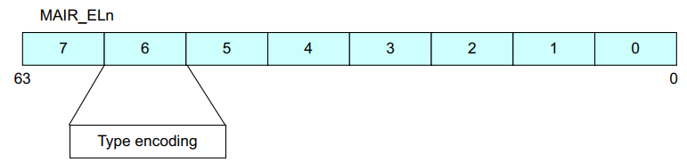
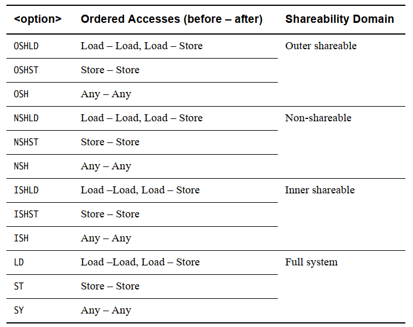
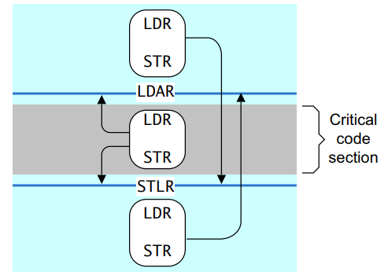
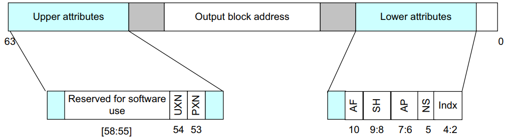
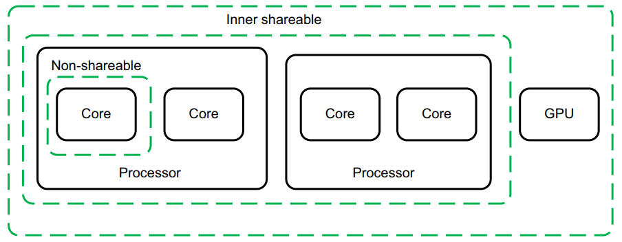

## 13. 内存排序

如果您的代码直接与硬件或在其他内核上执行的代码交互，或者如果它直接加载或写入要执行的指令，或修改页表，您需要注意内存排序问题。

如果你是应用程序开发者，硬件交互可能是通过设备驱动，与其他内核的交互是通过 Pthreads 或其他多线程 API，而与分页内存系统的交互是通过操作系统。在所有这些情况下，相关代码都会为您处理内存排序问题。但是，如果您正在编写操作系统内核或设备驱动程序，或者实现管理程序、JIT 编译器或多线程库，则必须对 ARM 体系结构的内存排序规则有一个很好的理解。您必须确保在您的代码需要显式内存访问顺序的地方，您能够通过正确使用屏障来实现这一点。

ARMv8 架构采用弱排序的内存模型。一般来说，这意味着内存访问的顺序不需要与加载和存储操作的程序顺序相同。处理器能够相对于彼此重新排序内存读取操作。写入也可以重新排序（例如，写入组合）。因此，硬件优化（例如缓存和写入缓冲区的使用）以提高处理器性能的方式起作用，这意味着所需的带宽可以减少处理器和外部存储器之间的延迟，并且隐藏与此类外部存储器访问相关的长延迟。

对普通内存的读取和写入可以由硬件重新排序，仅受数据依赖性和显式内存屏障指令的影响。某些情况需要更严格的排序规则。您可以通过描述该内存的转换表条目的内存类型属性向核心提供有关此的信息。

非常高性能的系统可能支持诸如推测性内存读取、多次发出指令或乱序执行等技术，这些技术与其他技术一起，为内存访问的硬件重新排序提供了进一步的可能性：

- 多pipeline发射指令(Multiple issue of instructions)
一个处理器可能在每个周期发出并执行多条指令，以便可以同时执行按程序顺序依次执行的指令。
- 乱序执行(Out-of-order execution)
许多处理器支持非相关指令的乱序执行。每当一条指令在等待前一条指令的结果时停止，处理器就可以执行没有依赖关系的后续指令。
- 推测当处理器遇到条件指令(Speculation )
（例如分支）时，它可以推测性地在确定是否必须执行该特定指令之前开始执行指令。因此，如果条件解决表明推测是正确的，则可以更快地获得结果。
- 推测负载(Speculative loads)
如果推测性地执行从可缓存位置读取的加载指令，则可能导致缓存行填充和现有缓存行的潜在驱逐。
- 加载和存储优化(Load and store optimizations)
由于对外部存储器的读取和写入可能具有较长的延迟，因此处理器可以通过例如将多个存储合并到一个更大的事务中来减少传输次数。
- 外部存储系统(External memory systems)
在许多复杂的片上系统(SoC) 设备中，有许多代理能够启动传输和多条路由到读取或写入的从设备。其中一些设备，例如 DRAM 控制器，可能能够同时接受来自不同主机的请求。事务可以由互连缓冲或重新排序。这意味着来自不同主设备的访问可能因此需要不同数量的周期才能完成，并且可能会相互超越。
- 缓存一致的多核处理(Cache coherent multi-core processing)
在多核处理器中，硬件缓存一致性可以在内核之间迁移缓存线。因此，不同的内核可能会以彼此不同的顺序看到对缓存内存位置的更新。
- 优化编译器(Optimizing compilers)
优化编译器可以重新排序指令以隐藏延迟或充分利用硬件功能。它通常可以向前移动内存访问，使其更早，并在需要值之前给它更多时间来完成。

在单核系统中，这种重新排序的效果通常对程序员是透明的，因为单个处理器可以检查危险并确保
尊重数据依赖性。但是，如果您有多个内核通过共享内存进行通信，或者以其他方式共享数据，则内
存排序考虑变得更加重要。本章讨论了与多处理(MP) 操作和多个执行线程的同步相关的几个主题。它还讨论
了架构定义的内存类型和规则以及如何控制这些。  

### 13.1 内存类型  

ARMv8 架构定义了两种互斥的内存类型。所有内存区域都配置为这两种类型中的一种，即Normal和Device。第三种内存类型， Strongly Ordered，是 ARMv7 架构的一部分。这种类型和设备内存之间的差异很小，因此现在在ARMv8 中省略了。 （请参阅第 13‑4 页的设备内存。）

除了内存类型之外，属性还提供对可缓存性、可共享性、访问和执行权限的控制。可共享和缓存属性仅适用于普通内存。设备区域始终被视为不可缓存且可外部共享。对于可缓存位置，您可以使用属性向处理器指示缓存分配策略。

内存类型不直接编码在转换表条目中。相反，每个块条目都为内存类型表指定一个 3 位索引。该表存储在内存属性间接寄存器MAIR_ELn 中。该表有 8 个条目，每个条目有 8 位，如图 13‑1 所示。

虽然翻译表块条目本身并不直接包含内存类型编码，但处理器内部的 TLB 条目通常为特定条目存储此信息。

因此，在ISB指令屏障和 TLB 无效操作之后，可能不会观察到对 MAIR_ELn 的更改。



#### 13.1.1 普通内存  

您可以将普通内存用于所有代码和内存中的大多数数据区域。普通内存的示例包括物理内存中的 RAM、闪存或ROM 区域。这种内存提供了最高的处理器性能，因为它是弱排序的并且对处理器的限制较少。处理器可以重新排序、重复和合并对普通内存的访问。

此外，处理器可以推测性地访问标记为正常的地址位置，以便可以从内存中读取数据或指令，而无需在程序中显式引用，或者在显式引用的实际执行之前。这种推测性访问可能是由于分支预测、推测性高速缓存行填充、无序数据加载或其他硬件优化而发生的。

为获得最佳性能，请始终将应用程序代码和数据标记为 Normal，并且在需要强制内存排序的情况下，您可以通过使用显式屏障操作来实现。普通内存实现了弱排序的内存模式。相对于其他正常访问或设备访问，正常访问不需要按顺序完成。

但是，处理器必须始终处理由地址依赖性引起的危险。

例如，考虑以下简单的代码序列：
```c
STR X0, [X2]
LDR X1, [X2]
```
处理器始终确保X1中的值是写入X2 中存储的地址的值。

这当然适用于更复杂的依赖关系。考虑以下代码：
```c
ADD X4, X3, #3
ADD X5, X3, #2
STR X0, [X3]
STRB W1, [X4]
LDRH W2, [X5]
```
在这种情况下，访问发生在彼此重叠的地址上。处理器必须确保内存的更新就像STR和STRB按顺序发生一样，以便LDRH返回最新的值。处理器将STR和STRB合并到包含要写入的最新、正确数据的单个访问中仍然有效。

### 13.1.2 设备内存  

您可以将设备内存用于访问可能会产生副作用的所有内存区域。
例如，对 FIFO 位置或定时器的读取是不可重复的，因为它为每次读取返回不同的值。对控制寄存器的写入可
能会触发中断。它通常仅用于系统中的外围设备。设备内存类型对内核施加了更多限制。

推测性数据访问不能对标记为设备的内存区域执行。对此有一个不常见的例外。如果使用 NEON 操作从设备
内存中读取字节，则处理器可能会读取未明确引用的字节（如果它们位于包含一个或多个明确引用的字节的
对齐 16 字节块内）。

尝试从标记为设备的区域执行代码通常是不可预测的。该实现可能会像处理具有 Normal 不可缓存属性
的内存位置一样处理指令提取，或者可能会出现权限错误。

有四种不同类型的设备内存，适用不同的规则。
- Device-nGnRnE 限制性最强（相当于 ARMv7 架构中的强有序内存）
- Device-nGnRE
- Device-nGRE
- Device-GRE least restrictive

The letter suffixes refer to the following three properties:
- Gathering or non Gathering (G or nG)
此属性确定是否可以将多个访问合并到此内存区域的单个总线事务中。如果地址被标记为非聚会(nG)，那么内存总线上对该位置执行的访问次数和大小必须与代码中显式访问的次数和大小完全匹配。如果地址被标记为Gathering (G)，则处理器可以例如将两个字节写入合并为单个半字写入。对于标记为Gathering 的区域，还可以合并对同一内存位置的多个内存访问。例如，如果程序读取同一个位置两次，核心只需要执行一次读取，就可以返回两条指令的结果相同。对于从标记为非 Gathering的区域读取，数据值必须来自终端设备。不能从写缓冲区或其他位置窥探它。
- Re-ordering (R or nR)
这决定了对同一设备的访问是否可以相互重新排序。如果地址被标记为非重新排序(nR)，则同一块内的访问始终按程序顺序出现在总线上。这个块的大小是实现定义的。如果这个块的大小很大，它可以跨越几个表条目。在这种情况下，对于也标记为 nR 的任何其他访问，都遵守排序规则。
- Early Write Acknowledgement (E or nE)
这确定是否允许处理器和正被访问的从设备之间的中间写缓冲区发送写完成的确认。如果地址被标记为非早期写确认(nE)，则写响应必须来自外设。如果地址被标记为早期写入确认(E)，则允许互连逻辑中的缓冲区在终端设备实际接收到写入之前发出写入接受信号。这本质上是给外部存储系统的信息。

### 13.2  内存屏障

ARM 体系结构包括屏障指令，用于在特定点强制访问排序和访问完成。在某些架构中，类似的指令被称为栅栏。

如果您正在编写顺序很重要的代码，请参阅ARM 体系结构参考手册 ‑ ARMv8中的附录 J7 Barrier LitmusTests ，了解 ARMv8‑A 体系结构配置文件和ARM 体系结构参考手册 ARMv7‑A/R 版中的附录 G 障碍石蕊测试，其中包括许多工作示例。

ARM 体系结构参考手册定义了某些关键词，特别是术语遵守和必须遵守。在典型系统中，这定义了主设备的总线接口（例如内核或 GPU 和互连）必须如何处理总线事务。只有主人能够观察传输。所有总线事务均由主机发起。主设备执行事务的顺序不一定与此类事务在从设备上完成的顺序相同，因为除非明确强制执行某些排序，否则事务可能由互连重新排序。

描述可观察性的一种简单方法是说“当我可以阅读您所写的内容时，我观察了您的写作，并且当我无法再更改您阅读的值时，我已经观察了您的阅读”，我和您都指核心或其他系统中的主人。

该架构提供了三种屏障指令：
- 指令同步屏障 (ISB)
这用于保证再次获取任何后续指令，以便使用当前 MMU 配置检查特权和访问。它用于确保任何先前执行的上下文更改操作，例如写入系统控制寄存器，在 ISB 完成时已经完成。
例如，在硬件方面，这可能意味着指令流水线被刷新。它的典型用途是内存管理、缓存控制和
上下文切换代码，或者代码在内存中移动的地方。
- 数据存储屏障 (DMB)
这防止了跨屏障指令的数据访问指令的重新排序。该处理器在 DMB 之前执行的所有数据访问，即加载或存储，但不是指令提取，在 DMB 之后的任何数据访问之前，对指定可共享域内的所有其他主控器都是可见的。例如：
```c
LDR x0, [x1] // Must be seen by the memory system before the STR below.
DMB ISHLD
ADD x2, #1 // May be executed before or after the memory system sees
LDR.
STR x3, [x4] // Must be seen by the memory system after the LDR above.
```
它还确保在执行任何后续数据访问之前已完成任何显式的先前数据或统一缓存维护操作。
```c
DC CSW, x5 // Data clean by Set/way
LDR x0, [x1] // Effect of data cache clean might not be seen by this
// instruction
DMB ISH
LDR x2, [x3] // Effect of data cache clean will be seen by this instruction
```
- 数据同步屏障 (DSB)
这强制执行与数据存储器屏障相同的顺序，但具有阻止执行任何进一步指令的额外效果，而不仅仅是加载或存储，或两者兼而有之，直到同步完成。这可用于防止执行 SEV 指令，例如，该指令将向其他内核发出事件发生的信号。它一直等到此处理器发出的所有高速缓存、TLB 和分支预测器维护操作都已针对指定的可共享域完成。例如：
```c
DC ISW, x5 // operation must have completed before DSB can complete
STR x0, [x1] // Access must have completed before DSB can complete
DSB ISH
ADD x2, x2, #3 // Cannot be executed until DSB completes
```

从上面的示例中可以看出， DMB和DSB指令采用一个参数，该参数指定屏障操作之前或之后的访问类型，以及它适用的可共享域。



有序访问字段指定屏障操作的访问类别。有三个选项。

- Load - Load/Store
这意味着屏障需要在屏障之前完成所有加载，但不需要存储来完成。在程序顺序中出现在屏障之后的加载和存储都必须等待屏障完成。
- Store - Store
这意味着屏障仅影响存储访问，并且负载仍然可以围绕屏障自由重新排序。
- Any - Any
这意味着加载和存储都必须在屏障之前完成。在程序顺序中出现在屏障之后的加载和存储都必须等待屏障完成。

屏障用于防止发生不安全的优化并强制执行特定的内存排序。因此，使用不必要的屏障指令会降低软件性能。仔细考虑在特定情况下是否需要使用屏障，如果需要，使用哪种屏障才是正确的。

排序规则的一个更微妙的影响是核心的指令接口、数据接口和 MMU table walker 被视为单独的观察者。这意味着您可能需要，例如，使用DSB指令来确保访问一个接口保证在另一个接口上是可观察的。

如果执行数据缓存清理和无效指令，例如DCCVAU、 X0，则必须在此之后插入DSB指令，以确保后续页表遍历、对转换表条目的修改、指令提取或对内存中指令的更新，都可以看到新的值。

例如，考虑转换表的更新：
```C
STR X0, [X1] // update a translation table entry
DSB ISHST // ensure write has completed
TLBI VAE1IS, X2 // invalidate the TLB entry for the entry that changes
DSB ISH // ensure TLB invalidation is complete
ISB // synchronize context on this processor
```

需要一个DSB来确保维护操作的完成，并且需要一个ISB来确保这些操作的效果可以通过下面的说明看到。

处理器可能随时推测性地访问标记为正常的地址。因此，在考虑是否需要屏障时，不要只考虑加载或存储指令生成的显式访问。

#### 13.2.1 单项内存屏障(One-way barriers)

AArch64 添加了具有隐式屏障语义的新加载和存储指令。这些要求按照程序顺序观察隐式屏障之前或之后的所有加载和存储。

- Load-Acquire (LDAR)
所有按程序顺序在LDAR之后的加载和存储，并且与目标地址的可共享域匹配，都必须在LDAR 之后观察。
- Store-Release (STLR)
在STLR之前，与目标地址的可共享域匹配的所有加载和存储都必须在STLR 之前观察。

以上的命令，也有exclusive版本，如 LDAXR and STLXR

与使用限定符来控制哪些可共享域看到屏障效果的数据屏障指令不同， LDAR和STLR指令使用所访问地址的属性。

LDAR指令保证 LDAR 之后的任何内存访问指令仅在加载获取之后可见。存储释放保证在存储释放变得可见之前所有早期的内存访问都是可见的，并且存储对于能够同时存储缓存数据的系统的所有部分都是可见的。



该图显示了访问如何在一个方向上越过单向障碍，但在另一个方向上却不能


#### 13.2.2 ISB详细介绍

ARMv8 架构将上下文定义为系统寄存器的状态，将上下文更改操作定义为缓存、TLB 和分支预测器维护操作，或对系统控制寄存器的更改，例如 SCTLR_EL1、TCR_EL1 和 TTBRn_EL1。只有在上下文同步事件之后才能保证看到这种上下文改变操作的效果。

上下文同步事件分为三种：
- Taking an exception.
- Returning from an exception.
- Instruction Synchronization Barrier (ISB)

ISB刷新流水线，并从缓存或内存中重新获取指令，并确保在 ISB 之前完成的任何上下文更改操作的效果对ISB之后的任何指令都是可见的。它还确保在ISB之后的任何上下文更改操作

指令只在ISB执行后生效，在ISB之前的指令看不到。这并不意味着在修改处理器寄存器的每条指令之后都需要ISB 。例如，对PSTATE字段、ELR、SP 和 SPSR 的读取或写入以相对于其他指令的程序顺序发生。

此示例显示如何启用浮点单元和 NEON，您可以在 AArch64 中通过写入 CPACR_EL1 寄存器的位[20] 来执行此操作。 ISB是一个上下文同步事件，可确保在执行任何后续指令或 NEON 指令之前完成启用。

```c
MRS X1, CPACR_EL1
ORR X1, X1, #(0x3 << 20)
MSR CPACR_EL1, X1
ISB
```

#### 13.2.3 C语言中的内存屏障使用

C11 和 C++11 语言具有良好的独立于平台的内存模型，如果可能的话，它比内部函数更可取。

所有版本的 C 和 C++ 都有序列点，但 C11 和 C++11 也提供内存模型。序列点仅防止编译器重新排序 C++ 源代码。没有什么可以阻止处理器对生成的目标代码中的指令重新排序，也没有什么可以阻止读取和写入缓冲区重新排序将数据传输发送到缓存的顺序。换句话说，它们只与单线程代码相关。对于多线程代码，要么使用 C11 / C++11 的内存模型特性，要么使用操作系统提供的其他同步机制，例如互斥锁。通常，编译器无法跨序列点重新排列语句并限制编译器可以进行的优化。

代码中的序列点示例包括函数调用和对 volatile 变量的访问。C 语言规范对序列点的定义如下：“在被称为序列点的执行序列中的某些指定点，之前评估的所有副作用都应该是完整的，并且后续评估的副作用应该没有发生。"

Linux 中的内存屏障：Linux 内核包括许多独立于平台的屏障函数。请参阅memory‑barriers.txt文件中的 Linux 内核文档： https://git.kernel.org/cgit/linux/kernel/git/torvalds/linux.git/tree/Documentation/了解更多详情。


#### 13.2.4 LDNP和STNP

ARMv8 中的一个新概念是非临时加载和存储。这些是LDNP和STNP

执行读取或写入一对寄存器值的指令。它们还向内存系统提示缓存对这些数据没有用处。该提示不会禁止内存系统活动，例如地址缓存、预加载或收集，而只是表明缓存不太可能提高性能。一个典型的用例可能是流数据，但您应该注意，有效使用这些指令需要一种特定于微架构的方法。

非临时加载和存储放宽了内存排序要求。在上述情况下，可能会在前面的LDR指令之前观察到LDNP指令，这可能导致从X0 中不可预知的地址读取。例如：
```c
LDR X0, [X3]
LDNP X2, X1, [X0]
```
要纠正上述问题，您需要一个明确的负载屏障：
```c
LDR X0, [X3]
DMB NSHLD
LDNP X2, X1, [X0]
```

### 13.3 内存属性  

系统的内存映射被划分为多个区域。每个区域可能需要不同的内存属性，例如访问权限，包括针对不同特权级别、内存类型和缓存策略的读取和写入权限。代码和数据的功能片段通常在内存映射中组合在一起，并且这些区域中的每一个的属性单独控制。此功能由内存管理单元执行。转换表条目使 MMU 硬件能够将虚拟地址转换为物理地址。此外，它们指定了与每个页面相关的许多属性。

图 13‑3显示了如何在阶段 1 块条目中指定内存属性。转换表中的块条目定义了每个内存区域的属性。第 2 阶段的参赛作品有不同的布局。



- UXN and PXN are execution permissions
- AF is the access flag
- SH is the shareable attribute
- AP is the access permission
- NS is the security bit, but only at EL3 and Secure EL1
- Indx is the index into the Memory Attribute Indirection Register MAIR_ELn

描述符格式提供了对分层属性的支持，以便在一个级别设置的属性可以被较低级别继承。这意味着 L0、L1 或 L2 表中的表条目可以覆盖它指向的表中指定的一个或多个属性。这可用于访问权限、安全性和执行权限。例如，L1 表中具有 NSTable=1 的条目意味着它指向的 L2 和 L3 表中的 NS 位被忽略，并且所有条目都被视为具有 NS=1。此功能仅限制同一翻译阶段的后续查找级别。

#### 13.3.1 可缓存和可共享的内存属性  

标记为正常的内存区域可以指定为缓存或非缓存。有关可缓存内存的更多信息，请参阅第 14 章多核处理器。内存缓存可以通过内部和外部属性分别控制，用于多级缓存。内部和外部之间的划分是实现定义的，但通常是集合

内部属性的一部分由集成到处理器中的缓存使用，而外部属性从处理器导出到外部存储器总线，因此可能由内核或集群外部的缓存硬件使用。

shareable 属性用于定义一个位置是否与多个内核共享。
将区域标记为不可共享意味着它仅由该内核使用，而将其标记为内部可共享或外部可共享，或两者兼而有之，意味着该位置与其他观察者共享，例如，GPU 或 DMA 设备可能是被认为是另一个观察者。同样，内部和外部之间的划分是实现定义的。这些属性的架构定义是，它们使我们能够定义观察者集，这些观察者的可共享性属性使数据或统一缓存对数据访问透明。这意味着系统提供硬件一致性管理，以便内部可共享域中的两个核心必须看到标记为内部可共享的位置的一致副本。如果系统中的处理器或其他主机不支持一致性，那么它必须将可共享区域视为不可缓存。



缓存一致性硬件存在一定的开销。与其他方式相比，数据存储器访问可能需要更长的时间并消耗更多的功率。通过保持较少数量的主设备之间的一致性并确保它们在硅片中物理上靠近在一起，可以最大限度地减少这种开销。出于这个原因，该架构将系统拆分为多个域，从而可以将开销限制在需要一致性的那些位置。

系统中以下共享域的解释：

- Non-shareable
这表示内存只能由单个处理器或其他代理访问，因此内存访问永远不需要与其他处理器同步。此域通常不用
于 SMP 系统。
- Inner shareable
这表示可以由多个处理器共享的可共享域，但不一定是系统中的所有代理。一个系统可能有多个内部共享域。影响一个 Inner Shareable 域的操作不会影响系统中的其他 Inner Shareable 域。此类域的一个示例可能是四核 Cortex‑A57 集群
- Outer shareable
外部可共享(OSH) 域重新排序由多个代理共享，并且可以由一个或多个内部可共享域组成。影响外部可共享域的操作也会隐式影响其内部的所有内部可共享域。但是，它不会以其他方式表现为内部可共享操作。
- Full system
对整个系统(SY) 的操作会影响系统中的所有观察者。


<font color=red size=6>
比刷剧还爽！学完ARM架构，你将自信爆棚、信心满满！
</font>
<br>


<font color=black size=5>课程介绍</font><br>

- [Armv8/Armv9架构从入门到精通](http://arm3.hehezhou.cn)<br>
- [Secureboot从入门到精通](http://secureboot.hehezhou.cn)<br>
- [Trustzone/TEE/安全从入门到精通-标准版](http://trustzone1.hehezhou.cn)<br>
- [Trustzone/TEE/安全从入门到精通-高配版](http://trustzone2.hehezhou.cn)<br>
- [Trustzone/TEE/安全从入门到精通-实践版](http://trustzone3.hehezhou.cn)<br>
- [optee系统安全从入门到精通](http://opteedake.hehezhou.cn)<br>
- [Android15安全架构](http://android15.hehezhou.cn)<br>
- [ATF架构从入门到精通](http://atfke.hehezhou.cn)<br>
- [CA/TA可信安全应用开发从入门到精通](http://atfke.hehezhou.cn)<br>
- [aarch64汇编基础入门](http://aarch64.hehezhou.cn)<br>
- [ARM架构扫盲-SOC架构扫盲](http://armsoc.hehezhou.cn)<br>
- [Android Keymaster/keymint详解](http://keymaster.hehezhou.cn)<br>
- [Arm精选-全店通VIP](http://quandiantong.hehezhou.cn)<br>
- [Arm精选-铂金VIP](http://bojin.hehezhou.cn)<br>