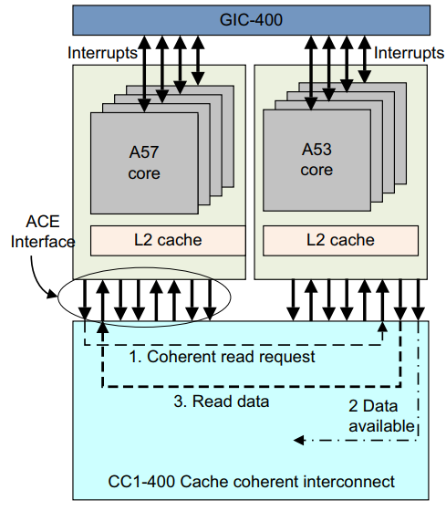

## 14. 多核处理器

ARMv8-A 架构为包含多个处理元素的系统提供了重要级别的支持。 ARM 多核处理器（例如 Cortex-A57MPCore 和 Cortex-A53MPCore 处理器）可以包含一到四个内核。使用 Cortex-A57 或 Cortex-A53 处理器的系统几乎总是以这种方式实现。多核处理器可能包含多个能够独立执行指令的内核，这些内核可以被视为单个单元或集群。 ARM 多核技术使集群中的四个组件内核中的任何一个都可以在不使用时关闭以节省电力，例如当设备负载较轻或处于待机模式时。当需要更高的性能时，每个处理器都在使用以满足需求，同时仍分担工作负载以保持尽可能低的功耗。

多处理可以定义为在包含两个或多个内核的单个设备中同时运行两个或多个指令序列。现在，在用于通用应用处理器的系统和更传统地定义为嵌入式系统的领域中，它都是一种广泛采用的技术。

多核系统的整体能耗可以显着低于基于单处理器内核的系统。多个内核可以使执行更快地完成，因此系统的某些元素可能会在更长的时间内完全断电。或者，具有多个内核的系统可能能够以低于单个处理器所需的频率运行以实现相同的吞吐量。较低功率的硅工艺或较低的电源电压可以降低功耗并减少能源使用。大多数当前系统不允许独立更改内核频率。但是，每个内核都可以进行动态时钟门控，从而节省更多功率和能源。

拥有多个可供我们使用的内核还可以为系统配置提供更多选择。例如，您的系统可能使用单独的内核，一个用于处理硬实时要求，另一个用于需要高性能、不间断性能的应用程序。这些可以合并到一个单一的多处理器系统中。

多核设备也可能比单核设备响应更快。当中断分布在内核之间时，有多个内核可用于响应中断，并且每个内核要服务的中断更少。多核还使重要的后台进程能够与重要但不相关的前台进程同时进行

### 14.1 多处理器系统

我们可以区分包含以下内容的系统：
• 包含单个内核的单个处理器。
• 多核处理器，例如 Cortex-A53，具有多个能够独立执行指令的内核，并且可以由系统设计人员或可以抽象底层的操作系统在外部视为单个单元或集群 来自应用层的资源。
• 多个集群，其中每个集群包含多个核心。

下面对多处理系统的描述定义了本书中使用的术语。 在其他操作系统上，它们可能具有不同的含义。

#### 14.1.1 代码在哪个内核上运行

一些软件操作取决于代码在哪个内核上运行。例如，全局初始化通常由在单个内核上运行的代码执行，然后在所有内核上进行本地初始化。

多处理器关联寄存器 (MPIDR_EL1) 使软件能够确定它正在哪个内核上执行，无论是在集群内还是在具有多个集群的系统中，它都可以确定在哪个内核上以及在哪个集群中执行。

某些处理器配置中的 U 位指示这是单核还是多核集群。亲和性字段给出了核心相对于其他核心的位置的分层描述。通常，Affinity 0 是集群内的核心 ID，而 Affinity 1 是集群 ID。

> 在 EL1 上运行的软件可能在由管理程序管理的虚拟机内运行。为了配置虚拟机，EL2 或 EL3 可以在运行时将 MPIDR_EL1 设置为不同的值，以便特定虚拟机看到每个虚拟内核的一致、唯一值。虚拟内核和物理内核之间的关系由管理程序控制，并且可能随时间而变化。

> MIPDR_EL3 包含每个物理内核的不可更改 ID。没有两个内核共享相同的 MPIDR_EL3 值。

#### 14.1.2 对称多处理

对称多处理 (SMP) 是一种动态确定各个内核角色的软件架构。集群中的每个核心都具有相同的内存和共享硬件视图。任何应用程序、进程或任务都可以在任何内核上运行，并且操作系统调度程序可以在内核之间动态迁移任务以实现最佳系统负载。多线程应用程序可以同时在多个内核上运行。操作系统可以隐藏应用程序的大部分复杂性。

在本指南中，操作系统下应用程序的每个运行实例称为一个进程。应用程序通过调用系统库来执行许多操作，该系统库从库代码中提供某些功能，但也充当对内核操作的系统调用的包装器。各个进程具有关联的资源，包括堆栈、堆和常量数据区域，以及调度优先级设置等属性。进程的内核视图称为任务。进程是共享某些公共资源的任务的集合。其他操作系统可能有不同的定义。

在描述 SMP 操作时，我们使用术语内核来表示包含异常处理程序、设备驱动程序以及其他资源和进程管理代码的操作系统部分。我们还假设存在通常使用定时器中断调用的任务调度程序。调度程序负责在多个任务之间对内核上的可用周期进行时间切片，动态确定各个任务的优先级，并决定接下来运行哪个任务。

线程是在同一进程空间内执行的独立任务，使应用程序的不同部分能够在不同的内核上并行执行。它们还允许应用程序的一部分在另一部分等待资源时继续执行。

通常，进程中的所有线程共享多个全局资源（包括相同的内存映射以及对任何打开文件和资源句柄的访问）。线程也有自己的本地资源，包括它们自己的堆栈和寄存器使用情况，这些资源由内核在上下文切换时保存和恢复。但是，这些资源是本地的这一事实并不意味着可以保证任何线程的本地资源都不会受到其他线程的错误访问。线程是单独调度的，即使在单个进程中也可以具有不同的优先级。

支持 SMP 的操作系统为应用程序提供可用核心资源的抽象视图。多个应用程序可以在 SMP 系统中同时运行，无需重新编译或更改源代码。传统的多任务操作系统使系统能够在单核或多核处理器中同时执行多个任务或活动。在多核系统中，我们可以实现真正的并发，其中多个任务实际上在不同的核上同时并行运行。管理这些任务在可用内核上的分布的角色由操作系统执行。通常，操作系统任务调度程序可以在系统中的可用内核之间分配任务。此功能称为负载平衡，旨在获得更好的性能或节能，甚至两者兼而有之。例如，对于某些类型的工作负载，如果将构成工作负载的任务安排在更少的内核上，则可以实现节能。这将允许更多资源闲置更长的时间，从而节省能源。

在其他情况下，如果任务分布在更多内核上，则可以提高工作负载的性能。与在更少的内核上运行相比，这些任务可以更快地向前推进，而不会相互干扰。

在另一种情况下，与在较高频率下较少内核相比，以较低频率在更多内核上运行任务可能是值得的。这样做可以在节能和性能之间提供更好的权衡。

SMP 系统中的调度程序可以动态地重新确定任务的优先级。这种动态任务优先级允许其他任务在当前任务休眠时运行。例如，在 Linux 中，性能受处理器活动限制的任务可以降低其优先级，以支持性能受 I/O 活动限制的任务。 I/O-bound 进程中断计算-bound 进程，因此它可以启动其 I/O 操作然后返回睡眠，并且处理器可以在 I/O 操作完成时执行计算-bound 代码。

中断处理也可以跨内核进行负载平衡。这有助于提高性能或节省能源。跨内核平衡中断或为特定类型的中断保留内核可以减少中断延迟。这也可能导致缓存使用减少，从而有助于提高性能。

使用更少的内核来处理中断可能会导致更多的资源闲置更长的时间，从而以降低性能为代价来节省能源

#### 14.1.3 定时器

支持 SMP 操作的操作系统内核通常有一个任务调度程序，它负责在多个任务之间对内核上的可用周期进行时间切片。它动态确定各个任务的优先级，并决定接下来在每个内核上运行哪个任务。通常需要一个计时器，以使每个内核上的活动任务的执行能够定期中断，从而使调度程序有机会选择不同的任务进行处理。

当所有内核竞争相同的关键资源时，可能会出现问题。每个核心运行调度程序来决定它应该执行哪个任务，并且这会以固定的时间间隔发生。内核调度程序代码需要使用一些共享数据，例如任务列表，这些数据可以通过排除（由互斥锁提供）来防止并发访问。互斥体在任何时候只允许一个核心有效地运行调度程序。

系统定时器架构描述了一个通用系统计数器，每个内核最多可提供四个定时器通道。该系统计数器应处于固定时钟频率。有安全和非安全物理计时器以及两个用于虚拟化目的的计时器。每个通道都有一个比较器，它与系统范围的 64 位计数进行比较，该计数从零开始计数。您可以配置定时器，以便在计数大于或等于编程的比较器值时产生中断。

尽管系统计时器必须具有固定频率，通常以 MHz 为单位，但允许变化的更新粒度。这意味着，您可以在每 10 或 100 个周期以相应降低的速率将计时器增加一个较大的量，例如 10 或 100，而不是在每个时钟滴答上增加计数。这给出了相同的有效频率，但更新粒度降低了。这对于实现低功耗状态很有用。 CNTFRQ_EL0 寄存器报告系统定时器的频率。

一个常见的误解是 CNTFRQ_EL0 由所有内核共享。只有每个内核的寄存器，然后仅从固件的角度来看：所有其他软件应该看到该寄存器已经初始化为所有内核上的正确公共值。然而，计数器频率是全局的，并且对于所有内核都是固定的。 CNTFRQ_EL0 为引导 ROM 或固件提供了一种方便的方式来告诉其他软件全局计数器频率是多少，但不控制硬件行为的任何方面。

CNTPCT_EL0 寄存器报告当前计数值。 CNTKCTL_EL1 控制EL0 是否可以访问系统定时器。

要配置计时器，请完成以下步骤：
- (1) 将比较器值写入 64 位寄存器 CNTP_CVAL_EL0。
- (2) 在 CNTP_CTL_EL0 中启用计数器和中断生成。
- (3) 轮询 CTP_CTL_EL0 以报告 EL0 定时器中断的原始状态。

您可以将系统计时器用作倒数计时器。在这种情况下，所需的计数被写入 32 位 CNTP_TVAL_EL0 寄存器。硬件会为您计算正确的 CNTP_CVAL_EL0 值。

#### 14.1.4 同步

在 SMP 系统中，必须经常在任何特定时间将数据访问限制为一个修饰符。这对于外围设备是正确的，对于由多个线程或进程访问的全局变量和数据结构也是如此。保护此类共享资源通常是通过一种称为互斥的方法。在多核系统中，您可以使用自旋锁（实际上是具有原子不可分割机制的共享标志）来测试和设置其值。

ARM 体系结构提供了三个与独占访问相关的指令，以及这些指令的变体，它们对字节、半字、字或双字大小的数据进行操作。

这些指令依赖于内核或内存系统标记特定地址以供该内核使用独占访问监视器进行独占访问监视的能力。这些指令的使用在多核系统中很常见，但也出现在单核系统中，以实现在同一核上运行的线程之间的同步操作。

A64 指令集有实现此类同步功能的指令：
- 负载独占 (LDXR)：LDXR W|Xt, [Xn]
- Store Exclusive (STXR): STXR Ws, W|Xt, [Xn] 其中Ws表示存储是否成功完成。 0 = 成功。
- 清除独占访问监视器（CLREX） 这用于清除本地独占监视器的状态。

LDXR 执行内存加载，但也标记要监视的物理地址以供该内核独占访问。 STXR 对内存执行条件存储，仅当目标位置被标记为被该核心监控以进行独占访问时才会成功。如果存储不成功，则该指令在通用寄存器 Ws 中返回非零值，如果存储成功，则返回值 0。在汇编语法中，它总是被指定为 W 寄存器，即，不是 X 寄存器。此外，STXR 清除了独占标签。

加载独占和存储独占操作仅保证对映射有以下所有属性的普通内存起作用：
- Inner or Outer Shareable.
- Inner Write-Back.
- Outer Write-Back.
- Read and Write allocate hints.
- Not transient.

互斥锁或自旋锁可用于控制对外围设备的访问。锁定位置将在普通 RAM 中。您不使用加载或存储独占来访问外围设备本身。

每个内核只能标记一个地址。独占监视器不会阻止另一个内核或线程读取或写入被监视的位置，而只是监视该位置自 LDXR 以来是否已被写入。

尽管体系结构和硬件支持独占访问的实现，但它们依赖于程序员强制执行正确的软件行为。互斥体只是一个标志，独占访问机制使该标志能够以原子方式访问。任何访问该标志的线程或程序都可以知道它设置正确。但是，互斥锁控制的实际资源仍然可以由行为不正确的软件直接访问。同样，用于存储互斥体的内存也没有特殊属性。当独占访问序列完成时，它只是内存中的另一条数据。此外，在编写使用互斥锁进行资源保护的代码时，了解弱序内存模型至关重要。例如，如果没有正确使用屏障和其他内存排序注意事项，推测可能意味着在授予互斥锁之前已加载数据，或者在更新关键资源之前释放互斥锁。

#### 14.1.5 非对称多处理

非对称多处理 (AMP) 系统使您能够将各个角色静态分配给集群内的一个核心，这样实际上您就拥有单独的核心，每个核心在每个集群内执行单独的作业。这称为功能分发软件架构，通常意味着您在各个内核上运行单独的操作系统。该系统在您看来是一个带有用于某些关键系统服务的专用加速器的单核系统。 AMP 并不是指任务或中断与特定内核相关联的系统。

在 AMP 系统中，每个任务都可以有不同的内存视图，并且高负载的内核无法将工作传递给负载较轻的内核。在此类系统中不需要硬件缓存一致性，尽管通常存在通过共享资源在内核之间进行通信的机制，可能需要专用硬件。第 14-10 页的缓存一致性中描述的系统可以帮助减少与系统之间共享数据相关的开销。

使用多核处理器实现 AMP 系统的原因可能包括安全性、保证满足实时期限的要求，或者因为单个内核专用于执行特定任务。

有几类系统同时具有 SMP 和 AMP 功能。这意味着有两个或更多内核运行 SMP 操作系统，但系统具有不作为 SMP 系统的一部分运行的其他元素。 SMP 子系统可以看作是 AMP 系统中的一个元素。缓存一致性在 SMP 核心之间实现，但不一定在 SMP 核心和系统内的 AMP 元素之间实现。这样，可以在同一个集群内实现独立的子系统。

完全有可能（并且正常）构建单个内核运行不同操作系统（这些称为多操作系统系统）的 AMP 系统

> 在这些单独的内核之间需要同步的地方，可以通过消息传递通信协议来提供，例如多核通信协会 API (MCAPI)。 这些可以通过使用共享内存来传递数据包和使用软件触发的中断来实现所谓的门铃机制来实现。

#### 14.1.6 异构多处理

术语异构多处理 (HMP) 在许多不同的环境中都有应用。 它通常与 AMP 混为一谈，用来描述由不同类型的处理器组成的系统，例如多核 ARM 应用处理器和专用处理器（例如基带控制器芯片或音频编解码器芯片）。

ARM 使用 HMP 来表示由应用处理器集群组成的系统，这些应用处理器在指令集架构上 100% 相同，但在微架构上却大不相同。 所有处理器都是完全缓存一致的，并且是同一一致域的一部分。

最好使用称为 big.LITTLE 的 HMP 技术的 ARM 实现来解释这一点。 在 big.LITTLE 系统中，节能的 LITTLE 内核与高性能的大内核相干耦合，形成一个系统，可以以最节能的方式完成高强度和低强度任务。

big.LITTLE 的核心原则是应用软件无需修改即可在任何一种处理器上运行

#### 14.1.7 独占监视器

典型的多核系统可能包括多个独占监视器。每个核心都有自己的本地监视器，并且有一个或多个全局监视器。与用于独占加载或存储指令的位置相关的转换表条目的可共享和可缓存属性确定使用哪个独占监视器。

在硬件中，核心包括一个名为本地监视器的设备。该监视器观察核心。当核心执行独占加载访问时，它会在本地监视器中记录该事实。当它执行独占存储时，它会检查是否执行了先前的独占加载，如果不是，则使独占存储失败。该体系结构使各个实现能够确定监视器执行的检查级别。内核一次只能标记一个物理地址。

每次异常返回时，即执行 ERET 指令时，本地独占监视器都会被清除。在 Linux 内核中，多个任务在 EL1 的内核上下文中运行，并且可以在没有异常返回的情况下进行上下文切换。只有当我们在其关联的内核任务的上下文中返回用户空间线程时，我们才会执行异常返回。这与 ARMv7 架构不同，其中内核任务调度程序必须明确清除每个任务切换上的独占访问监视器。本地独占监视器的重置是否也会重置全局独占监视器，这是由实现定义的。

当用于独占访问的位置标记为不可共享时使用本地监视器，即仅在同一内核上运行的线程。本地监视器还可以处理将访问标记为内部可共享的情况，例如，互斥锁保护在可共享域内的任何核心上运行的 SMP 线程之间共享的资源。对于在不同的、非一致的内核上运行的线程，互斥锁位置被标记为正常、不可缓存，并且需要系统中的全局访问监视器。

系统可能不包括全局监视器，或者全局监视器可能仅适用于某些地址区域。如果对系统中不存在合适的监视器的位置执行独占访问，会发生什么情况，这是由实现定义的。以下是一些允许的选项：
- 该指令生成外部中止。
- 该指令产生一个 MMU 故障。
- 该指令被视为 NOP。
- 独占指令被视为标准 LDR/STR 指令，存储独占指令的结果寄存器中保存的值变为 UNKNOWN。

Exclusives Reservation Granule (ERG) 是独占监视器的粒度。它的大小是实现定义的，但通常是一个高速缓存行。它为监视器提供了地址之间的最小间距以区分它们。在单个 ERG 中放置两个互斥锁可能会导致误报，其中对任一互斥锁执行 STXR 指令会清除两者的独占标签。这不会阻止架构正确的软件正常运行，但它可能效率较低。可以从缓存类型寄存器 CTR_EL0 中读取特定内核上独占监视器的 ERG 大小。

### 14.2 缓存一致性

前面章节的缓存仅考虑单个处理器中缓存的影响。 Cortex-A53 和 Cortex-A57 处理器支持集群中不同内核之间的一致性管理。 这需要用正确的可共享属性标记地址区域。 这些处理器允许构建包含多核集群的系统，其中可以保持集群之间共享数据的一致性。 这种系统级一致性需要高速缓存一致性互连，例如实现 AMBA 4 ACE 总线规范的 ARM CCI-400。 请参下图.

系统中的一致性支持取决于硬件设计决策，并且存在许多可能的配置。例如，一致性只能在单个集群内得到支持。双集群 big.LITTLE 系统是可能的，其中内部域包括两个集群的核心，或者内部域包括集群而外部域包括其他集群的多集群系统。有关 big.LITTLE 系统的更多信息，请参阅第 16 章 big.LITTLE 技术。

除了维护缓存之间数据一致性的硬件之外，您还必须能够将运行在一个内核上的代码执行的缓存维护活动广播到系统的其他部分。有硬件配置信号，在复位时采样，控制是否广播内部或外部缓存维护操作，以及是否广播系统屏障指令。 AMBA 4 ACE 协议允许向其他主设备发送障碍信号，从而维持维护和一致性操作的顺序。互连逻辑可能需要通过引导代码进行初始化。

软件必须通过创建适当的转换表条目来定义哪个地址区域将由哪个主控组使用，即哪些其他主控共享该地址。对于普通可缓存区域，这意味着将可共享属性设置为不可共享、内部可共享或外部可共享之一。对于不可缓存的区域，shareable 属性被忽略。

在多核系统中，不可能知道特定核是否有一条线覆盖其缓存之一中的特定地址（尤其是在互连具有缓存的情况下，例如 CCN-50x）。

维护可能需要广播到互连。这意味着一个内核上的软件可以向当前可能存储在保存该地址的不同内核的数据缓存中的地址发出缓存清理或无效操作。当如下图 所示广播维护操作时，该操作由特定共享域中的所有核执行。

SMP 操作系统通常依赖于能够广播缓存和 TLB 维护操作。考虑外部 DMA 引擎能够修改外部存储器内容的情况。

运行在特定内核上的 SMP 操作系统不知道哪个内核拥有哪些数据。它只需要在集群中的任何位置使地址范围无效。如果操作未广播，则操作系统必须在每个内核上本地发出清理或无效操作。 DSB 屏障指令使核心等待它发出的广播操作完成。屏障不会强制广播接收到的操作完成。有关屏障指令的更多信息，请参阅第 13 章内存排序。

下表缓存维护操作以及是否广播：

> - a  如果设置了 HCR/HCR_EL2 FB 位，则在非安全 EL1 中广播，覆盖正常行为。 当从 Non-secure 执行时，该位会导致以下指令在内部共享域内广播
> EL1: TLBI VMALLE1, TLBI VAE1, TLBI ASIDE1, TLBI VAAE1, TLBI VALE1, TLBI VAALE1, IC IALLU
> - b  广播由内存区域的shareability属性决定

对于IC指令，即指令缓存维护操作，IS表示该功能适用于Inner Shareable域内的所有指令缓存。

### 14.3 集群内的多核缓存一致性

一致性意味着确保系统内的所有处理器或总线主控器具有相同的共享内存视图。这意味着对保存在一个内核缓存中的数据的更改对其他内核可见，从而使内核无法看到过时或旧的数据副本。这可以通过简单地不缓存来处理，即禁用共享内存位置的缓存，但这通常具有很高的性能成本。

**软件管理的一致性**

软件管理的一致性是处理数据共享的一种更常见的方式。数据被缓存，但软件（通常是设备驱动程序）必须清除脏数据或使缓存中的旧数据无效。这需要时间，增加软件复杂性，并且在共享率很高时会降低性能

**硬件管理的一致性**

硬件保持集群内 1 级数据缓存之间的一致性。内核在上电时自动参与一致性方案，启用其 D-cache 和 MMU，并且地址被标记为一致性。然而，这种高速缓存一致性逻辑并不保持数据和指令高速缓存之间的一致性。

在 ARMv8-A 架构和相关实现中，可能存在硬件管理的一致性方案。这些确保在硬件一致系统中标记为可共享的任何数据都具有该可共享域中的所有内核和总线主控器看到的相同值。这为互连和集群增加了一些硬件复杂性，但极大地简化了软件并启用了仅使用软件一致性无法实现的应用程序。

缓存一致性方案可以通过多种标准方式运行。 ARMv8 处理器使用 MOESI 协议。 ARMv8 处理器也可以连接到 AMBA 5 CHI 互连，其缓存一致性协议类似于（但不完全相同）MOESI。

根据使用的协议，SCU 用以下属性之一标记缓存中的每一行：M（修改）、O（拥有）、E（独占）、S（共享）或 I（无效）。 这些描述如下：

**Modified**
缓存行的最新版本在此缓存中。 其他缓存中不存在内存位置的其他副本。 高速缓存行的内容不再与主存一致。

**Owned **
这描述了一条脏的并且可能在多个缓存中的行。 拥有状态的高速缓存行保存最新的正确数据副本。 只有一个核心可以保存拥有状态的数据。 其他核心可以将数据保持在共享状态。

**Exclusive**
高速缓存行存在于该高速缓存中并且与主存储器一致。 其他缓存中不存在内存位置的其他副本。

**Shared**
高速缓存行存在于此高速缓存中，并且不一定与内存保持一致，因为 Owned 的定义允许将脏行复制到共享行中。 但是，它将具有最新版本的数据。 它的副本也可以存在于一致性方案中的其他缓存中。

**Invalid**
缓存行无效。

以下规则适用于协议的标准实现：
- 只有在高速缓存行处于修改或独占状态时才能执行写入。如果处于 Shared 状态，则必须首先使所有其他缓存的副本失效。写入将行移动到修改状态。
- 缓存可以随时丢弃共享行，将其更改为无效状态。修改后的行首先被写回。
- 如果一个高速缓存保持一行处于修改状态，则从系统中的其他高速缓存读取从高速缓存接收更新的数据。传统上，这是通过首先将数据写入主存储器，然后在执行读取之前将高速缓存行更改为共享状态来实现的。
- 当另一个缓存读取该行时，具有处于独占状态的行的缓存必须将该行移动到共享状态。
- 共享状态可能不准确。如果一个缓存丢弃了共享行，另一个缓存可能不知道它现在可以将该行移动到独占状态。

处理器集群包含一个窥探控制单元 (SCU)，其中包含存储在各个 L1 数据缓存中的标签的重复副本。因此缓存一致性逻辑：
- 保持 L1 数据缓存之间的一致性。
- 仲裁对 L2 接口的访问，包括指令和数据。
- 具有重复的标记 RAM 以跟踪每个内核数据中分配的数据。

图 中的每个内核都有自己的数据和指令缓存。 缓存一致性逻辑包含来自 D 缓存的标签的本地副本。 但是，指令缓存不参与一致性。 数据缓存和一致性逻辑之间有 2 路通信。 ARM 多核处理器还实现了优化，可以直接在参与的 L1 缓存之间复制干净数据和移动脏数据，而无需访问和等待外部存储器。 此活动由 SCU 在多核系统中处理。

#### 14.3.1 探听控制单元(Snoop Control Unit)

Snoop Control Unit (SCU) 维护每个内核的 L1 数据缓存之间的一致性，并负责管理以下互连操作：
- Arbitration.
- Communication.
- Cache-2-cache and system memory transfers.

该处理器还将这些功能提供给其他系统加速器和非缓存 DMA 驱动的外设，以提高性能并降低系统范围的功耗。这种系统一致性还降低了在每个操作系统驱动程序内维护软件一致性时所涉及的软件复杂性。

每个核心都可以单独配置为参与或不参与数据缓存一致性管理方案。处理器内部的 SCU 设备自动维护集群内内核之间的 1 级数据缓存一致性。有关详细信息，请参阅第 14-10 页的缓存一致性和第 14-13 页的集群内的多核缓存一致性。

由于可执行代码的更改频率要低得多，因此此功能不会扩展到 L1 指令缓存。一致性管理是使用基于 MOESI 的协议实现的，经过优化以减少外部存储器访问的数量。为了使一致性管理对内存访问有效，以下所有条件都必须为真：
- SCU 通过位于私有内存区域的控制寄存器启用。 SCU 具有可配置的访问控制，限制哪些处理器可以对其进行配置。
- MMU 已启用。
- 被访问的页面被标记为 Normal Shareable，缓存策略为 write-back, write-allocate。然而，设备和强排序内存不可缓存，从内核的角度来看，直写缓存的行为类似于未缓存的内存。

SCU 只能在单个集群内保持一致性。 如果系统中有额外的处理器或其他总线主控器，当它们与 MP 块共享内存时，需要明确的软件同步

#### 14.3.2 加速器一致性端口(ACP：Accelerator coherency port  )

SCU 上的此 AMBA 4 AXI 兼容从接口为直接与 ARMv8 处理器接口的主接口提供互连点：
- 该接口支持所有标准读写事务，无需额外的一致性要求。 但是，任何对内存连贯区域的读取事务都会与 SCU 交互，以测试信息是否已存储在 L1 缓存中。
- SCU 在将写入转发到内存系统之前强制执行写入一致性，并可能分配到 L2 缓存中，从而消除直接写入片外内存的功率和性能影响。

#### 14.3.3 集群之间的缓存一致性

集群内的多核缓存一致性显示了硬件如何保持在同一集群中的多个处理器缓存之间共享的数据之间的一致性。 系统还可以包含硬件，通过处理可共享的数据事务和广播屏障和维护操作来保持集群之间的一致性。 可以动态地从一致性管理中添加或删除集群，例如，当整个集群（包括 L2 缓存）断电时。 操作系统可以通过内置的性能监控单元 (PMU) 监控一致互连上的活动

#### 14.3.4 Domains

在 ARMv8-A 体系结构中，术语域用于指代一组主总线主控器。 域确定哪些主服务器被窥探，以进行连贯事务。 窥探是检查主缓存以查看请求的位置是否存储在那里。 有四种定义的域类型：
- Non-shareable.
- Inner Shareable.
- Outer Shareable.
- System.

典型的系统使用是运行在同一个操作系统下的主服务器在同一个 Inner Shareable 域中。 共享可缓存数据但耦合度不高的主节点位于同一个外部可共享域中。 同一个内域的master也必须在同一个外域。 通过页表中的条目控制内存访问的域选择

### 14.4 总线协议和缓存一致性互连

将硬件一致性扩展到多集群系统需要一致的总线协议。 AMBA 4 ACE 规范包括 AXI 一致性扩展 (ACE)。完整的 ACE 接口可实现集群之间的硬件一致性，并使 SMP 操作系统能够在多个内核上运行。

如果您有多个集群，则一个集群中对内存的任何共享访问都可以窥探其他集群的缓存，以查看数据是否存在，或者是否必须从外部内存加载。 AMBA 4 ACE-Lite 接口是完整接口的子集，专为 DMA 引擎、网络接口和 GPU 等单向 IO 相干系统主机而设计。

这些设备可能没有自己的缓存，但可以从 ACE 处理器读取共享数据。非核心主机的缓存通常不会与核心缓存保持一致。例如，在许多系统中，核心无法窥探从端口上 GPU 的缓存内部。但反过来并不总是正确的。

ACE-Lite 允许其他主节点窥探其他集群的缓存。这意味着对于可共享的位置，必要时从一致的缓存中完成读取，并且可共享的写入与从一致的缓存行中强制清除和无效合并。 ACE 规范允许将 TLB 和 I-Cache 维护操作广播到所有能够接收它们的设备。数据屏障被发送到从接口以确保它们以编程方式完成。

CoreLink CCI-400 Cache Coherent Interface 是 AMBA 4 ACE 的首批实现之一，支持多达两个 ACE 集群，使多达 8 个内核能够看到相同的内存视图并运行 SMP 操作系统，例如 big.小组合，例如 Cortex-A57 处理器和 Cortex-A53 处理器，如图所示。

它还具有三个 ACE-lite 相干接口，可供例如 DMA 控制器或 GPU 使用。

下图显示了从 Cortex-A53 集群读取到 Cortex-A57 集群的一致数据：
- (1)。 Cortex-A53 集群发出一个一致的读取请求。
- (2)。 CCI-400 将请求传递给 Cortex-A53 处理器以窥探 Cortex-A57 集群缓存。
- (3)。 收到请求后，Cortex-A57 集群会检查其数据缓存的可用性并以所需信息进行响应。
- (4)。 如果请求的数据在缓存中，CCI-400 将数据从 Cortex-A57 集群移动到 Cortex-A53 集群，从而导致 Cortex-A53 集群中的缓存行填充。

CCI-400 和 ACE 协议可实现 Cortex-A57 和 Cortex-A53 集群之间的完全一致性，从而无需外部存储器事务即可实现数据共享。

ARM CoreLink 互连和内存控制器系统 IP 解决了在 Cortex-A 系列处理器、高性能媒体处理器和动态内存之间高效移动和存储数据的关键挑战，以优化系统级芯片的系统性能和功耗（ SoC）。 CoreLink 系统 IP 使 SoC 设计人员能够最大限度地利用系统内存带宽并减少静态和动态延迟。

#### 14.4.1 计算子系统和移动应用程序

下图显示了具有 Cortex-A57 和 Cortex-A53 系列处理器、CoreLink MMU-500 系统 MMU 和一系列 CoreLink 400 系统 IP 的移动应用处理器示例。

cortex-A53 处理器提供 big.LITTLE 集群组合，并通过 AMBA 4 ACE 连接到 CCI-400，以提供完整的硬件一致性。 ARM Mali®-T628 GPU 和 IO 一致性主控通过 AMBA 4 ACE-Lite 接口连接到 CCI-400。

ARM 提供了不同的互连选项来维护跨集群的一致性：

- **CoreLink CCI-400 Cache Coherent Interconnect**
这支持两个多核集群并使用 AMBA 4 和 AMBA Coherency Extensions 或 ACE。 ACE 使用 MOESI 状态机实现跨集群一致性。

- **CoreLink CCN-504 Cache Coherent Network**
这支持多达四个多核集群，并包括集成的 L3 缓存和两个通道 72 位 DDR。
ARM CoreLink CCN-504 Cache Coherent Network 提供最佳的系统带宽和延迟。 CCN 系列互连设计用于使用 AMBA 5 CHI 连接的内核，尽管有一些 AMBA 4 ACE 支持。特别是 CCN-504 提供了符合 AMBA 4 AXI 一致性扩展 (ACE) 的端口，以实现多个 Cortex-A 系列处理器之间的完全一致性，更好地利用缓存并简化软件开发。此功能对于高带宽应用至关重要，包括需要一致的单核和多核处理器集群的游戏服务器和网络。结合 ARM CoreLink 网络互连和内存控制器 IP，CCN 提高了系统性能和电源效率。

- **CoreLink CCN-508 Cache Coherent Network**
这支持多达 8 个多核集群、32 个内核，并包括集成的 L3 缓存和四通道 72 位 DDR

- **CoreLink MMU-500 System MMU**
这为系统组件提供地址转换，请参阅第 12 章内存管理单元。

- **CoreLink TZC-400 TrustZone Address Space Controller**
这将对内存或外围设备的事务执行安全检查，并允许将内存区域标记为安全。

- **CoreLink DMC-400 Dynamic Memory Controller**
这提供了动态内存调度和与外部 DDR2/3 或 LPDDR2 内存的接口。

-----------------

