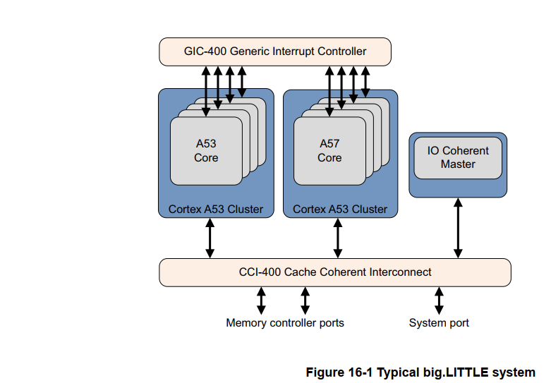
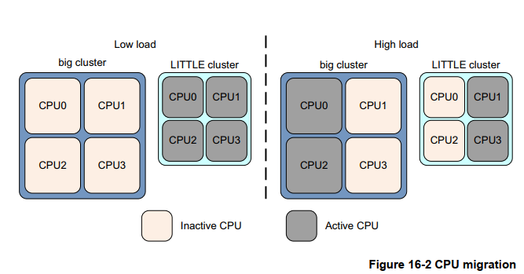
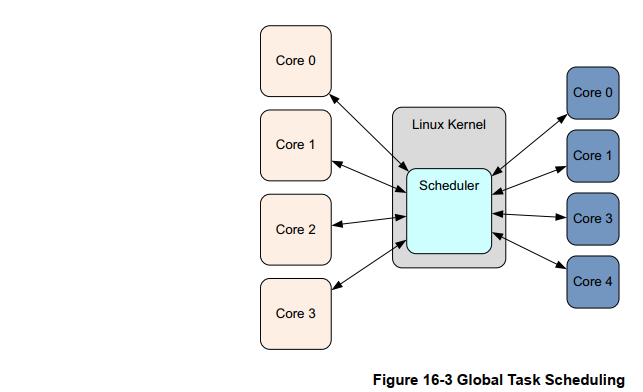
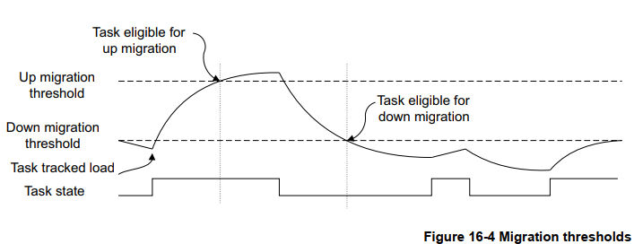
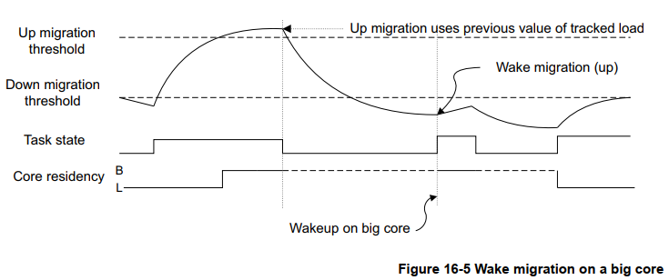
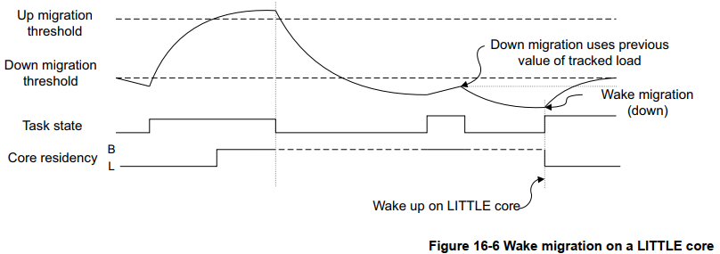
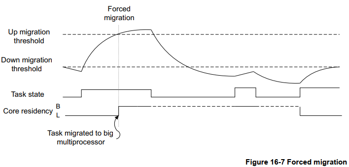

## 16. big.LITTLE 技术

现代软件堆栈对移动系统提出了相互矛盾的要求。一方面是对游戏等任务的高性能需求，另一方面是对音频播放等低强度应用的节俭能源储备的持续要求。  

传统上，不可能有一个单一的处理器设计能够同时具备高峰值性能和高能效。这意味着大量能量被浪费了，因为高
性能内核将用于低强度任务，从而导致电池寿命缩短。性能本身会受到内核可以持续运行的热限制的影响。

ARM 的 big.LITTLE 技术通过将高能效的LITTLE内核与高性能的big内核结合在一起解决了这个问题。big.LITTLE 是异构处理系统的一个示例。此类系统通常包括具有不同微架构的几种不同处理器类型，例如通用处理器和专用ASIC。

big.LITTLE 将异构性更进一步，因为它包括通用处理器，这些处理器的微架构不同，但指令集架构兼容。经常与此类系统一起使用的术语是异构多处理 （HMP）（14-8页异构多核处理）。HMP 与非对称多处理(AMP) （第14-7页的非对称处理） 的不同之处在于，HMP 系统中的所有处理器都是完全一致的，并且运行相同的操作系统映像。 

根据性能要求，软件可以在大型或小型处理器（或两者）上运行。当需要最高性能时，可以将软件移至仅在
大型处理器上运行。对于普通任务，软件可以在 LITTLE 处理器上完美运行。通过这种组合，big.LITTLE 提供了一种解决方案，能够在系统的热范围内提供最新移动设备所需的峰值性能，并具有最大的能源效率。

### 16.1 big.LITTLE的系统结构

big.LITTLE 系统中的两种类型的内核都是完全缓存一致的，并且共享相同的指令集架构 (ISA)。相同的应用程序二进制文件在任何一个上都未经修改即可运行。 处理器内部微架构的差异使它们能够提供不同的功率和性能特征，这些特征是 big.LITTLE 概念的基础。这些通常由操作系统管理。

big.LITTLE 软件模型需要在 big 和 LITTLE 集群之间透明且高效地传输数据。硬件一致性实现了这一点，对软件透明。集群之间的一致性由缓存一致性互连提供，例如第 14 章中描述的 ARM CoreLink CCI‑400。如果没有硬件一
致性，大核和小核之间的数据传输将始终通过主内存进行，但这会很慢而且不会省电。此外，它还需要复杂的缓存管理软件，以实现大集群和小集群之间的数据一致性。 

此外，这样的系统还需要一个共享的中断控制器，例如 GIC‑400，使中断能够在集群中的任何内核之间迁移。所
有内核都可以使用分布式中断控制器（例如 CoreLink GIC‑400）相互发送信号。任务切换通常完全在 OS 调度程
序中处理，对应用软件不可见。下图显示了一个示例系统。  

#### 16.1.1 big.LITTLE配置

许多种big.LITTLE配置都是可能的，上使用Cortex‑A57内核作为大集群，使用Cortex‑A53内核作为小集群，但也可以使用其他配置。

小集群能够处理大多数低强度任务，例如音频播放、网页滚动、操作系统事件和其他始终在线、始终连接的任务。因此，小集群很可能是软件堆栈所在的位置，例如运行游戏或视频处理等密集型任务。  

大集群可用于繁重的工作负载，例如某些高性能游戏图形。网页渲染是另一个常见的例子。这两种集群类型的结合提供了节省能源和满足移动设备中应用程序堆栈日益增长的性能需求的机会。  

### 16.2 big.LTTLE中的软件执行模型

big.LITTLE有两种主要的执行模型

**迁移** 

迁移模型是对DVFS等电源性能管理技术的自然扩展（参考15-6章节动态电压和频率调整）

迁移模型有两种类型：

- 集群迁移
- CPU迁移

迁移操作类似于DVFS操作点转换。响应负载变化，遍历内核的DVFS曲线上的工作点。当当前内核（或集群）达到最高运行点时，如果软件堆栈需要更高的性能，则执行内核（或集群）迁移操作。然后在另一个内核（或集群）上继续执行，遍历该内核（或集群）上的操作点。当不需要性能时，执行可以切换回来。

**全局任务调度**

在全局任务调度（请参阅第 16‑5 章节的全局任务调度）中，操作系统任务调度程序了解大核和小核之间计算能力的差异。调度程序跟踪每个单独的软件线程的性能要求，并使用该信息来决定为每个软件线程使用哪种类型的内核。可以关闭未使用的内核。与迁移模型相比，这种方法具有许多优点。  

#### 16.2.1 集群迁移

如果只有一个集群，无论是大集群还是小集群，在任何时候都处于活动状态，除非在集群上下文切换到另一个集群期间非常短暂。为了获得最佳的功率和性能效率，软件堆栈主要在节能的 LITTLE 集群上运行，而在大集群上只运行很短的时间。此模型要求两个集群中的内核数量相同。  

该模型不能很好地处理不平衡的软件工作负载，即在集群内的内核上放置显着不同负载的工作负载。在这种情况下，集群迁移会导致完全切换到大集群，即使并非所有内核都需要该级别的性能。出于这个原因，集群迁移不如其
他方法受欢迎。  

#### 16.2.2 CPU迁移

在这个模型中，每个大内核都与一个小内核配对。在任何时候，每对中只有一个内核处于活动状态，不活动的内核被断电。该对中的有源磁芯是根据当前负载条件选择的。使用第 16‑5 页图 16‑2 中的示例，操作系统可以看到四个逻辑内核。每个逻辑内核在物理上可以是大内核或小内核。这种选择是由动态电压和频率调整(DVFS) 驱动的。此模型要求两个集群中的内核数量相同。 

系统主动监控每个内核上的负载。高负载使得执行上下文被移动到大内核，反之，当负载低时，执行被移动到小内核。在任何时候，配对中只有一个内核可以处于活动状态。当负载从出站内核（负载离开的内核）移动到入站内核（它到达的内核）时，前者被关闭。该模型允许在任何时候混合使用大核和小核。  

#### 16.2.3 全局任务调度

通过 big.LITTLE 技术的发展，ARM 已经将软件模型从各种迁移模型发展到全局任务调度(GTS)，它构成了big.LITTLE 技术所有未来发展的基础。 GTS 的 ARM 实现称为 big.LITTLE 多核处理系统(MP)。

  

在这个模型中，操作系统任务调度程序知道大核和小核之间计算能力的差异。使用统计数据，调度程序跟踪每个单独软件线程的性能要求，并使用该信息来决定每个使用哪种类型的内核。该模型可以在任何集群中具有任意数量内核的 big.LITTLE 系统上运行。这显示在第 16‑5 页的图 16‑3 中。与迁移模型相比，这种方法具有许多优点，例如：    

- 系统可以有不同数量的大核和小核。  
- 与迁移模型不同，任意数量的内核可以在任何时候处于活动状态。如果需要峰值性能，这可以增加可用的最大计算容量。  
- 可以隔离大集群，专供密集线程使用，而轻线程运行在LITTLE集群上。这使得繁重的计算任务能够更快地完成，因为没有额外的后台线程。  
- 可以将中断单独定位到大内核或小内核。  

###  16.3 big.LITTLE多核处理

对于 Linux 内核上的 big.LITTLE MP，基本要求是调度程序决定软件线程何时可以在 LITTLE 内核或大内核上
运行。调度程序通过将跟踪的软件线程负载与可调负载阈值、向上迁移阈值和向下迁移阈值进行比较来实现这一
点，如图 16‑4所示。  

当当前分配给小内核的线程的跟踪负载平均值超过向上迁移阈值时，该线程被认为符合迁移到大内核的条件。相反，当当前分配给大内核的线程的平均负载低于向下迁移阈值时，它被认为有资格迁移到小内核。在 big.LITTLE MP 中，这些基本规则管理大核和小核之间的任务迁移。在集群内，标准Linux调度程序负载平衡适用。这试图在一个集群中的所有内核之间保持负载平衡。  

通过基于内核的当前频率调整跟踪的负载指标来完善模型。当内核以半速运行时正在运行的任务，以比内核全速运行时的一半速率累积跟踪负载。这使 big.LITTLE MP 和 DVFS 管理能够和谐地协同工作。  

big.LITTLE MP 使用多种机制来确定何时在大核和小核之间迁移任务：  

#### 16.3.1 分叉迁移

这在使用fork系统调用创建新的软件线程时运行。此时，显然没有可用的历史负载信息。系统默认为新线程使用大内核，假设轻线程由于唤醒迁移而快速迁移到小内核。  

分叉迁移使要求苛刻的任务受益，而且成本不高。低强度和持久性的线程，如 Android 系统服务，仅在创建时移动到大内核，之后迅速移动到更合适的小内核。整个过程中明显要求高的线程不会因为首先在 LITTLE 内核上启动而受到惩罚 。线程偶尔运行但往往需要性能的线程受益于在大型集群上启动并根据需要继续在那里运行。

#### 16.3.2 唤醒迁移

当之前空闲的任务准备好运行时，调度程序必须决定哪个集群执行该任务。要在 big 和 LITTLE 之间进行选择，big.LITTLE MP 使用任务的跟踪负载历史记录。通常，假设任务在相同的集群上恢复前。不会为处于休眠状态的任务更新负载指标。因此，当调度程序在唤醒时检查任务的负载指标时，在选择执行它的集群之前，该指标具有任务上次运行时的值。此属性意味着足够繁忙的任务总是倾向于在大内核上唤醒。例如，音频播放任务会周期性地忙碌。但这通常是一项要求不高的任务，因此整体负载可能会舒适地放在一个小内核上。任务必须实际修改其行为以更改集群。  

如果任务修改了其行为，并且负载指标已超过向上或向下迁移阈值，则可以将任务分配给不同的集群。图 16‑5和图 16‑6说明了这个过程。定义的规则确保大核通常只运行一个密集线程并运行到完成，因此向上迁移只发生在空闲的大核上。向下迁移时，此规则不适用，可以将多个软件线程分配给一个小内核。  

#### 16.3.3 强制迁移

强制迁移处理长时间运行的软件线程不休眠或不经常休眠的问题。调度程序定期检查每个 LITTLE内核上运行的当前线程。如果跟踪的负载超过向上迁移阈值，则任务将转移到大内核，如第 16‑9 页的图 16‑7 中所示。  

#### 16.3.4 空闲拉取迁移

空闲拉取迁移旨在充分利用活跃的大内核。当大内核没有任务要运行时，会检查所有小内核，以查看小内核上当前正在运行的任务是否具有高于向上迁移阈值的负载指标。然后可以立即将这样的任务迁移到空闲的大内核。如果没有找到合适的任务，则可以将大内核断电。这种技术可确保大内核在运行时始终执行系统中最密集的任务并运行它们以完成。  

#### 16.3.5 卸载迁移

卸载迁移需要禁用正常的调度程序负载平衡。这样做的缺点是长时间运行的线程可以集中在大内核上，而让小内核闲置且未得到充分利用。在这种情况下，通过利用所有内核可以明显提高整体系统性能。  

卸载迁移用于定期将线程向下迁移到 LITTLE 内核，以利用未使用的计算容量。以这种方式向下迁移的线程如果在下一次调度机会超过阈值，则仍然是向上迁移的候选者。