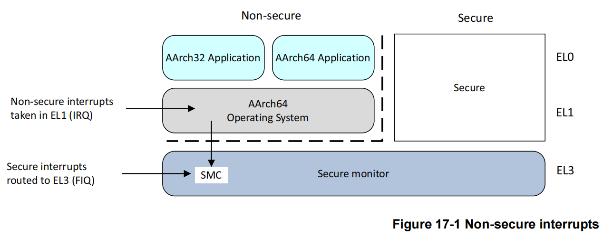
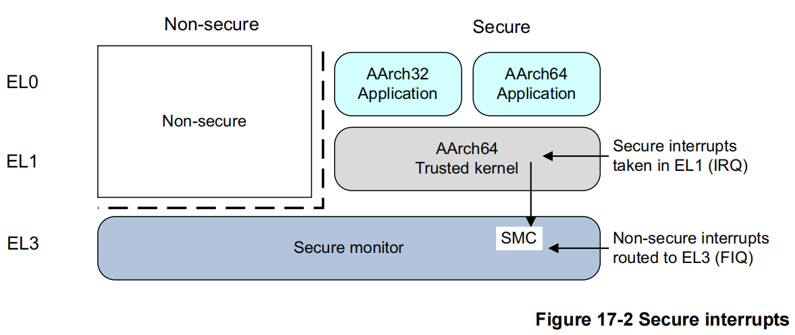
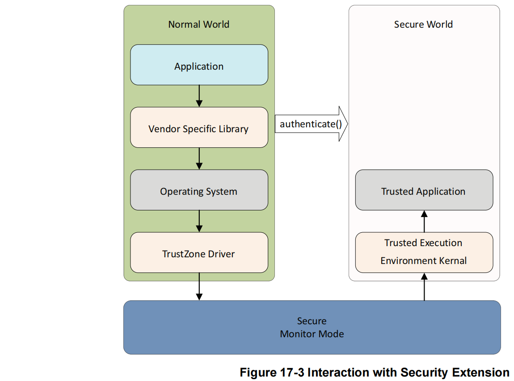
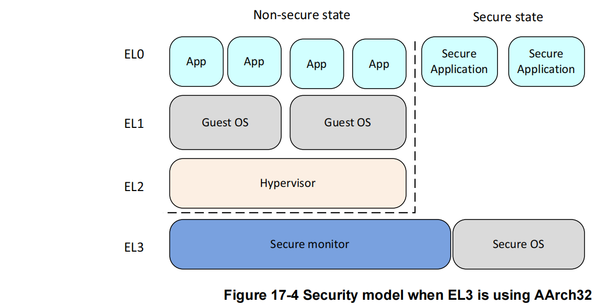
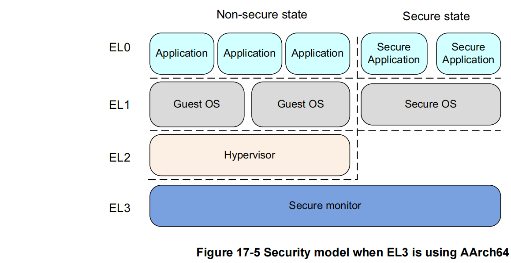

## 17. 安全

提供一定级别安全性的系统，即受信任的系统，是一种保护资产（例如密码和加密密钥或信用卡详细信息）免受 一系列似是而非的攻击的系统，以防止它们被复制、损坏或制造不可用。

安全性通常由机密性、完整性和可用性原则定义。机密性是密码和加密密钥等资产的关键安全问题。防止修改和真实性证明对于用于安全的软件和片上机密至关重要。可信系统的示例可能包括移动支付的密码输入、数字版权管理（DRM）和电子票务。在开放系统的世界中，安全性更难实现，在开放系统中，您可以将各种软件下载到一个平台上，无意中也会下载恶意或不可信的代码，这些代码可能会篡改您的系统。

移动设备可用于观看视频、听音乐、玩游戏或浏览 Web 和访问金融服务。这需要用户和银行或服务提供商都信任该设备。该设备运行具有高度连接性的复杂操作系统，并且可能容易受到恶意软件的攻击。您可以通过软件系统设计实现一定程度的安全性，但您可以通过 CPU 和系统级内存分区获得更高级别的保护。

ARM 处理器包括特定的硬件扩展，以支持构建受信任的系统。编写可信操作系统或可信执行环境(*Trusted Execution Environment*, TEE) 系统超出了本书的范围。但是，如果您设置安全部分字段以实现ARMv7 安全扩展，请注意这会对操作系统和非特权代码（即不属于受信任系统的代码）施加一些限制。

软件和硬件攻击可以分为以下几类：

**软件攻击**

​				恶意软件的攻击通常不需要对设备进行物理访问，并且可以利用操作系统或应用程序中的漏洞。

**简单的硬件攻击**

​				这些通常是被动的、主要是非破坏性的攻击，需要访问设备并接触电子设备，并使用逻辑探针和 JTAG 运				行控制单元等常用工具。

**实验室硬件攻击**

​				这种攻击需要复杂且昂贵的工具，例如聚焦离子束 (FIB) 技术或功率分析技术，并且更常用于针对智能卡 				设备。

TrustZone技术旨在防止软件和简单硬件攻击。

### 17.1 TrustZone硬件架构

TrustZone体系结构为系统设计人员提供了一种方法，可以使用TrustZone安全扩展和安全外设来帮助保护系统。即使不使用安全特性，底层程序员也必须理解TrustZone体系结构对系统施加的限制。

ARM 安全模型划分了设备硬件和软件资源，因此它们要么存在于安全子系统的安全世界中，要么存在于其他一切的正常世界中。系统硬件确保无法从普通世界访问任何安全世界资产。安全设计将所有敏感资源置于安全世界中，理想情况下具有运行稳健的软件，可以保护资产免受各种可能的软件攻击。

ARM架构参考手册（*ARM Architecture Reference Manual* ）使用术语“安全”和“不安全”来表示系统安全状态。“不安全”状态并不意味着安全漏洞，而是普通操作，因此与“普通”世界相同。正常情况下，非安全世界和安全世界之间存在一种主从关系，因此只有当普通世界执行安全监视器调用(*Secure Monitor Call，SMC*)时，安全世界才会被执行，(参考*SMC instruction in ARMv8-A Architecture Reference Manual*)。“世界”这个词不仅用来描述执行状态，还用来描述只有在该状态下才能访问的所有内存和外设。

支持TrustZone的体系结构使单个物理核心可以以时间分片的方式同时执行普通世界和安全世界的代码，尽管这取决于产生中断的外设的可用性，这些外设可以被配置为仅供安全世界访问。例如，可以使用一个安全定时器中断来为安全世界保证一些执行时间，其方式类似于抢占式多任务处理。此类外围设备可能可用也可能不可用，具体取决于平台设计人员打算支持的安全级别和用例。

或者，可以使用更接近协作多任务的执行模型。在这种情况下，虽然安全世界在每个世界可以访问的资源方面独立于普通世界，但执行时间的调度通常在两个世界之间相互依赖。

与固件或任何其他系统软件一样，安全世界中的软件必须小心谨慎，将其对系统其他部分的影响降到最低。例如，通常避免消耗大量的执行时间，除非执行普通世界请求的某些操作，并且应该尽快向普通世界发出不安全中断的信号。这有助于确保普通世界软件的良好性能和响应性，而不需要进行大量的移植。

存储系统是通过伴随外设和存储器地址的附加位来划分的。该位称为 NS 位，表示访问是安全的还是非安全的。该位被添加到所有内存系统事务中，包括缓存标签以及对系统内存和外围设备的访问。这个额外的地址位为安全世界提供了一个物理地址空间，为普通世界提供了一个完全独立的物理地址空间。在普通世界中运行的软件只能对内存进行非安全访问，因为在普通世界生成的任何内存事务中，ARM Core总是将NS位设置为1。运行在安全世界中的软件通常只进行安全内存访问，但也可以使用页表项中的NS和NSTable标记对特定的内存映射进行非安全访问。

尝试对标记为安全的缓存数据执行非安全访问会导致缓存未命中。尝试对标记为安全的外部存储器执行非安全访问会导致存储器系统拒绝该请求，并且从设备返回错误响应。没有向非安全系统指示错误是由尝试访问安全内存引起的（无法区分这个错误是访问安全内存导致的还是其他原因导致的）。

在 AArch64 中，EL3 有自己的翻译表，由寄存器 TTBR0_EL3 和 TCR_EL3 管理。在安全世界中只允许第一阶段的翻译，并且没有 TTBR1_EL3。  AArch64 EL1 转换表寄存器不在安全状态之间存储，因此在安全监视器的上下文切换时必须为每个世界保存和恢复 TTBR0_EL1、TTBR1_EL1 和 TCR_EL1的值。这使每个世界都可以拥有一组本地转换表，其中安全世界映射对普通世界隐藏并受到保护。安全世界转换表中的条目包含 NS 和 NSTable 属性位，它们决定特定访问是否可以访问安全或非安全物理地址空间。

安全项和非安全项可以在缓存和转换后备缓冲区( *Translation Lookaside Buffers，TLBs*)中共存。在两个世界之间切换时，不需要使缓存数据无效。普通世界只能生成非安全访问，所以只能命中标记为非安全的缓存行，而安全世界可以生成安全的和非安全的访问。TLB 中的条目记录了哪个世界生成了一个特定的条目，虽然非安全状态永远不能对安全进行操作，但是安全世界可以将NS行分配到缓存中。此外，对于每个异常级别，缓存是分别启用和禁用的。缓存控制是独立于两个世界的，但不是独立于所有的异常级别，因此EL0永远不能直接启用或禁用缓存，而EL2可以覆盖非安全的EL1的行为。

### 17.2 通过中断切换安全世界

当内核执行来自两个世界的代码时，它们之间的上下文切换通过执行安全监视器(*SMC*) 指令或硬件异常机制（如中断）发生。 ARM 处理器有两种中断类型，FIQ 和 IRQ。

对于安全中断有明确的支持，将异常和中断重定向到EL3，而不依赖于当前的DAIF。然而，这些控制只区分主要的中断类型:IRQ、FIQ和异步中止。更细粒度的控制要求将中断过滤到安全组和非安全组。要想有效地做到这一点，需要得到GIC的支持，GIC对此有明确的设施。

一个典型的用例是将 FIQ 用作安全中断，方法是将安全中断源映射为中断控制器中的 FIQ。相关外设和中断控制器寄存器必须标记为仅安全访问，以防止正常世界重新配置这些中断。

这些安全FIQ中断必须路由到处于安全执行状态的处理程序。

使用安全扩展的实现通常有一个轻量级的可信内核，在安全世界中托管安全服务（比如加密）。一个完整的操作系统运行在普通世界，并能够使用`SMC`指令访问安全服务。通过这种方式，普通世界可以访问服务功能，而不会有将安全资产（如关键材料或其他受保护的数据）暴露给在普通世界中执行的任意代码的风险。

### 17.3 多核系统中的安全

多核系统中的每个核都具有本章所述的相同的安全特性。集群中的任意数量的核都可以在任何时间点在安全世界中执行，并且核能够在彼此独立的世界之间转换。附加的寄存器控制普通世界代码是否可以修改窥探控制单元（*Snoop Control Unit，SCU*）的设置。类似地，必须对跨多核簇分配优先级的中断的GIC进行配置，以注意安全问题。

#### 17.3.1 普通世界与安全世界互动

如果您在包含一些安全服务的系统中编写代码，那么了解如何使用这些服务会很有用。典型系统具有轻量级内核或 TEE 托管服务，例如安全世界中的加密。这与正常世界中的完整操作系统交互，该操作系统可以使用SMC调用访问安全服务。通过这种方式，普通世界可以访问服务功能，而不会将密钥暴露在风险中。

通常，应用程序开发人员不会直接与安全扩展、TEE或可信服务交互。相反，它们使用由普通世界的库提供的高级API，例如authenticate()。该库由与可信服务相同的厂商提供。例如，为信用卡公司提供服务，并处理低级别的交互。图17-3以流的形式显示了这种交互，用户应用程序调用OS适当的API，该API然后传递给驱动程序代码，然后通过安全监视器将执行传递给TEE。

在安全世界和普通世界之间传递数据是很常见的。例如，在安全的世界中，你可能有一个签名检查器。普通世界可以使用SMC调用请求安全世界验证下载更新的签名。安全世界需要访问普通世界使用的内存，安全世界可以在它的转换表描述符中使用NS位，以确保它使用非安全访问来读取数据。这非常重要，因为数据可能已经在缓存中，由普通世界中执行的访问把地址标记为非安全的。安全属性可以看作是一个额外的地址位。如果核心使用安全内存访问来尝试读取数据，它不会命中已经在缓存中的非安全数据。

如果你是普通世界的程序员，一般来说，可以忽略安全世界中发生的事情，因为它的操作对你是隐藏的。一个副作用是，如果在安全环境中发生中断，中断延迟可能会稍微增加，但与典型操作系统的总体延迟相比，这种增加是很小的。请注意，这种类型的服务质量问题取决于安全世界操作系统的良好设计和实现。

创建安全世界操作系统和应用程序的细节超出了本书的范围.

#### 17.3.1 安全调试

安全系统还控制调试提供的可用性。可以通过完整的JTAG调试和跟踪控制为普通和安全软件世界配置单独的硬件，这样就不会泄露有关受信任系统的信息。可以通过安全外围设备控制硬件配置选项，也可以硬连线并使用以下信号控制它们：

+ 安全特权侵入式调试启用(*Secure Privileged Invasive Debug Enable, SPIDEN*)： JTAG 调试。
+ 安全特权非侵入调试启用(*Secure Privileged Non-Invasive Debug Enable, SPNIDEN*) : 跟踪和性能监视器。

### 17.4 安全状态与非安全状态的切换

使用ARMv7安全扩展，软件使用监控模式在安全和非安全状态之间切换。这种模式与其他在安全状态中的特权模式对等。

对于 ARMv8 架构，当 EL3 使用 AArch32 时，系统的行为与 ARMv7 相同，以确保完全兼容，因此安全状态下的所有特权模式都被视为处于 EL3。

AArch32 的安全模型如图 17‑4 所示。在这种情况下，AArch32 使用 EL3 来提供安全操作系统和监视器。

为了与 ARMv7 架构保持一致，安全状态 EL1 和 EL0 具有与非安全状态 EL1 和 EL0 不同的虚拟地址空间。这允许来自 ARMv7 32 位架构的安全端代码用于具有 64 位操作系统或在非安全端运行的管理程序的系统中。

图17-5显示了AArch64使用EL3的安全模型来提供一个安全监视器。对于AArch32来说，EL3状态是不可用的，但是EL1可以用于安全操作系统。当EL3使用AArch64时，EL3级别用于执行负责在非安全状态和安全状态之间切换的代码。

学完这套ARM课，看芯片手册再也不头疼！

 

课程介绍 

- [Armv8/Armv9架构从入门到精通](http://arm3.hehezhou.cn) 
- [Secureboot从入门到精通](http://secureboot.hehezhou.cn) 
- [Trustzone/TEE/安全从入门到精通-标准版](http://trustzone1.hehezhou.cn) 
- [Trustzone/TEE/安全从入门到精通-高配版](http://trustzone2.hehezhou.cn) 
- [Trustzone/TEE/安全从入门到精通-实践版](http://trustzone3.hehezhou.cn) 
- [optee系统安全从入门到精通](http://opteedake.hehezhou.cn) 
- [Android15安全架构](http://android15.hehezhou.cn) 
- [ATF架构从入门到精通](http://atfke.hehezhou.cn) 
- [CA/TA可信安全应用开发从入门到精通](http://atfke.hehezhou.cn) 
- [aarch64汇编基础入门](http://aarch64.hehezhou.cn) 
- [ARM架构扫盲-SOC架构扫盲](http://armsoc.hehezhou.cn) 
- [Android Keymaster/keymint详解](http://keymaster.hehezhou.cn) 
- [Arm精选-全店通VIP](http://quandiantong.hehezhou.cn) 
- [Arm精选-铂金VIP](http://bojin.hehezhou.cn) 