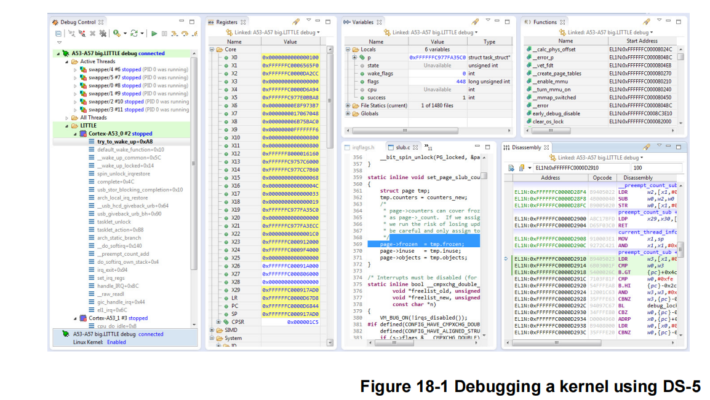
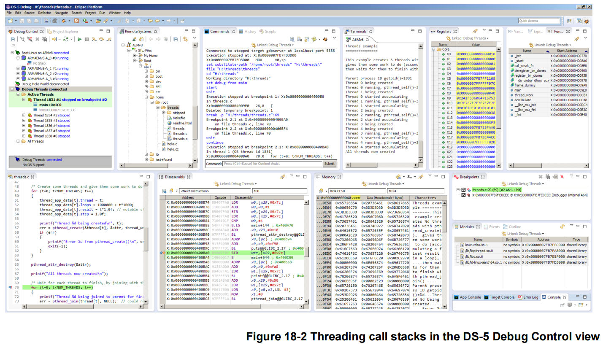
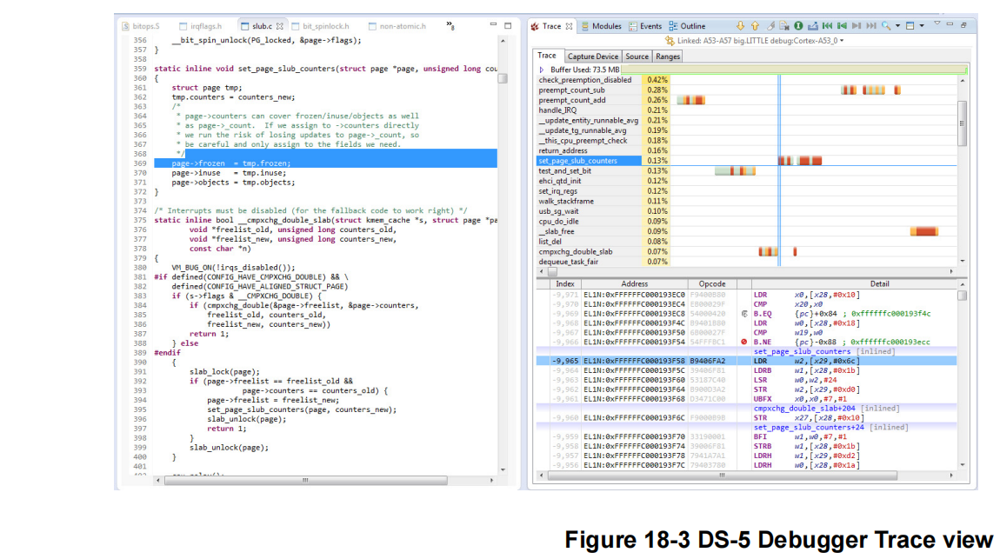

## 18. 调试

调试是软件开发的关键部分，通常被认为是过程中最耗时，因此也是最昂贵的部分。它使软件开发人员能够创建满足高性能、低功耗和可靠性三个关键标准的应用程序、中间件和平台软件。然而，bug可能难以检测、重现和修复，也很难预测解决bug所需的时间长度。当产品交付给客户时，解决问题的成本显著增加。在很多情况下，当产品的销售时间窗口较小时，如果产品推迟，就会错失市场机会。因此，系统提供的调试工具对于任何开发人员来说都是至关重要的考虑因素。

许多使用 ARM 处理器的嵌入式系统具有有限的输入/输出设施，意味着传统的桌面调试方法（例如使用printf()）可能不合适。在过去的系统中，开发人员可能会使用昂贵的硬件工具（如逻辑分析仪或示波器）来观察程序的行为。本书中描述的处理器是包含内存、缓存和许多其他模块的复杂片上系统 (SoC) 的一部分。可能没有在芯片外可见的处理器信号，因此无法通过连接逻辑分析仪（或类似设备）来监控行为。出于这个原因，ARM 系统通常包括专用硬件，以提供广泛的控制和观察设施以进行调试。

外部调试特性最初是在ARMv4架构处理器上引入的，以支持使用嵌入式和深度嵌入式处理器的开发人员，现在已经发展成为广泛的调试和跟踪特性组合。对丰富应用程序软件平台的支持，特别是对自托管调试和性能分析的支持，是最近在ARMv6和ARMv7-A架构中添加的。

ARMv8处理器提供的硬件特性使调试工具能够对核心活动提供重大级别的控制，并以非侵入性的方式收集有关程序执行的大量数据。硬件特性有两大类，侵入性(*invasive*)和非侵入性(*non-invasive*)

### 18.1 ARM 调试硬件

侵入式调试提供了使您能够停止程序并逐行逐行执行它们的工具，无论是在 C 源代码级别，还是单步执行汇编语言指令。这可以通过使用芯片 JTAG 引脚连接到内核的外部设备来实现，也可以通过调试监控代码来实现。

<font color='red' size=4>**Note**</font>

> JTAG是联合测试行动组(Joint Test Action Group)的缩写，指的是 IEEE‑1149.1 规范，最初设计用于标准化板上电子设备的测试，但现在被广泛重新用于核心调试连接。

#### 18.1.1 概述

调试器提供了控制程序执行的能力，使您能够将代码运行到某个点、暂停内核、单步执行代码并恢复执行。可以在特定指令上设置断点，使调试器在内核到达该指令时进行控制。这些工作使用两种不同方法之一。软件断点通过将指令替换为HLT或BRK指令的操作码来工作。

如果连接了外部调试器并且相关的安全权限允许进入调试状态，则HLT指令使内核进入调试状态。 AArch64 中的BRK指令会产生同步调试异常，但不会导致内核进入调试状态。有关调试状态的详细信息，请参阅第 18‑4 页的调试事件。

显然，这些只能用于存储在RAM中的代码，但它们的优点是可以大量使用。调试软件必须跟踪它放置软件断点的位置，以及最初位于这些地址的操作码是什么，这样当您想要执行断点指令时，它就可以把正确的代码放回去。

硬件断点使用内核内置的比较器，并在执行到达指定地址时停止执行。这些可以在内存中的任何地方使用，因为它们不需要更改代码，但硬件提供有限数量的硬件断点单元。

调试工具可以支持更复杂的断点，例如，在地址范围内的任何指令上停止，或者只在特定的事件序列发生或硬件处于特定状态时停止。当读取或写入特定的数据地址或地址范围时，数据观察点给予调试器提供控制。这些也可以称为数据断点。例如，Cortex-A57处理器在硬件资源中有6个硬件断点和4个观察点。请参阅调试ID寄存器(*DBGDIDR*)获取给定实现的这些值。

单步是指调试器在一段代码中移动的能力，一次一条指令。 Step‑In 和 Step‑Over 之间的区别可以参考函数调用来解释。如果 Step‑Over 执行函数调用，则整个函数将作为一个步骤执行，使能够在不想单步执行的函数之后继续。 Step‑In 意味着您只需单步执行该功能。

当遇到一个断点，或者单步执行时，您可以检查和更改ARM寄存器和内存的内容。更改内存的一种特殊情况是代码下载。调试工具通常使您能够更改代码、重新编译，然后将新映像下载到系统中。

#### 18.1.2 停止或自托管调试

侵入式调试可以分为停止调试（也称为外部调试）和监控调试（也称为自托管调试）。在任何一种情况下，内核的调试逻辑都会生成一个调试事件以响应某些情况，例如命中断点。该调试事件的处理是监控调试与停止调试的区别。

在停止调试时，调试事件会导致内核进入调试状态。在调试状态下，内核停止，这意味着它不再获取指令。相反，内核在调试器的指导下执行指令，该调试器在通过 JTAG 或另一个外部接口连接的不同主机上运行。

在监视器调试中，调试事件会引发调试异常。异常必须由运行在同一内核上的专用调试监控软件处理。监视器调试以软件支持为前提。

#### 18.1.3 调试事件

处理器的调试逻辑负责生成调试事件。调试事件是正在调试的进程的一部分，它导致系统通知调试器。调试事件包括断点单元等事件，该断点单元将指令的地址与存储在其寄存器中的地址进行匹配。它们可以是同步或异步的。断点、BRK和HLT指令以及观察点都是同步调试事件。处理器将调试事件转换为一系列操作中的一个，即：

+ 调试异常
  + 调试异常是自托管调试模型的基础
+ 进入特殊的调试状态
  + 调试状态是外部调试模型的基础
+ 忽略调试事件
+ 挂起调试事件并稍后将其转换为操作
+ 根据外部调试状态和控制寄存器(*EDSCR*)的设置，进入两种调试模式之一
  +  监控调试模式
  + 停止调试模式

调试事件转换为异常或进入调试状态取决于调试逻辑的配置和调试事件的类型。例如，一些调试事件永远不会导致进入调试状态，而其他事件永远不会导致调试异常。调试事件永远不会同时转换为调试异常和调试状态的入口。

有时，尽管配置了调试逻辑，处理器仍无法将调试事件转换为这些操作之一。这是因为这样做会破坏处理器的安全模型。如果处理器在安全状态下执行并且连接到它的外部调试器不受信任，则处理器不允许进入调试状态。

<font size=4>**软件调试事件**</font>

软件调试事件是：

+ 断点调试事件
+ 观察点调试事件
+ 软件步骤调试事件
+ 软件断点指令调试事件
+ Vector 捕获调试事件

除了下面介绍的外部调试使用断点和观察点的情况外，断点和观察点调试事件：

+ 如果启用了当前安全状态和异常级别，则为调试异常目标生成一个调试异常。
+ 只有当启用调试异常时才会生成软件步骤调试事件
+ 软件断点指令调试事件总是产生调试异常

<font size=4>**断点调试事件**</font>

地址断点通过将系统寄存器中保存的值与指令地址进行比较来生成调试事件

有些断点是上下文感知的，可以将其编程为上下文断点，与上下文ID或(在非安全状态下)虚拟机标识符( *Virtual Machine Identifier, VMID*)的值进行比较。

可以对断点进行编程，使其只在某些模式、异常级别和安全状态下匹配。地址中断点可以链接到上下文中断点。

处理器中的断点数目是由实现定义的(*IMPLEMENTATION DEFINED*)。

<font size=4>**观察点调试事件**</font>

地址观察点通过将系统寄存器中保存的值与加载和存储指令生成的数据地址进行比较来生成调试 

事件。

可以对观察点进行编程，使其只在某些模式、异常级别和安全状态下匹配。地址观察点可以链接到上下文断点。

观察点也可以通过编程来匹配访问类型;也就是说，只匹配加载，只匹配存储，或者同时匹配加载和存储。观察点与指令读取不匹配。

处理器中观察点的数量由实现定义。

<font size=4>**软件步骤调试事件**</font>

软件步骤调试事件用于单步执行一条指令，即执行一条指令，然后将控制权返回给调试器。单步执行指令：

1.  调试器软件启用软件步骤
2.  调试器软件将PC设置为要执行的指令
3.   处理器执行那条指令
4.  在下一条指令上执行软件步骤异常

然而，当指令被单步执行时，可能会产生另一个同步异常。

<font size=4>**软件断点指令调试事件**</font>

A64指令集定义了一个软件断点指令。

```
BRK #<immediate>
```

A32 和 T32 指令集定义了软件断点指令。

```
BKPT #<immediate>
```

软件断点指令生成无法屏蔽的同步调试异常。

<font size=4>**Vector 捕获调试事件**</font>

Vector 捕获调试事件仅在 AArch32 阶段 1 转换机制中生成，并且仅生成调试异常。 Vector捕获异常仅从 AArch32 状态生成。

#### 18.1.4 调试事件

在任何标准接口可用于调试之前，复杂系统需要其大部分硬件和软件能够正常工作。在不依赖被调试系统的情况下对系统进行调试非常重要。为此，需要可靠的外部调试，即硬件辅助、运行控制调试和跟踪功能。所有这些都可以在不需要在平台上运行软件的情况下进行控制，但通常在产品设计周期的早期就需要这样做。

自托管工具通常需要软件支持层，这使得调试软件的某些部分变得困难，或者使得调试对于诊断某些类型的bug来说过于侵入性。低成本的外部调试接口，如串行线调试(SWD)，还有助于扩展具有外部调试吸引力的应用程序的范围。更多信息请参阅第18-9页的CoreSight。

#### 18.1.5 停止调试模式

在停止调试模式下，调试事件会导致核进入调试状态，核停止并与系统的其余部分隔离。这意味着调试器显示核所看到的内存，并且内存管理和缓存操作的效果变得可见。在调试状态下，核从程序计数器指示的位置停止执行指令，而是通过外部调试接口进行控制。这使得外部代理(如调试器)能够查询核心上下文并控制所有后续指令的执行。可以修改核状态和系统状态。因为核已经停止，所以在调试器重新启动执行之前不会处理任何中断。

停止调试的基本原则与 ARMv7‑A 保持不变。那是：

+ 当编程为停止调试时，调试事件会导致进入一个特殊的调试状态。
+ 在调试状态下，核不会从内存中获取指令，而是从特殊的指令传输寄存器中获取指令。
+ 数据传输寄存器用于在主机和目标之间移动寄存器和内存内容。

#### 18.1.6 自托管调试

我们已经看到了ARM架构如何为外部调试器提供了广泛的特性。在核(驻留在目标系统上的调试监视器)上运行的软件也可以使用其中的许多功能。监视系统可能很便宜，因为它们可能不需要任何额外的硬件。但是，它们会占用系统中的内存空间，并且只有在目标系统本身实际运行时才能使用。对于一个至少不能正确引导的系统来说，它们没有什么价值。

为了帮助开发人员创建应用程序，平台需要经常(至少部分地)在应用程序处理器本身上运行的开发工具，而不是需要昂贵的接口硬件来连接第二台主机。ARMv8-A体系结构对这种自托管调试形式的体系结构支持进行了改进。在现有的桌面平台上，自托管是软件开发的流行方法。

#### 18.1.7 调试Linux程序

Linux是一个多任务操作系统，其中每个进程都有自己的进程地址空间，并配有私有的转换表映射。这使得调试某些类型的问题相当棘手。

广义地说，在Linux系统中有两种不同的调试方法。

Linux应用程序通常使用运行在目标机上的GDB调试服务器进行调试，通常通过以太网与主机进行通信。在调试会话发生时，内核继续正常运行。此调试方法不提供对内置硬件调试工具的访问。目标系统永久处于运行状态。服务器接收来自主机调试器的连接请求，然后接收命令并将数据返回给主机。

主调试器向GDB服务器发送加载请求，GDB服务器通过启动一个新进程来运行被调试的应用程序来进行响应。在执行开始之前，它使用系统调用ptrace()来控制应用程序进程。来自这个进程的所有信号都被转发到GDB服务器。发送到应用程序的信号会发送到GDB服务器，GDB服务器可以处理该信号，或者将其转发给正在调试的应用程序。

要设置断点，GDB 服务器会在代码中的所需位置插入生成 SIGTRAP 信号的代码。执行此操作时，将调用 GDB服务器，然后可以执行经典的调试器任务，例如检查调用堆栈信息、变量或寄存器内容。

#### 18.1.8 调试Linux内核

对于内核调试，使用了一个基于jtag的调试器。当执行断点时，系统将停止。这是检查诸如设备驱动程序加载、错误操作或内核引导失败等问题的最简单方法。另一个常用方法是通过printk()函数调用。strace工具显示有关用户系统调用的信息。

Kgdb 是 Linux 内核的源代码级调试器，可在单独的机器上与 GDB 一起使用，并支持检查堆栈跟踪和内核状态（例如 PC 值、计时器内容和内存）视图。 device/dev/kmem 启用对内核内存的运行时访问。

当然，可以使用支持 Linux 的 JTAG 调试器来调试线程，通常只能停止所有进程；不能停止单个线程或进程而让其他线程或进程继续运行。可以为所有线程设置断点，也可以仅在特定线程上设置断点。

由于内存映射取决于哪个进程处于活动状态，因此通常只能在映射特定进程时设置软件断点。ARM DS‑5 调试器能够使用 gdbserver 调试 Linux 应用程序并使用调试 Linux 内核和 Linux 内核模块JTAG。DS‑5 调试器的调试和跟踪功能将在下一节中描述。

#### 18.1.9 调用栈

应用程序代码使用调用堆栈来传递参数、存储本地数据和存储返回地址。每个函数压入堆栈的数据被组织成一个堆栈帧。当调试器停止内核时，它可能能够分析堆栈上的数据，为您提供调用堆栈，即导致当前情况的函数调用列表。这在调试时非常有用，因为它使您能够确定应用程序达到特定状态的原因。

要重建调用堆栈，调试器必须能够确定堆栈上的哪些条目包含返回地址信息。如果代码构建时包含了调试器信息(*DWARF*调试表)，或者遵循应用程序压入堆栈的帧指针链，则该信息可能包含在调试器信息(DWARF调试表)中。为此，必须构建代码来使用框架指针。如果这两种类型的信息都不存在，则无法构造调用堆栈。

在多线程应用程序中，每个线程都有自己的堆栈。因此，调用堆栈信息只与正在检查的特定线程相关。

#### 18.1.10 半主机调试 

半主机是一种机制，它使运行在ARM目标上的代码能够使用运行调试器的主机上提供的工具。

例如，键盘输入、屏幕输出和磁盘I/O。例如，您可以使用这种机制来启用C库函数，例如printf()和scanf()，以使用主机的屏幕和键盘。开发硬件通常没有完整的输入和输出设施，但是半主机使主机计算机能够提供这些设施。

半主机是通过一组定义好的软件指令来实现的，这些指令会产生一个异常。应用程序调用适当的半主机调用，然后调试代理处理异常。调试代理程序提供与主机所需的通信。

对于 ARMv8 处理器，半主机使用的规范与实现 ARMv7 的处理器不同。 DS‑5 调试器通过拦截 AArch64 中的HLT 0xF000来处理半主机。

当然，在开发环境之外，运行在主机上的调试器通常不会连接到系统。因此，开发人员有必要重新定位任何使用半主机的C库函数，例如，通过使用fputc()。这将涉及将使用SVC调用的库代码替换为可以输出字符的代码。

### 18.2 ARM 跟踪硬件

非侵入式调试，可以在执行时观察核行为。尽管有不同类型的非侵入式调试，但本节将特别介绍跟踪和跟踪硬件。可以记录执行的内存访问（包括地址和数据值）并生成程序的实时跟踪，查看外设访问、堆栈和堆访问以及对变量的更改。对于许多实时系统，不可能使用侵入式调试方法。例如，考虑一个引擎管理系统，虽然您可以在特定点停止核，但引擎仍在移动，您将无法进行有用的调试。即使在实时要求不那么繁重的系统中，跟踪也非常有用。

跟踪通常由连接到内核的内部硬件块提供。这称为嵌入式跟踪宏单元(*Embedded Trace Macrocell, ETM*)，是大多数基于 ARM 处理器的系统的一部分。在某些情况下，每个内核有一个 ETM。片上系统设计人员可以从他们的硅片中省略这个模块以降低成本。这些模块观察但不影响核心行为，并且能够监控指令执行和数据访问。

捕获跟踪有两个主要问题。首先是在当前非常高的核时钟速度下，即使是几秒钟的操作也可能意味着数万亿个执行周期。显然，要理解这些信息量是极其困难的。

第二个相关问题是当前的核每个周期可能执行一个或多个 64 位高速缓存访问，并且记录数据地址和数据值可能需要很大的带宽。这带来了一个问题，通常，芯片上可能只提供几个引脚，并且这些输出可以以比核时钟频率低得多的速率切换。如果核以1GHz的速度每个周期产生100bit的信息，而芯片以200MHz的速度只能输出4bit的trace，那就有问题了。

为了解决后一个问题，跟踪宏单元试图压缩信息以减少所需的带宽。然而，处理这些问题的主要方法是控制跟踪块，以便只收集选定的跟踪信息。例如，您可能只跟踪执行，而不记录数据值。

此外，通常将跟踪信息存储在片上内存缓冲区(嵌入式跟踪缓冲区(*Embedded* 

*Trace Buffer, ETB*))中。这减轻了快速获取芯片外信息的问题，但在硅面积(因此芯片的价格)方面有额外的成本，并对可捕获的跟踪量提供了固定的限制。

ETB 以循环方式存储压缩的跟踪信息，不断捕获跟踪信息直到停止。 ETB 的大小因芯片实现而异，但 8 或 16KB的缓冲区通常足以容纳数千行程序跟踪。当程序失败时，如果启用跟踪缓冲区，您可以看到一部分程序历史记录。使用此程序历史记录，可以更轻松地回顾您的程序以查看故障点之前发生的情况。这对于调查通过需要停止和启动内核的传统调试方法难以识别的间歇性和实时故障特别有用。使用硬件跟踪可以显着减少查找这些故障所需的时间，因为跟踪准确地显示了执行了什么、时间是什么以及发生了哪些数据访问。

#### 18.2.1  CoreSight

ARM CoreSight™ 技术扩展了 ETM 提供的功能。同样，它在特定系统中的存在和能力由系统设计者定义。CoreSight 提供了许多极其强大的调试工具。它支持调试多核系统（非对称和 SMP），可以共享调试访问和跟踪引脚，并具有完全控制权哪些核在哪些时间被追踪。嵌入式交叉触发机制使工具能够以同步方式控制多个核，例如，当一个核遇到断点时，所有其他内核也将停止。

分析工具可以使用这些数据来显示程序在哪里花费了时间，以及存在哪些性能瓶颈。代码覆盖工具可以使用跟踪数据来提供调用图的探索。操作系统感知的调试器可以使用跟踪，在某些情况下，还可以使用附加的代码插装来提供高级的系统上下文信息。下面是对一些可用的CoreSight组件的简要描述

<font size=4>**调试访问端口 (DAP)**</font>

DAP 是 ARM CoreSight 系统的可选部分。并非每个设备都包含 DAP。它使外部调试器能够直接访问系统的内存空间，而无需将内核置于调试状态。在没有 DAP 的情况下读取或写入内存可能需要调试器停止内核并让它执行加载或存储指令。 DAP 使外部调试工具可以访问系统中的所有 JTAG 扫描链，从而调试和跟踪可用内核和其他组件的配置寄存器。

<font size=4>**嵌入式交叉触发 (ECT)**</font>

ECT模块是一个CoreSight组件，可以包含在CoreSight系统中。它的目的是将系统中多个设备的调试能力链接在一起。例如，可以有两个相互独立运行的核心。当您在一个核上运行的程序上设置断点时，如果能够指定当该核心断点处停止时，另一个核也必须停止(无论它当前执行的是什么指令)，这将是很有用的。ECT内部的交叉触发矩阵和接口使调试状态和控制信息能够在核和跟踪宏单元之间传播。

在 ARMv8 处理器系统中始终需要交叉触发块，因为它提供了在处理器进入暂停模式后重新启动处理器执行的唯一方法。

<font size=4>**CoreSight 串行线**</font>

CoreSight串行线调试提供了一个使用调试访问端口(*Debug* 

*Access Port, DAP*)的2针连接，在功能上相当于一个5针JTAG接口。

<font size=4>**系统跟踪宏单元 (STM)**</font>

这为多个核(和进程)提供了一种执行printf()样式调试的方法。运行在系统中任何主机上的软件都能够访问STM通道，而无需知道其他人使用了它，只需使用非常简单的代码片段。这使得内核和用户空间代码的带时间戳的软件检测成为可能。时间戳信息给出了与以前事件相关的增量，可能非常有用。

<font size=4>**跟踪内存控制器 (TMC)**</font>

如前所述，在已封装的IC上添加额外的引脚可以显著增加其成本。在一个设备上有多个核(或能够生成跟踪信息的其他块)的情况下，很可能因为经济原因而无法提供多个跟踪端口。CoreSight 跟踪内存控制器是一个跟踪漏斗，能够将多个跟踪源合并到系统内存中的单个总线中。

提供的控件用于在这些多个输入源之间启用、排序和选择。可以使用专用的跟踪端口，通过JTAG或串行线接口，或通过重用SoC的I/O端口，将跟踪信息导出芯片外。跟踪信息可以存储在ETB或系统内存中。

### 18.3 DS‑5 调试和跟踪

DS-5调试器为使用基于ARM架构的处理器在硬件目标和模型上调试应用程序提供了一个强大的工具。您可以完全控制执行流程，以便快速隔离和纠正错误。

DS-5调试器提供了广泛的调试功能，例如：

+ 加载镜像和符号
+ 运行镜像
+ 断点和观察点
+ 源和指令级步进
+ 控制变量和寄存器值
+ 查看调用堆栈
+ 支持处理异常和Linux信号
+ 多线程Linux和Android应用程序的调试
+ Linux、内核和Android模块的调试，引导代码和内核移植
+ 应用程序倒带，允许您通过 Linux 和 Android 应用程序向后和向前调试

调试器支持一组全面的DS-5调试器命令，这些命令可以在Eclipse IDE、脚本文件或命令行控制台中执行。此外，有一小部分CMM风格的命令足以运行目标初始化脚本。

DS‑5 调试器支持使用 JTAG 进行裸机调试、使用gdbserver进行 Linux 应用程序调试、使用 JTAG 进行Linux 内核调试和内核模块调试。对裸机 SMP 系统的调试和跟踪支持，包括交叉触发和依赖于内核的视图和断点、PTM 跟踪以及高达 4 GB 的 DSTREAM 跟踪。此支持将在以下部分中描述。

此外，DS-5调试器支持ARM CoreSight ETM, PTM, ETB和STM，以提供非侵入性的程序跟踪，使您能够审查指令(和相关的源代码)，因为他们已经发生。它还提供了调试时间敏感问题的能力，否则传统的侵入式步进技术将无法解决这些问题。

#### 18.3.1 使用 DS‑5 调试 Linux 或 Android 应用程序 

调试 Linux 或 Android 应用程序需要在目标上安装和运行诸如 gdbserver 之类的调试服务器。您可以使用 TCP 或串行连接到运行操作系统的目标，它可以是真正的目标硬件或软件模型。

DS-5调试器负责下载并连接到调试服务器。开发人员只需指定平台和IP地址。这将使用多个应用程序和一个终端的复杂任务减少到IDE中的几个步骤。

#### 18.3.2 调试 Linux 内核模块

Linux 内核模块提供了一种扩展内核功能的方法，通常用于设备和文件系统驱动程序等。模块既可以内置到内核中，也可以编译为可加载模块，然后在开发过程中动态地从正在运行的内核中插入和删除，而无需频繁地重新编译内核。

但是，有些模块必须内置到内核中，不适合动态加载。内置模块的一个示例是在内核引导期间必需的，并且必须在安装根文件系统之前可用。

您可以使用 DS‑5 调试器在模块中设置源代码级断点，前提是调试信息已加载到调试器中。在模块插入内核之前尝试在模块中设置断点会导致断点被挂起。

调试模块时，必须确保目标上的模块与主机上的模块相同。代码布局必须相同，但目标上的模块不必包含调试信息。

<font size=4>**内置模块**</font>

要使用DS-5调试器调试已内置到内核中的模块，过程与调试内核本身相同

1. 将内核与模块一起编译
2. 将内核镜像加载到目标上
3.  将带有调试信息的相关内核镜像加载到调试器中
4. 像调试任何其他内核代码一样调试模块

<font size=4>**可加载模块**</font>

调试可加载内核模块的过程更为复杂。在Linux终端shell中，可以使用insmod和rmmod命令插入和删除模块。内核和可加载模块的调试信息都必须加载到调试器中。当您插入和删除模块时，DS-5调试器会自动为调试信息和现有断点解析内存位置。

为此，DS-5调试器拦截内核内的调用，以插入和删除模块。当调试器停止内核来查询各种数据结构时，每个操作都会有一个小的延迟。

#### 18.3.3 使用 DS‑5 调试 Linux 内核

要调试Linux内核模块，可以使用DSTREAM等调试硬件代理连接主机工作站和运行的目标。为了能够在源代码级别调试内核，需要将包含调试符号的vmlinux文件加载到调试器中。



#### 18.3.4 使用 DS‑5 调试多线程应用程序

DS‑5 调试器使用调试器变量$thread 跟踪当前线程。可以在打印命令或表达式中使用此变量。线程显示在调试控制视图中，具有调试器使用的唯一 ID 和操作系统的唯一 ID。例如：

```
Thread 1 (OS ID 1036)
```

其中线程1是调试器使用的ID，操作系统ID 1036是操作系统的ID

为每个线程维护单独的调用堆栈，所选堆栈帧以粗体文本显示。DS-5 Debug透视图中的所有视图都与所选的堆栈帧相关联，当选择另一个堆栈帧时，这些视图将被更新。



#### 18.3.5 调试共享库

共享库使您的应用程序的某些部分能够在运行时动态加载。您必须确保目标上的共享库与主机上的共享库相同。代码布局必须相同，但目标上的共享库不必包含调试信息。

您可以在共享库中设置标准执行断点，但必须在应用程序加载该库并将调试信息加载到调试器中之后才能设置。但是，挂起断点使您能够在应用程序加载共享库之前在共享库中设置执行断点。

当加载一个新的共享库时，DS-5调试器会重新评估所有挂起的断点，那些具有它可以解析的地址的断点会被设置为标准执行断点。未解析的地址仍然作为待处理的断点。

当应用程序卸载库时，调试器自动将共享库中的任何断点更改为挂起的断点。

#### 18.3.6 DS‑5 中的跟踪支持

DS‑5 使您能够对您的应用程序或系统执行跟踪。您可以实时捕获历史的、非侵入性的指令跟踪。跟踪是一个强大的工具，使您能够在系统全速运行时调查问题。这些问题可能是间歇性的，并且很难通过需要启动和停止内核的传统调试方法来识别。在尝试识别潜在瓶颈或改进应用程序的性能关键区域时，跟踪也很有用。

<font size=4>**跟踪视图**</font>

当跟踪被捕获时，调试器从跟踪流中提取信息并将其解压缩以提供已执行代码的完整反汇编和符号。

此视图显示了一个图形化导航图，其中显示了带有导航时间线的函数执行情况。此外，反汇编跟踪显示带有关联地址的函数调用，如果选择，还显示指令。在图表中单击特定的时间可以同步拆卸视图

在图表的左栏中，显示了总跟踪的每个函数的百分比。例如，如果总共执行了1000条指令，其中300条与myFunction()关联，那么这个函数显示30%。

在导航时间轴中，颜色编码是一个热图，显示执行的指令以及每个函数在每个时间轴中执行的指令数量。深红色表示指令更多，浅黄色表示指令更少。然而，在1:1的比例下，颜色方案将内存访问指令显示为深红色，分支指令显示为中等橙色，所有其他指令显示为浅绿色。



<font size=4>**基于跟踪的分析**</font>

根据从目标接收到的跟踪数据，DS‑5 调试器可以生成带有信息的时间线图表，以帮助开发人员快速了解他们的软件如何在目标上执行以及哪些功能使用内核最多。时间线提供各种缩放级别，并且可以根据每个时间单位的指令数量显示热图，或者在最高分辨率下，提供按每组指令的典型延迟进行颜色编码的每条指令可视化。


-----------------

