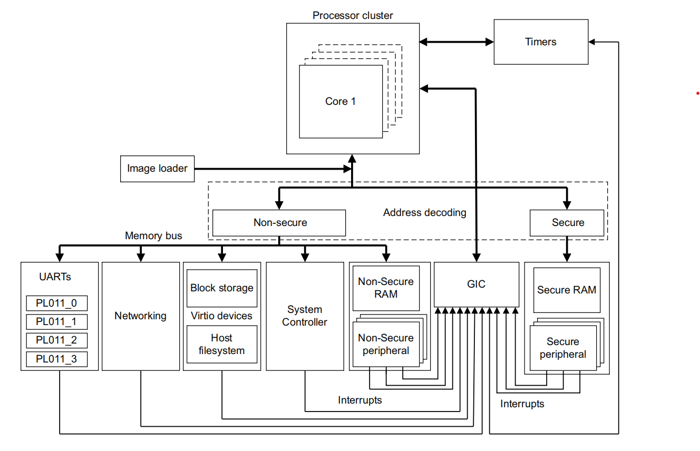
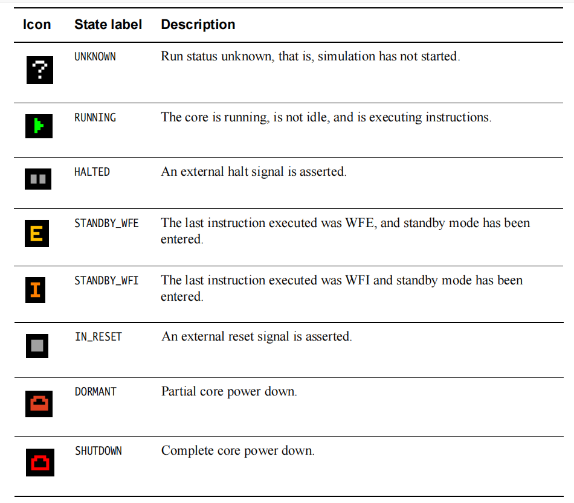
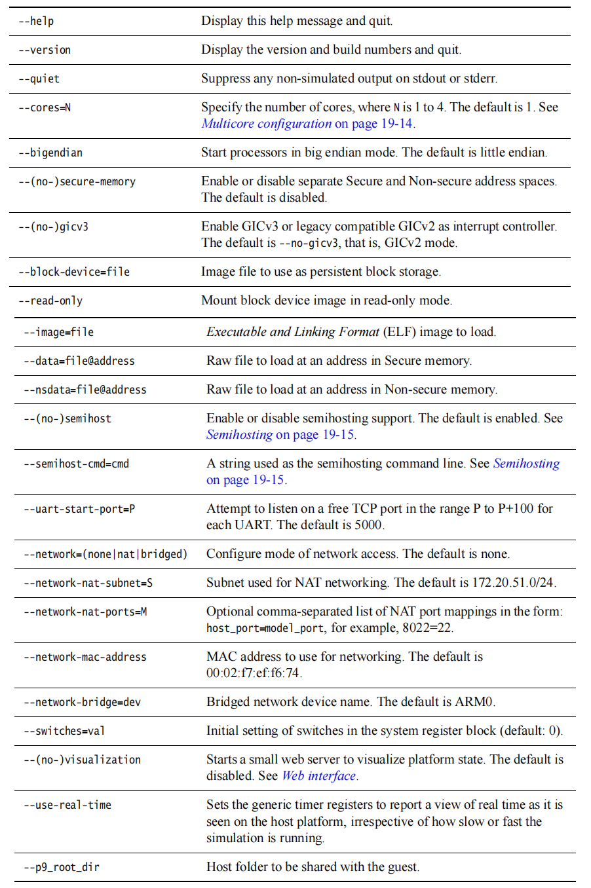
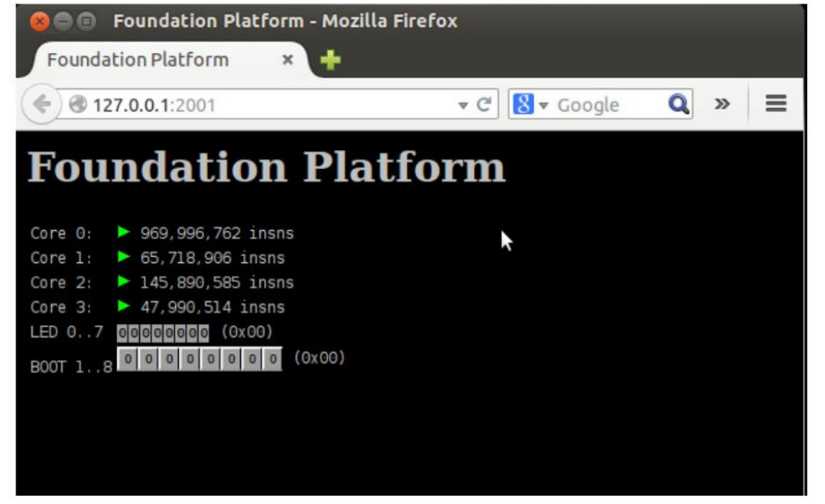
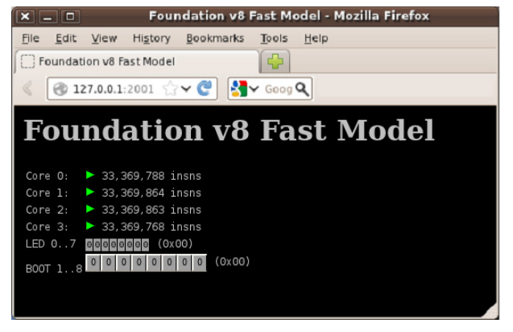
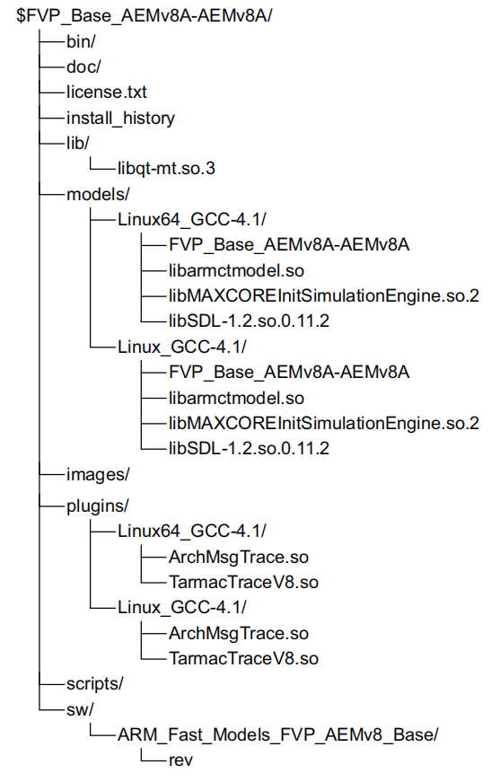
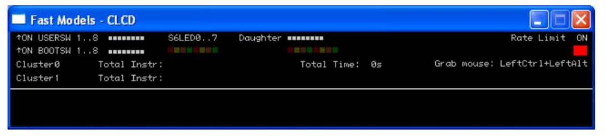
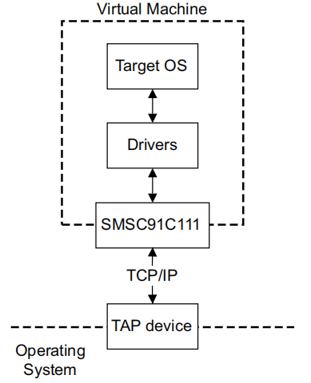

## 19 ARMv8模型

平台模型，例如本章中描述的模型，可以在不需要实际硬件的情况下进行软件开发。软件模型从程序员的角度提供处理器和设备的模型。模型的功能行为等同于真实硬件。

为了获得快速的模拟执行速度，牺牲了绝对时序精度。这意味着您可以使用 PV 模型来确认软件功能，但您不能依赖循环计数、低级组件交互或其他硬件特定行为的准确性。

ARMv8‑A 基础平台中的处理器并非基于任何现有的处理器设计，但仍符合 ARMv8‑A 架构规范。ARMv8‑A 基础平台使用 ARM 快速模型技术，是 ARM 处理器建模解决方案套件的一部分。这些建模解决方案可在通过ARM快速模型交付的模型组合中使用。

在基本平台 FVP 中建模的处理器可以配置为类似于 Cortex‑A53 和 Cortex‑A57 处理器。


### 19.1 ARM 快速模型

Fast Models 是一个用于创建以高仿真速度执行的虚拟平台模型的环境。它们提供对基于 ARM 的系统的访问，这些系统适用于在芯片可用之前进行早期软件开发。与 ARM Development Studio 5 (DS‑5) 结合使用，FastModels 可以帮助开发人员在整个开发周期中调试、分析和优化他们的应用程序。

这些虚拟平台可以方便地分发给软件开发人员进行早期软件开发，而无需昂贵的开发板。他们：

- 每秒执行多达 2.5 亿条 ARM 指令，与实际硬件相当
- 具有针对应用程序和固件以及早期驱动程序开发量身定制的性能和准确性
- 快速启动 Linux 和 Android 等操作系统
- 提供基于ARM处理器的子系统的SystemC Transaction Level Messaging (TLM) 2.0导出
- 拥有功能准确的 ARM 指令集模型，针对 ARM 处理器设计进行了全面验证
- 对先进的 ARM 技术进行建模，例如缓存、MMU、LPAE、虚拟化、TrustZone 和 VFP
- 模拟外围设备，例如以太网、LCD、键盘和鼠标

生成的平台配备了组件架构调试接口(CADI)，可以独立运行或从合适的调试器运行。 Fast Models 自动为独立平台和集成平台生成所需的接口。

快速模型可用于许多 ARM 处理器和系统控制器，以及经典 ARM 处理器和 CoreLink 系统控制器。

快速模型只关注处理器上运行的程序的准确性。他们没有尝试准确地模拟总线事务，也没有准确地模拟指令时序。整个模拟具有非常准确的时序概念，但代码转换(CT) 处理器并未声称以类似设备的时序调度指令。

快速模型试图对硬件进行准确建模，但在执行速度、准确性和其他标准之间存在折衷。在某些情况下，处理器型号可能与硬件不匹配。

快速模型可以：

- 准确地模拟指令
- 正确执行架构上正确的代码

但是，快速模型不能：

- 验证硬件
- 对所有架构上不可预测的行为进行建模
- 模型周期计数
- 对时序敏感的行为进行建模
- 模型SMP指令调度
- 测量软件性能
- 模拟 bus 线路

快速模型旨在准确地反映系统程序员的观点。软件能够检测硬件和模型之间的差异，但这些差异通常取决于未精确指定的行为。例如，可以检测指令和总线事务的准确时序、推测性预取的影响和缓存牺牲品选择的差异。某些类别的行为被指定为UNPREDICTABLE并且这些情况可以被软件检测到。依赖于这种行为的程序，即使是无意的，也不能保证在任何设备或快速模型上可靠地工作。利用此行为的程序可能会在硬件和模型之间以不同的方式执行。

通常，处理器在模拟时间的同一点发出一组指令（一个量程），然后在执行下一个量程之前等待一段时间。时序安排使得处理器平均每个时钟节拍一条指令。

这样做的结果是：

- 在模型上运行的软件的感知性能不同于现实世界的软件。特别是，内存访问和算术运算都需要大量时间
- 程序可能能够检测处理器的量化执行行为，例如通过高分辨率计时器进行轮询

#### 19.1.1 哪里获取到ARM 快速模型

有关如何购买 ARM 快速模型的详细信息，请访问http://www.arm.com/fastmodels


### 19.2 ARMv8-A 基础平台

ARMv8‑A 基础平台是 ARMv8‑A 架构的测试平台。它是一个简单的平台模型，能够运行裸机半托管应用程序并启动一个完整的操作系统。

它作为平台模型提供，从命令行配置仿真并使用平台中的外围设备进行控制。

基础平台有：

-  包含 1‑4 个内核的 ARMv8‑A 处理器集群模型，实现：
  - 所有异常级别的 AArch64
  -  EL0 和 EL1 支持 AArch32
  - 所有异常级别的小端和大端
  - 通用计时器
  -  自托管调试
  -  GICv2 和可选的 GICv3 内存映射处理器接口和分配器
- 8GB 内存
  - 该平台可模拟高达 8GB 的 RAM
  - 要模拟具有 4GB RAM 的系统，您需要至少具有 8GB RAM 的主机
  - 要模拟具有 8GB RAM 的系统，您需要一台至少具有 12GB RAM 的主机
-  四个 PL011 UART 连接到 xterms
-  平台外设包括实时时钟、看门狗定时器、实时定时器和电源控制器
-  安全外围设备，包括受信任的看门狗、随机数生成器、非易失性计数器和根密钥存储
-  连接到主机网络资源的网络设备模型
-  在主机上实现为文件的块存储设备
-  带有 LED 和开关的小型系统寄存器块，使用 Web 服务器可见
-  一个简单的网络界面来指示模型的状态。请参阅 网页页面第19-13页
-  主机文件系统访问实现为计划 9 文件系统

缓存被建模为无状态并且没有写缓冲区。这在数据端产生了完美的内存一致性效果。指令端有一个可变大小的预取缓冲区，因此需要在目标代码中使用正确的屏障才能正确运行。

除非集群中的所有内核都处于等待中断(WFI)状态，否则平台会尽可能快地运行或等待异常(WFE)，在这种情况下，平台空闲，直到发生中断或外部事件发生。

基础平台已经过修订，以支持 ARM可信基础系统架构(TBSA) 和服务器基础系统架构(SBSA)。添加了许多外围设备，并对内存映射进行了相应的更改。它也被更新以更紧密地与 Versatile Express 基板和 ARM 快速模型中的外设保持一致。在适当的情况下，原始Foundation 模型现在称为Foundation v1或Foundation v2 ，而 Foundation Platform 是Foundation v9.1。

针对以前版本的平台编写的软件将使用默认的‑‑no‑gicv3配置选项在平台上未经修改地工作。只有使用早期RAM 块的软件可能需要一些调整。



​							**Figure 19-1 Block diagram of ARMv8-A Foundation Platform**

地址解码块的行为取决于‑‑secure‑memory是否使用命令行选项。

该平台提供以下类型的网络支持：

**基于NAT,IPV4**	

- 基于 IPv4 的网络通过使用针对以前版本的平台编写的软件将使用默认的‑‑no‑gicv3配置选项在平台上未经修改地工作。只有使用早期RAM 块的软件可能需要一些调整。

**桥接**

- 桥接网络需要设置以太网桥接设备，以在主机上的以太网端口和平台提供的网络接口 

  之间进行桥接。这通常需要管理员权限。有关更多信息，请参阅 Linux bridge‑utils 包中 

  的文档。

#### 19.2.1 基金会平台的局限性

以下限制适用于 ARMv8‑A 基础平台：

- 写缓冲区没有建模
- 并非在每个指令边界处都发生中断
- 缓存被建模为无状态
- 没有组件架构调试接口(CADI)、CADI 服务器、跟踪或其他插件支持
- 不支持 Thumb2EE
- 不支持 ARMv8 加密扩展


#### 19.2.2 软件要求

运行 ARMv8‑A 基础平台所需的软件如下：

**操作系统**

- 适用于64位 Intel 架构的 Red Hat Enterprise Linux 5.x 版本
-  适用于 64 位 Intel 架构的 Red Hat Enterprise Linux 6.x 版本
- 适用于 64 位 Intel 架构的 Ubuntu 10.04 或更高版本

目前尚不支持在其他操作系统上运行该平台。但是，该模型应该在任何最新的 x86 64 位 Linux 操作系统上运行，提供 glibc v2.3.2 或更高版本，并且存在 libstdc++ 6.0.0 或更高版本

**UART输出**

要使通用异步接收器/发送器(UART) 输出可见，必须在主机上安装xterm和telnet ，并在 PATH 中指定


#### 19.2.3 从哪里获得 ARM 基础平台

ARMv8‑A 基础平台是一个开源平台，可以从http://www.arm.com/fvp。


#### 19.2.4验证安装

Foundation Platform 仅作为预构建的平台二进制文件提供。安装目录结构如下：



​																**Figure 19-2 Installed files**


**在哪里**：

**例子**

包括运行示例程序描述的示例程序的 C 版本和.axf文件。它还包括 Makefile 和设备树Foundation_Platform.dts 的示例源代码。

**基金会_平台**

ARMv8‑A 基础平台可执行文件。

**libMAXCOREInitSimulationEngine.so**

平台所需的辅助库。

**libarmctmodel.so**

代码翻译库。

**FoundationPlatform_Readme.txt**

用户指南的简短摘要。

**DUI0677E_foundation_platform_ug.pdf**

文档。

**LES-PRE-20164_V1_-_Foundation_Platform.txt**

最终用户许可协议文本。


#### 19.2.5 运行示例程序

提供的示例程序可用于确认 ARMv8‑A 基础平台工作正常。

使用以下命令行运行平台：

`./Foundation_v8 ‑‑image hello.axf`

添加‑‑quiet以抑制除示例程序的输出之外的所有内容。

它应该打印类似于以下内容的输出：

```C
terminal_0: Listening for serial connection on port 5000
terminal_1: Listening for serial connection on port 5001
terminal_2: Listening for serial connection on port 5002
terminal_3: Listening for serial connection on port 5003
Simulation is started
Hello, 64-bit world!
Simulation is terminating. Reason: Simulation stopped
```

该示例演示了平台正确初始化、加载和执行示例程序，以及半主机调用以打印输出并停止平台工作。


#### 19.2.6 示例程序故障排除

- 如果您尝试在 32 位 Linux 主机上运行示例程序，则会出现类似于以下内容的错误：

​	`./Foundation_Platform: /lib64/ld-linux-x86-64.so.2: bad ELF interpreter: No suchfile or directory`

- 如果您的系统上未安装libstdc++ ，则在启动时会出现以下错误：

​	`./Foundation_Platform: error while loading shared libraries: libstdc++.so.6: cannot open shared object file`

- 如果您的系统glibc太旧，或者您的libstdc++太旧，您会收到以下消息：

​	`./Foundation_Platform: /usr/lib64/libstdc++.so.6: version GLIBCXX_3.4 not found (required by Foundation_Platform)`

`./Foundation_v8: /lib64/libc.so.6: version GLIBC_2.3.2 not found (required by Foundation_Platform)`

​	`./Foundation_Platform: /lib64/libc.so.6: version GLIBC_2.2.5 not found (required by Foundation_Platform)`

libstdc++和glibc通常是核心操作系统安装的一部分。


#### 19.2.7 内核

ARMv8 基础平台不提供内核。但是，可以使用 AArch64 (ARM64) 补丁。使用这些时，主线内核应该在 ARMv8 基础平台中正常运行，而不需要额外的补丁。您将需要一个跨工具链来构建 ARM64 内核。默认内核配置在 Foundation Platform 中工作，无需任何更改。


#### 19.2.8 配置内核命令行

在大多数 Linux 系统上配置内核命令行的常用方法是使用引导加载程序。由于 Foundation Platform 直接引导内核而不调用中间引导加载程序，因此必须以不同的方式执行配置。构建内核映像后，必须添加引导包装器。这以平台可以使用的方式向内核映像添加了额外的配置，包括：

- 内核命令行
- 表示平台硬件配置的扁平设备树 (FDT) blob
-  initramfs 映像（如果需要）

与内核一起提供了一个示例引导包装器源代码。通过编辑包含的 Makefile 来配置它。有许多设置可以更改，但通常使用它们中的大多数无需任何更改即可工作。最有可能对配置有用的设置是：

**INITRD_FLAGS**

将此设置为‑DUSE_INITRD以附加 initramfs 文件系统。

**FILESYSTEM**

如果INITRD_FLAGS设置为‑DUSE_INITRD，则要使用的 initramfs 映像的路径。

**BOOTARG**

内核命令行

在配置后使用make ，引导包装器会将内核及其配置链接到一个文件中，供模型使用，通常是 linux‑system.axf


#### 19.2.9  根文件系统的选择

将 initramfs 与内核一起使用是一个简单的选项，但会使用更多内存，因为它还必须存储文件系统。对于更大、更有用的文件系统，ARM 建议使用虚拟块设备（使用‑‑block‑device选项，请参阅第 19‑12 页的命令行概述）或 NFS 根。如果您在平台中交叉构建程序和测试，使用 NFS 根是更方便的途径，但需要更复杂的配置。


#### 19.2.10 根文件系统设置块设备映像

此方法假定您已经为要添加到根文件系统的文件创建了一个压缩文件系统。

根文件系统设置块设备映像：

1. 使用以下命令创建一个正确大小的空文件（文件名）：

   `\# dd if=/dev/zero of=<filename> bs=1M count=<number of megabytes>`

2. 在该文件中创建一个文件系统，使用：

   `\# mkfs.ext4 <filename>`

3.  使用以下命令在主机系统上挂载文件系统：

   `\# mkdir /mnt/AArch64`

   `\# mount -o loop <filename> /mnt/AArch64`

4. 使用以下命令将文件系统提取到设备上：

   `\# cd /mnt/AArch64`

   `\# zcat /path/to/filesystem.cpio.gz | cpio -divmu --no-absolute-filenames`

   `\# cd /`

5.  使用以下方法卸载设备：

   `\# umount /mnt/AArch64`

6. 您的块设备映像可以使用了。要在平台中使用它，请将引导包装器 Makefile 中的根设备配置为root=/dev/vda并重建引导包装器。

- 警告

  对于大多数网络协议，使用网络地址转换 (NAT) 或用户模式网络就足够了。但是，如果您尝试使用与平台在同一台机器上运行的 NFS 服务器，则用户模式网络将不适用于此。相反，使用桥接配置网络。请参阅第 19‑11 页的网络连接。

- 笔记

  如果您使用的是 nfsroot，请注意主机上的 IP 地址在您使用时不会更改。配置不当的 DHCP 服务器可能会导致发生意外的地址更改。如果您依赖 NFS 服务器作为根文件系统，这会导致问题。

  

#### 19.2.11  启动Foundation平台 

有关详细信息，请参阅第 19‑12 页的命令行概述。

在块设备上使用 ARM 可信固件、UEFI、Linux 内核和文件系统启动模型 

要启动模型，请使用：

`./Foundation_Platform \`

`--data=fvp_bl1.bin@0x0 \`

`--data=fvp_fip.bin@0x8000000 \`

`--block-device=filesystem.img`

fvp_bl1.bin和fvp_fip.bin可以从 Linaro 网站下载http://releases.linaro.org/latest/openembedded/aarch64/。

**使用内核和 initramfs 启动模型**

要使用内核和 initramfs 启动模型：

1. 在内核中构建一个 initramfs。
2. 使用 boot‑wrapper 创建一个 AXF（可能称为linux‑system.axf）。
3.  使用以下命令在 Foundation Platform 上启动 AXF：

`./Linux64_Foundation_v8/Foundation_v8 ‑‑image linux‑system.axf`

**使用用户模式网络启动模型**

使用：

`./Foundation_v8 ‑‑network=nat ‑‑image linux‑system.axf`

**使用块设备上的内核和文件系统启动模型**

使用：

**./Foundation_v8 --image linux-system.axf --block-device filesystem.img**

Linux 内核必须使用CONFIG_VIRTIO、 CONFIG_VIRTIO_MMIO、 CONFIG_VIRTIO_RING和CONFIG_VIRTIO_BLK进行编译，并且引导包装器中提供的内核引导参数必须包含root=/dev/vda。这是 virtio 系统块的设备名称。


#### 19.2.12 网络连接

本节介绍如何设置网络连接，然后配置网络环境以在 Linux 平台上使用。以下说明假定您的网络通过 DHCP 提供 IP 地址。如果不是这种情况，请咨询您的网络管理员。

- NAT，基于 IPv4 的网络通过使用用户级 IP 服务提供有限的 IP 连接。这不需要额外的权限来设置或使用，但有固有的限制。可以使用端口重映射来提供系统级服务或与主机上的服务冲突的服务。
- NAT（用户模式）网络支持已知问题会间歇性地导致网络速度变慢。

使用用户模式网络的一个问题是，由于它充当模型中的虚拟网络和主机网络之间的 NAT 路由器，它重新映射来宾连接的 源端口。这可能会导致 NFS 服务器出现问题。这些通常默认配置为拒绝来自端口号大于 1023 的源端口的客户端连接。对 于大多数 Linux 发行版提供的 NFS 服务器，可以通过在要挂载的 NFS 导出的配置条目中添加不安全选项来解决此问题。

- /etc/exports目录中列出了使用 NFS 导出的本地文件系统路径（NFS 导出） 。可以为/etc/exports 中的任何条目指定不安全选项，使用：

  `/pub *(ro,insecure,all_squash)`


#### 19.2.13 建立网络连接

NAT 网络将满足平台的大多数要求，但在某些情况下，例如使用本地 nfsroot，将需要桥接。必须更新主机 Linux 机器上的网络配置以允许这样做。这有几个阶段：

1. 确保您已在系统上安装了brctl实用程序

   ARM 建议使用 Linux 发行版中包含的标准 Linux 桥接实用程序。有关 Linux 网桥实用程序的更多信息，请参阅：http://www.linuxfoundation.org/collaborate/workgroups/networking/bridge

2. 使用以下命令禁用当前以太网设备（在本例中为 eth0）：

   `\# ifconfig eth0 down`

   您必须关闭网络管理器才能执行此操作。它不支持高级网络选项，例如桥接。

3.  要关闭网络管理器，请使用：

   `/etc/init.d/NetworkManager stop`

   关闭网络管理器可能因系统而异。检查您的操作系统文档以了解如何禁用网络管理器。

4. 添加一个新的虚拟设备（<bridge_name>，在本例中为 tap0），使用：

   `\# ip tuntap add dev tap0 mode tap`

5.  使用 eth0 和 tap0 添加新的桥接设备，并启用它，使用：

   `\# brctl addbr br0`

   `\# brctl addif br0 eth0`

   `\# brctl addif br0 tap0`

6. 启用新的网桥设备并使用 DHCP 请求 IP 地址，使用：

   `\# ifconfig br0 up`

   `\# dhclient br0`

7. 这个新的网络设备 br0 应该像现有的 eth0 设备一样工作，但会在 eth0 和 tap0 之间共享物理网络连接。模型 

   使用 tap0 虚拟设备访问网络。

8. 使用命令行选项‑‑network=bridged运行模型

   `--network-bridge=<bridge name>` 

   `where <bridge_name> = tap0.`

9.  通过 ping 任何合适的网站检查网络设施是否存在。


#### 19.2.14 命令行概述

命令行参数提供所有模型配置。使用‑‑help运行模型以获取可用命令的摘要。

在命令行上使用的语法是：

`./Foundation_v8 [OPTIONS...]`

表 19‑1显示了这些选项。

​															**Table 19-1 Command-line options**



如果提供了多个‑‑image、 ‑‑data或‑‑nsdata选项，则图像和数据按照它们在命令行中出现的顺序加载，并从最后一个 ELF 的入口点开始模拟指定，如果没有提供 ELF 图像，则为地址 0。您可以指定多个‑‑image、 ‑‑ data或‑‑nsdata选项。


#### 19.2.15 网页界面

在命令行上使用的语法如下：

`./Foundation_v8 --visualization`

or

`./Foundation_v8 --no-visualization`

使用‑‑visualization选项运行模型，而不使用‑‑quiet选项，会显示额外的输出：

```
terminal_0: Listening for serial connection on port 5000
terminal_1: Listening for serial connection on port 5001
terminal_2: Listening for serial connection on port 5002
terminal_3: Listening for serial connection on port 5003
```

可视化 Web 服务器在端口 2001 上启动

terminal_n行与 UART 相关。请参阅UART。

使用您的网络浏览器访问地址 http://127.0.0.1:2001

浏览器显示一个可视化窗口，如图 19‑3 所示。



​															**Figure 19-3 Visualization window**

可视化窗口提供模型各部分状态的动态视图以及更改平台开关状态的能力。


#### 19.2.16 串口

当 Foundation Platform 启动时，它会初始化四个 UART。对于每个 UART，它会搜索一个空闲的 TCP 端口，用于对 UART 进行 telnet 访问。它通过顺序扫描 100 个端口范围并使用第一个空闲端口来实现此目的。启动端口默认为 5000，您可以使用‑‑uart‑start‑port命令行参数更改它。

将终端或程序连接到给定端口会显示和接收来自相关 UART 的输出，并允许输入到 UART。

UART 输出数据时，如果端口没有连接终端或程序，则自动启动终端。

仅当设置了DISPLAY环境变量且不为空时，终端才会自动启动。


#### 19.2.17 串口输出

要使 UART 输出可见，必须在主机上安装xterm和telnet ，并在 PATH 中指定。


#### 19.2.18 多核配置

默认情况下，模型以单个处理器启动，该处理器从最后提供的 ELF 映像中的入口点开始执行，如果没有提供 ELF 映像，则从地址 0 开始执行。

您可以使用‑‑cores=N将模型配置为最多具有四个处理器内核。每个内核开始执行相同的图像集，从相同的地址开始。 ‑‑可视化根据处理器是处于 ARM 还是 Thumb 状态，拦截 AArch32 中的 SVC 0x123456或0xAB 。与多核选项一起使用的命令行选项会产生一个如图 19‑4 所示的可视化窗口。



·											**Figure 19-4 Multicore option with number of cores = 4**


#### 19.2.19  半主机

半主机使在平台模型上运行的代码能够直接访问主机上的 I/O 设施。这些工具的示例包括控制台 I/O 和文件 I/O。有关半主机的更多信息，请参阅ARM®编译器软件开发指南。

模拟器通过以下任一方式处理半主机：

- 根据处理器是处于 ARM 还是 Thumb 状态，拦截 AArch32 中的 SVC 0x123456或0xAB 
- 在 AArch64 中拦截 HLT 0xF000 


#### 19.2.20 半主机配置

在命令行上启用或禁用半主机的语法如下：

`./Foundation_v8 ‑‑(no‑)semihost`

用于在命令行上设置半主机命令行字符串的语法如下：

`./Foundation_v8 --semihost-cmd=<*command string*>`


### 19.3 基础平台 FVP

固定虚拟平台(FVP) 使您无需实际硬件即可开发软件。 AEMv8‑A 基础平台 FVP 使您能够在 ARMv8 开发平台的虚拟实现上运行软件应用程序，并为 ARM 软件可交付成果的开发、分发和演示提供标准参考平台。

它包含两个功能齐全的 ARM v8架构包络模型的处理器集群(AEMv8‑A) 和标准外设集，旨在支持软件开发和移植。该平台是早期 VE实时系统模型(RTSM) 的演变，基于 ARM 生产的Versatile™ Express (VE) 硬件开发平台。

AEMv8‑A 基础平台 FVP 具有：

-  最多四个 AEMv8‑A 多处理器型号的两个可配置集群实施：
  -  所有异常级别的 AArch64
  - 所有异常级别的可配置 AArch32 支持
  -  在所有异常级别上对小端和大端的可配置支持
  - 通用计时器
  - 自托管调试
  -  CADI 调试
  -  GICv3 内存映射处理器接口和分配器
- 多媒体或网络环境的外围设备
- 四个 PL011 UART
- CoreLink CCI‑400 缓存一致性互连
- 架构 GICv3 模型
-  ARM 高清 LCD 显示控制器，1920 × 1080 分辨率，60fps，具有单个 I2S 和四个立体声通道
- 64 MB NOR 闪存和电路板外围设备
- CoreLink TZC‑400 TrustZone 地址空间控制器


#### 19.3.1 软件要求

该平台应安装以下软件组件：

**Linux**

The following software is supported:

​	**操作系统**

- 适用于 64 位和 32 位架构的 Red Hat Enterprise Linux 5.x 版本

- 适用于 64 位和 32 位体系结构的 Red Hat Enterprise Linux 6.x 版本

​	**Shell**

​	与 sh 兼容的 shell，例如 bash 或 tcsh。该模型应该在任何最新的 x86 64 位 Linux 操作系统上运行，只要存在 	glibc v2.3.2（或更高版本）和 libstdc++ 6.0.0（或更高版本）。

**微软Windows**

Microsoft Windows 需要以下软件：

​	**操作系统**

- 带有 Service Pack 1 的 Microsoft Windows 7，32 位或 64 位
- Microsoft Visual C++ 2008 可再发行包 ATL 安全更新 (KB973551)

**Adobe Acrobat reader**

​	阅读器版本 8 或更高版本


#### 19.3.2 验证安装

AEMv8‑A 基础平台 FVP 仅作为预构建平台二进制文件提供。安装目录格式如下：



​													**Figure 19-5 AEMv8-A Base Platform FVP directory tree**

**路径：**

**bin**						

模型调试器可执行文件。有关详细信息，请参阅快速模型用户指南的模型调试器。

**doc**						

模型和工具的文档

**license.txt**			

模型使用许可条款

**install_history**	

安装程序日志文件

**images**					

简单演示程序的源代码和可执行文件

**lib	**						

libqt-mt.so.3  模型调试器支持库

**models**					

compiler

```
FVP_Base_AEMv8A-AEMv8A
The AEMv8-A Base Platform FVP executable file.
libarmctmodel.so
Code translation library.
libMAXCOREInitSimulationEngine.so.2
Helper library required by the model.
libSDL-1.2.so.0.11.2
Helper library required by the model.
```

**plugins**

TarmacTraceV8  用于生成已执行代码的文本跟踪输出的插件

ArchMsgTrace  当模型检测到目标代码正在使用处理器的IMPLEMENTATION DEFINED或UNPREDICTABLE行为时生成警告的插件

**scripts**

使用 TAP 形式的模型网络设置脚本

**sw**

ARM_Fast_Models_FVP_AEMv8_Base 模型构建号和修订标识符


#### 19.3.3 半主机支持

半主机使在平台模型上运行的代码能够直接访问主机上的 I/O 设施。这些工具的示例包括控制台 I/O 和文件 I/O。查看ARM®编译器软件开发指南。

模拟器通过以下任一方式处理半主机：

- 根据处理器是处于 ARM 还是 Thumb 状态，拦截 AArch32 中的 SVC 0x123456或0xAB 
- 在 AArch64 中拦截 HLT 0xF000


#### 19.3.4  在调试器中使用配置 GUI

在您的调试器中，可以在连接到模型并启动它之前配置 FVP 参数。请参阅调试器随附的文档。

要连接到 AEMv8‑A 基础平台 FVP，您的调试器必须具有 CADI 接口。


#### 19.3.5 从 Model Shell 设置模型配置选项

您可以通过命令行或模型的 CADI 属性中提供的配置设置来控制 AEMv8‑A Base Platform FVP 的初始状态。

**使用配置文件**

要配置从命令行使用 Model Shell 启动的模型，请在启动 AEMv8‑A Base Platform FVP 时包含对可选纯文本配置文件的引用。

配置文件中的注释行必须以#字符开头。

配置文件的每个非注释行包含：

- 组件实例的名称

- 要修改的参数及其值

- 您可以使用true/false或1/0 设置布尔值。如果字符串包含空格，则必须用双引号将字符串括起来

  ​										**Example 19-1 Typical configuration file**

```
# Disable semihosting using true/false syntaxsemihosting-enable=false
#
# Enable the boot switch using 1/0 syntax
bp.sp810_sysctrl.use_s8=1
#
# Set the boot switch position
bp.ve_sysregs.user_switches_value=1
```

您可以通过传递‑l开关来获取模型参数的完整列表。

例如：

```
models/Linux64_GCC-4.1/FVP_Base_AEMv8A-AEMv8A -l
# Parameters:
# instance.parameter=value #(type, mode) default = 'def value' : description : 
[min..max]
#-----------------------------------------------------------------------
cache_state_modelled=1 # (bool, init-time) default = '1' 	// Enabled d-cache and 
															// i-cache state for 
															// all components
cluster0.NUM_CORES=0x4 # (int , init-time) default = '0x4' 	// Number of cores in 
															// cluster0:[0x1..0x4]
cluster1.NUM_CORES=0x4 # (int , init-time) default = '0x4' 	// Number of cores in 
															// cluster1:[0x0..0x4]
gicv3.gicv2-only=0 # (bool, init-time) default = '0' 		// When using the
															// GICv3 model,pretend
															// to be a GICv2
															// system.
semihosting-enable=1 # (bool, init-time) default = '1' 		// Enable semihosting 
															// for all cores
spiden=1 # (bool, init-time) default = '1' 					// Debug authentication 
															// signal spiden
spniden=1 # (bool, init-time) default = '1' 				// Debug authentication 
															// signal spniden
<output truncated>
```

**使用命令行** 

您可以在调用模型时使用‑C开关来定义模型参数。您还可以使用‑‑parameter作为‑C开关的同义词。使用与配置文件相同的语法，但在每个参数前加上‑C开关。


#### 19.3.6 在 AEMv8‑A 基础平台 FVP 上加载和运行应用程序

提供了与 AEMv8‑A 基础平台 FVP 一起使用的示例应用程序。

这些应用程序仅用于演示目的，ARM 不支持。示例或实现细节的数量可能会随着系统模型的不同版本而变化。

在所有版本的 AEMv8‑A Base Platform FVP 上运行的有用示例应用程序是：

**brot_ve_64.axf**  

此应用程序提供了将图像渲染到 CLCD 显示器的演示，提供源代码。这些示例位于%PVLIB_HOME%\images目录

中。


#### 19.3.7 从命令行运行示例程序

1. 打开终端窗口并导航到安装目录

2.  使用以下命令打开并运行提供的示例程序：

   ```
   models/Linux64_GCC-4.1/FVP_Base_AEMv8A-AEMv8A \
   -a cluster\*.cpu\*=images/brot_ve_64.axf \
   -C bp.secure_memory
   ```

   **models/Linux64_GCC-4.1/FVP_Base_AEMv8A-AEMv8A**

   是模型可执行文件。此版本仅适用于 64 位主机。Linux_GCC‑4.1 中的文件适用于 32 位和 64 位主机。

   **-a cluster\*.cpu\***

   指示模型启动映像，为所有集群的所有核心设置 pc 的初始值。

   **‑C bp.secure_memory=false**

   禁用 CoreLink TZC‑400 对 DRAM 的访问控制。这是必需的，因为这个简单的示例映像不包含初始化 TZC‑400 的固件实现


#### 19.3.8 使用模型调试器运行示例程序 

1. 启动模型调试器。它位于安装目录中的bin/modeldebugger中，或者使用 Windows 中的“开始”菜单

2. 选择文件→调试 Isim 系统

   出现一个对话框

3. 对于系统，选择以下模型可执行文件：

   models/Linux64_GCC-4.1/FVP_Base_AEMv8A-AEMv8A

4. 在其他命令行选项中，键入：

   ‑C bp.secure_memory=false

   点击ok

5. 选择 cluster0 中的一个或多个目标，然后单击“ok”

6. 在 Load Application 对话框中，确保选中 Enable SMP Application Loading，然后找到并选择images/

   brot_ve_64.axf文件

7. 在打开的 ModelDebugger 窗口之一上单击run


#### 19.3.9 使用 CLCD 窗口

当 AEMv8‑A 基础平台 FVP 启动时，FVP CLCD 窗口打开，显示模拟彩色 LCD 帧缓冲区的内容。它会自动调整大小以匹配CLCD 外设寄存器中设置的水平和垂直分辨率。

图 **19‑6** 显示了 FVP CLCD 在其默认状态下，即启动后的状态。



​															**Figure 19-6 CLCD window at startup**

CLCD 窗口的顶部显示以下状态信息：

**Total Instr** 		

一个计数器，显示执行的指令总数。

**Total Time**

间显示总经过时间的计数器，以秒为单位，这是挂钟时间，不是模拟时间。

**Rate Limit**

制此选项限制内核处于 WFI、重置或否则闲置。

速率限制默认启用。模拟时间受到限制，使其更接近实时。

单击方形按钮以禁用或启用速率限制。禁用速率限制时，文本从 ON 变为 OFF，彩色框变暗。

第 **19‑22** 页的图 **19‑7** 显示了禁用速率限制的 CLCD。


您可以使用rate_limit‑enable控制是否启用速率限制参数，实例化模型时 AEMv8‑A 基础平台 FVP 可视化组件的可视化参数之一。

**Instr/sec**

显示挂钟时间每秒执行的指令数。

**Perf Index** 

实时与仿真时间的比率。比例越大，速度越快模拟运行。如果启用速率限制功能，则性能指数接近统一。

**CLCD display**

The large area at the bottom of the window displays the contents of the CLCD buffer, as in Figure **19-7**.


​													**Figure 19-7 CLCD window active**


​														**Table 19-2 Core run state icon descriptions**

在您开始模拟之前，图标不会出现。

您可以通过按左 Ctrl+左 Alt 键来隐藏主机鼠标指针。再次按这些键可重新显示主机鼠标指针。只有左 Ctrl 键是可操作的。键盘右侧的 Ctrl 键没有相同的效果。

如果您喜欢使用不同的键，请使用trap_key配置选项，它是 Visualization 组件的可视化参数之一。


#### 19.3.10 将以太网与 AEMv8‑A 基础平台 FVP 结合使用

AEMv8‑A 基础平台 FVP 为您提供了一个虚拟以太网组件。这是 SMSC91C111 以太网控制器的模型，使用 TAP 设备与网络通信。默认情况下，以太网组件被禁用。

AEMv8‑A 基础平台 FVP 包括 SMSC91C111 以太网控制器的软件实现。因此，您的目标操作系统必须包含此特定设备的驱动程序，并且您必须配置内核以使用 SMSC 芯片。 Linux 是支持 SMSC91C111的操作系统。

共有三个可配置的 SMSC91C111 组件参数：

- enabled
- mac_address
- promiscuous

**enabled**

当设备被禁用时，内核无法检测到它。有关详细信息，请参阅快速模型参考手册中的SMSC_91C111 组件部分。第 19‑24 页的图 19‑8显示了模型网络结构的框图。



​														**Figure 19-8 Model networking structure block diagram**

您必须配置 HostBridge 组件才能在 TAP 设备上执行读取和写入操作。 HostBridge 组件是一个虚拟程序员视图模型，充当网络网关与主机上的 TAP 设备交换以太网数据包，并将数据包转发到 NIC 模型。

**mac_address**

如果未指定 MAC 地址，则在运行模拟器时，它会采用随机生成的默认 MAC 地址。当在本地网络的多个主机上运行模型时，这提供了一定程度的 MAC 地址唯一性。

**promiscuous**

默认情况下，以太网组件以混杂模式启动。这意味着它可以接收所有网络流量，即使是没有专门针对设备的任何流量。如果您将单个网络设备用于多个 MAC 地址，则必须使用此模式。例如，如果您在主机操作系统和 AEMv8‑A Base Platform FVP 以太网组件之间共享同一个网卡，请使用此模式。

默认情况下，AEMv8‑A Base Platform FVP 上的以太网设备具有随机生成的 MAC 地址并以混杂模式启动。


#### 19.3.11 与VE模型和平台的兼容性

在以前的 VE 模型上运行的软件应该与 AEMv8‑A 基础兼容平台 FVP，但可能需要更改以下配置选项：

- GICv2
- GICv3
- System global counter
-  Disable platform security.

**GICv2**

AEMv8‑A 基础平台 FVP 默认使用 GICv3。它可以配置为使用 GICv2 或 GICv2m 兼容模式。

要将模型配置为 GICv2m，请设置以下内容：

```
-C gicv3.gicv2-only=1 \
-C cluster0.gic.GICD-offset=0x10000 \
-C cluster0.gic.GICC-offset=0x2F000 \
-C cluster0.gic.GICH-offset=0x4F000 \
-C cluster0.gic.GICH-other-CPU-offset=0x50000 \
-C cluster0.gic.GICV-offset=0x6F000 \
-C cluster0.gic.PERIPH-size=0x80000 \
-C cluster1.gic.GICD-offset=0x10000 \
-C cluster1.gic.GICC-offset=0x2F000 \
-C cluster1.gic.GICH-offset=0x4F000 \
-C cluster1.gic.GICH-other-CPU-offset=0x50000 \
-C cluster1.gic.GICV-offset=0x6F000 \
-C cluster1.gic.PERIPH-size=0x80000 \
-C gic_distributor.GICD-alias=0x2c010000
```

要将模型配置为 GICv2，请设置以下内容：

```
-C gicv3.gicv2-only=1 \
-C cluster0.gic.GICD-offset=0x1000 \
-C cluster0.gic.GICC-offset=0x2000 \
-C cluster0.gic.GICH-offset=0x4000 \
-C cluster0.gic.GICH-other-CPU-offset=0x5000 \
-C cluster0.gic.GICV-offset=0x6000 \
-C cluster0.gic.PERIPH-size=0x8000 \
-C cluster1.gic.GICD-offset=0x1000 \
-C cluster1.gic.GICC-offset=0x2000 \
-C cluster1.gic.GICH-offset=0x4000 \
-C cluster1.gic.GICH-other-CPU-offset=0x5000 \
-C cluster1.gic.GICV-offset=0x6000 \
-C cluster1.gic.PERIPH-size=0x8000 \
-C gic_distributor.GICD-alias=0x2c010000
```

要为 GICv2m 配置 MSI 帧，可以使用额外的参数来设置 16 个可能的帧（8 个安全帧和 8 个非安全帧）的基地址和配置：

```
-C gic_distributor.MSI_S-frame0-base=ADDRESS \
-C gic_distributor.MSI_S-frame0-min-SPI=NUM \
-C gic_distributor.MSI_S-frame0-max-SPI=NUM
```

在此示例中，您可以将MSI_S替换为 MSI_NS，对于 NS 帧，您可以替换frame0对于可能的 16 帧中的每一个，使用frame1到frame7 。如果未为给定帧指定基地址，或者 SPI 编号超出范围，则不会实例化相应的帧。


**GICv3**

AEMv8‑A 核心模型包括 GICv3 系统寄存器的实现。这是默认启用的。

GIC 分配器和 CPU 接口有几个参数，允许配置模型以匹配不同的实现选项。使用‑‑list‑params获取完整列表。

GIC 模型的配置选项应在以下位置可用：

- `cpu/cluster.gic.*`
- `cpu/cluster.gicv3.*`
- `gic_distributor.*`


**System global counter**

VE 模型没有为系统全局计数器提供内存映射接口，并启用了自由运行定时器从复位。但是，架构要求是在重置时不启用此类计数器。这意味着内核的通用定时器寄存器不会运行，除非：

- 软件通过在 0x2a43000 的 CNTCR 中写入 FCREQ[0] 和 EN 位来启用计数器外设。这是首选方法。
- ‑C bp.refcounter.non_arch_start_at_default =1参数已设置。这是一种与旧软件兼容的备份方法。


**Disable platform security**

VE 模型根据固定的安全映射选择性地限制访问。在 AEMv8‑A 基础平台 FVP 中，外围设备的安全映射得到了增强，现在默认启用。软件必须对 TZC‑400 进行编程才能对 DRAM 进行任何访问，因为所有访问都在复位配置中被阻止。

为了与尚未更新以对 TZC‑400 进行编程的软件兼容，提供了以下参数，这将导致无论安全状态如何都允许所有访问：

`-C bp.secure_memory=false`


#### 19.3.12 从哪里获得 ARMv8‑A 基础平台 FVP

有关 ARMv8‑A 基础平台 FVP 的详细信息，请访问http://www.arm.com/fvp

