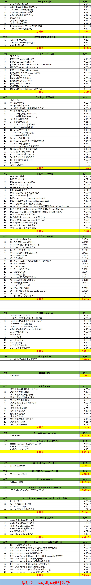
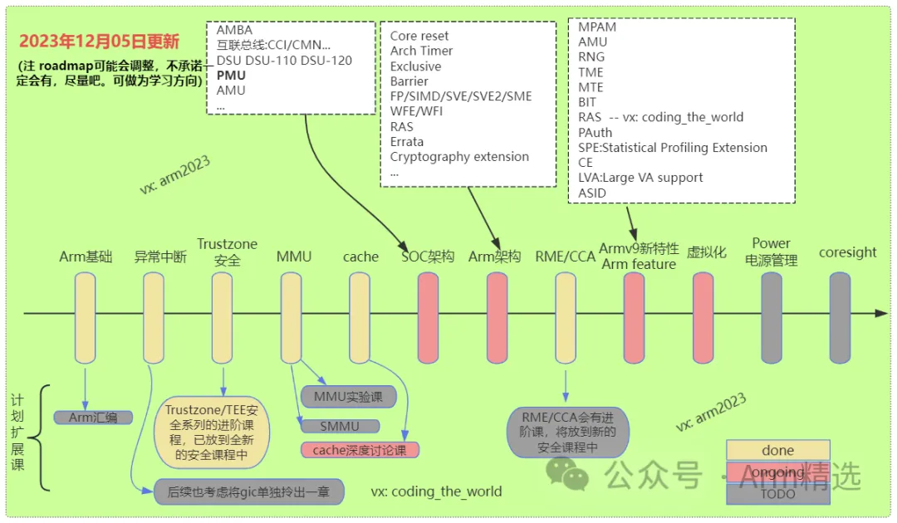
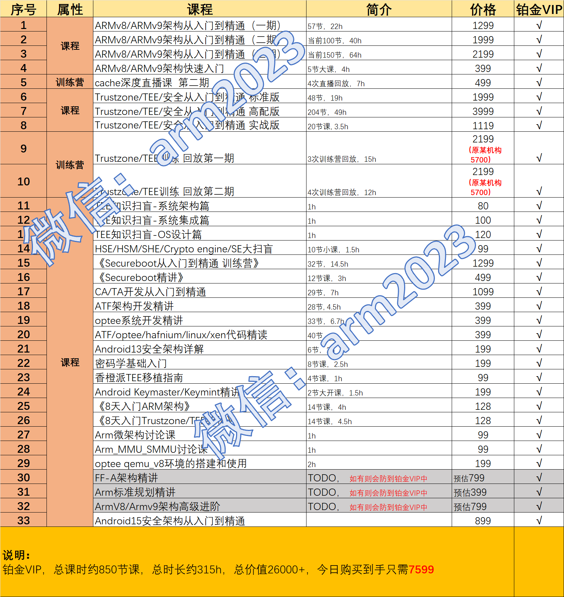
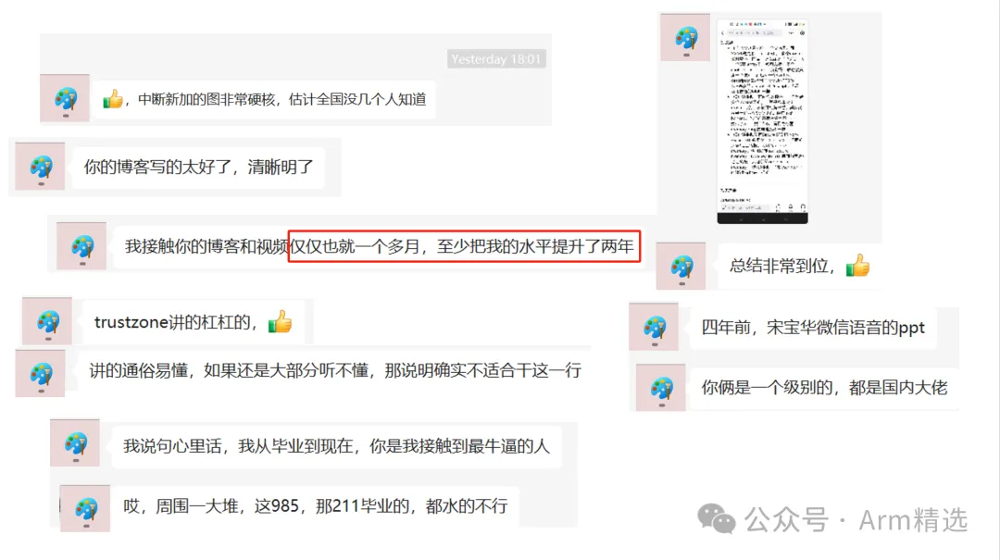
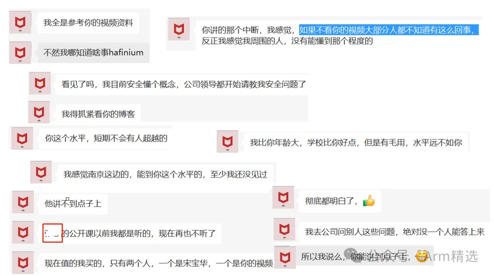
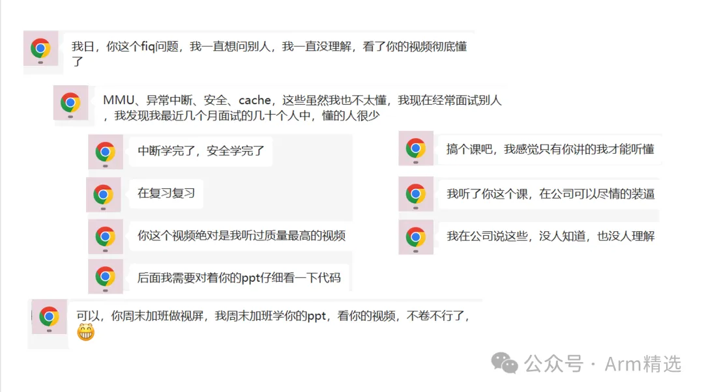
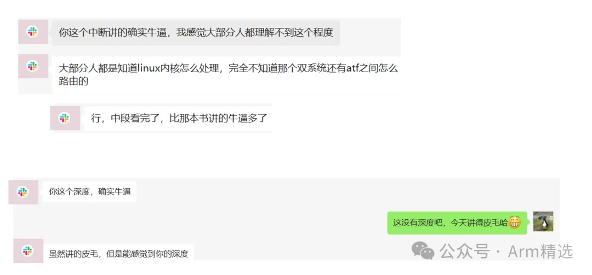
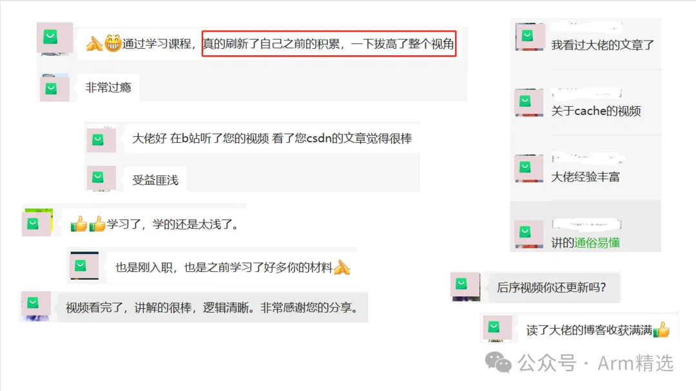
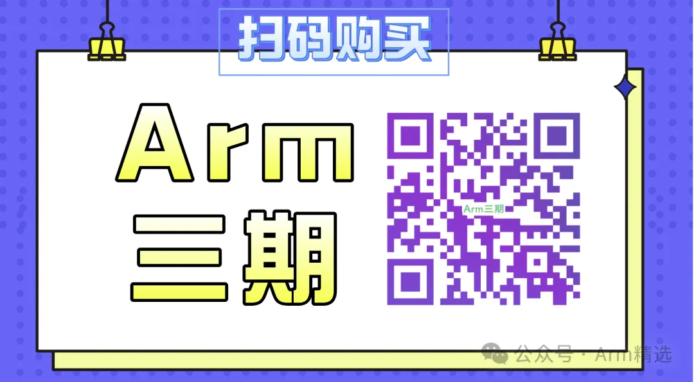

# Arm三期课程介绍

## 学习对象

- **[行业]**：汽车电子、手机、服务器、云计算、物联网、人工智能；
- **[人群]**：本科/研究生/博士、初级工程师、中级工程师、资深工程师、行业大佬，即适合小白入门，也适合大佬查缺补漏；
- **[方向]**：电子/计算机专业、芯片架构设计、芯片底层软件、芯片验证、BSP软件开发、内核驱动开发、固件开发、bootrom/bootloader开发、安全、虚拟化、大系统开发等；
- **[行业链]**：主机厂、OEM、OEM、tier1、SOC厂家、各级供应商；

##  课程特色

- 1、全网最全最新，真正的Armv8和Armv9架构（注：这不是25年前的ARM9, 这也不是15年前的A9, 这里也不讲汇编，这里讲的是架构/架构/架构）；
- 2、这里不读PPT，70%的原创彩色框架图。
- 3、批判性：指出各种互联网中司空见惯的错误。(如FIQ不是快速中断，是转发中断，F是Forward；VIVT根本没人再用...);
- 4、实事求是：有理有据，尽量不瞎说，不编造，一切有源头可查，有文档可参考;
- 5、白话、通俗易懂。课堂不参水分。

##  学员收益

- 1、知道我学习什么，我要怎么去学习，从此之后有了一个明确的学习路线。
- 2、认识一些共同目标的人，相互讨论问题，共同进步。勤学、共学、助学。
- 3、ARM不再神秘，SOC不在神秘，让您短期内就能cover住全局
- 4、熟悉ARM Architecture架构知识
- 5、熟悉SOC架构知识
- 6、熟悉主流的系统软件框架
- 7、熟悉各项硬件原理和机制，如异常中断、MMU、cache、TLB、VMSA、Trustzone
- 6、深入了解当前的系统架构、软硬件架构，能够看懂这些大家，将来也能够自己设计。
- 7、熟悉系统的启动流程、Secureboot等
- 8、熟悉各类标准和规范
- 9、能够进入芯片厂商干活、能够在非芯片产生成为技术担当。
- 10、全体系的掌握ARMv8/ARMv9的核心知识点(ARM基础、异常中断GIC、MMU/Cache、architecture、SOC架构、Trustzone、虚拟化...);
- 11、掌握ARM架构、掌握SOC架构、掌握常规IP(gic、smmu、timer、AXI/ACE/CHI、TZC400、CCI/CMN...)；
- 12、快速熟悉常规系统软件(bootrom、spl、ATF、TEE、bootloader、kernel...), Secureboot安全启动...
- 13、扎实自己的基础知识，技术水平提升N个level, 掌握快速的学习方法；

## 课程大纲

本课程大纲如下所示，总时长约**63小时**，持续更新中。

Armv8/Armv9架构从入门到精通，Armv8/Armv9架构从入门到精通（一期），Armv8/Armv9架构从入门到精通（二期）

Armv8/Armv9架构从入门到精通（三期），Arm一期、Arm二期、学习资料、免费、下载，全套资料，Secureboot从入门到精通，secureboot训练营，ATF架构从入门到精通、optee系统精讲、secureboot精讲，Trustzone/TEE/安全快速入门班，Trustzone/TEE/安全标准版，Trustzone/TEE/安全高配版。全套资料。周贺贺，baron，代码改变世界，coding_the_world，Arm精选，arm_2023，安全启动，加密启动

optee、ATF、TF-A、Trustzone、optee3.14、MMU、VMSA、cache、TLB、arm、armv8、armv9、TEE、安全、内存管理、页表，Non-cacheable,Cacheable, non-shareable,inner-shareable,outer-shareable, optee、ATF、TF-A、Trustzone、optee3.14、MMU、VMSA、cache、TLB、arm、armv8、armv9、TEE、安全、内存管理、页表… 

 Armv8/Armv9架构从入门到精通，Armv8/Armv9架构从入门到精通（一期），Armv8/Armv9架构从入门到精通（二期）

Armv8/Armv9架构从入门到精通（三期），Arm一期、Arm二期、学习资料、免费、下载，全套资料，Secureboot从入门到精通，secureboot训练营，ATF架构从入门到精通、optee系统精讲、secureboot精讲，Trustzone/TEE/安全快速入门班，Trustzone/TEE/安全标准版，Trustzone/TEE/安全高配版。全套资料。周贺贺，baron，代码改变世界，coding_the_world，Arm精选，arm_2023，安全启动，加密启动

optee、ATF、TF-A、Trustzone、optee3.14、MMU、VMSA、cache、TLB、arm、armv8、armv9、TEE、安全、内存管理、页表，Non-cacheable,Cacheable, non-shareable,inner-shareable,outer-shareable, optee、ATF、TF-A、Trustzone、optee3.14、MMU、VMSA、cache、TLB、arm、armv8、armv9、TEE、安全、内存管理、页表… 

## 课程计划

**（强烈建议购买VIP，花更少的钱，买更多的课程。）**

## 学员反馈

## 课程服务

有微信群、有课程群、有PPT、有开源资料、有答疑、有交流...

## 观看指南

1. 在微信里搜索“小鹅通”小程序，输入手机号登陆即可在线观看。
2. 在应用市场下载和安装“小鹅通APP”，输入手机号登陆即可在线观看。使用小鹅通APP观看，支持课程缓存功能，可以离线播放。
3. 微信端打开如下地址，输入手机号登陆即可在线观看。

https://appoxpc9kws6959.h5.xiaoeknow.com

4. 在PC上播放：请先登陆PC版微信然后打开如下网址，或者在PC版微信中打开“小鹅通”微信小程序。

https://appoxpc9kws6959.h5.xiaoeknow.com

## 购买须知

支持试看（自信），详情咨询客服。

## 版权说明

本店铺所有课程/笔记都已经在版权局登记知识版权，版权归作者所有，订购本课程视为同意如下协议：

1. 不得以任何方式翻录/传播本课程，一经发现依法追究相关法律责任。
2. 本课程仅供订购者本人使用，不得私自分享账号给他人。

3、本店铺的部分视频部分帧采用一人一课方式，如发现私自传播的情形，情节严重的，我们将追究法律责任。

## 购买地址

## 联系客服

