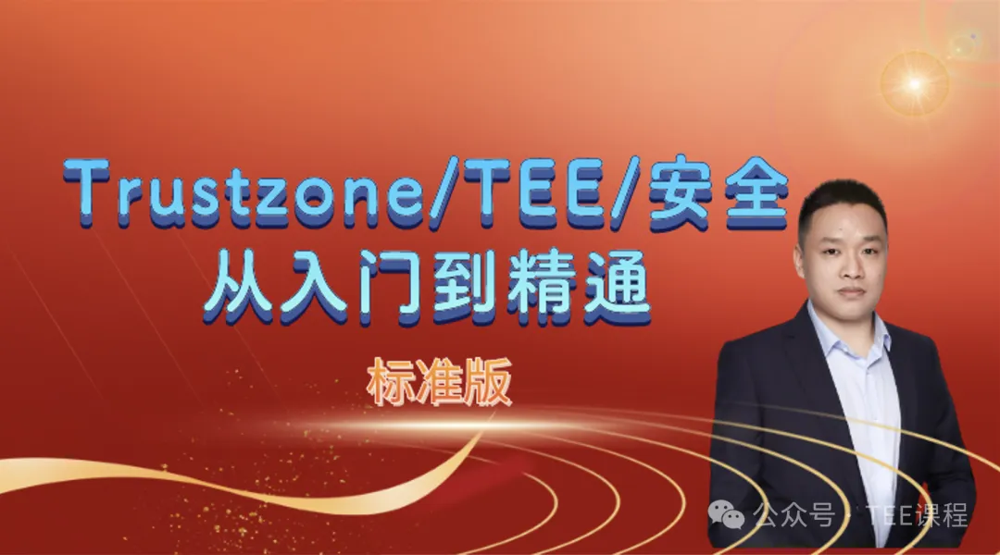
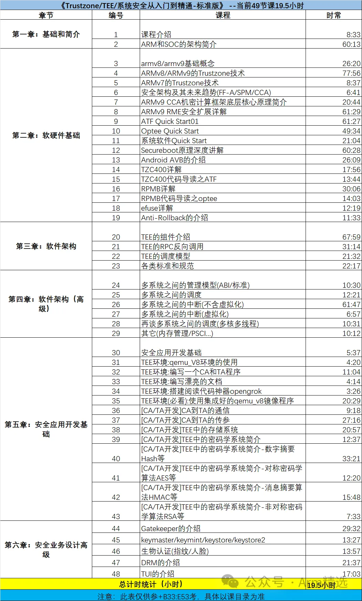

# Trustzone_TEE标准版-48节课_19.5h

**说明：trustzone/tee高配版、标准版、实践版，相互独立，互不包含、互不冲突。**

## 学习对象

**[行业]**：汽车电子、手机、服务器、云计算、物联网、人工智能；

**[人群]**：本科/研究生/博士、初级工程师、中级工程师、资深工程师、行业大佬，即适合小白入门，也适合大佬查缺补漏；

**[方向]**：电子/计算机专业、芯片架构设计、芯片底层软件、芯片验证、BSP软件开发、内核驱动开发、固件开发、bootrom/bootloader开发、安全、虚拟化、大系统开发等；

**[行业链]**：主机厂、OEM、OEM、tier1、SOC厂家、各级供应商；

## 课程特色

1、体系化学习。安全的知识很零碎，而我这里构建了一套体系化的学习路线，从小白到精通、从底层到上层、从硬件到软件、从设计到业务再到标准规范。全方位讲解系统安全、架构安全、整条安全链路。

2、全网唯一，最全和最新。在资料极其匮乏的底层安全赛道，在绝大多数安全知识都视为公司敏感信息的背景，能够克服种种阻力，原创了绝大部分资料和内容，然后分享给大家，让给多的人有东西科学、有方向可走，选择这个行业再也不用迷茫。

3、这里不读PPT，80%的原创彩色框架图。

4、实事求是：有理有据，尽量不瞎说，不编造，一切有源头可查，有文档可参考; 5、白话、通俗易懂。课堂不参水分。

## 学员收益

1、全体系的掌握Trustzone/TEE/安全的核心知识点(包括不限于：Secureboot安全启动、密码学基础知识、安全架构。);

 2、掌握硬件安全架构，包括但不限于：Trustzone安全架构技术、CCA/RME安全架构技术、Armv8/Armv9架构知识、MMU/TLB、Cache等知识。

3、掌握大系统软件设计架构，包括但不限于：Bootrom、spl、ATF、TEE、bootloader、linux、hafnium等 

4、掌握常用安全硬件知识，包括但不限于：efuse、安全硬件、Crypto engine、RPMB 等 

5、熟悉常规的安全业务设计，包括但不限于：TUI、DRM、产线设计、支付设计、android安全设计等

 6、掌握可信安全应用开发基础、掌握安全业务设计基础。

7、扎实自己的基础知识，技术水平提升N个level, 掌握快速的学习方法；

## 课程大纲

(课程目标)

- 1、最快速地了解，SOC安全架构、Arm安全架构、Trustzone/TEE分别是什么？应用场景是怎样的？
- 1、知道我学习什么，我要怎么去学习，从此之后有了一个明确的学习路线。
- 2、认识一些共同目标的人，相互讨论问题，共同进步。勤学、共学、助学。
- 3、ARM不再神秘，SOC不在神秘，安全架构不再神秘，Trustzone不在什么，TEE不在神秘，让您短期内就能cover住全局
- 4、助你技术能力大大提升，质地飞跃，跨级飞跃。
- 5、有了这些基础知识后，市面上出现的任何SOC、任何软件架构，你都不在害怕，都能在短时间内快速上手。

(当前的课程目录和时长)

## 店铺地址

## 客服咨询

