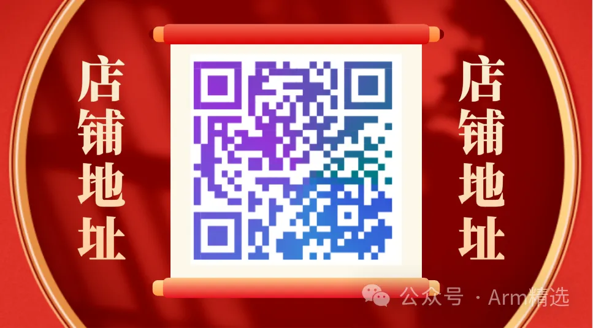

# Trustzone_TEE高配版本-205节_50h

**说明：trustzone/tee高配版、标准版、实践版，相互独立，互不包含、互不冲突。**

## 学习对象

- [行业]：汽车电子、手机、服务器、云计算、物联网、人工智能；
- [人群]：本科/研究生/博士、初级工程师、中级工程师、资深工程师、行业大佬，即适合小白入门，也适合大佬查缺补漏；
- [方向]：电子/计算机专业、芯片架构设计、芯片底层软件、芯片验证、BSP软件开发、内核驱动开发、固件开发、bootrom/bootloader开发、安全、虚拟化、大系统开发等；
- [行业链]：主机厂、OEM、OEM、tier1、SOC厂家、各级供应商；

## 课程背景

2021年ARM又推出了ARMv9架构，系统软件架构也在悄无声息地发生变化。在这种架构中，强调的是隔离技术，包括资源的隔离、运行时隔离，特权操作系统的权限也变得越来越小…

不管您是什么领域，ARM服务器、汽车电子、手机或者是其它设备终端，安全都是其中的一个重要环节。我们常说的安全一般是只网络安全/业务安全/App安全，这些安全依赖的正是操作系统安全，操作系统安全所依赖的就是安全架构技术，在该安全架构中，首当要学习的就是Trustzone/TEE技术。只有设备安全/操作系统安全/APP安全/网络安全/服务器安全整个一条链都安全了，那么你的业务才算得上的安全.

不管您是做什么的，您做不做安全或虚拟化，掌握整个系统软件架构也是一件必要的事情。您只有掌握了安全架构，你才具有全局的视野，才能进行全局的软件设计，才称得上架构师。

 

 

安全不仅仅是架构安全，安全还是一种生态，安全还产生一类标准。安全出现在产品声明周期的任何一个角落，它可能零碎地出现在硬件中、零碎地出现在软件代码中。如果你不了解安全，你可能无法进行优秀的产品设计，你甚至无法去正确的阅读代码。

 

## 课程介绍

（1） 讲解ARM最新硬件架构(ARM Core、ARM Architecture)、SOC架构

（2） 讲解最新的Trustzone安全架构、TEE架构、Secureboot等

（3） 讲解软件组件：TF-A(ATF)、optee_os、Linux Kernel、CA/TA应用程序等，及其交互模型、设计模型

（4） 多系统交互代码导读、安全论证实践、CA/TA示例实践、安全业务设计实践

（5） 我们学习的是全部硬件、全部系统，软硬结合，或者是大系统的软硬件融合

 

## 课程收益

1、安全不再神秘，能cover住全局

2、熟悉ARM Architecture架构知识

3、熟悉SOC架构知识

4、熟悉主流的系统软件框架

5、知道多系统之间是如何交互的，也能够进行系统级的设计

6、深入了解当前的系统安全架构以及未来安全架构趋势

7、熟悉基础的安全业务设计方法

8、熟悉系统的启动流程、Secureboot等

9、知道Linux Kernel在大系统中的位置，以及与其它系统交互的方法

10、熟悉各类标准和规范

11、学习资料的获取方法

## 课程大纲

## 店铺地址

## 客服咨询

