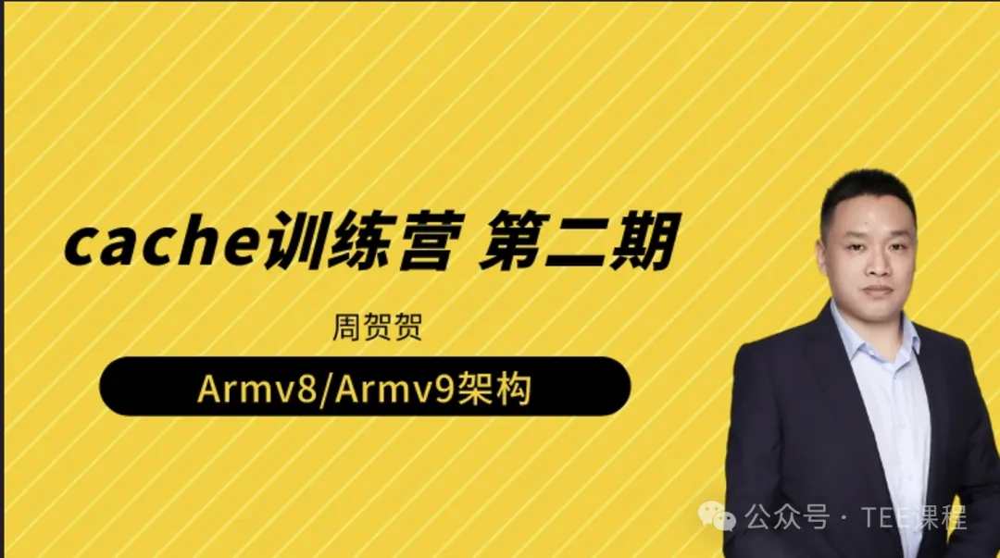
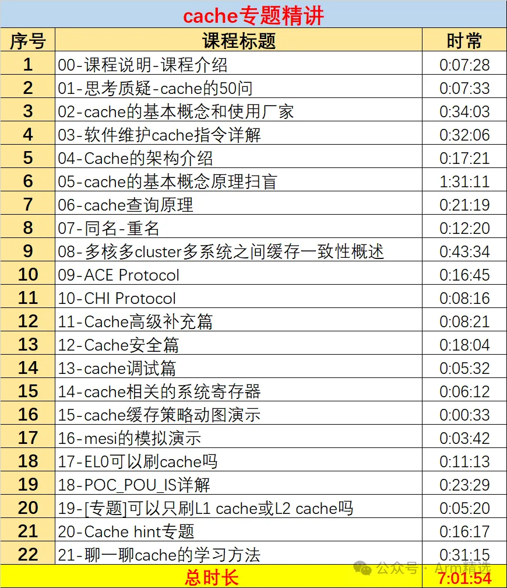
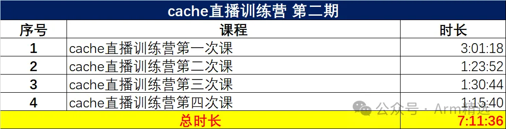
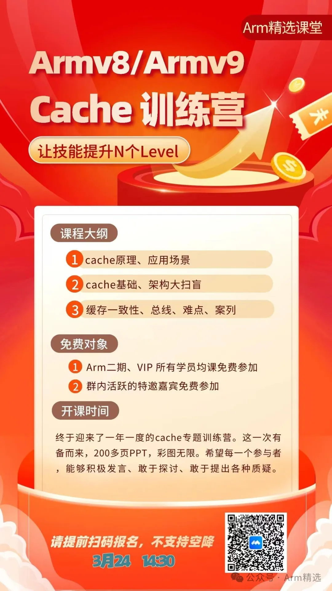
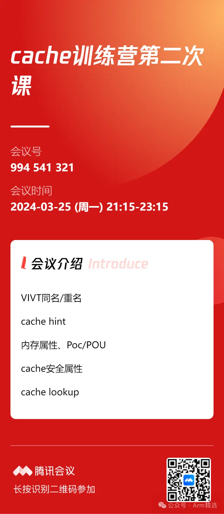
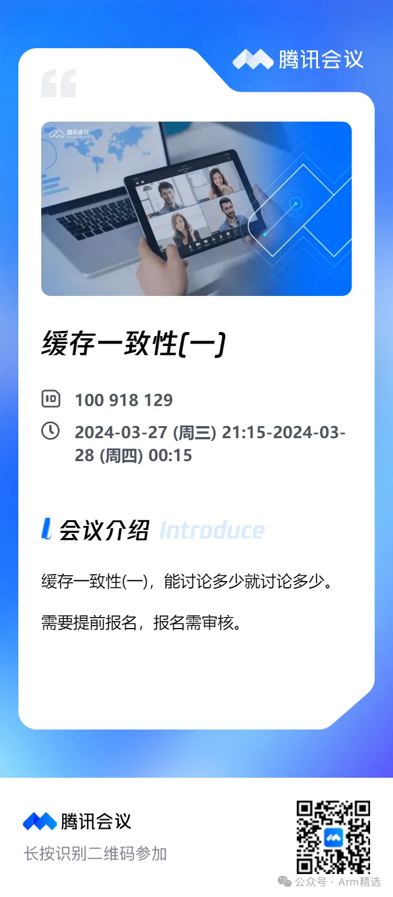
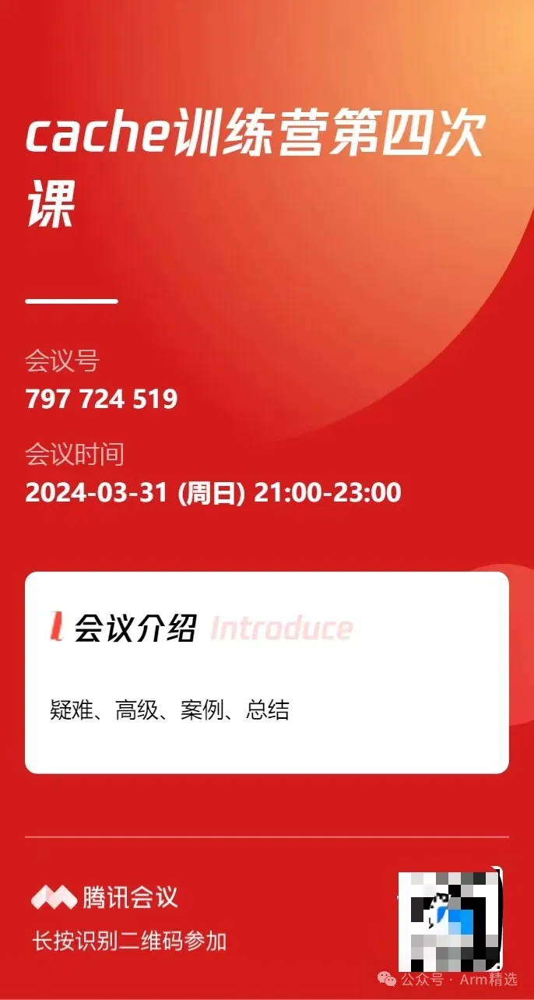
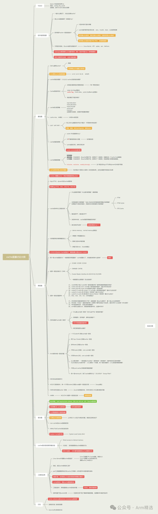

# cache直播训练营回放+cacha专题-单售

**本课程属于Arm三期课程的一部分。建议购买Arm三期课程**。 

**总时长14小时：7h的专题精讲 + 7h的直播回放**。

Armv8/Armv9架构从入门到精通，Armv8/Armv9架构从入门到精通（一期），Armv8/Armv9架构从入门到精通（二期）

Armv8/Armv9架构从入门到精通（三期），Arm一期、Arm二期、学习资料、免费、下载，全套资料，Secureboot从入门到精通，secureboot训练营，ATF架构从入门到精通、optee系统精讲、secureboot精讲，Trustzone/TEE/安全快速入门班，Trustzone/TEE/安全标准版，Trustzone/TEE/安全高配版。全套资料。周贺贺，baron，代码改变世界，coding_the_world，Arm精选，arm_2023，安全启动，加密启动

Armv8/Armv9架构从入门到精通，Armv8/Armv9架构从入门到精通（一期），Armv8/Armv9架构从入门到精通（二期）

Armv8/Armv9架构从入门到精通（三期），Arm一期、Arm二期、学习资料、免费、下载，全套资料，Secureboot从入门到精通，secureboot训练营，ATF架构从入门到精通、optee系统精讲、secureboot精讲，Trustzone/TEE/安全快速入门班，Trustzone/TEE/安全标准版，Trustzone/TEE/安全高配版。全套资料。周贺贺，baron，代码改变世界，coding_the_world，Arm精选，arm_2023，安全启动，加密启动

optee、ATF、TF-A、Trustzone、optee3.14、MMU、VMSA、cache、TLB、arm、armv8、armv9、TEE、安全、内存管理、页表，Non-cacheable,Cacheable, non-shareable,inner-shareable,outer-shareable, optee、ATF、TF-A、Trustzone、optee3.14、MMU、VMSA、cache、TLB、arm、armv8、armv9、TEE、安全、内存管理、页表… 

**购买方法**：

https://zzgpv.xetslk.com/s/kDLn0

