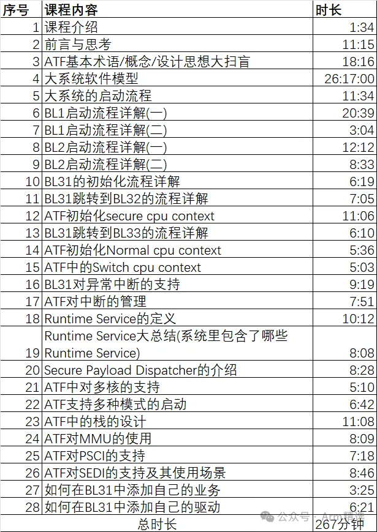

# 《ATF架构开发精讲》课程介绍

（本课程中如有涉及代码或硬件架构，则对应的版本号：TF-A 2.80，optee 3.20, Linux Kernel 6.3，armv8.7+9.0的aarch64）

## 适用人群

- 安全行业开发者
- ATF、固件开发者
- 系统架构师、战略规划师
- 汽车行业软件工程师
- ASIC硬件开发者
- SOC/芯片底层软件开发者
- 系统工程师/BSP软件工程师/驱动工程师
- 学生 ......

既适合资深/高级工程师来查缺补漏，又适合初级工程师入门，也适合ASIC同事跨界学习，软硬件融合。

## 收益

学习《ATF架构开发精讲 》课程的收益如下: 1、全体系的掌握ATF/TF-A的核心知识点; 2、掌握ATF的设计核心思想，能够进入软件架构层次的各项设计；3、学习和理解理解Armv8/Armv9架构、Trustzone架构 4、技术水平提升N个level, 掌握快速的学习方法；

## 课程简介和大纲

该课程包含但不限与以下章节：

- ATF基本术语/概念/设计思想大扫盲
- 大系统的启动流程
- BL1启动流程详解
- BL2启动流程详解
- BL31的初始化流程详解
- BL31跳转到BL32的流程详解
- BL31跳转到BL33的流程详解
- BL31对异常中断的支持
- Runtime Service的定义
- Runtime Service大总结(系统里包含了哪些Runtime Service)
- ATF初始化Normal cpu context
- ATF初始化secure cpu context
- ATF中的Switch cpu context
- ATF中对多核的支持
- ATF中的栈的设计
- ATF对中断的管理
- ATF对MMU的使用
- ATF对PSCI的支持
- ATF对SEDI的支持及其使用场景
- SCP和SCMI简介
- 如何在BL31中添加自己的业务
- 如何在BL31中添加自己的驱动 

## 课程地址

## 客服咨询

