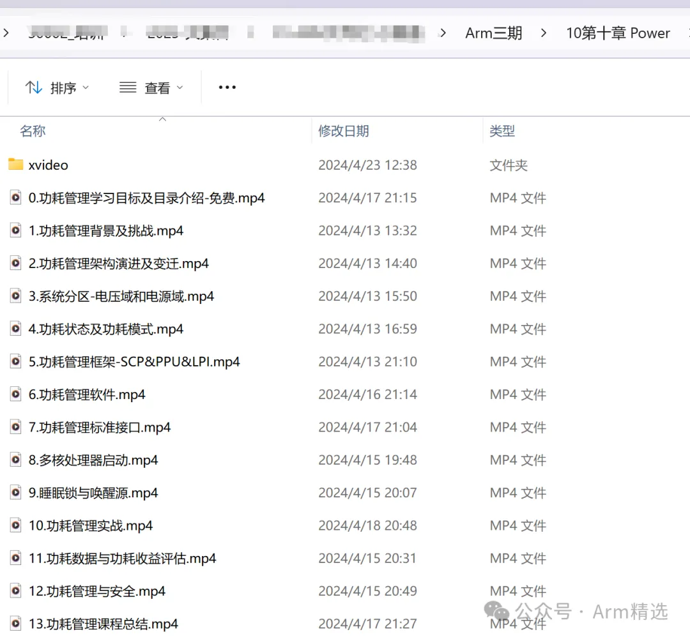

# Arm架构-功耗管理精讲与实战-芯片底层电源管理框架

**本课程属于Arm三期课程的一部分。建议购买Arm三期课程**。 

## **学习目标**

1、为什么要功耗管理？SOC架构中功耗管理示例？功耗管理挑战？

2、从单核->多核->big.LITTLE->DynamIQ，功耗管理架构演进?

3、什么是电压域？什么是电源域？CPU&GPU分区示例？层次结构？

4、功耗状态？功耗模式？Core&Cluster&Device&SoC如何映射？

5、功耗管理框架？SCP？PPU？LPI？之间的关系？如何配合？

6、功耗管理软件栈及示例？WFI&WFE？时钟&电源树？DVFS&AVS？

7、功耗管理有哪些标准接口？ACPI&PSCI&SCMI？

8、SecureBoot？多核处理器启动流程？PSCI启动方式？

9、什么是睡眠锁？什么是唤醒源？什么是组合唤醒源？

10、睡眠唤醒实验？压力测试？Suspend-to-Idle/RAM/Disk演示？

11、功耗数据如何测试？功耗曲线？功耗收益评估？

12、功耗与安全？超频攻击？欠压攻击？低功耗流程中的安全？

## **课程特色**

- **全网唯一、全球首发**
- **这是芯片底层的功耗电源管理架构**

## 课程大纲

1、功耗管理背景及挑战

2、功耗管理架构演进及变迁

3、系统分区-电压域和电源域

4、功耗状态及功耗模式

5、功耗管理框架-SCP&PPU&LPI

6、功耗管理软件

7、功耗管理标准接口

8、多核处理器启动

9、睡眠锁与唤醒源

10、功耗管理实战

11、功耗数据与功耗收益评估

12、功耗管理与安全

## 购买地址

**也欢迎购买Arm二期，现在购买Arm二期，周末自动送Arm三期，三期望中将包含****“Arm架构-功耗管理精讲与实战”****章节**

## 联系客服

Armv8/Armv9架构从入门到精通，Armv8/Armv9架构从入门到精通（一期），Armv8/Armv9架构从入门到精通（二期）

Armv8/Armv9架构从入门到精通（三期），Arm一期、Arm二期、学习资料、免费、下载，全套资料，Secureboot从入门到精通，secureboot训练营，ATF架构从入门到精通、optee系统精讲、secureboot精讲，Trustzone/TEE/安全快速入门班，Trustzone/TEE/安全标准版，Trustzone/TEE/安全高配版。全套资料。周贺贺，baron，代码改变世界，coding_the_world，Arm精选，arm_2023，安全启动，加密启动

optee、ATF、TF-A、Trustzone、optee3.14、MMU、VMSA、cache、TLB、arm、armv8、armv9、TEE、安全、内存管理、页表，Non-cacheable,Cacheable, non-shareable,inner-shareable,outer-shareable, optee、ATF、TF-A、Trustzone、optee3.14、MMU、VMSA、cache、TLB、arm、armv8、armv9、TEE、安全、内存管理、页表… 

 Armv8/Armv9架构从入门到精通，Armv8/Armv9架构从入门到精通（一期），Armv8/Armv9架构从入门到精通（二期）

Armv8/Armv9架构从入门到精通（三期），Arm一期、Arm二期、学习资料、免费、下载，全套资料，Secureboot从入门到精通，secureboot训练营，ATF架构从入门到精通、optee系统精讲、secureboot精讲，Trustzone/TEE/安全快速入门班，Trustzone/TEE/安全标准版，Trustzone/TEE/安全高配版。全套资料。周贺贺，baron，代码改变世界，coding_the_world，Arm精选，arm_2023，安全启动，加密启动

optee、ATF、TF-A、Trustzone、optee3.14、MMU、VMSA、cache、TLB、arm、armv8、armv9、TEE、安全、内存管理、页表，Non-cacheable,Cacheable, non-shareable,inner-shareable,outer-shareable, optee、ATF、TF-A、Trustzone、optee3.14、MMU、VMSA、cache、TLB、arm、armv8、armv9、TEE、安全、内存管理、页表… 

**TEE课程**

Armv8/Armv9架构课程、Trustzone/TEE课程、Secureboot课程、安全课程

8篇原创内容

公众号
