# Secureboot从入门到精通-训练营

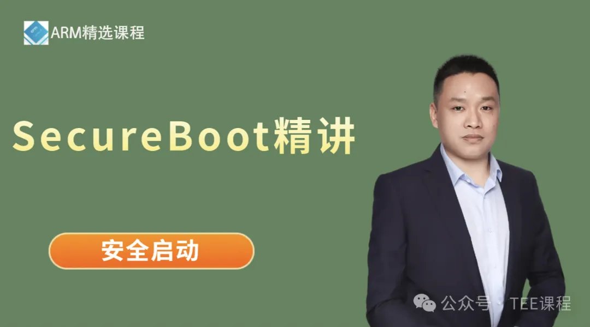

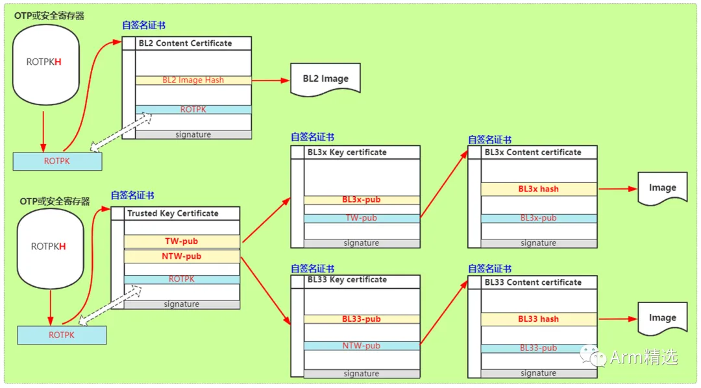

------

#### 学习对象

**[行业]**：汽车电子、手机、服务器、云计算、物联网、人工智能；

**[人群]**：本科/研究生/博士、初级工程师、中级工程师、资深工程师、行业大佬，即适合小白入门，也适合大佬查缺补漏；

**[方向]**：电子/计算机专业、芯片架构设计、芯片底层软件、芯片验证、BSP软件开发、内核驱动开发、固件开发、bootrom/bootloader开发、安全、虚拟化、大系统开发等；

**[行业链]**：主机厂、OEM、OEM、tier1、SOC厂家、各级供应商；

#### 课程特色

1、全网***唯一***最全最新，真正的基于SOC的、基于Cortex-A的、基于Armv8/Armv9架构的安全启动/Secureboot；

2、这里不读PPT，80%的***原创****彩色***框架图。

3、这里深度解读原理、代码导读。深度解读安全启动链路中的每一个环节。

4、这里不仅有疯狂的安全硬件知识，还有软件框架、软件设计标准规范，还有大量的secureboot启动案列、大量的刷机案例。非常适合小白到入门。

5、白话、通俗易懂。课堂不参水分。

#### 学员收益

1、全体系的掌握安全软硬件核心知识点(efuse、Rpmb、crypto engine、密码学算法、ATF固件、启动的标准规范...); 

2、掌握常规通用的刷机流程和刷机示例、掌握常规和通用的Secureboot安全启动方法；

3、快速熟悉常规系统软件(bootrom、spl、ATF、TEE、bootloader、kernel...), Secureboot安全启动... 

4、扎实自己的基础知识，技术水平提升N个level, 掌握快速的学习方法；

#### 课程大纲

(当前的课程目录和时长)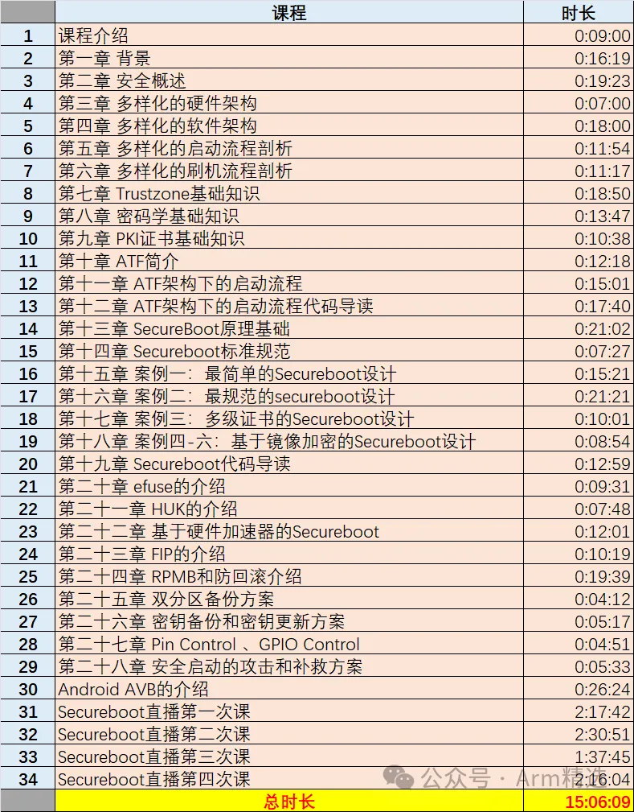

(课程体系：该课程属于VIP中的一部分，全系列的VIP课程如下所示，强烈建议购买VIP，花更少的钱买更多的课，学习更多的内容)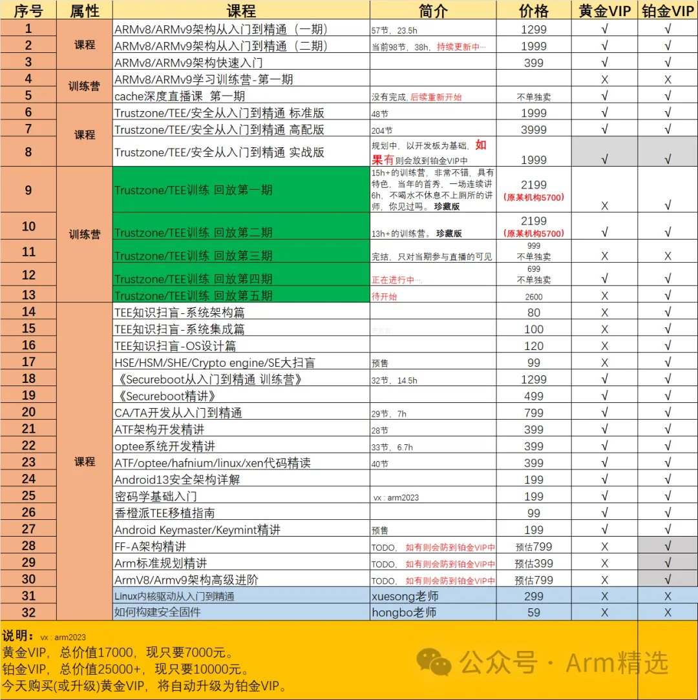

#### 职位匹配

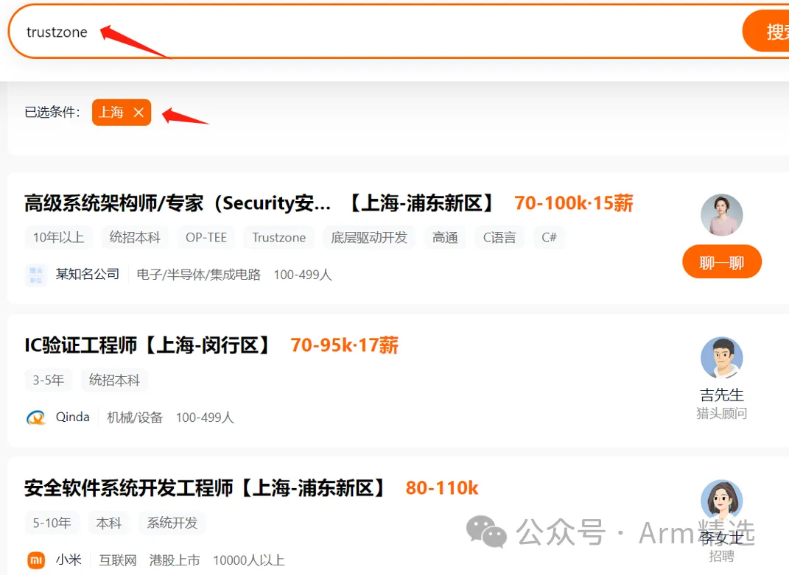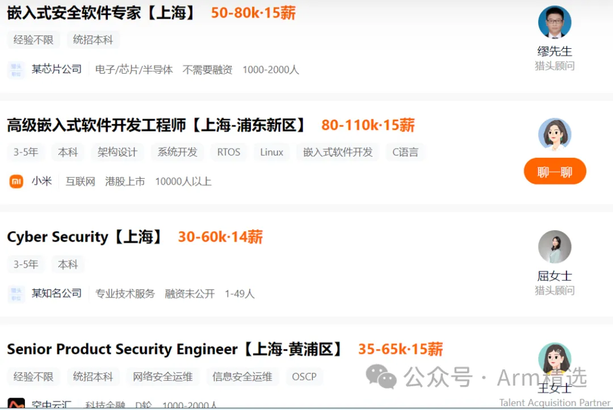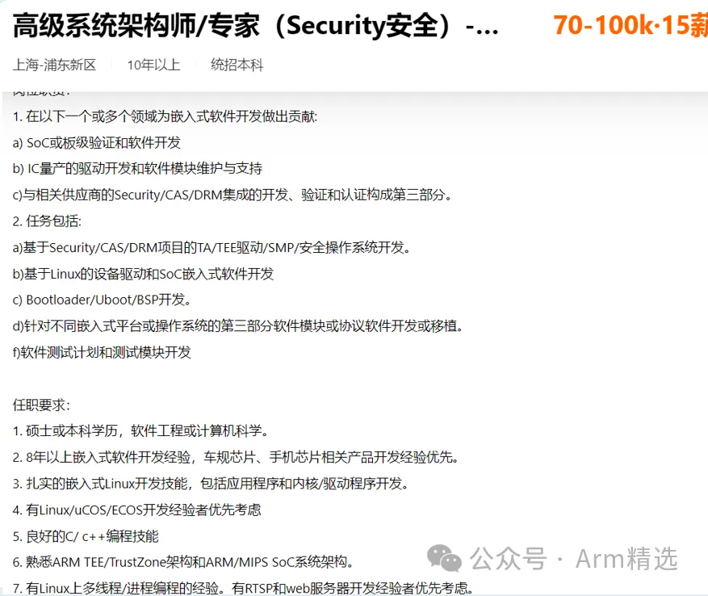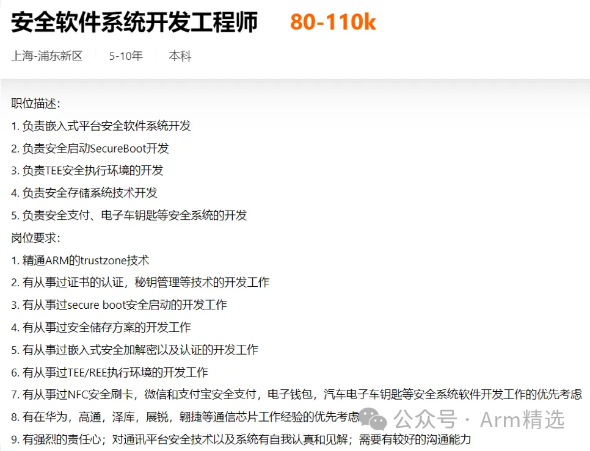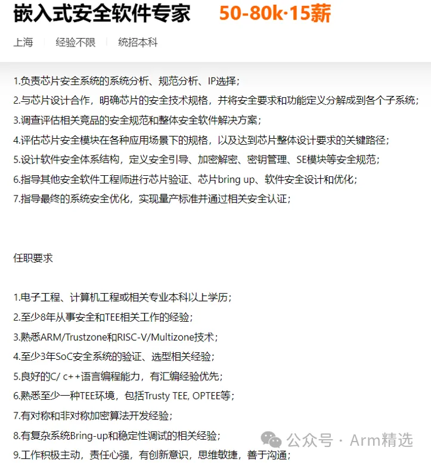

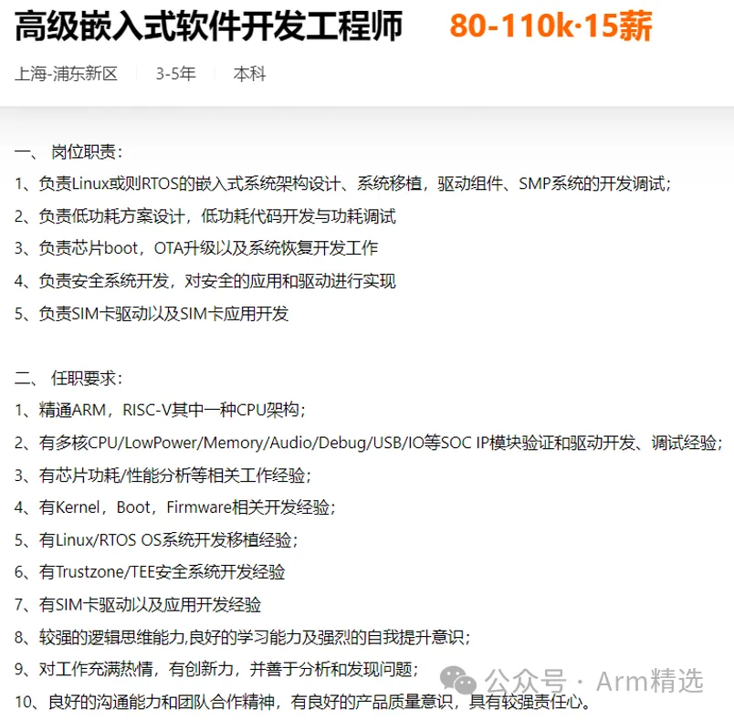

#### 学员反馈

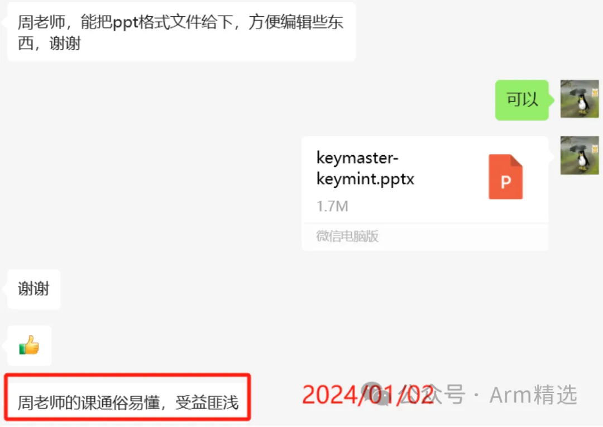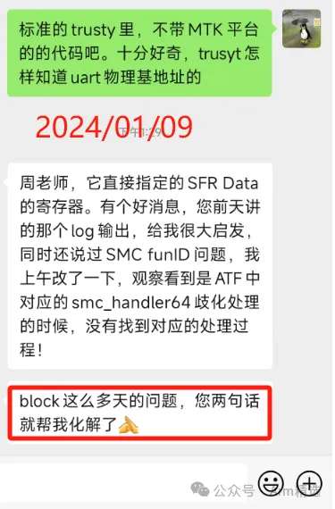

#### 讲师寄语

**薪资翻翻、年薪百万、迎娶白富美、走向人生巅峰**！！

#### 课程地址

#### 客服咨询

