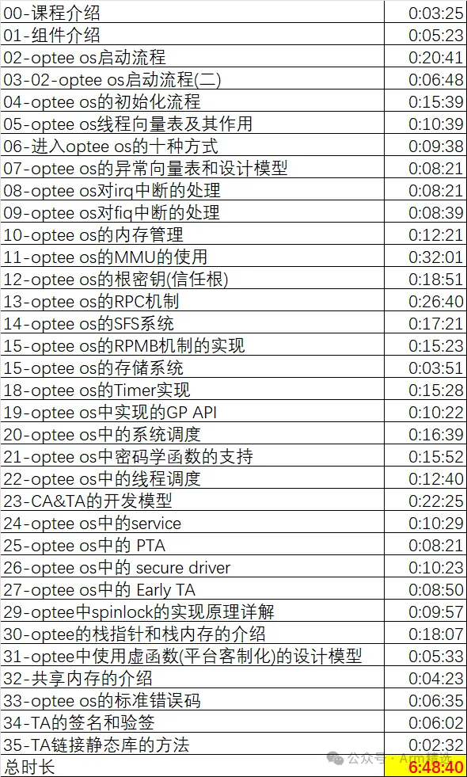

# 《optee系统开发精讲》课程介绍

（本课程中如有涉及代码或硬件架构，则对应的版本号：TF-A 2.80，optee 3.20, Linux Kernel 6.3，armv8.7+9.0的aarch64） （**注意：该课程没有PPT，该课程是对照代码讲解的**）

## 适用人群

- 安全行业开发者
- ATF、固件开发者
- 系统架构师、战略规划师
- 汽车行业软件工程师
- ASIC硬件开发者
- SOC/芯片底层软件开发者
- 系统工程师/BSP软件工程师/驱动工程师
- 学生 ......

既适合资深/高级工程师来查缺补漏，又适合初级工程师入门，也适合ASIC同事跨界学习，软硬件融合。

## 收益

学习《optee系统开发精讲 》套餐的收益如下:

 1、全体系的掌握optee的核心知识点(多核多线程、启动流程、各类API、TA/PTA/STA、driver、service、各类设计思想、内存管理、中断管理...); 

2、掌握TEE OS的设计核心思想(不限与optee，对其它TEE也是如此)，能够进入软件架构层次的各项设计；

3、快速熟悉大系统软件的各项组件，能够进行大系统软件之间的设计或排查问题

 4、学习和理解理解Armv8/Armv9架构、Trustzone架构 

5、技术水平提升N个level, 掌握快速的学习方法；

## 课程简介和大纲

该课程包含但不限与以下章节：

- optee的组件介绍

- optee os启动流程

- optee os的初始化流程

- optee os线程向量表及其作用

- 进入optee os的八种方式

- optee os的异常向量表和设计模型

- optee os对irq中断的处理

- optee os对fiq中断的处理

- optee os的内存管理

- optee os的MMU的使用

- optee os的根密钥(信任根)

- optee os的RPC机制

- optee os的存储系统

- optee os的SFS系统

- optee os的RPMB机制的实现

- optee os的Timer实现

- optee os中实现的GP API

- optee os中的系统调度

- optee os中密码学函数的支持

- optee os中的线程调度

- CA/TA的开发模型

- optee os中的service

- optee os中的 PTA

- optee os中的 secure driver

- optee os中的 Early TA

- optee中spinlock的实现原理详解

- optee中mutex的实现方式

- optee的栈指针和栈内存的介绍

- optee中使用虚函数(平台客制化)的设计模型

- 共享内存的介绍

- optee os的标准错误码

- TA的签名和验签

- TA链接静态库的方法

  

## 课程地址

## 客服咨询

