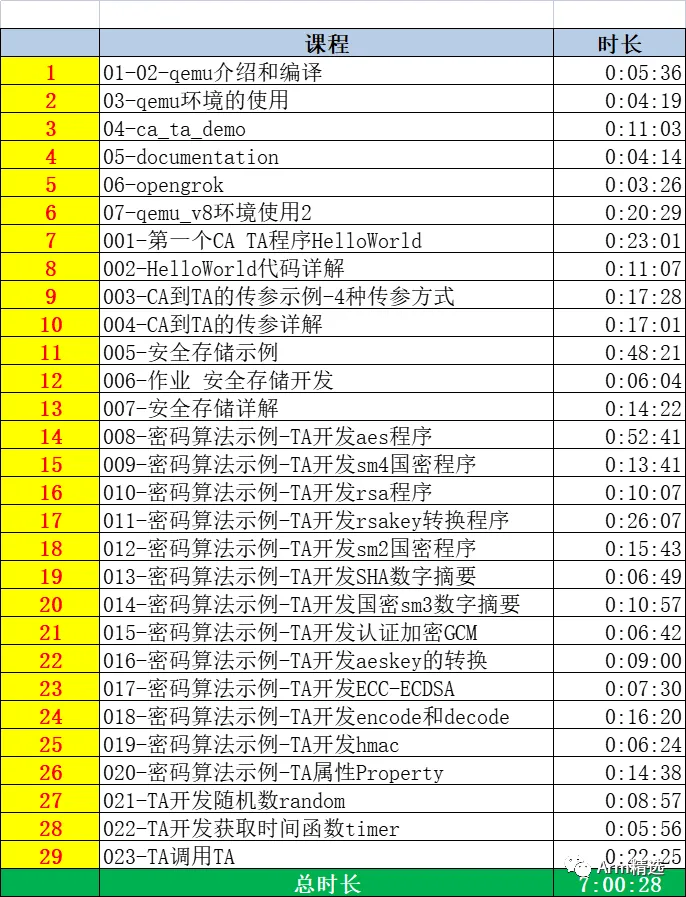

# 《CA_TA开发从入门到精通》课程介绍

Hello大家好，上架一门新的视频课程，课程主要包含两大部分，第一部分搭建环境，第二部分从无到有的编写代码。带领大家"手把手"编写。 一门课程打通在不同TEE OS上进行CA/TA开发的所有用法。

|  | **ARM精选频道**              | _    |
| -------------------------------------------- | ---------------------------- | ---- |
| 00:02                                        | 课程亮点                     | _    |
| 00:05                                        | 受益人群                     | _    |
| 00:06                                        | 课程收益                     | _    |
| 00:08                                        | 课程大纲 - qemu v8环境搭建   | _    |
| 00:09                                        | 课程大纲 - CA/TA开发编程实践 | _    |

★ 课程亮点★

从无到有、手把手教你编写CA/TA，快速上手，快速部署项目标准的开发，开发一套CA/TA，可部署到不同的TEE OS上。

★ 受益人群 ★

汽车行业主机厂、tier1、SOC芯片公司的安全部门同事

手机行业，ODM/OEM、SOC芯片公司的安全部门同事

学生

★ 课程收益 ★

熟悉CA/TA开发的步骤和流程。快速上手，快速搭建自己开发环境。

熟悉各类TEE、基于各类TEE的CA/TA开发步骤。搭建自己的安全平台

熟悉各类常规安全应用

熟悉tee密码学算法、tee存储

★ qemu v8环境搭建★

- 搭建一个qemu_v8的环境，用于跑BL1-->BL2-->BL31-->BL32-->BL33-->Linux kerne
- l直接使用已搭建好的镜像
- 工程使用以及说明

★ CA/TA开发编程实践 ★

从无到有编写代码，已完成的大纲如下：

- 2秒钟快速编写(clone)一组CA/TA程序
- 安全存储详解以及代码示例
- CA到TA双向传参数的四种方式（value、temref、memref），区别？优缺点？
- 对称密码学算法aes的使用，CBC/ECB/CTR/XTS分组密码的使用，加密解密，pending等
- aeskey的操作，如何随机生成aeskey（TEE_GenerateKey），objectHandle和aesbuf有什么区别？如何将handle
- 认证加密算法，如aes-GCM的使用
- 非对称密码学算法RSA的使用，包括加密、解密、签名、验签
- RSA key的处理，包含如何生成RSA KEY，rsakey object如何转换成可见的数组，如何转换der，如何转换pem，反向又如何转换
- ECC/ECDSA的使用
- 国密sm2 sm3 sm4的使用. 其中sm4包含加密、解密、签名、验签等
- encode和decode的实现
- TA属性的定制以及API的使用
- 数字摘要 SHA1 sha224 sha256 sha384 sha512等
- 消息认证码 HMAC
- TEE侧获取时间的函数有哪些(TEEGetSystemTime、TEEGetREETime)，有什么区别？分别是怎样使用的？
- 如何获取随机数（TEE_GenerateRandom）？
- TA调用TA的示例和演示

后续可能继续补充的如下（也欢迎大家提需求）：

- multi-session和multi-instance的使用
- CA LOGIN flag的使用

#### 课程地址】

#### 【客服咨询】

