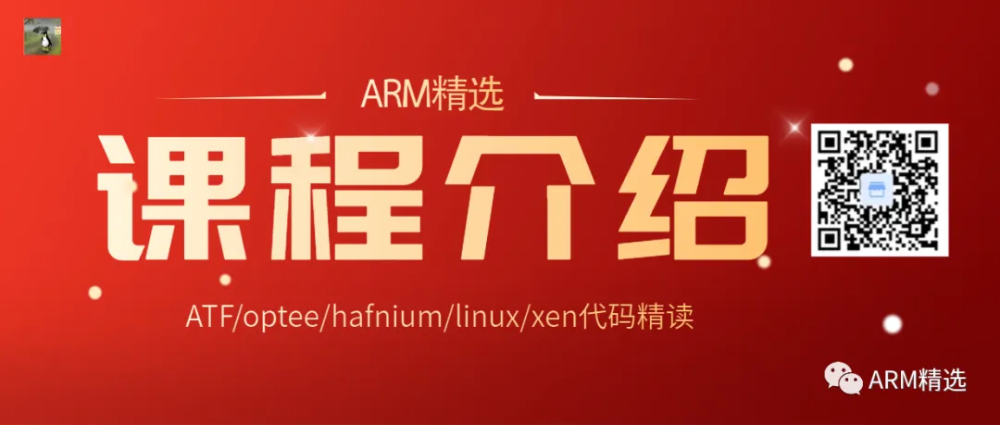
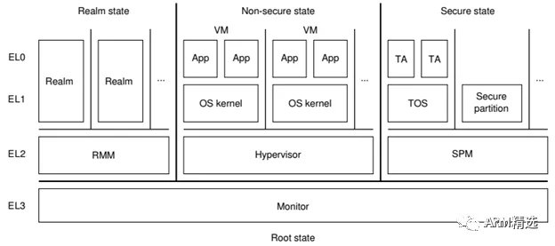
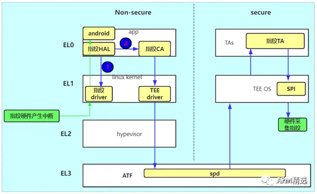
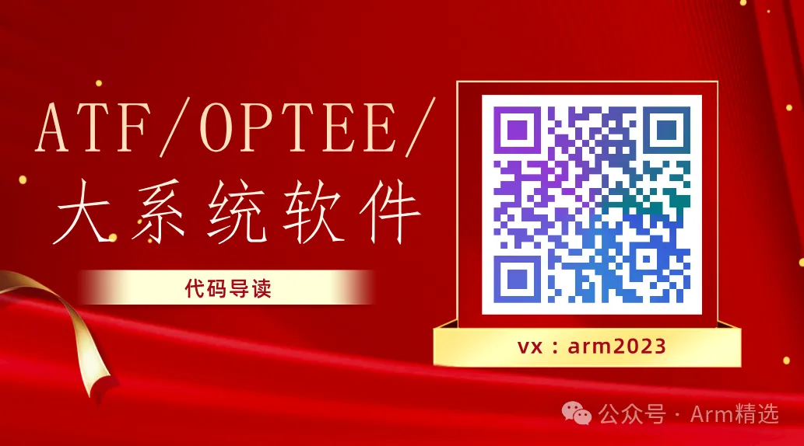

# ATF_optee_hafnium_linux_xen代码精读

|  | **TEE课程** | _    |
| -------------------------------------------- | ----------- | ---- |
| 00:02                                        | 课程内容    | _    |
| 00:05                                        | 课程亮点    | _    |

★ 课程内容★

1、介绍ARMV8/ARMV9最新架构，SOC最新架构，直接带领着您去阅读代码掌握一手经验；

2、导读的代码包含但不限于：TF-A(ATF)、hafnium、optee、Linux Kernel、xen、bootrom、spl、uboot等

3、对于TEE常规组件包含但不限于：optee_os、optee_client_lib、tee-supplicant、optee_linux_kernel_driver、CA/TA程序；

4、在导读的过程中，除了学习多系统下的软件交互，还会认真的剖析硬件机制和原理，例如MMU/CACHE/GIC/异常中断等；

5、软硬件交互，包含启动的交互，即整个大系统的启动流程；也包含runtime时的交互，即在运行时多系统之间如何跳转的，本质是什么等；

6、更多信息，请认真查看本课程的目录（本视频具体内容以目录为主）

★课程亮点★

1、强调软硬件融合。让您从软件到硬件全面打通，从此自信爆棚；

2、高效率学习（学会高效率的学习方法），拒绝死啃；最大特色，突出快字；本系列注重讲解原理、注重讲解设计方法、思想结构，更是教大家一种快速阅读代码的方法。同时也能帮助大家少走一些弯路，烧踩一些低级的坑，节省大家的时间，让您快速从小白进阶大牛；

附录1:未来主流的软件框图

附录2:(以指纹为例)一张经典的软件架构图

#### 【视频介绍/预览】---必看！！！

以下视频来源于

Arm精选

，时长01:58

#### 【课程地址】

#### 【客服咨询】

