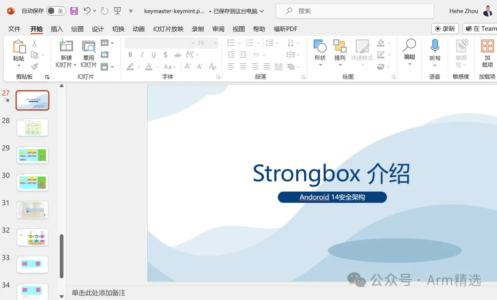

# Keystore_keymaster_keymint课程

#### 课程大纲：

Keystore/Keystore2/keymaster/keymint的概念 keymaster/keymint的版本演进 keymint接口示例 Keystore/keymaster/keymint/Strongbox 软件框架 Keystore软件框架 Keystore算法使用示例 要求进行用户身份验证才能使用密钥 Keystore-strongbox 算法使用示例 AuthToken的使用示例 A/B System AVB 2.0 AVB需求和设计 RootOfTrust 定义 Root of trust binding ROT的介绍 版本绑定 Trusty CA和TA通信的定义 Trusty CA和TA的代码 Keymaster和keymint HAL接口定义 Android attestation Key Android RKP Keystore异常示例

strongbox........

#### PPT和代码的展示：

#### 【课程地址】

https://zzgpv.xetlk.com/s/1CJHC3

#### 【客服咨询】

Armv8/Armv9架构从入门到精通，Armv8/Armv9架构从入门到精通（一期），Armv8/Armv9架构从入门到精通（二期）Armv8/Armv9架构从入门到精通（三期），Arm一期、Arm二期、学习资料、免费、下载，全套资料，Secureboot从入门到精通，secureboot训练营，ATF架构从入门到精通、optee系统精讲、secureboot精讲，Trustzone/TEE/安全快速入门班，Trustzone/TEE/安全标准版，Trustzone/TEE/安全高配版。全套资料。周贺贺，baron，代码改变世界，coding_the_world，Arm精选，arm_2023，安全启动，加密启动optee、ATF、TF-A、Trustzone、optee3.14、MMU、VMSA、cache、TLB、arm、armv8、armv9、TEE、安全、内存管理、页表，Non-cacheable,Cacheable, non-shareable,inner-shareable,outer-shareable, optee、ATF、TF-A、Trustzone、optee3.14、MMU、VMSA、cache、TLB、arm、armv8、armv9、TEE、安全、内存管理、页表…  Armv8/Armv9架构从入门到精通，Armv8/Armv9架构从入门到精通（一期），Armv8/Armv9架构从入门到精通（二期）Armv8/Armv9架构从入门到精通（三期），Arm一期、Arm二期、学习资料、免费、下载，全套资料，Secureboot从入门到精通，secureboot训练营，ATF架构从入门到精通、optee系统精讲、secureboot精讲，Trustzone/TEE/安全快速入门班，Trustzone/TEE/安全标准版，Trustzone/TEE/安全高配版。全套资料。周贺贺，baron，代码改变世界，coding_the_world，Arm精选，arm_2023，安全启动，加密启动optee、ATF、TF-A、Trustzone、optee3.14、MMU、VMSA、cache、TLB、arm、armv8、armv9、TEE、安全、内存管理、页表，Non-cacheable,Cacheable, non-shareable,inner-shareable,outer-shareable, optee、ATF、TF-A、Trustzone、optee3.14、MMU、VMSA、cache、TLB、arm、armv8、armv9、TEE、安全、内存管理、页表… 

