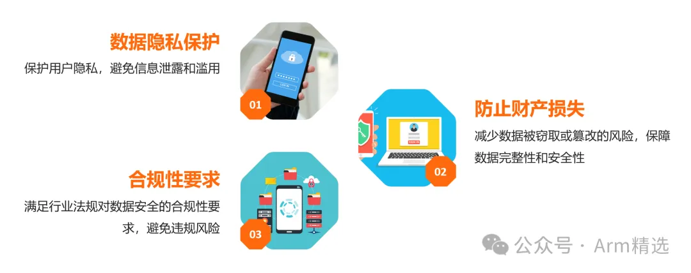

# Android15安全架构-课程介绍

### 1. Android安全架构

Android系统为用户提供了一个相对安全的操作环境，保护了用户数据和设备的安全。Android操作系统在安全性方面投入了大量资源，以保护用户数据和设备免受恶意攻击。以下是Android安全架构中的几个关键组件及其功能介绍：

#### 1.1. 应用程序沙盒（Application Sandbox）

应用程序沙盒是Android安全模型的核心。每个应用程序在独立的进程中运行，并且拥有一个唯一的用户ID (UID)，使得应用程序之间不能直接访问彼此的数据。这种隔离机制确保了即使一个应用程序被恶意攻击，其他应用程序和系统数据也能保持安全。

#### 1.2. 应用程序签名

Android要求所有应用程序在安装前必须进行签名。签名通过开发者的私钥进行，加密后生成的签名文件被附加到APK（Android应用包）中。系统使用开发者的公钥来验证签名的有效性，确保应用程序没有被篡改。这种机制提供了应用程序的完整性和身份认证。

#### 1.3. fs-verity

fs-verity是一种只读文件系统的完整性验证机制。它使用Merkle树结构对文件内容进行哈希处理，可以有效检测文件的篡改。每次文件读取操作都会验证文件的哈希值，确保其未被修改。fs-verity主要用于保护系统文件和应用数据的完整性。

#### 1.4. AVB（Android Verified Boot）

AVB是Android的验证引导机制，旨在确保设备启动时加载的每一层软件都是可信的。AVB通过链式信任验证，逐层检查引导加载程序、内核、系统分区等的完整性和真实性。如果任何层被篡改，设备将无法启动或进入受限模式。

#### 1.5. dm-verity

dm-verity是用于验证设备启动过程中磁盘分区数据完整性的机制。它使用类似于fs-verity的Merkle树结构，在引导时验证系统分区数据。如果检测到分区数据被篡改，系统将进入只读模式，防止恶意软件进一步损害设备。

#### 1.6. 文件基加密（FBE）

FBE是Android 7.0引入的文件级别加密机制。与全盘加密不同，FBE允许不同的文件使用不同的密钥进行加密，从而支持多用户和工作模式。每个用户的数据只有在成功解锁设备后才能解密，提高了数据的安全性。

#### 1.7. Keystore2（KeyMint、StrongBox）

Keystore2是Android的加密密钥管理系统。KeyMint和StrongBox是其两个关键组件。KeyMint提供了一套API，用于在可信硬件中生成和管理加密密钥。StrongBox则是一个独立的硬件安全模块（HSM），专门存储高价值的加密密钥，如用于支付和生物认证的密钥。

#### 1.8. Gatekeeper/生物认证

Gatekeeper是Android的密码验证框架，负责管理设备锁屏密码的验证。生物认证（如指纹和面部识别）集成在Gatekeeper中，通过硬件安全模块确保生物特征数据的安全存储和处理。生物认证提供了便捷且安全的身份验证方式。

#### 1.9. SELinux

SELinux是Linux内核中的安全模块，Android自4.3版本开始引入SELinux来强化系统安全。SELinux通过强制访问控制（MAC）策略，限制进程和用户对系统资源的访问，防止恶意应用利用系统漏洞进行攻击。

#### 1.10. OEM锁（OEM Lock）

OEM锁是一种防止设备被非授权人员刷写自定义固件的安全机制。启用OEM锁后，只有通过官方渠道并获得用户明确授权，才能解锁设备进行固件更新。这有助于保护设备免受恶意固件的侵害。

#### 1.11. DRM（数字版权管理，Widevine等）

DRM技术用于保护数字内容的版权。Widevine是Google提供的一种DRM解决方案，广泛应用于流媒体服务。它通过加密和密钥管理机制，确保只有授权设备和用户才能访问受保护的内容，防止未经授权的复制和分发。

#### 1.12. OMAPI（Open Mobile API，安全元件）

OMAPI是一种用于与安全元件（SE）通信的标准API。安全元件是一种独立的硬件模块，用于存储和处理敏感数据，如支付卡信息和加密密钥。OMAPI使应用程序能够安全地访问和操作这些数据，确保敏感信息的安全性。

### 2. Android安全的增强功能？

- AddressSanitizer
- Arm内存标记扩展(MTE)
- 边界排错(BoundSan):Bounds Sanitizer
- 控制流完整性(CFI):Control Flow Integrity
- 只能执行的内存:Excute-only Memory
- 通过libFuzzer进行模糊测试：Fuzzing with libFuzzer
- GWP ASan 和KFENCE
- HWAddressSanitizer
- 整数溢出排错功能
- kernel CFI
- LLVM Sanitizers
- 内存安全
- HWASan、ASan 和KASAN
- 安全测试套件
- Scudo
- Shadow Call Stack
- Tagged Pointer
- 了解HWASan报告
- 零初始化内存:Zero Initialized Memory

### 3. Android安全有哪些优秀的课程？

**Android15安全架构大课程**，最新上架，即将完成。(还有4小节没录)

- 01-Android安全概述
- 02-Trusty环境搭建-qemu-android
- 03-Trusty下新增一个CA/TA
- 04-1-Gatekeeper
- 04-2-Gatekeeper代码导读-从Framework到TA全栈流程解读
- 04-3-Gatekeeper代码导读-TA底层的实现
- 05-生物认证-概述
- 06-生物认证-指纹
- 07-生物认证-人脸
- 08-Keystore/Keymaster/Keymint
- 09-Strongbox
- 10-GoogleKey
- 11-lD attestation
- 12-AVB
- 13-DICE
- 14-DRM
- 15-RKP
- 16-deviceLock
- 17-secretkeeper
- 18-FDE/FBE (注:FBE/FDE课程由董老师赞助支持，不一定放到VIP课程中)
- 19- selinux
  

### 4. 如何购买、提升自己、让自己变得更牛逼？

#### 4.1 课程地址

**购买地址** ：https://zzgpv.xetlk.com/s/1JA7Hb

或者**扫码购买**：

#### 4.2 铂金VIP更划算

该课程(除FBE小节)将会加入到VIP中去。VIP

### **又双叒叕**

升值了。

**（强烈建议购买VIP，花更少的钱，买更多的课程。）**

