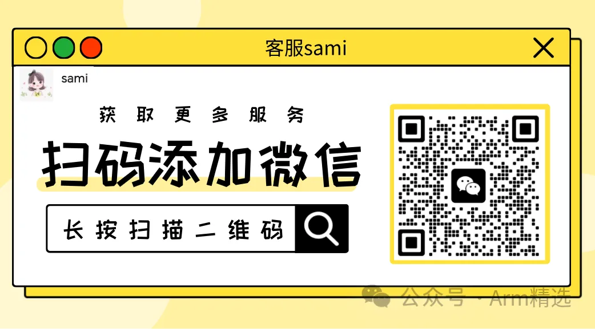

# MTE/PAC/BTI内存保护三剑客

春节前夕，我们再上架3个新课：

- **MTE内存标记扩展精讲与实战**
- **PAC指针认证精讲与实战**
- **BTI分支目标识别精讲与实践**

新课首发，三个课打包一起购买有个特惠活动，原来297的现在只需199，即可购买三个课程。以下是课程的详细介绍

#### 1、MTE内存标记扩展精讲与实战

##### 思考

1、常见的内存安全问题有哪些？举例说明？

2、内存安全的软件缓解技术有哪些？在optee上的应用？

3、MTE下的内存安全性如何保证？空间安全性？时间安全性？

4、MTE的架构细节？硬件原理？TAG存在哪？TAG哪些地址？

5、MTE在SOC上的硬件部署？缓存一致性和总线互联考虑？

6、MTE功能如何验证？TAG比较失败时发生什么？问题如何定位？

7、MTE性能开销？同步模式？异步模式？如何进行优化？

8、MTE存不存在安全性问题？侧信道攻击？

9、MTE与PAC的关系如何？标记是否有冲突？

##### 课程大纲

1、内存安全问题及挑战

 2、内存安全的软件缓解技术 

3、MTE下的内存安全性 

4、MTE的架构细节

 5、MTE在SOC上的硬件部署及示例 

6、QEMU上MTE功能验证与异常解析

 7、MTE性能开销权衡及优化措施

 8、对MTE的侧信道攻击 

9、MTE与PAC的关系

#### 2、PAC指针认证精讲与实战

##### 思考

1、什么是栈溢出攻击？什么是代码重用攻击？区别与联系？

2、栈溢出攻击的软&硬件缓解技术有哪些？在TF-A&OPTEE上的应用？

3、什么是ROP攻击？对ROP攻击的缓解技术？

4、PAC下的ROP如何缓解？对返回地址的签名与验证？

5、PAC的架构细节？硬件原理？PAC如何生成？如何检查？指令集？

6、PAC如何启用?构建PAC的编译选项控制？

7、PAC功能如何验证？PAC检查失败时发生什么？问题如何定位？

8、PAC性能开销？如何进行优化？

9、PAC存不存在安全性问题？侧信道攻击？

10、PAC与BTI、MTE的关系如何？标记是否有冲突？

##### 课程大纲

1、代码重用攻击及栈溢出攻击 

2、栈溢出攻击的软&硬件缓解技术

 3、面向返回编程ROP问题及挑战 

4、PAC下的ROP问题 

5、PAC的架构细节 

6、PAC的启用与构建

 7、QEMU上PAC功能验证与异常解析

 8、PAC性能开销权衡及优化措施 

9、对PAC的侧信道攻击 

10、PAC与BTI、MTE的关系

。

