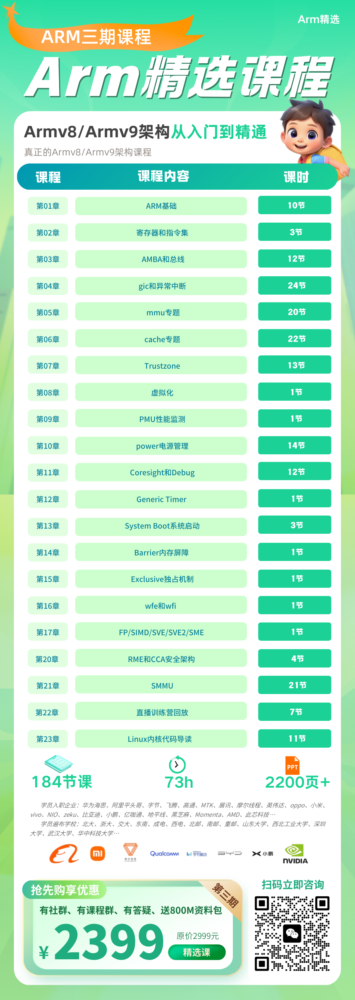
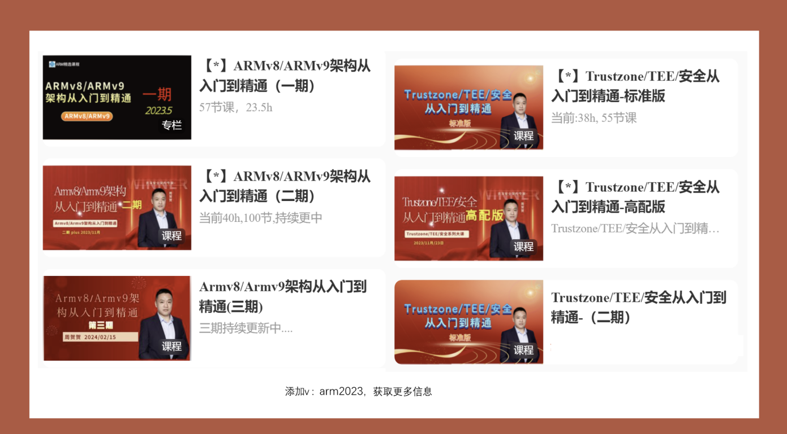

Armv8/armv9架构入门指南
#######################################

.. raw:: html

    Armv8/Armv9架构从入门到精通，Armv8/Armv9架构从入门到精通（一期），Armv8/Armv9架构从入门到精通（二期）Armv8/Armv9架构从入门到精通（三期），Arm一期、Arm二期、学习资料、免费、下载，全套资料，Secureboot从入门到精通，secureboot训练营，ATF架构从入门到精通、optee系统精讲、secureboot精讲，Trustzone/TEE/安全快速入门班，Trustzone/TEE/安全标准版，Trustzone/TEE/安全高配版。全套资料。周贺贺，baron，代码改变世界，coding_the_world，Arm精选，arm_2023，安全启动，加密启动 optee、ATF、TF-A、Trustzone、optee3.14、MMU、VMSA、cache、TLB、arm、armv8、armv9、TEE、安全、内存管理、页表，Non-cacheable,Cacheable, non-shareable,inner-shareable,outer-shareable, optee、ATF、TF-A、Trustzone、optee3.14、MMU、VMSA、cache、TLB、arm、armv8、armv9、TEE、安全、内存管理、页表…  

.. toctree::
   :maxdepth: 1

   arm_training/00_5-交流群-直播群-答疑群
   01
   02
   03
   04
   05
   06
   07
   08
   09
   10
   11
   12
   13
   14
   15
   16
   17
   18
   19
   20

.. raw:: html

   相关课程介绍：

.. raw:: html

    Armv8/Armv9架构从入门到精通，Armv8/Armv9架构从入门到精通（一期），Armv8/Armv9架构从入门到精通（二期）Armv8/Armv9架构从入门到精通（三期），Arm一期、Arm二期、学习资料、免费、下载，全套资料，Secureboot从入门到精通，secureboot训练营，ATF架构从入门到精通、optee系统精讲、secureboot精讲，Trustzone/TEE/安全快速入门班，Trustzone/TEE/安全标准版，Trustzone/TEE/安全高配版。全套资料。周贺贺，baron，代码改变世界，coding_the_world，Arm精选，arm_2023，安全启动，加密启动 optee、ATF、TF-A、Trustzone、optee3.14、MMU、VMSA、cache、TLB、arm、armv8、armv9、TEE、安全、内存管理、页表，Non-cacheable,Cacheable, non-shareable,inner-shareable,outer-shareable, optee、ATF、TF-A、Trustzone、optee3.14、MMU、VMSA、cache、TLB、arm、armv8、armv9、TEE、安全、内存管理、页表…  