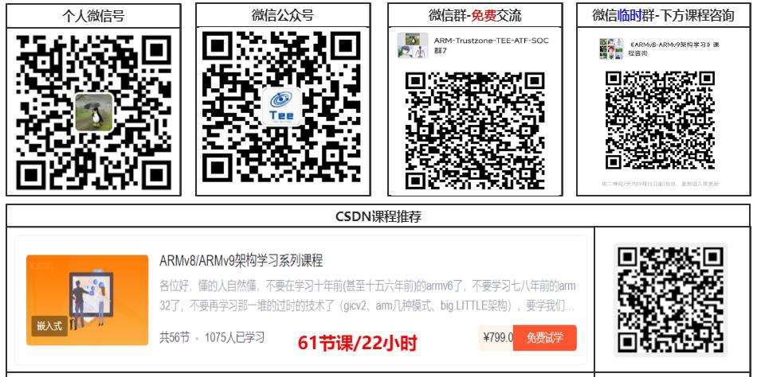

Armv8/armv9架构入门指南
#######################################

|xuanchuan|

.. toctree::
   :maxdepth: 2

   arm_training/00_5-交流群-直播群-答疑群
   01
   02
   03
   04
   05
   06
   07
   08
   09
   10
   11
   12
   13
   14
   15
   16
   17
   18
   19
   20

请大家多多关注，即将免费！ 公众号:"Arm精选"
Armv8/Armv9架构、Trustzone/TEE_安全、Secureboot

.. toctree::
   :maxdepth: 1

   arm_training/00_9-铂金VIP的介绍
   arm_training/02-Arm三期课程介绍
   arm_training/03-Trustzone_TEE标准版-48节课_19.5h
   arm_training/04-Trustzone_TEE高配版本-205节_50h
   arm_training/05-Trustzone_TEE实践版-20节课_3.5h
   arm_training/06-cache直播训练营回放+cacha专题-单售
   arm_training/07-《ATF架构开发精讲》课程介绍
   arm_training/08-Arm架构-功耗管理精讲与实战-芯片底层电源管理框架
   arm_training/09-Secureboot从入门到精通-训练营
   arm_training/10-《optee系统开发精讲》课程介绍
   arm_training/11-《CA_TA开发从入门到精通》课程介绍
   arm_training/12-ATF_optee_hafnium_linux_xen代码精读
   arm_training/13-Keystore_keymaster_keymint课程
   arm_training/14-《8天入门ARM架构》限时128元
   arm_training/15-《8天入门Trustzone_TEE_安全架构》限时128元
   arm_training/16-Android15安全架构-课程介绍
   arm_training/17-MTE_PAC_BTI内存保护三剑客
