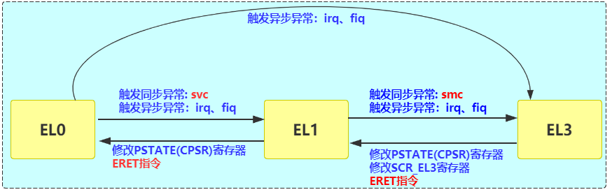
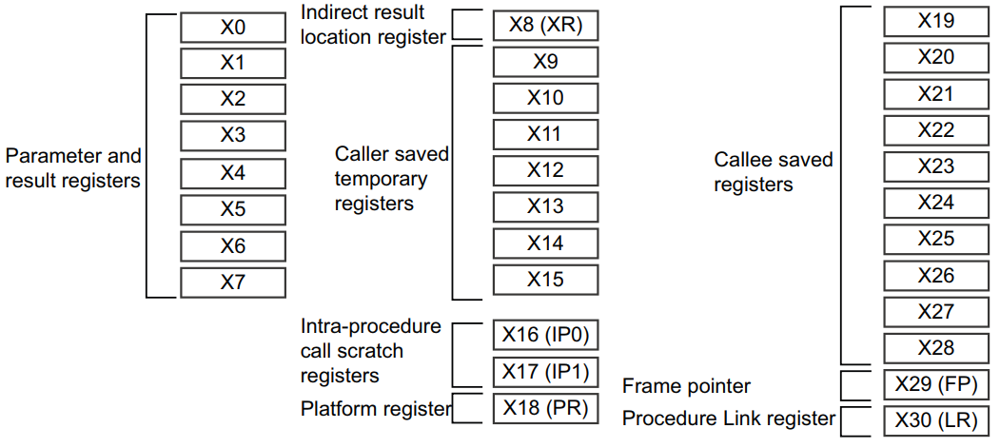
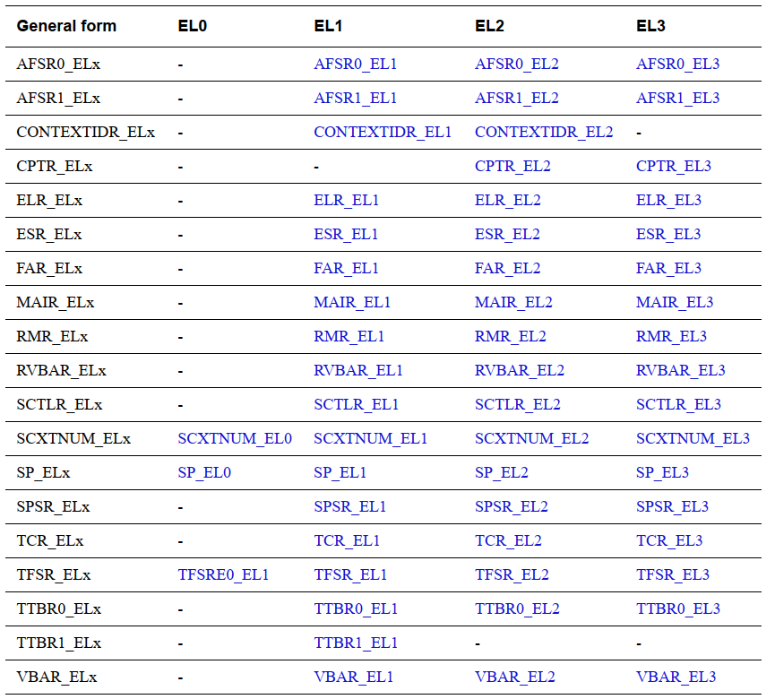

## ARMV8的一些总结-一篇就够了

#### 1、ARM的一些概念
##### (1)、PE - processing element
ARM体系结构定义了抽象机器的行为，称为处理元素（processing element），通常缩写为PE。与ARM体系结构兼容的实现必须符合处理元素所描述的行为。

##### (2)、RISC架构
ARM架构是一个精简指令集计算机(RISC)架构，具有以下RISC架构特征：
- 一个大的统一寄存器文件。
- 一种加载存储架构，其中数据处理操作只对font color=red size=3寄存器font内容进行操作，而不是直接对font color=red size=3内存font内容进行操作。
简单的寻址模式，所有的加载存储地址仅由寄存器内容和指令字段决定。

##### (3)、AArch64和AArch32概念
ARMv8体系结构的一个重要特性是向后兼容，并且可以在各种标准和更专门的用例中自由地进行优化实现。ARMv8架构支持
- A 64-bit Execution state, AArch64.
- A 32-bit Execution state, AArch32, 这与以前版本的ARM架构兼容

通用名AArch64和AArch32描述64位和32位执行状态
- AArch64是64位执行状态，这意味着地址保存在64位寄存器中，基本指令集中的指令可以使用64位寄存器进行处理。AArch64状态支持A64指令集。
- AArch32是32位执行状态，这意味着地址保存在32位寄存器中，基本指令集中的指令使用32位寄存器进行处理。AArch32状态支持T32和A32指令集。

##### (4)、ARM的ARM系列
ARM定义了三个架构概要：
- AApplication架构,支持基于内存管理的虚拟内存系统体系结构(VMSA),支持A64、A32和T32指令集
- RReal-time架构,支持基于内存保护的受保护内存系统架构(PMSA),支持A32和T32指令集。
- MMicrocontroller架构,支持T32指令集的变体

##### (5)、AArch64特点
AArch64，64位执行状态
- 提供31个64位通用寄存器，其中X30用作过程链接寄存器。
- 提供64位程序计数器(PC)、堆栈指针(SPs)和异常链接寄存器(ELRs)。
- 为SIMD向量和标量浮点支持提供32个128位寄存器。
- 提供单个指令集A64
- 定义了ARMv8异常模型，有四个异常级别，EL0 - EL3，提供了一个执行特权层次结构，
- 提供对64位虚拟寻址的支持。
- 定义许多包含PE状态的进程状态(PSTATE)元素。A64指令集包括直接操作各种PSTATE元素的指令
- 使用表示可以访问寄存器的最低异常级别的后缀来命名每个系统寄存器。

##### (6)、AArch32特点
AArch32，32位执行状态
- 提供13个32位通用寄存器，以及一个32位PC、SP和link寄存器(LR)。LR同时用作ELR和过程链接寄存器。其中一些寄存器具有多个存储实例，用于不同的PE模式。
- 为从Hyp模式返回的异常提供一个ELR。
- 为高级SIMD向量和标量浮点支持提供32个64位寄存器。
- 提供两个指令集，A32和T32。
- 支持基于PE模式的ARMv7-A异常模型，并将其映射到基于异常级别的ARMv8异常模型。
- 提供对32位虚拟寻址的支持。
- 定义许多包含PE状态的进程状态(PSTATE)元素。A32和T32指令集包括直接操作各种PSTATE元素的指令，以及使用应用程序状态寄存器(APSR)或当前程序状态寄存器(CPSR)访问PSTATE的指令。

##### (7)、AArch32和AArch64的切换
在AArch64和AArch32执行状态之间转移控制称为互处理（interprocessing）. 只能在异常级别发生变化时在执行状态之间移动，并且必须遵守文中给出的规则。这意味着不同的软件层，例如应用程序、操作系统内核和管理程序，在不同的异常级别执行，可以在不同的执行状态中执行。

##### (8)、A64A32T32
在ARMv8中，可能的指令集取决于执行状态

- AArch64状态只支持一个名为A64的指令集。这是一个使用32位指令编码的固定长度指令集。
- AArch32状态支持以下指令集
A32,这是一个使用32位指令编码的固定长度指令集。
T32,这是一个可变长度的指令集，同时使用16位和32位指令编码。在以前的文档中，这些指令集被称为ARM和Thumb指令集。ARMv8扩展了这些指令集。在AArch32状态中，指令集状态决定PE执行的指令集。

##### (9)、 System registers 
系统寄存器提供了体系结构特性的控制和状态信息, The System registers 包含：
- General system control registers.
- Debug registers.
- Generic Timer registers.
- Optionally, Performance Monitor registers.
- Optionally, the Activity Monitors registers.
- 可选地，在其他ARM架构规范中定义的一组或多组寄存器
跟踪系统寄存器，如嵌入式跟踪宏单元体系结构规范中定义的，ETMv4。
可伸缩向量扩展系统寄存器（Scalable Vector Extension System registers），定义在ARM®架构参考手册补充，可伸缩向量扩展(SVE)，用于ARMv8-A。
统计分析扩展系统寄存器，定义在ARM®架构参考手册的补充，统计分析的扩展，为ARMv8-A。
通用中断控制器(GIC)系统寄存器，
- RAS扩展系统寄存器，在ARM®可靠性（Reliability）、可用性（Availability）和可服务性（Serviceability）(RAS)中定义ARMv8规范，用于ARMv8- a架构配置文件。RAS扩展是对ARMv8.2体系结构的强制扩展，也是对ARMv8.0和ARMv8.1体系结构的可选扩展。

##### (10)、ARMv8 architecture extensions
ARMv8 architecture extensions
- ARMv8加密扩展
- 可靠性、可用性和可服务性(RAS)扩展
- 事件监视器
- IVIPT扩展
- 基于PC示例的概要分析扩展。

- 统计分析扩展(SPE) SPE是ARMv8.2的一个可选扩展。也就是说，SPE需要实现ARMv8.2。
- 可伸缩向量扩展(SVE) SVE是ARMv8.2的可选扩展。也就是说，SVE需要实现ARMv8.2。
- 活动监视器扩展(AMU) AMU是ARMv8.4的可选扩展。也就是说，AMU需要实施ARMv8.4。
- 内存分区和监视扩展(MPAM) MPAM是ARMv8.2的一个可选扩展。也就是说，MPAM需要实现ARMv8.2。

##### (11)、ARM的crypto扩展
ARMv8加密扩展
- 包括AESD和AESE指令的ARMv8.0-AES。
- 包括SHA1和SHA256指令。

#### 2、ARMV8的ELx等级切换
在armv8中，有EL0、EL1、EL2、EL3四个权限级别.
低级别像高级别切换是通过触发异常来进行的。例如：
(1)、在EL0时调用svc指令，触发一个同步异常,cpu则会陷入EL1；
(2)、在EL0时来了一个IRQ或FIQ，会触发一个异步异常,cpu则会陷入EL1或EL2或EL3(根据SCR寄存器中中断的配置来决定)；
高级别向低级别切换是通过修改PSTATE寄存器

#### 3、ARMV8-aarch64寄存器总结
##### 1、通用寄存器

ARMv8有31个通用寄存器X0-X30, 还有SP、PC、XZR等寄存器
下面详细介绍写这些通用寄存器(general-purpose registers)：
- (1)、X0-X7  Argument registers
用于参数传递

- (2)、X9-X15  Caller-saved temporary registers 
在子函数中使用这些寄存器时，直接使用即可, 无需saverestore. 在汇编代码中x9-x15出现的频率极低

- (3)、X19-X29 Callee-saved registers (X19-X29)
在callee子函数中使用这些寄存器时，需要先save这些寄存器，在退出子函数时再resotre

- (4)、X8, X16-X18, X29, X30  Registers with a special purpose
这些都是特殊用途的寄存器

##### 2、系统寄存器

- ELR_ELx  异常链接寄存器
该寄存器只有ELR_EL1 ELR_EL2 ELR_EL3, 没用ELR_EL0. 因为异常不会routing(target)到EL0.
例如在user mode时触发了一个target到EL1的irq异常，那么会将PC指针保持到ELR_EL1中，然后跳转到EL1的异常向量表中;
user mode时触发了一个target到EL3的irq异常，，那么会将PC指针保持到ELR_EL3中，然后跳转到EL3的异常向量表中;

- ESR_ELx  (exception Syndrome register )异常综合寄存器异常状态寄存器 ： 反应异常的原因等信息
该寄存器只有ELR_EL1 ELR_EL2 ELR_EL3, 没用ELR_EL0.
例如s 16bit指令的异常、32bit指令的异常、simd浮点运算的异常、MSRMRS的异常....

- FAR_ELx  (Fault Address Register)  错误的地址寄存器
当取指令或取数据时，PC对齐错误或者watchpoint异常(PC alignment fault and Watchpoint exceptions)，会将错误的地址填入到该寄存器中;

- MAIR_EL1, (Memory Attribute Indirection Register) 内存属性寄存器
配置内存的属性，如Tagged Normal Memory、normal memory、device memory
如果是normal memory，那么inner和Outer的配置是Write-Through Write-backwrite Allocatewrite non-Allocate等

- SCTLR_EL1, (System Control Register) 系统控制寄存器
如d-cachei-cachemmu的enable和disable

#### 4、AXIAPBAHBACE的简单介绍
##### (1)、AMBA概述
AMBA (Advanced Microcontroller Bus Architecture) 高级处理器总线架构
(1)、AXI (Advanced eXtensible Interface) 高级可拓展接口
(2)、APB (Advanced Peripheral Bus) 高级外围总线
(3)、AHB (Advanced High-performance Bus) 高级高性能总线
(4)、ASB (Advanced System Bus) 高级系统总线

##### (2)、AXI4分类
AXI是ARM 1996年提出的微控制器总线家族AMBA中的一部分
(1)、AXI4：主要面向高性能地址映射通信的需求；
(2)、AXI4-Lite：是一个简单地吞吐量地址映射性通信总线；
(3)、AXI4-Stream：面向高速流数据传输；
AXI4总线分为主、从两端，两者间可以连续的进行通信

##### (3)、ACE-lite
ACE接口是对AXI4的扩展，里面增加了许多cache相关的接口

#### 5、AMRV7和ARMV8中的一些细微差异

思考
- 什么是协处理器？ARMV8-aarch64下有没有协处理器
- MRSMSR是什么指令，在aarch64架构下没有MCRMRC指令
- 什么是SError？ 什么是prefetch abort，undefined instruction？
- LR和ELR的区别？
- 在aarch32中, R15是PC，那么在aarch64中X30为什么不是PC？
- MV PC ,#3 这样的指令是否可以
- 在aarch32中, R13是SP，那么在aarch64为什么没有通用寄存器作为SP？
- armv7和armv8的ARM NEON的区别？
- PSTATE和CPSR的区别
- ARMv8上是否能接gicv2，armv7上是否能接gicv3？

##### (1)、svc和swi的区别

svc和swi都是supervisor call指令，都是系统调用.

 - 再armv7之前，用的都是swi，触发异步异常，进入vector_swi异常向量表;
 - 在armv8-arch64架构下，抛弃了swi，改用了svc，触发的是同步异常，进入同步异常向量表el1_sync
##### (2)、swi、SGI、softirq的区别？
【问题】swi叫软中断、SGI也叫软中断、linux kernel中还有一个softirq也叫软中断，他们三个有什么区别呢？
【回答】：
 - swi ：software irq，是ARM的一个软件中断指令，产生swi异常;
 - SGI：software generate interrupt，软件产生的中断，是cpu写gic寄存器，gic发出的一个irq给到cpu
 - softirq： linux kernel自己造的软中断，和硬件无关
##### (3)、SError和data abort、prefetch abort、undefined instruction的区别
在armv7下使用的是data abort、prefetch abort、undefined instruction，在armv8下使用的是SError.
注在linux kernel中，armv7体系下均已实现data abort、prefetch abort、undefined instruction异常处理函数，在linux kernel的armv8体系下，没有实现SError异常处理