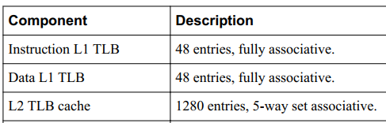

## ARM A76学习笔记

### 1、Cortex-A76 cores特点
最多可以有4个Cortex-A76 cores通过1个DSU，连接到外部的memory
### 2、Cortex-A76的组件有：
• Instruction fetch.   L1  i-cache
• Instruction decode.
• Register rename.
• Instruction issue.
• Execution pipelines. ALU 和 NEON
• L1 data memory system.  L1  d-cache
• L2 memory system. L2  cache

##### （1）、The instruction fetch unit includes:
• A 64KB, 4-way, set associative L1 instruction cache with 64-byte cache lines and optional parity
protection.
• A fully associative L1 instruction TLB with native support for 4KB, 16KB, 64KB, 2MB, and 32MB
page sizes.
• A dynamic branch predictor
 L1  i-cache ：64KB，4路256组相连，cache line位64bytes
 TLB i-cache ：全相连，支持4KB, 16KB, 64KB, 2MB，32M size

##### （2）、Instruction decode
The instruction decode unit supports the A32, T32, and A64 instruction sets. It also supports Advanced
SIMD and floating-point instructions in each instruction set

##### （4）、Execution pipeline
The execution pipeline includes:
• Integer execute unit that performs arithmetic and logical data processing operations.
• Vector execute unit that performs Advanced SIMD and floating point operations. Optionally, it can
execute the cryptographic instructions.
 其实这里就是描述，有一个用于整数计算的ALU、有一个浮点型运算和SIMD运算的NEON

##### （5）、L1 data memory system
The L1 data memory system executes load and store instructions and encompasses the L1 data side
memory system. It also services memory coherency requests.
The load/store unit includes:
• A 64KB, 4-way, set associative L1 data cache with 64-byte cache lines and optional ECC protection
per 32 bits.
• A fully associative L1 data TLB with native support for 4KB, 16KB, 64KB, 2MB, and 512MB page
sizes

 L1  d-cache ：64KB，4路256组相连，cache line位64bytes
 TLB d-cache ：全相连，支持4KB, 16KB, 64KB, 2MB，512MB  size

##### （6）、L2 memory system
The L2 memory system services L1 instruction and data cache misses from the Cortex-A76 core.
The L2 memory system includes:
• An 8-way set associative L2 cache with data ECC protection per 64 bits. The L2 cache is
configurable with sizes of 128KB, 256KB, or 512KB.
• An interface with the DSU configurable at implementation time for synchronous or asynchronous
operation
 L2  cache ：8路相连的cache，大小为128KB, 256KB, or 512KB
### 3、DSU
The Cortex-A76 core has several interfaces to connect it to a SoC. The DSU manages all interfaces
 DSU管理A76和SOC连接的所有接口

### 4、About system control
The system registers control and provide status information for the functions that the core implements.
The main functions of the system registers are:
• Overall system control and configuration.
• MMU configuration and management.
• Cache configuration and management.
• System performance monitoring.
• GIC configuration and management.
The system registers are accessible in the AArch64 EL0-EL3 and AArch32 EL0 Execution state. Some
of the system registers are accessible through the external debug interface.

### 5、About the Generic Timer

### 6、About the MMU
The Memory Management Unit (MMU) is responsible for translating addresses of code and data Virtual
Addresses (VA) to Physical Addresses (PAs) in the real system. The MMU also controls memory access
permissions, memory ordering, and cache policies for each region of memory
 负责转换代码和数据的地址（VAs to PAs）、还控制内存访问权限、内存排序和缓存策略

(TLB)

The TLB entries contain either one or both of a global indicator and an Address Space Identifier (ASID)
to permit context switches without requiring the TLB to be invalidated.
The TLB entries contain a Virtual Machine Identifier (VMID) to permit virtual machine switches by the
hypervisor without requiring the TLB to be invalidated
 TLB entries包含：1-2个global indicator、ASID、VMID

1. Performs a lookup for the requested VA, current ASID, current VMID, and current translation regime
in the relevant instruction or data.
2. If there is a miss in the relevant L1 TLB, the MMU performs a lookup for the requested VA, current
ASID, current VMID, and translation regime.
3. If there is a miss in the L2 TLB, the MMU performs a hardware translation table walk
 现在L1 TLB中查找、再到L2 TLB查找，都没命中则走hardware translation table walk

When executing in AArch64 state at a particular Exception level, you can configure the hardware
translation table walk to use either the 4KB, 16KB, or 64KB translation granule. Program the Translation
Granule bit, TG0, in the appropriate translation control register:
• TCR_EL1.
• TCR_EL2.
• TCR_EL3.
• VTCR_EL2
 查找的页面可以通过修改TCR寄存器配置4KB, 16KB, or 64KB
 TTBR0_EL1 、TTBR1_EL1

